# Facebookグループ投稿アーカイブ

シビックテックのイベントに関連すると判定した投稿を、古い順に掲載しています。

- 投稿数: 388
- コメント数: 454
- 投稿画像数: 263
- コメント画像数: 7
- 期間: 2013-12-19 〜 2025-01-15

## 0001 — 2013-12-19 — 安部 邦昭

- 投稿ID: 186534901547657
- 投稿URL: https://www.facebook.com/groups/186097664924714/posts/186534901547657/
- 要約: 初めましての方も、そうでない方も、こんにちは。 大宮・さいたま市をベースにまちづくり活動をしている、安部です。 このグループは、後藤先生の呼びかけで開催した「さいたまの「IT X市民活動」を考える - 第１回 ICTでまちを元気に－」をきっかけに、Code for SAITAMA的な動きをしていこう！
- コメント要約: （コメントなし）

初めましての方も、そうでない方も、こんにちは。
大宮・さいたま市をベースにまちづくり活動をしている、安部です。
このグループは、後藤先生の呼びかけで開催した「さいたまの「IT X市民活動」を考える　- 第１回　ICTでまちを元気に－」をきっかけに、Code for SAITAMA的な動きをしていこう！という話しの中から設定しました。またのちほど後藤先生や奥本さんからも投稿があることと思いますが、よろしくお願いいたします。
https://www.facebook.com/events/381951251939624/

## 0002 — 2013-12-21 — 古田武士

- 投稿ID: 187144851486662
- 投稿URL: https://www.facebook.com/groups/186097664924714/posts/187144851486662/
- 要約: 年明けに
- コメント要約: 是非やりましょう。

年明けにhttp://www.data.go.jp/のオープンデータをQgisで閲覧をネタにしてセミナー開きたいなと思ってます。

### コメント — 後藤 真太郎

是非やりましょう。

## 0003 — 2013-12-31 — 後藤 真太郎

- 投稿ID: 192511060950041
- 投稿URL: https://www.facebook.com/groups/186097664924714/posts/192511060950041/
- 要約: 立正大学の後藤です。 にも書かれているように、2013年はオープンデータが本格的に立ち上がった年でした。シンクタンク時代を含め、30年以上、GISのコンサルテーションやデータ流通に係わってる者からすれば新たな動きにつながるきっかけになる期待を持っております。
- コメント要約: （コメントなし）

立正大学の後藤です。http://blogs.itmedia.co.jp/business20/2013/12/2013-2365.html
にも書かれているように、2013年はオープンデータが本格的に立ち上がった年でした。シンクタンク時代を含め、30年以上、GISのコンサルテーションやデータ流通に係わってる者からすれば新たな動きにつながるきっかけになる期待を持っております。別途運営している、埼玉県GIS普及推進研究会や市民キャビネットスマートICT部会などの活動と補完しあいながらICTで市民活動が支援できるような仕組みができればと思っています。今後ともよろしくお願いします。
2013年オープンデータのまとめ
BLOGS.ITMEDIA.CO.JP
2013年オープンデータのまとめ

## 0004 — 2014-01-09 — 安部 邦昭

- 投稿ID: 197269160474231
- 投稿URL: https://www.facebook.com/groups/186097664924714/posts/197269160474231/
- 要約: 次回の会合ですが、1/20(月)に開催することになりました。イベントを立てましたので、ご参加いただける方は、以下のリンクより参加のポチをお願いいたします。 2014/01/20(月) Code for SAITAMA(仮)～さいたまのIT×市民活動をわくわくする～第二回ミーティング さいたま市 7Fに「いいね！
- コメント要約: （コメントなし）

次回の会合ですが、1/20(月)に開催することになりました。イベントを立てましたので、ご参加いただける方は、以下のリンクより参加のポチをお願いいたします。
https://www.facebook.com/events/475246445919850
2014/01/20(月)
Code for SAITAMA(仮)～さいたまのIT×市民活動をわくわくする～第二回ミーティング
さいたま市
7Fに「いいね！」しました

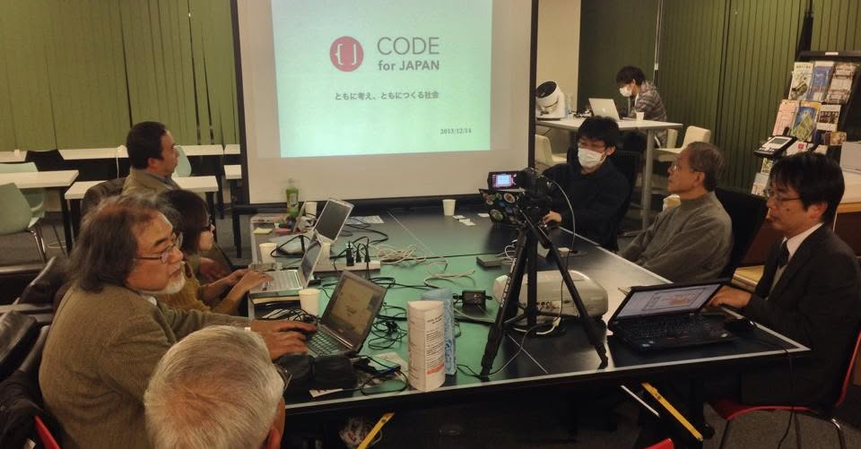

## 0005 — 2014-01-13 — 安部 邦昭

- 投稿ID: 199449673589513
- 投稿URL: https://www.facebook.com/groups/186097664924714/posts/199449673589513/
- 要約: 横浜では昨日、こんなイベントが行われたそうです。 HAMAKEI.COM 横浜消防出初式で市民らが防災地図作り－約6,000のスポット情報集まる 横浜消防出初式2014が1月12日、横浜赤レンガ倉庫イベント広場・1号館、赤レンガパークで行われ、家族連れを中心に約7万8,000人が訪れた。
- コメント要約: （コメントなし）

横浜では昨日、こんなイベントが行われたそうです。
HAMAKEI.COM
横浜消防出初式で市民らが防災地図作り－約6,000のスポット情報集まる
横浜消防出初式2014が1月12日、横浜赤レンガ倉庫イベント広場・1号館、赤レンガパークで行われ、家族連れを中心に約7万8,000人が訪れた。

## 0006 — 2014-01-21 — 古瀬 正也
 
·
フォローする

- 投稿ID: 203367709864376
- 投稿URL: https://www.facebook.com/groups/186097664924714/posts/203367709864376/
- 要約: 昨日のミーティングに参加していました古瀬です。 昨日のイベントページにも投稿したのですが、もしかしたら、目にする機会が少ないかもしれないと思いまして、こちらのグループにも投稿してみることにしました。
- コメント要約: アジャイルなものでいいのです。是非、やりましょう。今日、17時から日進で 防災アイデアソンの準備してます。本番は、1/24 25 杉戸にて実施します。 ローカルにつくるアイデア、話、聞かせてください。

昨日のミーティングに参加していました古瀬です。
昨日のイベントページにも投稿したのですが、もしかしたら、目にする機会が少ないかもしれないと思いまして、こちらのグループにも投稿してみることにしました。
以下、イベントページに投稿した内容です。何か、思うことや、意見がある方、ここにコメントしてくださると嬉しいです！
===================
“おたがいに意見を述べる会合に出席して、何も言わないと、あとで後悔する。言葉があまっているからである。何か言うと、あとで後悔する。言葉が足りないからである。”
この言葉は、現代では、あまり名の知られていない、ある思想家の、僕が好きな言葉です。
今日、僕は、完全に「前者」だったわけで、一言も発言しなかったことに後悔していますが、一点だけ、思ったことがありましたので、ここに投げてみようと思います。
どなたか、偶然、この投稿を見かけた方、何か思うことがあれば、反応してくだされば、とても嬉しく思います。
例えば、僕は、大宮の隣駅（日進駅）近くに住んでいるのですが、もっと小さく、もっとローカルに、「Code for Nisshin（日進）」とか設立してもいいのでしょうか？
今日の会に参加して、僕にとっては、「さいたま市」という範囲は、とても大きく感じましたし、より小さく、よりローカルの方が、もっと小回りが効いて、住民のニーズやウォントが見えてきて、個人的には動きやすい気がしました。
また、そのような場合には、この「Code for ◯◯」という言葉を使っても良いのでしょうか？何かしらの「Code for japan」の認定や「Code for Saitama（さいたま）」の承認など、必要な手続きはあるのでしょうか？
例えば、「green drinks」や「せんきょCAMP」のように、概念を共有して、手を挙げた人は、誰でも始められる、というムーブメント的な存在なのでしょうか？
◎green drinks
http://greendrinks.jp
◎せんきょCAMP
http://senkyocamp.org
特に、僕は、「アイデアソン」「ハッカソン」という言葉でやってきたわけではありませんが、「ワークショップデザイン」と「ファシリテーター」が本業ですので、まちの人のニーズやアイデアを出し合うワークショップや、課題の抽出などのワークショップは、得意分野です。
「Code for Saitama」として、ということであれば、関わる人のあらゆる意図が存在していて、合意形成も困難で、スピード感も遅くなってしまう気がしたので、自分の地元で「Code for Nisshin（日進）」を小さく立ち上げ、最初の、アイデアを出し合うワークショップを、実験的にやっちゃおうかな、なんて、思っていました。（まだ、妄想段階ですが…）
そして、もし、そこで、IT技術が必要なアイデアが出たのであれば、僕は、技術屋ではないので、ここに集まっている「Code for Saitama」や僕の友人の技術屋さんに投げかけて、得意な人や関わりたい人が、関わりたい関わり方で、任意のプロジェクト・チームを発足して、進めていけばいいのかな、とか思いました。
もし、費用がかかるレベルであれば、どうやってお金を生み出せばいいのかも、そのチームで考え、生み出していく。今は、共感・共鳴があれば、「READY?FOR」や「FAAVO埼玉」などのクラウドファンディングでお金を集められるシステムもありますし、「お金は後から」スタンスで、小さく無理のない範囲で、始めちゃう、っていうのもいいのかなと思っています。
◎READY?FOR
https://readyfor.jp
◎FAAVO埼玉
https://faavo.jp/saitama
ちょっと、長くなりましたが、本日、発言しなかった者として、せめて、ここで、小さな声を一言でも出しておこうと思い、投稿させていただきました。
最後に、本日の場を開いてくれた、安部さん、後藤先生。そして、参加して、様々な知恵や情報を提供してくださった皆さん、ありがとうございました。ぼやけていた「Code for japan」のことや、事例などを知れて、非常に、興味深かったです。
===================
green drinks Japan
GREENDRINKS.JP
green drinks Japan

### コメント — 後藤 真太郎

アジャイルなものでいいのです。是非、やりましょう。今日、17時から日進で
防災アイデアソンの準備してます。本番は、1/24 25 杉戸にて実施します。

### コメント — 後藤 真太郎

ローカルにつくるアイデア、話、聞かせてください。複数の人で人的リソースをシェアできればいいので、さいたま市に拠点を置いておいた方が協力者も得やすいかと思います。

### コメント — 古瀬 正也

＞後藤先生
ちなみに、「今日の準備」というのは、差し支えなければ、顔出すのも可能でしょうか？
「KJ法」などのブレーンストーミングの手法は、イメージできるのですが、いまいち、「アイデアソン」のイメージがついていないので、とても興味あります。

### コメント — 後藤 真太郎

特定非営利活動法人ＮＰＯ埼玉ネット
〒331-0823　埼玉県さいたま市北区日進町２丁目544番地1　埼玉NPOハウス　info@nposaitamanet.or.jp　　TEL048-729-6151　FAX048-729-6152　でやってます。分野が特殊なのでびっくりなさらないようにお願いしますね。

### コメント — 古瀬 正也

わかりました。17時から1時間程、お邪魔させてもらおうと思います。
よろしくお願いします。

### コメント — 後藤 真太郎

電車の時間が合わず、少し遅れます。

### コメント — 古瀬 正也

すいません。私も、5分程、遅れそうです。

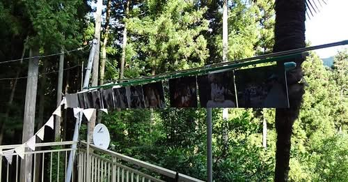

## 0007 — 2014-01-22 — 星野 邦敏

- 投稿ID: 203821399819007
- 投稿URL: https://www.facebook.com/groups/186097664924714/posts/203821399819007/
- 要約: こんにちは。コワーキングスペース7Fの運営代表者の星野邦敏です。 先日は、第２回のイベントお疲れ様でした！ とりあえず、イベントの最中に取得したドメインで、３時間で、埼玉県が公開しているAED設置場所のCSVデータを使って、今いる場所から近いAED設置場所を検索できるサービスの叩き台を作ってみました。
- コメント要約: （コメントなし）

こんにちは。コワーキングスペース7Fの運営代表者の星野邦敏です。
先日は、第２回のイベントお疲れ様でした！
とりあえず、イベントの最中に取得したドメインで、３時間で、埼玉県が公開しているAED設置場所のCSVデータを使って、今いる場所から近いAED設置場所を検索できるサービスの叩き台を作ってみました。
埼玉県もさいたま市も、総務省や京都府や千葉市のように、オープンデータに積極的な所のように、オープンデータが進めばもっと色々とできるようになりそうですね。
とりあえず、このサービスは普通に利用可能なサービスレベルまで開発を進めていこうと思っています。
今後とも宜しくお願い致します！
今いる場所から近いAED設置場所を検索 in 埼玉県
http://aed-saitama.com/about

## 0008 — 2014-01-23 — 後藤 真太郎

- 投稿ID: 204224529778694
- 投稿URL: https://www.facebook.com/groups/186097664924714/posts/204224529778694/
- 要約: いよいよ明日に迫りました。全国から杉戸町に参集してきます。現在約200名の登録があります。東日本大震災での緊急から復興期に至る災害支援活動のネットワークを持続させましょう。
- コメント要約: 1/24 200名、1/25 150名の参加者を得て、無事終了しました。1/24の午後の防災アイデアソンは200人規模の大がかりなものになりました。事務局を行った市民キャビネット災害支援部会は、東日本大震災の発災直後２週間、日本のNPOの1/2-1/3を支援し、立正大学でも2度のフォーラムを行った絆を協働型訓練で継続させようという目的で開催に至りました。

いよいよ明日に迫りました。全国から杉戸町に参集してきます。現在約200名の登録があります。東日本大震災での緊急から復興期に至る災害支援活動のネットワークを持続させましょう。GISを用いた情報共有、ICSの考え方を用いた図上訓練、トリアージ訓練に参加される方は事前登録をお願いします。
事業名：国土交通省「広域的地域間共助」推進のためのモデル事業
杉戸町・富岡町・川内村地域間共助推進事業
事業主体：埼玉県杉戸町、福島県富岡町・川内村、ＮＰＯ埼玉ネット、すぎとＳＯＨＯクラブ
「協働型災害訓練」の実施
・日時　平成２６年１月２４・２５日（金・土）
・場所　埼玉県杉戸町地内（東武動物公園駅東口から会場まで送迎車を運行します8：00－10：00）
・内容　首都圏直下型地震発生を想定した図上訓練、自家用ヘリコプター運用、災害救助犬、トリアージ等の実訓練を実施します。詳細は　http://kyoujo.npgo.net/　を参照ください。
※当日参加も可能ですが、班分けの都合がありますので、事前申し込みいただけると幸甚です。
・参加団体抜粋（順不同）
杉戸町、富岡町、川内村、ＮＰＯ埼玉ネット、すぎとＳＯＨＯクラブ、国土交通省広域地方政策課、三菱総合研究所、市民キャビネット災害支援部会、市民キャビネットスマートICT部会、市民救助隊（ＣＦＲ）、在日米陸軍消防、市民航空災害支援センター、東埼玉総合病院、岩手医科大学、立正大学地球環境科学部、金沢星稜大学、埼玉県ＧＩＳ普及推進研究会 、明星大学人文学部、3.11ＮＰＯ+、ＮＰＯキャンパー、ＮＰＯレスキューライダーズ、ＮＰＯ連携福島復興支援センター、ＳＳネットまつぶし、いたばし総合ボランティアセンター、すみだカット倶楽部、たすけあい伊奈、とんぼエコオフィス、グリーンフォーレストジャパン、コモンズ世田谷、ドリームスカイ ユニオン、ユニバーサル志縁社会創造センター、ワーク埼玉、元気スタンド ぷリズム、港区市民団体、埼玉県キャンプ協会、埼玉県労働者福祉協議会、中央社協の「まちひとサイト」（Ｗｅｂメディア）、川内村ＮＰＯ協働センター、南会津と世田谷を結ぶ会、日進親和会、日本ケアフィットサービス協会、日本レスキュー協会、日本捜索救助犬協会、日本太鼓協会、表郷ボランティアネットワーク
※食事代金以外無料で、ＩＣＳ、ＤＩＧ、ＣＦＲ訓練が受講でき、ネットワークづくりもできます。
参加申し込みフォーム（http://www2.tba.t-com.ne.jp/fleamarket/npoforum.html）から申し込みください。
KYOUJO.NPGO.NET
国土交通省「広域的地域間共助」推進のためのモデル事業

### コメント — 後藤 真太郎

1/24 200名、1/25 150名の参加者を得て、無事終了しました。1/24の午後の防災アイデアソンは200人規模の大がかりなものになりました。事務局を行った市民キャビネット災害支援部会は、東日本大震災の発災直後２週間、日本のNPOの1/2-1/3を支援し、立正大学でも2度のフォーラムを行った絆を協働型訓練で継続させようという目的で開催に至りました。地元、杉戸では防災祭りのノリでした。こうしたイベントを全国で行ってくれとの要望もだされ、確かな反応を感じたイベントでした。

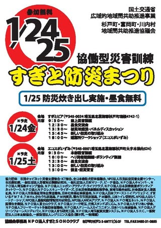

## 0009 — 2014-02-02 — 後藤 真太郎

- 投稿ID: 209212802613200
- 投稿URL: https://www.facebook.com/groups/186097664924714/posts/209212802613200/
- 要約: （要約なし）
- コメント要約: まだ、構想段階ですが3月末に大宮でマッピングパーティーしたいと思ってます。テーマは県のオープンデータのAEDを実際に見に行って属性を調べてOSMに登録しようと思ってます。

（本文なし。コメントからイベント関連性を確認）

### コメント — 古田武士

まだ、構想段階ですが3月末に大宮でマッピングパーティーしたいと思ってます。テーマは県のオープンデータのAEDを実際に見に行って属性を調べてOSMに登録しようと思ってます。段取りなどはまだまだですが。

### コメント — 後藤 真太郎

マッピングパーティーいいですね。熊谷では直実史跡マップ、品川では品川宿マップを作ってます。幸手宿、杉戸宿にはアナログで作っているグループがいますので繋げる可能性はありあす。また、木曽義仲（嵐山生まれ）・巴御前を大河ドラマにする署名運動も始まってますので武蔵武士マップも合わせ技としていいかもしれませんね。また、氷川神社の参道が磁北からずれてます。このずれを計測するのも面白いかもしれません。

## 0010 — 2014-02-03 — 安部 邦昭

- 投稿ID: 209652569235890
- 投稿URL: https://www.facebook.com/groups/186097664924714/posts/209652569235890/
- 要約: Office7Fの星野さんが、こんなイベントを立てられました。 詳しくは、星野さんまで！ 2014/02/11(火) 「オープンデータ・アプリコンテスト」に、Webアプリやスマートフォンアプリを作って、応募しようイベント さいたま市 7Fに「いいね！
- コメント要約: ありがとうございます。こうしたイベントを同じ場所で行うのがハッカソン、アイデアをつくのがアイデアソンです。自治体が抱えている問題を扱うようなイベントを自治体が主催してえば自治体のアプリができるというおまけつき。

Office7Fの星野さんが、こんなイベントを立てられました。
詳しくは、星野さんまで！
2014/02/11(火)
「オープンデータ・アプリコンテスト」に、Webアプリやスマートフォンアプリを作って、応募しようイベント
さいたま市
7Fに「いいね！」しました

### コメント — 後藤 真太郎

ありがとうございます。こうしたイベントを同じ場所で行うのがハッカソン、アイデアをつくのがアイデアソンです。自治体が抱えている問題を扱うようなイベントを自治体が主催してえば自治体のアプリができるというおまけつき。将来的にこうした支援を行うこともCode for Saitamaの役割かなと思います。

## 0011 — 2014-02-13 — 後藤 真太郎

- 投稿ID: 214568982077582
- 投稿URL: https://www.facebook.com/groups/186097664924714/posts/214568982077582/
- 要約: 2月6日、Code for Japanの勉強会「自治体関係者勉強会vol1」が開催され、レポートがアップされました。是非ご一読下さい。 【勉強会レポート】2/6開催 自治体関係者勉強会vol.1 BLOG.CODE4JAPAN.ORG 【勉強会レポート】2/6開催 自治体関係者勉強会vol.1
- コメント要約: （コメントなし）

2月6日、Code for Japanの勉強会「自治体関係者勉強会vol1」が開催され、レポートがアップされました。是非ご一読下さい。
【勉強会レポート】2/6開催　自治体関係者勉強会vol.1
BLOG.CODE4JAPAN.ORG
【勉強会レポート】2/6開催　自治体関係者勉強会vol.1

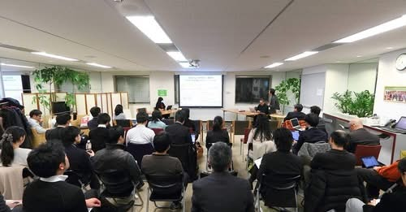

## 0012 — 2014-02-27 — 後藤 真太郎

- 投稿ID: 219726928228454
- 投稿URL: https://www.facebook.com/groups/186097664924714/posts/219726928228454/
- 要約: これをツールドフランス用にモデファイできませんか？ 公開グループ • メンバー48人 飛騨高山の外国人向け民宿プロジェクト
- コメント要約: そういえば、先月末行った富士通の観光アイデアソンで「外人さんいらっしゃい」というアイデアがありました。

https://www.facebook.com/groups/1401226330092990/　これをツールドフランス用にモデファイできませんか？
公開グループ • メンバー48人
飛騨高山の外国人向け民宿プロジェクト

### コメント — 後藤 真太郎

そういえば、先月末行った富士通の観光アイデアソンで「外人さんいらっしゃい」というアイデアがありました。

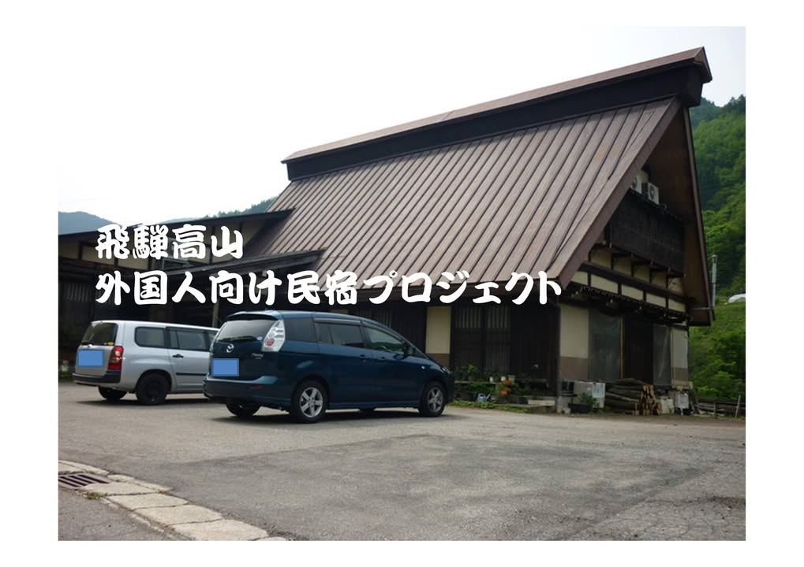

## 0013 — 2014-03-02 — 後藤 真太郎

- 投稿ID: 220702971464183
- 投稿URL: https://www.facebook.com/groups/186097664924714/posts/220702971464183/
- 要約: 本Gr.のメンバーでもある大宮経済新聞記者の新木さんが↓のようなイベントを企画されてます。Code foe Saitama準備会を始める際に、アイデアソンから始めましょうという提案がありましたが、アイデアソンのイメージがわかないという方も多いと伺ってますので議論から始めることになり、2回目のように発散気味になってしまいましたので現在、次の手を調整中です。
- コメント要約: 第2回に参加した石井です。とても面白そうな企画ですね！ただ、残念ながら先約ありです。是非、有意義な内容の会にしていただいて、議事録など、発信していただければと思います！

本Gr.のメンバーでもある大宮経済新聞記者の新木さんが↓のようなイベントを企画されてます。Code foe Saitama準備会を始める際に、アイデアソンから始めましょうという提案がありましたが、アイデアソンのイメージがわかないという方も多いと伺ってますので議論から始めることになり、2回目のように発散気味になってしまいましたので現在、次の手を調整中です。百聞は一見にしかずですので、アイデアソンのイメージ作りに参加されてはどうかと思います。ご検討ください。
地域を盛り上げるみんなのプロジェクト実現応援！ワークショップ
SAITAMAMORIAGERU.PEATIX.COM
地域を盛り上げるみんなのプロジェクト実現応援！ワークショップ

### コメント — Atsushi Ishii

第2回に参加した石井です。とても面白そうな企画ですね！ただ、残念ながら先約ありです。是非、有意義な内容の会にしていただいて、議事録など、発信していただければと思います！

## 0014 — 2014-03-06 — 後藤 真太郎

- 投稿ID: 221783781356102
- 投稿URL: https://www.facebook.com/groups/186097664924714/posts/221783781356102/
- 要約: こんな事例もあります。 医療データを元に「近くの良い病院」を可視化――データジャーナリズム・ハッカソンで見えた可能性 HUFFINGTONPOST.JP 医療データを元に「近くの良い病院」を可視化――データジャーナリズム・ハッカソンで見えた可能性
- コメント要約: 近くの病院に勤務する、良い先生とその勤務時間の可視化、というのがあるといいんですが。そこまですると問題でしょうか。同じ病院でも、先生によって当たり外れありますしね。

こんな事例もあります。
医療データを元に「近くの良い病院」を可視化――データジャーナリズム・ハッカソンで見えた可能性
HUFFINGTONPOST.JP
医療データを元に「近くの良い病院」を可視化――データジャーナリズム・ハッカソンで見えた可能性

### コメント — 天野 徹

近くの病院に勤務する、良い先生とその勤務時間の可視化、というのがあるといいんですが。。。そこまですると問題でしょうか。。。同じ病院でも、先生によって当たり外れありますしね。。。

### コメント — 後藤 真太郎

熊谷で子育て応援マップを作った時に同じような事をしようとしたら医師会から文句が出ましたね。でも、調整して何とかできました。こういうのって行政では絶対できない所です。

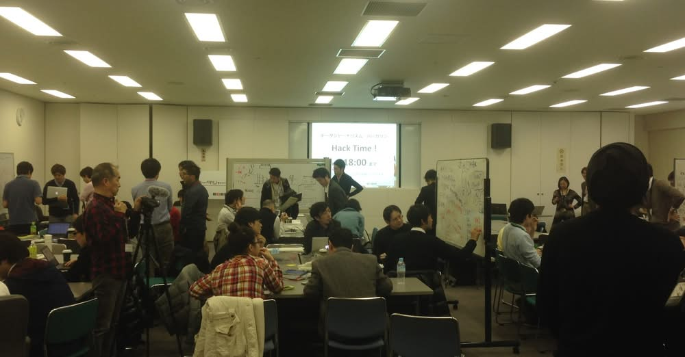

## 0015 — 2014-03-14 — 後藤 真太郎

- 投稿ID: 224043577796789
- 投稿URL: https://www.facebook.com/groups/186097664924714/posts/224043577796789/
- 要約: 東京ですが、以下のようにフォーラムを開催します。当日参加もOKですのでどうぞご参加ください。
- コメント要約: （コメントなし）

東京ですが、以下のようにフォーラムを開催します。当日参加もOKですのでどうぞご参加ください。
第13回の地域SNS全国フォーラム in 東京
https://www.facebook.com/events/615293741851362/?fref=ts
日時：平成26年3月15日（土）
会場：立正大学大崎キャンパス9号館（東京都品川区）
参加費：無料
定員：100名
プログラム：
10:30 開会挨拶（9B21教室）
10:45 基調講演　後藤真太郎氏（立正大学地球環境科学部環境システム学科教授）
11:45 昼食休憩
12:30 プレゼンテーションタイム　ナビゲーター　田中秀幸氏（東京大学大学院情報学環教授）
13:30 分科会
(1)未来の地域ネットワークづくり(9B13教室)
(2)地域活性化と「女子力」(9B12教室)
(3)地域SNSと防災（9B11教室）
15:30 全体会（9B21教室）
16:00 閉会
17:00 交流会（ゆうぼうと）
19:00 終了
2014/03/15(土)
第１３回地域ＳＮＳ全国フォーラム　in 東京
立正大学　大崎キャンパス
興味あり54人
興味あり

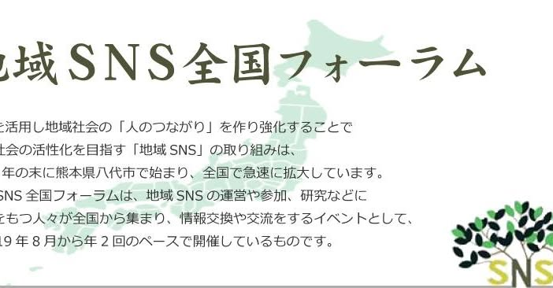

## 0016 — 2014-03-22 — 古田武士

- 投稿ID: 226068767594270
- 投稿URL: https://www.facebook.com/groups/186097664924714/posts/226068767594270/
- 要約: 一週間前になりましたので改めて告知します。 来週の土曜日に大宮で初めてのマッピングパーティーを開きます。 平たく言えば、街歩きをして地図をつくろうです。街を歩くことで新たな大宮の 発見にもつながります。
- コメント要約: 山中です。東京での別件がぶつかっていて行けそうもなくなりましたが、代わりにNPOワーク埼玉から松岡高志さんがお邪魔しますので、よろしくお願いします。

一週間前になりましたので改めて告知します。
来週の土曜日に大宮で初めてのマッピングパーティーを開きます。
平たく言えば、街歩きをして地図をつくろうです。街を歩くことで新たな大宮の
発見にもつながります。ふるって参加してください。
よろしくお願いします。

### コメント — 山中 邦久

山中です。東京での別件がぶつかっていて行けそうもなくなりましたが、代わりにNPOワーク埼玉から松岡高志さんがお邪魔しますので、よろしくお願いします。

## 0017 — 2014-03-22 — 後藤 真太郎

- 投稿ID: 226140790920401
- 投稿URL: https://www.facebook.com/groups/186097664924714/posts/226140790920401/
- 要約: Code for Saitama（仮）で支援できることを考えませんか？ NIKKEI.COM 「ツール・ド・埼玉」14年も開催 さいたま市と仏社合意 さいたま市は22日、2013年10月に初開催した自転車レース「さいたまクリテリウムｂｙツールドフランス」を14年も開催することで、仏の本大会主催会社のアモリ・スポル・オルガニザシオン（ＡＳＯ）と基本
- コメント要約: 「外人さんいらっしゃい」のシェアリングハウスの情報を提供するとか。これだけお金使うのだから市にお金が落ちるようにしなくては、、、 僕が考えているのは、OSMの大宮マップに英・仏・独のタグを充実させて外国人向けの飲食店やショッピングのタグを充実させたいと思っています。

Code for Saitama（仮）で支援できることを考えませんか？
NIKKEI.COM
「ツール・ド・埼玉」14年も開催　さいたま市と仏社合意
さいたま市は22日、2013年10月に初開催した自転車レース「さいたまクリテリウムｂｙツールドフランス」を14年も開催することで、仏の本大会主催会社のアモリ・スポル・オルガニザシオン（ＡＳＯ）と基本

### コメント — 後藤 真太郎

「外人さんいらっしゃい」のシェアリングハウスの情報を提供するとか。これだけお金使うのだから市にお金が落ちるようにしなくては、、、

### コメント — 古田武士

僕が考えているのは、OSMの大宮マップに英・仏・独のタグを充実させて外国人向けの飲食店やショッピングのタグを充実させたいと思っています。そうしたら、活用の幅も広がると思います。

### コメント — 後藤 真太郎

母国語のメニューがあるかどうかは重要ですね。

### コメント — 後藤 真太郎

３億３千万を指定席販売と寄付で処理するという予算のようですね。そんなに売れるのですかとも思いますが、継続を担保するには、魅力をボトムアップに伝えていくという事も必要ですね。去年はどうだったかの情報あればアップしていただけると嬉しいです。

### コメント — 後藤 真太郎

会場の新都心周辺のオープンストリートマップを充実させることも必要ですね。それがあればガイドマップなどは楽に作れます。次回のマッピングパーティーは新都心で。

### コメント — 後藤 真太郎

小さな旅館の広報。外国語のインストラクション作製。観光ガイド、ヘルプデスク、、、まだまだありそうですね。アイデアソンでまとめるのも良いかも。

### コメント — 山中 邦久

大宮のマッピングパーティではお世話になりました。途中で抜けなくてはならず残念でしたが、とても楽しく勉強になりました。高校生や大学生に声をかけて各地で創れるように何か企画できないかと思いましたが、上記の案では、コース沿いのマッピング情報収集と協力依頼などを絡めてさいたま市や主催者に声をかけるなどできれば、規模拡大と宣伝で普及活動になるのではと思えます。まずはどこから始めればいいのか？自分でできるように勉強するところからですかね。

## 0018 — 2014-03-23 — 後藤 真太郎

- 投稿ID: 226369734230840
- 投稿URL: https://www.facebook.com/groups/186097664924714/posts/226369734230840/
- 要約: 2/6に開催されたCode for Japan の自治体担当者向け勉強会の動画がアップされてます。ご覧ください。 2014-02-07 CfJ自治体担当者向け勉強会−１ YOUTUBE.COM 2014-02-07 CfJ自治体担当者向け勉強会−１
- コメント要約: 「税金はどこいった」のサイトはこれだけあるようですね。 ACCOUNTS.GOOGLE.COM Google Drive Google Drive

2/6に開催されたCode for Japan の自治体担当者向け勉強会の動画がアップされてます。ご覧ください。
2014-02-07 CfJ自治体担当者向け勉強会−１
YOUTUBE.COM
2014-02-07 CfJ自治体担当者向け勉強会−１

### コメント — 後藤 真太郎

「税金はどこいった」のサイトはこれだけあるようですね。http://goo.gl/LDrgFw
ACCOUNTS.GOOGLE.COM
Google Drive
Google Drive

## 0019 — 2014-03-29 — 後藤 真太郎

- 投稿ID: 227992660735214
- 投稿URL: https://www.facebook.com/groups/186097664924714/posts/227992660735214/
- 要約: 本日のマッピングパーチィー盛り上がりました。ご苦労様でした。5/10に鳩山衛星受信局の一般公開があります。ここで、地域のリモセン利用の事例を啓蒙するよう頼まれており、ポスター展示を行うことになっています。
- コメント要約: （コメントなし）

本日のマッピングパーチィー盛り上がりました。ご苦労様でした。5/10に鳩山衛星受信局の一般公開があります。ここで、地域のリモセン利用の事例を啓蒙するよう頼まれており、ポスター展示を行うことになっています。ここで、小学生、中学生向けにマッピングパーティーを行ったらどうでしょう。とれても２時間位の枠を２回くらいかと思います。時間枠については事務局に確認します。
EORC.JAXA.JP
EORC | 「科学技術週間」一般公開のお知らせ
地球観測センターでは、施設一般公開を実施します。宇宙から見た地球の画像の展示、講演会、プラバン･キーホルダー作りなど楽しい内容をご用意しています。お弁当をもって、ハイキング気分でお気軽にお立ち寄りください。皆様のご来場をお待ちしております。

## 0020 — 2014-03-31 — 羽鳥 健太郎

- 投稿ID: 228321334035680
- 投稿URL: https://www.facebook.com/groups/186097664924714/posts/228321334035680/
- 要約: 大宮マッピングパーティは楽しかったですね。参加できなかった方は残念でした。僕にとっては久しぶりのマッピングで、思い出すのに時間がかかってしまいました。鉄は熱いうちに打てではないですが、常に打ち続けないといけないかと。
- コメント要約: またやりましょう。 次回はマップ編集にもう少し時間をかけて頂くようお願いします。 今度のYLUG花見会も座学にそれほど時間を割いていませんね。古田さん、太田さん、近いうちに7Fで編集だけの座学のマッピングパーティをしましょう。

大宮マッピングパーティは楽しかったですね。参加できなかった方は残念でした。僕にとっては久しぶりのマッピングで、思い出すのに時間がかかってしまいました。鉄は熱いうちに打てではないですが、常に打ち続けないといけないかと。ということで、今週末もお花見を兼ねたマッピングパーティが北区の隅田川土手で開催されます。よかったらどうぞ。 http://ylug.doorkeeper.jp/events/10199

### コメント — 後藤 真太郎

またやりましょう。

### コメント — 羽鳥 健太郎

（本文なし）

### コメント — 酒井 千富

次回はマップ編集にもう少し時間をかけて頂くようお願いします。

### コメント — 羽鳥 健太郎

今度のYLUG花見会も座学にそれほど時間を割いていませんね。古田さん、太田さん、近いうちに7Fで編集だけの座学のマッピングパーティをしましょう。で、打ち上げは力（リキ）ね。

### コメント — 古田武士

了解です。一度、HOT支援を目的とした座学メインのマッピングパーティーでもいいですね。

## 0021 — 2014-03-31 — 古田武士

- 投稿ID: 228463494021464
- 投稿URL: https://www.facebook.com/groups/186097664924714/posts/228463494021464/
- 要約: 大宮マッピングパーティーご参加いただきましてありがとうございました。 次回の街歩きは、案だけですが新都心から南銀にかけたあたりでのマッピングパーティーを開催したいと思っています。
- コメント要約: JOSMのハンズオンセミナーは、とてもうれしいです。ぜひぜひ！

大宮マッピングパーティーご参加いただきましてありがとうございました。
次回の街歩きは、案だけですが新都心から南銀にかけたあたりでのマッピングパーティーを開催したいと思っています。
目的としては、さいたまクリテリウム前に外国人向けのガイドマップに使えるように、英・独・仏語のタグを充実させてさいたまクリテリウムのHPに使ってもらおうと考えています。
日程についてはまだノープランですが、みなさんの参加しやすい日を選んで決めていきたいと思っています。
その前に、座学でOpenstreetMapの講習会的なハンズオンセミナーをしたいなと思っています。特にJOSMの使い方を勉強することで編集に慣れてもらうことも大事だと思っています。
まだ、これについてもノープランですが・・・。

### コメント — 安部 邦昭

JOSMのハンズオンセミナーは、とてもうれしいです。ぜひぜひ！

## 0022 — 2014-04-01 — 羽鳥 健太郎

- 投稿ID: 228623110672169
- 投稿URL: https://www.facebook.com/groups/186097664924714/posts/228623110672169/
- 要約: 昨夜(3月31日)にCode for Japanのミーティングがあったので、大宮マッピングパーティのことを報告しました。Code for Gufuでも輪之中でマッピングパーティをやるそうです。
- コメント要約: Code for Japanのミーティングには出られませんでしたので情報提供助かります。私もマッピングパーティーは良いスタートになったと思いますので強く共感します。

昨夜(3月31日)にCode for Japanのミーティングがあったので、大宮マッピングパーティのことを報告しました。Code for Gufuでも輪之中でマッピングパーティをやるそうです。
開発者も重要ですが、地元の方の協力なくしては、解決どころか課題の抽出もままならないので、このようなイベントで仲間を増やすことは重要とのこと。地元の課題をITで解決するには、その前の(祭りに参加したりお酒飲んだりと)泥臭いことを重ねて、はじめてITの出番になるとか。
地道に継続的にできることをしていくのが、一見遠回りのようでも確実なのかなと思いました。そうするためにも、楽しみながらするという仕組みは重要ですね。
Code for Saitamaでは、AEDやさいたまクリテリウムbyツールドフランスの外国人対応と具体的なものが見えていますが、これに少しずつでも近づいている感じがみえるといいかなと思います。で、大宮マッピングパーティはそのはじまりとしてもかなりいいスタートになったのではないでしょうか。

### コメント — 後藤 真太郎

Code for Japanのミーティングには出られませんでしたので情報提供助かります。私もマッピングパーティーは良いスタートになったと思いますので強く共感します。組織化の経験から、準備に何度も話し合ったものほど元気がなくなっていくように思います。イベントを起こすときにゲートウェイとエバンジェリストが必要です。イベントを個々に起こしていただき、Code for Saitamaが雑用の補助、エバンジェリスト役をやれば、そんなに大きな負担なくICTによる社会貢献ができるのではないでしょうか？先ず、ツールドフランスを目標にしませんか？

## 0023 — 2014-04-03 — 安部 邦昭

- 投稿ID: 229167967284350
- 投稿URL: https://www.facebook.com/groups/186097664924714/posts/229167967284350/
- 要約: シェアします。 実証実験概要 - オープンデータ・アプリコンテスト OPENDATA.GR.JP 実証実験概要 - オープンデータ・アプリコンテスト
- コメント要約: （コメントなし）

シェアします。
実証実験概要 - オープンデータ・アプリコンテスト
OPENDATA.GR.JP
実証実験概要 - オープンデータ・アプリコンテスト

## 0024 — 2014-04-13 — 後藤 真太郎

- 投稿ID: 232247186976428
- 投稿URL: https://www.facebook.com/groups/186097664924714/posts/232247186976428/
- 要約: 八王子で外国人観光者を呼ぶアプリ開発ハッカソンが行われます。お時間のある方是非。 EVEREVO.COM 外国人観光者を八王子に呼ぶ！アプリ開発ハッカソン バリューハッカソン＠八王子 2020年に東京オリンピックが開催されることから、今後、国内には多くの外国人観光客が来日することが期待されています。
- コメント要約: ツールドフランスのためのICT利用方法のヒントがあるかも知れませんので紹介しました。

八王子で外国人観光者を呼ぶアプリ開発ハッカソンが行われます。お時間のある方是非。
EVEREVO.COM
外国人観光者を八王子に呼ぶ！アプリ開発ハッカソン バリューハッカソン＠八王子
2020年に東京オリンピックが開催されることから、今後、国内には多くの外国人観光客が来日することが期待されています。国家のみならず、地域の国際化が必要とされている社会背景もあり、今回のバリューハッカソンは「外国の方をどのように魅了し、地域に迎え入れることが出来るのか」をテーマに八王子で開催します。 2日間の集中した時間の中、地域の魅力とアプリの力で価値を創出し、日本の魅力を世界へ表現してみませんか！ バリューハッカソンとは ハッカソンに、「パワーコンセプト」という価値設計のトレーニングと方法論が入り、より価値に重点を置いたサービス開発スタイルとスキルアップを目的とした手法です。 開催概要 会場...

### コメント — 後藤 真太郎

ツールドフランスのためのICT利用方法のヒントがあるかも知れませんので紹介しました。

## 0025 — 2014-04-18 — 後藤 真太郎

- 投稿ID: 233625820171898
- 投稿URL: https://www.facebook.com/groups/186097664924714/posts/233625820171898/
- 要約: ついにさいたま市にもオープンデータ化の波がやってきました。 これは、昨年度、私もかかわりましたが、内閣府の総合防災情報システムと埼玉県の防災情報システムを連携して行った訓練の際に使ったものと思われます。
- コメント要約: おー！ 以前から出ていたICSの件も含めて清水市長に会いに行きますか？ 地元の方と一緒がいいですね。よそ者ばかりが騒いでも票になりませんので、、、 ついにですね！

ついにさいたま市にもオープンデータ化の波がやってきました。http://www.city.saitama.jp/006/007/004/003/p035574.html
これは、昨年度、私もかかわりましたが、内閣府の総合防災情報システムと埼玉県の防災情報システムを連携して行った訓練の際に使ったものと思われます。他のデータと連携させてCode for Saitamaでアイデアソンをしましょう。
CITY.SAITAMA.JP
さいたま市／さいたま市オープンデータポータル（試行版）
オープンデータが活用され、住民生活や企業活動の利便性の向上につながる社会を目指し、第63回九都県市首脳会議（埼玉県・千葉県・東京都・神奈川県・横浜市・川崎市・千葉市・さいたま市・相模原市）において、ビッグデータ・オープンデータの活用を首都圏連合協議会で検討することとなりました。検討の結果、試行的に「避難所等の位置情報」を対象としたオープンデータ化ガイドラインを策定し、さいたま市を含めた複数の団体において、データ公開を実施しています。

### コメント — 星野 邦敏

おー！

### コメント — 山中 邦久

以前から出ていたICSの件も含めて清水市長に会いに行きますか？

### コメント — 後藤 真太郎

地元の方と一緒がいいですね。よそ者ばかりが騒いでも票になりませんので、、、

### コメント — 中川 峻一

ついにですね！

### コメント — 後藤 真太郎

4/26PMのマッピング講習会がありますのでそのAMにアイデアだしの会を作りませんか？

## 0026 — 2014-04-19 — 後藤 真太郎さんがグループのイベントを作成しました。

- 投稿ID: 233954020139078
- 投稿URL: https://www.facebook.com/groups/186097664924714/posts/233954020139078/
- 要約: プレアイデアソン ‐さいたま市のオープンデータを使おう‐ 2014/04/26(土) プレアイデアソン ‐さいたま市のオープンデータを使おう‐ さいたま市 後藤 真太郎さんから招待がありました
- コメント要約: （コメントなし）

プレアイデアソン ‐さいたま市のオープンデータを使おう‐
2014/04/26(土)
プレアイデアソン ‐さいたま市のオープンデータを使おう‐
さいたま市
後藤 真太郎さんから招待がありました

## 0027 — 2014-04-24 — 横堀 泰子

- 投稿ID: 235489323318881
- 投稿URL: https://www.facebook.com/groups/186097664924714/posts/235489323318881/
- 要約: ご紹介 (^-^) ITPRO.NIKKEIBP.CO.JP 富士通が東北復興支援のハッカソン、自転車旅行向けサービスなどを開発 富士通は2014年4月12日〜13日の2日間、社外の人材を交えたハッカソンを開催した。
- コメント要約: 1月の富士通のハッカソンには参加しました。旅行系に力を入れているようですね。 ICTの活用推進策 いろいろチャレンジしているようですね｡ (^-^)

ご紹介 (^-^)
ITPRO.NIKKEIBP.CO.JP
富士通が東北復興支援のハッカソン、自転車旅行向けサービスなどを開発
富士通は2014年4月12日〜13日の2日間、社外の人材を交えたハッカソンを開催した。名称は「さくらハッカソン2014」。「桜をきっかけにして東北を訪れる人々を増やすアイデア・サービス」を開発することが目的だ。

### コメント — 後藤 真太郎

1月の富士通のハッカソンには参加しました。旅行系に力を入れているようですね。

### コメント — 横堀 泰子

ICTの活用推進策 いろいろチャレンジしているようですね｡ (^-^)

## 0028 — 2014-04-25 — 後藤 真太郎

- 投稿ID: 235785609955919
- 投稿URL: https://www.facebook.com/groups/186097664924714/posts/235785609955919/
- 要約: に向けて企画書を企んでます。コアとなる協議会に相当する団体は埼玉県GIS普及推進研究会を想定してます。ツールドフランスに向けたマッピングとそれを利用したガイドマップなどもその中のメニューに考えております。
- コメント要約: ツール・ド・フランスへの活用、大賛成です。全面的に応援します。 天野先生のアイデアも加えて、いくつかの大学と県社協、さいたま市などとの協議会設立が必要ではないでしょうか？

http://www.mlit.go.jp/.../kokudoseisaku01_hh_000042.html に向けて企画書を企んでます。コアとなる協議会に相当する団体は埼玉県GIS普及推進研究会を想定してます。ツールドフランスに向けたマッピングとそれを利用したガイドマップなどもその中のメニューに考えております。参加希望の団体は連絡いただけましたらうれしいです。4/26のAMにも具体的に議論する予定です。
MLIT.GO.JP
報道発表資料：「平成26年度G空間社会実証プロジェクト事業」の募集について - 国土交通省

### コメント — 土井 裕之

ツール・ド・フランスへの活用、大賛成です。全面的に応援します。

### コメント — 山中 邦久

天野先生のアイデアも加えて、いくつかの大学と県社協、さいたま市などとの協議会設立が必要ではないでしょうか？設立趣意書をＡ４版で作っていただければ、いくつかの行政には当たって見ることも可能かと思います。もちろん、ツールドに照準を合わせる戦略もあるでしょうが。

## 0029 — 2014-04-26 — 後藤 真太郎

- 投稿ID: 236140613253752
- 投稿URL: https://www.facebook.com/groups/186097664924714/posts/236140613253752/
- 要約: とよしま亮介さんから 140426 会議メモ（途中から） 次回以降の会議予定 ・原則この場所（7F）で行う ・公務員も参加できる日にする ・ノー残業デイの水曜日に行う ・平日は１９時から開始とする アイデアソンについて ・平日にミニアイデアソンを行う ・予め告知出して会場をおさえる ・初めての人もいるのでコースを歩いてみる メンター会議 ５月１４日 １９：…
- コメント要約: （コメントなし）

とよしま亮介さんから
140426 会議メモ（途中から）
次回以降の会議予定
・原則この場所（7F）で行う
・公務員も参加できる日にする
・ノー残業デイの水曜日に行う
・平日は１９時から開始とする
アイデアソンについて
・平日にミニアイデアソンを行う
・予め告知出して会場をおさえる
・初めての人もいるのでコースを歩いてみる
メンター会議
５月１４日　１９：００（７Ｆ）アイデアソン企画
６月　４日　１９：００（７Ｆ）最終調整
ミニアイデアソン
６月１１日　１９：００（７Ｆ）
メインアイデアソン
６月２２日　１０：００（コースＦＷ）
１３：００（会場未定）
記録者　豊島
修正点あればお知らせください。

## 0030 — 2014-04-26 — 後藤 真太郎

- 投稿ID: 236232399911240
- 投稿URL: https://www.facebook.com/groups/186097664924714/posts/236232399911240/
- 要約: 本日のプレアイデアソンおよびJOSM講習会に参加いただきありがとうございました。ツールドフランスのハッキングに向け進み始めることになりました。昨年の広報を調べてましたら、 に以下の文言があります。
- コメント要約: さすがツール・ド・フランス。オリンピックやサッカーワールドカップみたい 何もするなという事？かえってハッキングしたくなりますね。 規約の通り、大会の告知（例示はリンク先に載っております）以外は、規約に則り申請が必要と書いてありますね。

本日のプレアイデアソンおよびJOSM講習会に参加いただきありがとうございました。ツールドフランスのハッキングに向け進み始めることになりました。昨年の広報を調べてましたら、http://saitama-criterium.jp/logo_about.html　                                                 に以下の文言があります。これは勝手に広報するなという事なんでしょうか？この分野にお詳しい方、解説していただけましたら嬉しいです。
--------------------------　　　　　　　　　　　　　　　　　　　　　　　　　　「「さいたまクリテリウムbyツールドフランス」（以下「当イベント」）の名称及びロゴに関する使用は、主催者並びにさいたまクリテリウム実行委員会（以下「実行委員会」）がA.S.O.社から許諾を得ているものであり、それらの使用には、主催者並びに実行委員会、実行委員会が承認する団体（大会スポンサー等）及び報道関係、大会告知に寄与する場合に限り許諾されます。
故意過失に関わらず、無断使用ならびに類似や想起を喚起する使用の一切は、不正使用となりますので、ご注意ください。」と表記されてます。

### コメント — 酒井 千富

さすがツール・ド・フランス。オリンピックやサッカーワールドカップみたい

### コメント — 後藤 真太郎

何もするなという事？かえってハッキングしたくなりますね。

### コメント — 上村 貴広

規約の通り、大会の告知（例示はリンク先に載っております）以外は、規約に則り申請が必要と書いてありますね。

### コメント — 後藤 真太郎

今年度はまだ告知されてないから早いもん勝ち？

### コメント — 上村 貴広

後藤先生
問合せされるのが確実かと思います。普及や広報にも資する部分もあると思いますし、ロゴも使用できる可能性もありますよね。

### コメント — 安部 邦昭

アイデアソンの日程等を決めましたが、fbイベントを立てましょうか？

### コメント — 後藤 真太郎

お願いします。

## 0031 — 2014-05-01 — 後藤 真太郎

- 投稿ID: 237393039795176
- 投稿URL: https://www.facebook.com/groups/186097664924714/posts/237393039795176/
- 要約: イベントからのノアの方舟大作戦その2： 朝日新聞にこのような記事があります。避難所データがないとこのようなことは出来ません。 ASAHI.COM （新防災力）避難計画向上へ地理情報を活用：朝日新聞デジタル 津波で大きな被害が懸念される南海トラフの巨大地震に備え、ＧＩＳ（地理情報システム）を使って避難時の安全性を検証する取り組みが始まっている。
- コメント要約: （コメントなし）

イベントからのノアの方舟大作戦その2：
朝日新聞にこのような記事があります。避難所データがないとこのようなことは出来ません。
ASAHI.COM
（新防災力）避難計画向上へ地理情報を活用：朝日新聞デジタル
津波で大きな被害が懸念される南海トラフの巨大地震に備え、ＧＩＳ（地理情報システム）を使って避難時の安全性を検証する取り組みが始まっている。地図上の住宅や道路に加え、津波避難の検証に必要な標高の情報も

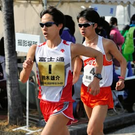

## 0032 — 2014-05-01 — 後藤 真太郎

- 投稿ID: 237395553128258
- 投稿URL: https://www.facebook.com/groups/186097664924714/posts/237395553128258/
- 要約: 4/26の打ち合わせの内容を受け、次回以降の会議予定をお知らせします。 6/11のミニアイデアソン、6/21のアイデアソンなどの企画から参加していただくメンターを募集します。
- コメント要約: も見てください。現在参加者9名です。 行けそうなら参加しますね

4/26の打ち合わせの内容を受け、次回以降の会議予定をお知らせします。
6/11のミニアイデアソン、6/21のアイデアソンなどの企画から参加していただくメンターを募集します。以下にレスお願いします。
・原則この場所（7F）で行う
・公務員も参加できる日にする
・ノー残業デイの水曜日に行う
・平日は１９時から開始とする
アイデアソンについて
・平日にミニアイデアソンを行う
・予め告知出して会場をおさえる
・初めての人もいるのでコースを歩いてみる
メンター会議
５月１４日　１９：００（７Ｆ）アイデアソン企画
６月　４日　１９：００（７Ｆ）最終調整
ミニアイデアソン
６月１１日　１９：００（７Ｆ）
メインアイデアソン
６月２1日　１０：００（コースＦＷ）-> ６月２1日に変更
１３：００（会場未定）

### コメント — 後藤 真太郎

https://www.facebook.com/events/459272200884491/ も見てください。現在参加者9名です。

### コメント — 川畑光功

行けそうなら参加しますね

## 0033 — 2014-05-01 — 後藤 真太郎さんがグループのイベントを作成しました。

- 投稿ID: 237397373128076
- 投稿URL: https://www.facebook.com/groups/186097664924714/posts/237397373128076/
- 要約: アイデアソン企画MTG 2014/05/14(水) アイデアソン企画MTG さいたま市
- コメント要約: （コメントなし）

アイデアソン企画MTG
2014/05/14(水)
アイデアソン企画MTG
さいたま市

## 0034 — 2014-05-02 — 安部 邦昭さんがグループのイベントを作成しました。

- 投稿ID: 237752376425909
- 投稿URL: https://www.facebook.com/groups/186097664924714/posts/237752376425909/
- 要約: アイデアソン企画MTG－最終調整 2014/06/04(水) アイデアソン企画MTG－最終調整 さいたま市
- コメント要約: （コメントなし）

アイデアソン企画MTG－最終調整
2014/06/04(水)
アイデアソン企画MTG－最終調整
さいたま市

## 0035 — 2014-05-05 — 後藤 真太郎

- 投稿ID: 238652039669276
- 投稿URL: https://www.facebook.com/groups/186097664924714/posts/238652039669276/
- 要約: 6/22のアイデアソンの会場ですが、さいたま市、埼玉県庁をはじめ、GIS普及推進研究会を通して周辺自治体に連絡しますので会場の仮押さえはしたいです。新都心のドコモビルの会議室などどうでしょうか?
- コメント要約: （コメントなし）

6/22のアイデアソンの会場ですが、さいたま市、埼玉県庁をはじめ、GIS普及推進研究会を通して周辺自治体に連絡しますので会場の仮押さえはしたいです。新都心のドコモビルの会議室などどうでしょうか?お借りできませんでしょうか？7F利用者やお知り合いの方を通して聞いていただけませんか？パケットを使いますので、Win-Winが成り立つのかなと思います。あるいは、共催をお願いして借りましょうか？

## 0036 — 2014-05-05 — 後藤 真太郎

- 投稿ID: 238653866335760
- 投稿URL: https://www.facebook.com/groups/186097664924714/posts/238653866335760/
- 要約: （要約なし）
- コメント要約: マッピングパーティー前の新都心の OSM （オープンストリートマップ）です。これがどこまで進化するか、乞うご期待 !

（本文なし。コメントからイベント関連性を確認）

### コメント — 後藤 真太郎

マッピングパーティー前の新都心の
OSM　（オープンストリートマップ）です。これがどこまで進化するか、乞うご期待 !!

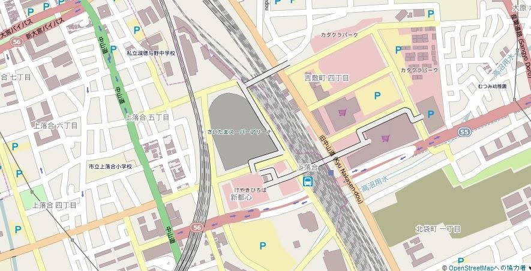

## 0037 — 2014-05-14 — 安部 邦昭

- 投稿ID: 241074259427054
- 投稿URL: https://www.facebook.com/groups/186097664924714/posts/241074259427054/
- 要約: 明日ですが、横浜でこんなイベントがあるそうです。ご参考まで。 2014/05/15(木) 政策デザイン勉強会 Vol.23「鯖江・横浜からオープンデータを考える」 横浜市 興味あり
- コメント要約: （コメントなし）

明日ですが、横浜でこんなイベントがあるそうです。ご参考まで。
https://www.facebook.com/events/664300100291156/
2014/05/15(木)
政策デザイン勉強会 Vol.23「鯖江・横浜からオープンデータを考える」
横浜市
興味あり

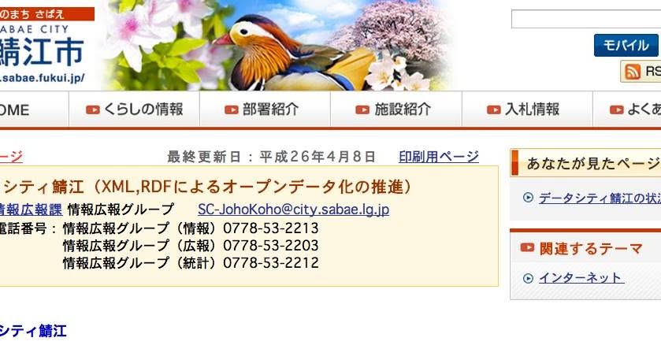

## 0038 — 2014-05-14 — 安部 邦昭さんがドキュメントを編集しました。

- 投稿ID: 241133342754479
- 投稿URL: https://www.facebook.com/groups/186097664924714/posts/241133342754479/
- 要約: クリテリウム ハッカソン MTG ◆自己紹介 古田・太田・羽島・酒井・横堀・伊藤・ 柴田・天野・石山・工藤・後藤・安部・豊島 ◆スローガン ◆経緯と今後のスケジュール 5/26 Cfsでの企画会議 5/31 新都心マッピングパーティ 5/14、6/4 スタッフ会議 6/11 ミニ・アイデアソン 19：00 アイデアソン 収容人数：３０人（MAX) 6/22…
- コメント要約: ちょっと訂正。安倍さん⇒安部さん デス。(^-^) YABAI! ((((；ﾟДﾟ))))ｶﾞｸｶﾞｸﾌﾞﾙﾌﾞﾙ 1点 確認です。 6/11(水)のスケジュール 旧]ミニアイディアソン：19:00-21:00 ↓ 新]ミニアイディアソン：何時から?

クリテリウム　ハッカソン MTG
◆自己紹介 古田・太田・羽島・酒井・横堀・伊藤・ 柴田・天野・石山・工藤・後藤・安部・豊島   ◆スローガン     ◆経緯と今後のスケジュール 5/26 Cfsでの企画会議   5/31　新都心マッピングパーティ   5/14、6/4　スタッフ会議   6/11　ミニ・アイデアソン 19：00　アイデアソン   収容人数：３０人（MAX)   6/22　メイン・アイデアソン 10:00　コース下
もっと見る

### コメント — 横堀 泰子

ちょっと訂正。安倍さん⇒安部さん デス。(^-^)

### コメント — 太田 一穂

YABAI!!!
((((；ﾟДﾟ))))ｶﾞｸｶﾞｸﾌﾞﾙﾌﾞﾙ

### コメント — 横堀 泰子

1点 確認です。
6/11(水)のスケジュール
旧]ミニアイディアソン：19:00-21:00
↓
新]ミニアイディアソン：何時から?
アイディアソン　　：19:00-21:00?

### コメント — 太田 一穂

6/11 19-21時のアイデアソンを「ミニ・アイデアソン」と言っているのだと思います。

### コメント — 横堀 泰子

太田さん コメントありがとうございます。
再質問です。
19:00の前にも 予定を入れないといけないのでしょうか?

### コメント — 安部 邦昭

6/11は、19:00～のみと認識しています。
あ、名前は見つかる前にこっそり直しちゃおうと思っていました(笑)

### コメント — 古田武士

修正ありがとう御座います。誤字は失礼しました。

### コメント — 安部 邦昭

古田さん、いえいえです。

### コメント — 後藤 真太郎

5/26 Cfsでの企画会議ってなんでしたっけ？もしやCfJ ?

### コメント — 安部 邦昭

5/26は特に予定していなかったと思います！

## 0039 — 2014-05-14 — 古田武士さんは安部 邦昭さん、他6人と一緒です。

- 投稿ID: 241134152754398
- 投稿URL: https://www.facebook.com/groups/186097664924714/posts/241134152754398/
- 要約: 古田武士 クリテリウムハッカソンのMTGの議事— 友達: 安部 邦昭さん、 他6人
- コメント要約: 今日は、参加させていただき、ありがとうございました。 皆さんの議論を聞きながら、いろいろ考えましたので、投稿します。 (※がついている部分が、私が考えた部分です。

古田武士
クリテリウムハッカソンのMTGの議事— 友達: 安部 邦昭さん、
他6人

### コメント — 天野 徹

今日は、参加させていただき、ありがとうございました。

### コメント — 天野 徹

皆さんの議論を聞きながら、いろいろ考えましたので、投稿します。
(※がついている部分が、私が考えた部分です。。。多分、皆さんの考えも入っていると思いますが)。
どうぞよろしくお願いします。

### コメント — 天野 徹

※○○系(嗜好別)向けのコンテンツセットの紹介は可能か。。。ストーリーの想定??
〇提供側と受け側の解釈・意味づけがことなることが多い。。。検索できる要素。。。
〇ウナギ屋さんめぐりのルートを提供するとか。
※昼ーウナギ、夜ー寿司など、食べ歩きポイントの組み合わせとか
(お店が空いている時間に、ゆっくり食べられるような、案内など)
※宿泊駅までの終電のつなぎ情報、それぞれの時間ごとの電車の乗継ぎセットなどの案内
※緯度経度辞書で、SNSから情報を切り出して、地図上でマッピングして見せるソフトを活用
※素材の組み合わせでスケジュールできる機能･･･地図上に空間的に展開して見せる機能とか、乗り継ぎ情報とか
※空席情報、予約機能など、アプリを使うとお得と思ってもらえる機能
･･･ポイント付与よりも、お店に協力してもらいやすいのではないか??
※営業時間とサービス内容・空きテーブル数などについてのリアルタイム情報･･･座席占有状態を知らせる座布団を使うなどの工夫をする
※民族・言語コミュニティ、溜まり場情報の提供を行う
･･･一体感を持って応援できるお店とか
※ATM、トイレ、喫茶店、宿泊の空き情報などの案内
･･･観戦後、街で遊んでもらった後の、小さな予定変更に対応する
〇行政が持っているガイドマップのデータを使う
※おすすめスポットの写真一覧から、回りたいスポットを選ぶと、地図上で回遊ルートを表示してくれて、必要な時間や交通費を概算してくれるアプリができないか(バスの乗り継ぎ情報、タクシー乗り場情報などがあると、もっと良い)
･･･※おすすめスポットについては、住所があれば緯度経度をすぐ出せるサイトがあるので、これを利用して、各スポットと緯度経度のデータベースを作ってしまえばよい･･･緯度経度パーティを開く、とか(笑)
→地図上にマッピングする
〇建物の形状をマップに落としても、上空から見た形しかわからないので、実際に見た目とは違う既存の地図をレイヤーにして重ねて表示するのは、著作権上の問題が発生する恐れあり
〇OSMから「宿泊パック」情報だけを抜き出して表示するとか
〇OSMへの情報登録を仲間に依頼するアプリとか。。。(ご近所自慢情報の登録コンテストとか。。。)
※外国人の自慢するスポット、内容についての情報をSNSから集めて、マップ上に落として、共有する(名前付きで)
〇プレミアム情報をいったん引き取って、付加価値を入れて登録する
〇空き時間で回れるスポットを紹介する。。。基点から徒歩圏で回れるスポットの提供とか時間内に交通機関を使って回れるコースとか
※傘情報、雨宿り情報、トイレ利用可能店舗情報、トイレ待ち人数情報(特に女性用)、渋滞情報、電車の遅れ情報など
※バスルート情報、出発地点と目的地を指定し乗り継ぎ案内をして地図上で案内する機能とか

### コメント — 天野 徹

・・・改行がめちゃめちゃになってしまい、済みません。

### コメント — とよしま 亮介

( ´ ▽ ` )ﾉ

### コメント — 横堀 泰子

天野さん 「編集」で修正されては如何でしょうか?

### コメント — 天野 徹

有難うございます。ちょっとだけ修正しました。
私の考えは※、会場で出た意見は〇で、示しています。。。
マッピングパーティとハッカソンと、緯度経度パーティがごっちゃになってる感がありますが。。。昨日参加させていただいて考えたのは、こんなところです。
ご参考になるものがあれば幸いです。

### コメント — 古田武士

天野さん作成文をドキュメントにしましたのでご修正くださればと思います。

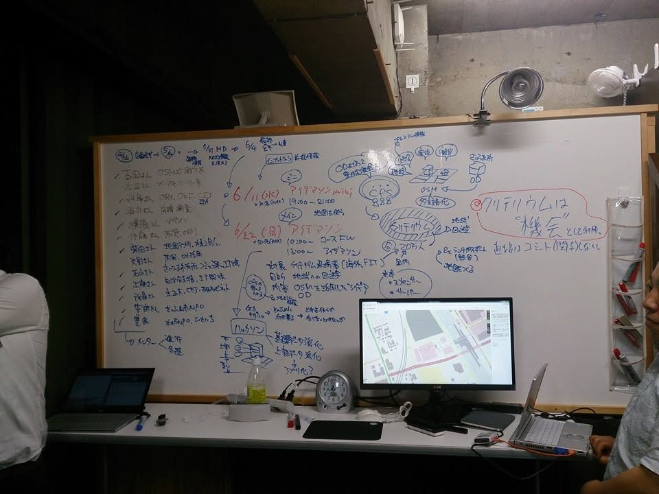

## 0040 — 2014-05-17 — 後藤 真太郎

- 投稿ID: 241817776019369
- 投稿URL: https://www.facebook.com/groups/186097664924714/posts/241817776019369/
- 要約: 3/29に7Fでこのようなイベントがあったのですね。50年前、荒川の河川敷にあった新川河岸を復元してHMDに表示しようとしてますので、HMDを使っているGrを紹介していただけませんでしょうか？
- コメント要約: こんな活動も行ってます。幻の村新川。ここは、現在3世代の交流のエコミュージアムになってます。 SHINKAWA-MUSE.NET 幻の村 新川村 幻の村 新川村

3/29に7Fでこのようなイベントがあったのですね。50年前、荒川の河川敷にあった新川河岸を復元してHMDに表示しようとしてますので、HMDを使っているGrを紹介していただけませんでしょうか？
ATND.ORG
EPSON Moverio ハッカソン in 埼玉

### コメント — 後藤 真太郎

こんな活動も行ってます。幻の村新川。ここは、現在3世代の交流のエコミュージアムになってます。　http://shinkawa-muse.net/
SHINKAWA-MUSE.NET
幻の村 新川村
幻の村 新川村

## 0041 — 2014-05-18 — 後藤 真太郎

- 投稿ID: 241917532676060
- 投稿URL: https://www.facebook.com/groups/186097664924714/posts/241917532676060/
- 要約: 5/29大宮ソニックシティ―にて、埼玉県GIS普及推進研究会講演会を開催します。 今回は、ビッグデータの交通安全対策への適用事例と北九州市での情報伝達・共有型図上訓練のプログラムにつき紹介します。
- コメント要約: 別件が浦和で14:30までなのですが 少し遅れても大丈夫でしょうか? 大丈夫です。よろしくお願いします。

5/29大宮ソニックシティ―にて、埼玉県GIS普及推進研究会講演会を開催します。http://goo.gl/hJDYD0　今回は、ビッグデータの交通安全対策への適用事例と北九州市での情報伝達・共有型図上訓練のプログラムにつき紹介します。平時のカーナビデータが災害時の交通不通箇所データとしても利用出来、状況認識の統一（COP:Common Operational Picture）へのGIS利用につき考えたいと思います。非会員でも参加可能ですので是非ご参加下さい。
DOCS.GOOGLE.COM
2014.5/29　埼玉県GIS普及推進研究会講演会申込み
埼玉県GIS普及推進研究会講演会を開催します。非会員でも参加可能ですので是非ご参加下さい。 尚、出欠のご返事は、下記にご記入の上、5月26日（月）までにお願いします。 ２０１４年５月２９日(木)　 開場・受付開始　１３：３０～ 講演会　１４：３０～１６：５５(大宮ソニックシティ　６０３号室) （総会　　１３：４５～１４：１５(大宮ソニックシティ　６０３号室)　（会員のみ）） 14:30-14:40 開会・趣旨説明（後藤　真太郎　会長） 14:40-15:40　基調講演１： 　カーナビデータを活用した交通安全対策について 　　　埼玉県県土整備部道路政策課　主幹　水谷　信哉　氏 　 15:40-1…

### コメント — 横堀 泰子

別件が浦和で14:30までなのですが 少し遅れても大丈夫でしょうか?

### コメント — 後藤 真太郎

大丈夫です。よろしくお願いします。

## 0042 — 2014-05-18 — 古田武士

- 投稿ID: 242054989328981
- 投稿URL: https://www.facebook.com/groups/186097664924714/posts/242054989328981/
- 要約: アイデアソンセミナーに参加しました。
- コメント要約: （コメントなし）

アイデアソンセミナーに参加しました。

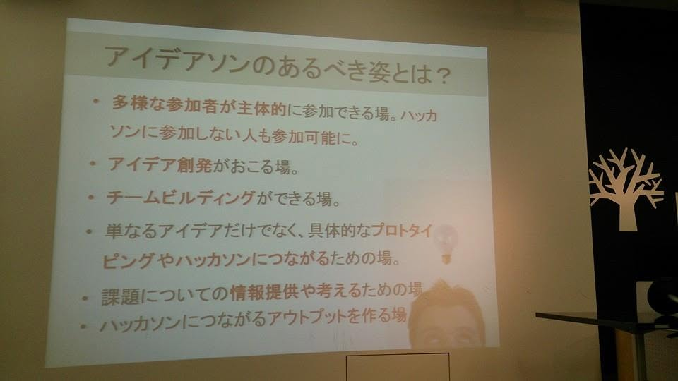

## 0043 — 2014-05-25 — 後藤 真太郎

- 投稿ID: 243832865817860
- 投稿URL: https://www.facebook.com/groups/186097664924714/posts/243832865817860/
- 要約: 熊谷市のオープンデータ（市はそのつもりではないようですが）を紹介します。トップページの「あつナビ」からB級グルメ（雪くま、フライ、熊谷うどん、、、）、桜の見どころ、冷しシャンプーの店、イベントなどのマップが表示でき、kmlデータがダウンロードできるようになってます。
- コメント要約: （コメントなし）

熊谷市のオープンデータ（市はそのつもりではないようですが）を紹介します。トップページの「あつナビ」からB級グルメ（雪くま、フライ、熊谷うどん、、、）、桜の見どころ、冷しシャンプーの店、イベントなどのマップが表示でき、kmlデータがダウンロードできるようになってます。　これは8年前に大学と協働事業で行われたものです。
ATSUIZO.COM
あついぞ.com - 市街地駐車場・駐輪場
あついぞ.comは熊谷周辺の情報発信ポータルサイトです。

## 0044 — 2014-05-25 — 後藤 真太郎

- 投稿ID: 243834015817745
- 投稿URL: https://www.facebook.com/groups/186097664924714/posts/243834015817745/
- 要約: 本日25日（日）19:20頃からNHKニュース7で、「調布マッピングパーティー」の様子が放送される予定です。未だ間に合います。5/31, 6/22もプレスリリースしましょう。
- コメント要約: （コメントなし）

本日25日（日）19:20頃からNHKニュース7で、「調布マッピングパーティー」の様子が放送される予定です。未だ間に合います。5/31, 6/22もプレスリリースしましょう。

## 0045 — 2014-05-27 — 古田武士

- 投稿ID: 244402545760892
- 投稿URL: https://www.facebook.com/groups/186097664924714/posts/244402545760892/
- 要約: 今度のマッピングパーティーのおおよそのスケジュールです。 １０：００ OSM入門講座 １１：３０ 南銀経由でさいたま新都心に向かいます。途中、昼食をはさみます。
- コメント要約: ｢OSM入門講座｣参加したいのですが 遅れる可能性があります。何時までならokでしょうか? 子連れのため、午後からの参加になりそうです。よろしくお願いいたします。

今度のマッピングパーティーのおおよそのスケジュールです。
１０：００　OSM入門講座
１１：３０　南銀経由でさいたま新都心に向かいます。途中、昼食をはさみます。
１３：００　さいたま新都心でのマッピングパーティ
１５：３０　大宮南公民館に移動
１７：００　マッピングパーティ終了
１８：００　けやきひろばでビール祭り参加
でどうでしょうか。
マッピングパーティの目的として
・外国人向けガイドマップとして多言語タグの登録の練習
・チェーン店（コンビニ・飲食・ショップ）の登録
・観光客向け施設の登録（ホテル・銀行・郵便局など）
を企画しています。午後からのさいたま新都心のみでも構いません。
参加はインベントページで
・OSM入門講座
https://www.facebook.com/events/677649452289094/
・さいたま新都心マッピングパーティ
https://www.facebook.com/events/714056385307055/
2014/05/31(土)
5/31 OpenStreetMap入門講座
さいたま市
参加者0人・興味あり0人

### コメント — 横堀 泰子

｢OSM入門講座｣参加したいのですが 遅れる可能性があります。何時までならokでしょうか?

### コメント — 安部 邦昭

子連れのため、午後からの参加になりそうです。よろしくお願いいたします。

### コメント — 後藤 真太郎

プレスリリースはどこまでされてますか？

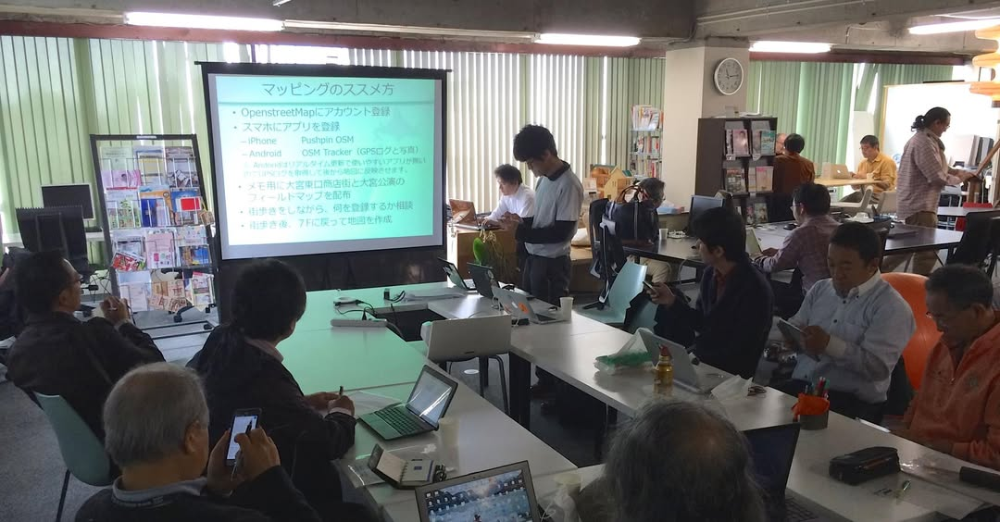

## 0046 — 2014-05-31 — とよしま 亮介

- 投稿ID: 245504988983981
- 投稿URL: https://www.facebook.com/groups/186097664924714/posts/245504988983981/
- 要約: これまでの流れをまとめました。 適宜修正お願いします。
- コメント要約: とよしまさん、ありがとうございます。こうしてまとめていただけると、外部に発信するときにとても助かります。

これまでの流れをまとめました。
適宜修正お願いします。
Code for SAITAMAの記録（仮）
1/8　Code for SAITAMA(仮)～さいたまのIT×市民活動をわくわくする～第1回MTG
1/20　Code for SAITAMA(仮)～さいたまのIT×市民活動をわくわくする～第2回MTG
1/24-25　協働型大規模災害訓練（有志参加）
3/15　第13回地域SNS全国フォーラムin東京（立正大学大崎キャンパス）
3/22　提案「ツールド埼玉支援」（後藤）
3/29　大宮マッピングパーティー
4/26　JOSM講習会
4/26　プレアイデアソン ‐さいたま市のオープンデータを使おう‐
5/14　アイデアソン企画MTG
5/31　OpenStreetMap入門講座
第2回大宮マッピングパーティー

### コメント — 安部 邦昭

とよしまさん、ありがとうございます。こうしてまとめていただけると、外部に発信するときにとても助かります。

## 0047 — 2014-06-01 — 後藤 真太郎

- 投稿ID: 245908688943611
- 投稿URL: https://www.facebook.com/groups/186097664924714/posts/245908688943611/
- 要約: ヤフーニュースにも取り上げられてました。やはり発信すべきですよね。そのためにはロジも大切。 HEADLINES.YAHOO.CO.JP 大宮で「マッピングパーティー」−誰もが使える著作権フリー地図を作る ／埼玉（みんなの経済新聞ネットワーク） - Y!
- コメント要約: （コメントなし）

ヤフーニュースにも取り上げられてました。やはり発信すべきですよね。そのためにはロジも大切。
HEADLINES.YAHOO.CO.JP
大宮で「マッピングパーティー」−誰もが使える著作権フリー地図を作る　／埼玉（みんなの経済新聞ネットワーク） - Y!ニュース
Yahoo!ニュース

## 0048 — 2014-06-01 — 後藤 真太郎

- 投稿ID: 245908915610255
- 投稿URL: https://www.facebook.com/groups/186097664924714/posts/245908915610255/
- 要約: 青木さんのブログにも取り上げられてます。 BLOG.GOO.NE.JP 第2回 大宮マッピングパーティー: - うじじす@オープンデータeventブログ 2014年5月31日13:00 - 17:00 5日後 · 31°C / 19°C 所により曇り 地図を表示 さいたま新都心駅 〒330-0843 ...
- コメント要約: （コメントなし）

青木さんのブログにも取り上げられてます。
BLOG.GOO.NE.JP
第2回　大宮マッピングパーティー: - うじじす@オープンデータeventブログ
https://www.facebook.com/events/714056385307055/?source=1 2014年5月31日13:00 - 17:00 5日後 · 31°C / 19°C 所により曇り 地図を表示 さいたま新都心駅 〒330-0843 ...

## 0049 — 2014-06-01 — 後藤 真太郎

- 投稿ID: 245909498943530
- 投稿URL: https://www.facebook.com/groups/186097664924714/posts/245909498943530/
- 要約: 流山では小学生対象のマッピングパーティーを開催したようですね。防災科研の田口さんの写真が見えますのでe-コミの関係でしょうか？ CITY.NAGAREYAMA.CHIBA.JP 小学生がマッピングパーティ 11月9日、文化会館で「マッピングパーティながれやま」が開催されました。
- コメント要約: （コメントなし）

流山では小学生対象のマッピングパーティーを開催したようですね。防災科研の田口さんの写真が見えますのでe-コミの関係でしょうか？
CITY.NAGAREYAMA.CHIBA.JP
小学生がマッピングパーティ
11月9日、文化会館で「マッピングパーティながれやま」が開催されました。

## 0050 — 2014-06-02 — 古田武士

- 投稿ID: 246078358926644
- 投稿URL: https://www.facebook.com/groups/186097664924714/posts/246078358926644/
- 要約: 埼玉新聞に土曜日のマッピングパーティが記事になりました。 文中に８月にも開催予定と告知してしまいました。 防災の日が９月１日（月）なので、８月３０・３１日のどちらかでしたいと思っています。
- コメント要約: 夏休みの自由研究向けマッピングというのもアリかもしれませんね。

埼玉新聞に土曜日のマッピングパーティが記事になりました。
文中に８月にも開催予定と告知してしまいました。
防災の日が９月１日（月）なので、８月３０・３１日のどちらかでしたいと思っています。
ネタとしては防災まちづくり系のイベントにしたいので
・どこでやるのか
・何を登録するのか
・どれくらいの規模を巻き込んでやるのか
を議論できたらと思っています。
できれば、調布メソッドの街歩きチームとマッピングチームを
分けた形にできたらと思います。
【街歩きチーム】
・テーマのものの情報をあつめる。
・テーマのものを写メをとる。
・メールで送信かTwitterに位置情報付きでそうしんする。
・機器を持っていない人は紙地図に書き込む
【マッピングチーム】
・メールやTwitterで上がってきた情報を集約する。
・集約した情報をJOSMもしくはIDで登録する。
・街歩きチームが合流した後で紙地図を回収して登録する。
です。何を登録したらいいかはまだ未定です。ポスト・バス停・etc・・・
街歩きチームは特にIT知識もいらないので参加者を募りたいと思っています。特に夏休み最終日ですので中高生の参加もできればと思います。

### コメント — 安部 邦昭

夏休みの自由研究向けマッピングというのもアリかもしれませんね。

## 0051 — 2014-06-02 — 後藤 真太郎

- 投稿ID: 246095702258243
- 投稿URL: https://www.facebook.com/groups/186097664924714/posts/246095702258243/
- 要約: マッピングパーティの記事が埼玉新聞に掲載されました。中野さん、新人なのに名前入りの記事とは素晴らしい。ありがとうございました。 このコンテンツは現在ご利用いただけません 所有者がシェア先を一部の人のみに限定しているか、プライバシー設定が変更されたか、コンテンツが削除された、などの理由が考えられます。
- コメント要約: （コメントなし）

マッピングパーティの記事が埼玉新聞に掲載されました。中野さん、新人なのに名前入りの記事とは素晴らしい。ありがとうございました。
このコンテンツは現在ご利用いただけません
所有者がシェア先を一部の人のみに限定しているか、プライバシー設定が変更されたか、コンテンツが削除された、などの理由が考えられます。

## 0052 — 2014-06-02 — 古田武士

- 投稿ID: 246141542253659
- 投稿URL: https://www.facebook.com/groups/186097664924714/posts/246141542253659/
- 要約: アイデアソンのATNDを立てておきました ミニアイデアソン アイデアソン 文面は仮ですので文言入れてくれたら修正します。 ATND.ORG Code for SAITAMA ミニアイデアソン
- コメント要約: （コメントなし）

アイデアソンのATNDを立てておきました
ミニアイデアソン
http://atnd.org/events/51878
アイデアソン
http://atnd.org/events/51879
文面は仮ですので文言入れてくれたら修正します。
ATND.ORG
Code for SAITAMA ミニアイデアソン

## 0053 — 2014-06-04 — 古田武士

- 投稿ID: 246667938867686
- 投稿URL: https://www.facebook.com/groups/186097664924714/posts/246667938867686/
- 要約: Code for Japan のアイデアソンの流れの動画 第4回Brigadeワークショップ「アイデアソンのやり方を学ぶ！」 YOUTUBE.COM 第4回Brigadeワークショップ「アイデアソンのやり方を学ぶ！
- コメント要約: （コメントなし）

Code for Japan のアイデアソンの流れの動画
第4回Brigadeワークショップ「アイデアソンのやり方を学ぶ！」
YOUTUBE.COM
第4回Brigadeワークショップ「アイデアソンのやり方を学ぶ！」

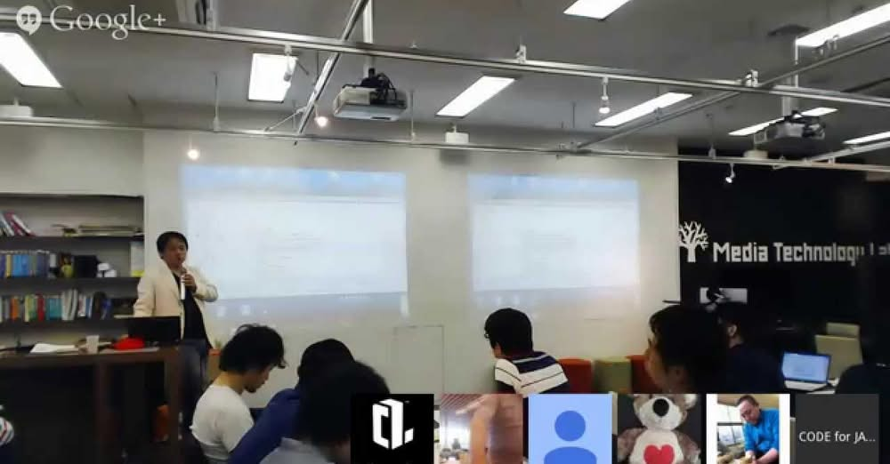

## 0054 — 2014-06-08 — 後藤 真太郎さんがグループのイベントを作成しました。

- 投稿ID: 247792445421902
- 投稿URL: https://www.facebook.com/groups/186097664924714/posts/247792445421902/
- 要約: ミニアイデアソン by Code for Saitama（連絡用） 2014/06/11(水) ミニアイデアソン by Code for Saitama（連絡用） さいたま市
- コメント要約: （コメントなし）

ミニアイデアソン  by Code for Saitama（連絡用）
2014/06/11(水)
ミニアイデアソン by Code for Saitama（連絡用）
さいたま市

## 0055 — 2014-06-08 — 後藤 真太郎さんがグループのイベントを作成しました。

- 投稿ID: 247794518755028
- 投稿URL: https://www.facebook.com/groups/186097664924714/posts/247794518755028/
- 要約: アイデアソン by Code for Saitama（連絡用） 2014/06/21(土) アイデアソン by Code for Saitama（連絡用） 交流プラザ
- コメント要約: （コメントなし）

アイデアソン by Code for Saitama（連絡用）
2014/06/21(土)
アイデアソン by Code for Saitama（連絡用）
交流プラザ

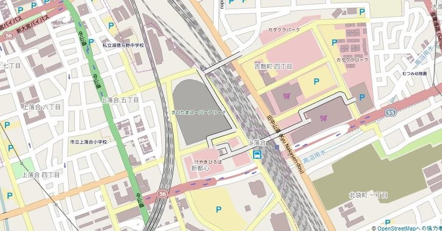

## 0056 — 2014-06-09 — 後藤 真太郎

- 投稿ID: 247934278741052
- 投稿URL: https://www.facebook.com/groups/186097664924714/posts/247934278741052/
- 要約: 横浜頑張ってますね。さいたま市は市が動き始めるまでCode for Saitamaが主導で動かないと覚めてしまいますので、機会をみて市と打ち合わせしましょう。GIS普及推進研究会や市民キャビネットスマートICT部会もセミナーを企画してますので相乗りもありかと思います。
- コメント要約: （コメントなし）

横浜頑張ってますね。さいたま市は市が動き始めるまでCode for Saitamaが主導で動かないと覚めてしまいますので、機会をみて市と打ち合わせしましょう。GIS普及推進研究会や市民キャビネットスマートICT部会もセミナーを企画してますので相乗りもありかと思います。https://www.facebook.com/events/793087994048431/?unit_ref=suggested_events
2014/06/13(金)
設立総会・第１回研究会
横浜市
オープンデータ活用！とシェアされています
興味あり

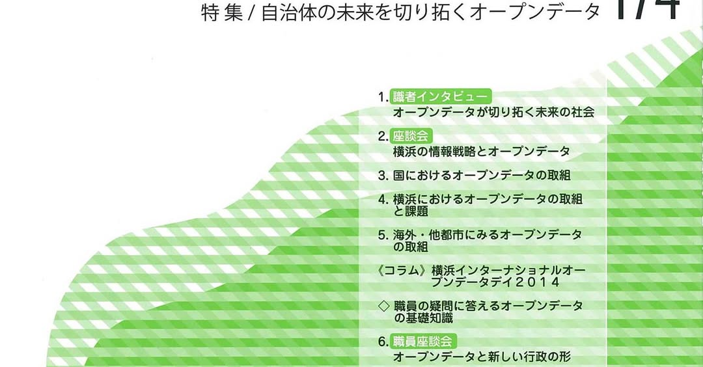

## 0057 — 2014-06-10 — 古田武士

- 投稿ID: 248244835376663
- 投稿URL: https://www.facebook.com/groups/186097664924714/posts/248244835376663/
- 要約: 昨日上げたOSMの地物のGeoJSONですが、検索もできるようにしました。 mod_rewrite化していませんが 例：学校の抽出 tag=[amenity|shop|tourism] ※tourismも追加しました。
- コメント要約: マッピングパーティで配ったチートシートを利用するといいです。 どのように使うのでしょうか？

昨日上げたOSMの地物のGeoJSONですが、検索もできるようにしました。
mod_rewrite化していませんが
例：学校の抽出
http://cfs.stream-map.com/osm1.php?tag=amenity&value=school
tag=[amenity|shop|tourism] ※tourismも追加しました。
value=タグの内容
です。エリア（ポリゴン）の方も抽出できるようにしています。
後、DB化している範囲はさいたま市の部分になります。
tag=amenity
value=parking
で駐車場の抽出も可能になります。
CFS.STREAM-MAP.COM
cfs.stream-map.com

### コメント — 古田武士

マッピングパーティで配ったチートシートを利用するといいです。

### コメント — 後藤 真太郎

どのように使うのでしょうか？

## 0058 — 2014-06-11 — 後藤 真太郎

- 投稿ID: 248591028675377
- 投稿URL: https://www.facebook.com/groups/186097664924714/posts/248591028675377/
- 要約: ハッカソンのアイデアに参考になりますね。
- コメント要約: （コメントなし）

ハッカソンのアイデアに参考になりますね。
KEYMAN.OR.JP
SBTなど、iPad専用の飲食店メニュー多言語化アプリを提供 - IT、IT製品の情報なら【キーマンズネット】
IT製品ニュース | 　ソフトバンク・テクノロジー株式会社（SBT）と八楽株式会社、M-SOLUTIONS株式会社は協働で、iPad専用で飲食店向けのメニュー多言語化アプリケーションサービス「グルメニュー -GOUR…スペックや導入事例、価格情報・比較情報も充実。資料請求も簡単に出来るIT情報サイトです。

## 0059 — 2014-06-11 — とよしま 亮介さんは安部 邦昭さん、他8人と7Fにいます。

- 投稿ID: 248707561997057
- 投稿URL: https://www.facebook.com/groups/186097664924714/posts/248707561997057/
- 要約: とよしま 亮介 さいたま市 本日は「大人の自由研究〜パパもママも始業式までに宿題できるかな？〜（仮）」の関係者リハーサル（ミニアイデアソン）。 2時間ピッタリ、みんな初めてなのに結構面白いアイデアが出るものですね^_^ 皆さんお疲れ様でした。
- コメント要約: （コメントなし）

とよしま 亮介
さいたま市
本日は「大人の自由研究〜パパもママも始業式までに宿題できるかな？〜（仮）」の関係者リハーサル（ミニアイデアソン）。
2時間ピッタリ、みんな初めてなのに結構面白いアイデアが出るものですね^_^
皆さんお疲れ様でした。— 安部 邦昭さん、
他8人
と7Fにいます。
写真の説明はありません。. 写真の説明はありません。. 写真の説明はありません。. 写真の説明はありません。. 写真の説明はありません。

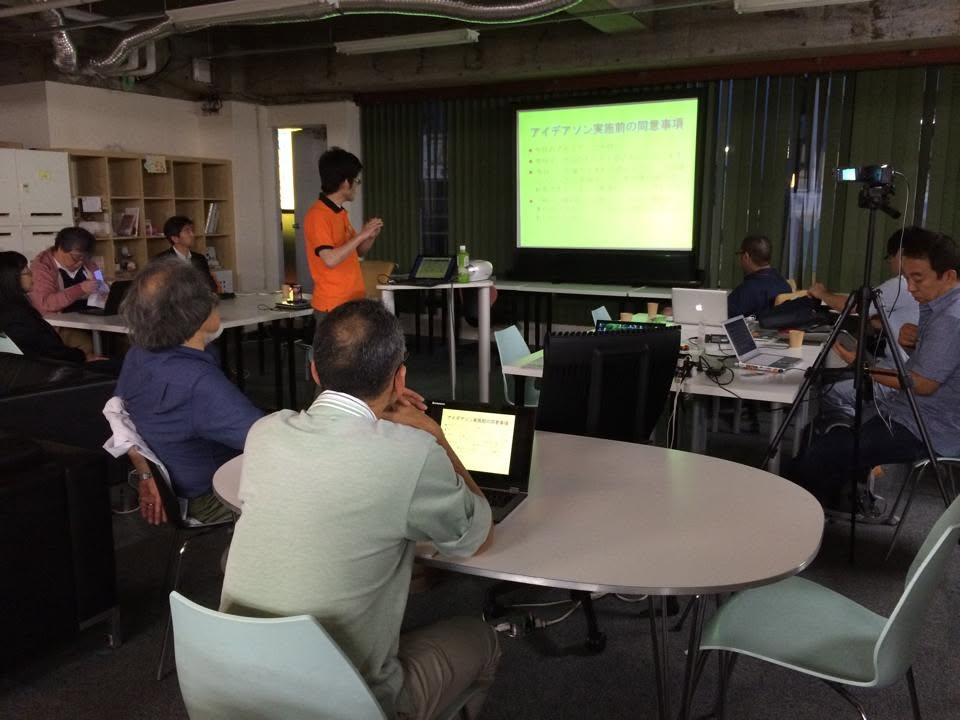

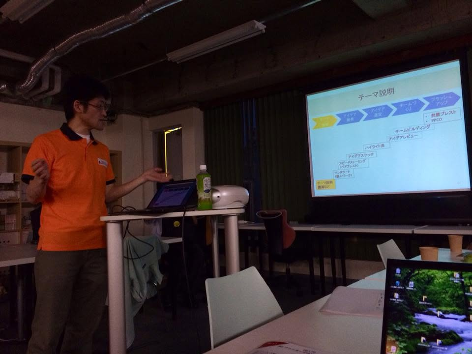

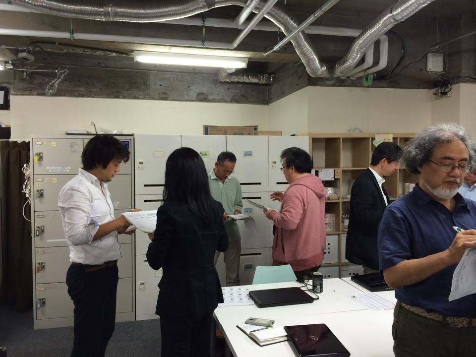

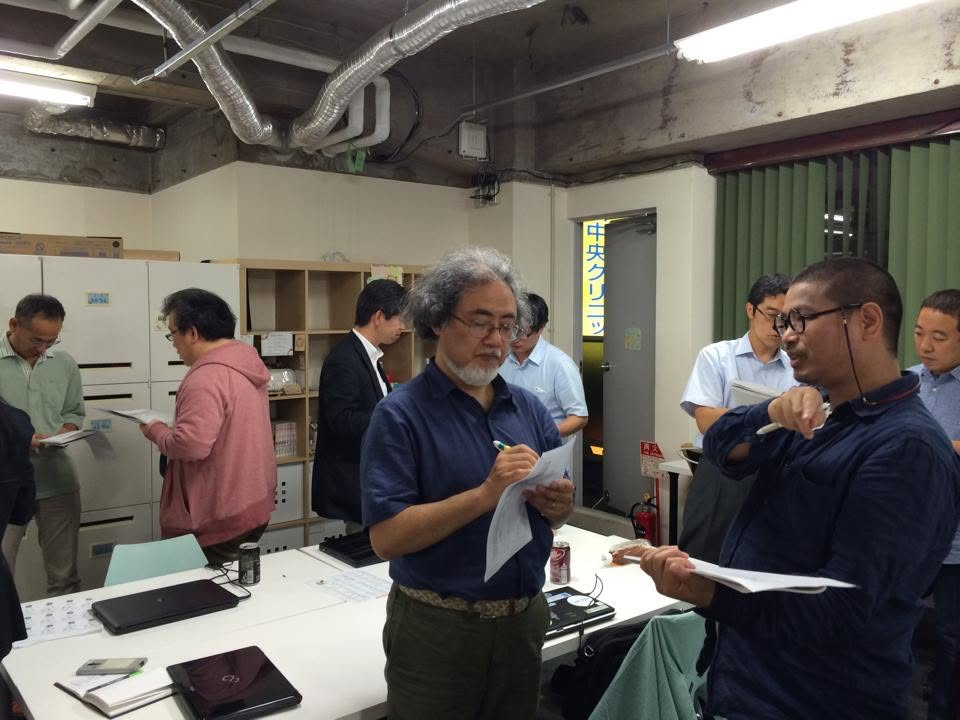

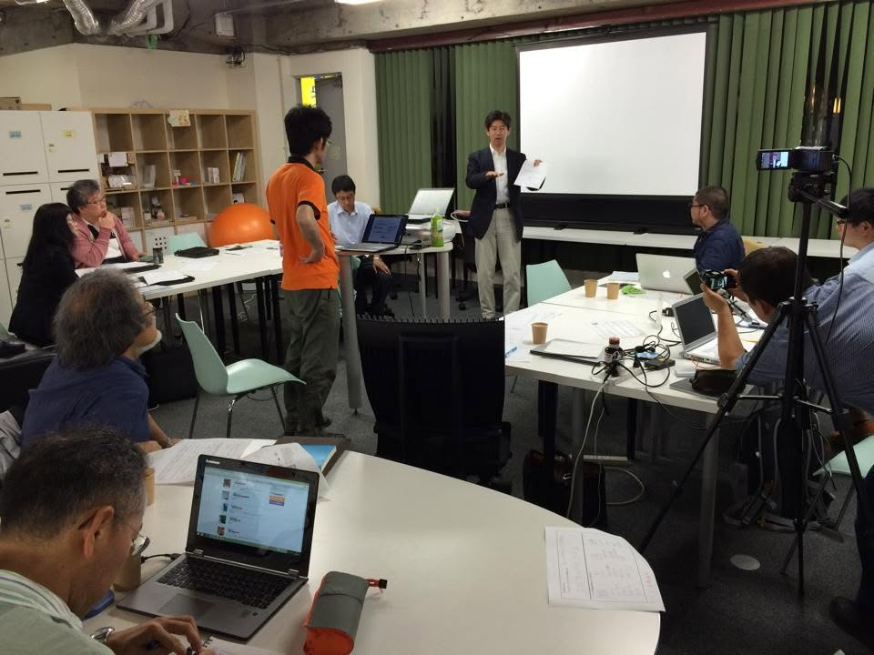

## 0060 — 2014-06-13 — 安部 邦昭

- 投稿ID: 249109101956903
- 投稿URL: https://www.facebook.com/groups/186097664924714/posts/249109101956903/
- 要約: 先日は、ミニアイデアソンお疲れ様でした。 ミニアイデアソンで出てきた「アイデアスケッチ」をシェアします。 星印が、一次投票の結果になります。 写真の説明はありません。
- コメント要約: （コメントなし）

先日は、ミニアイデアソンお疲れ様でした。
ミニアイデアソンで出てきた「アイデアスケッチ」をシェアします。
星印が、一次投票の結果になります。
写真の説明はありません。. 写真の説明はありません。. 写真の説明はありません。. 写真の説明はありません。. 写真の説明はありません。

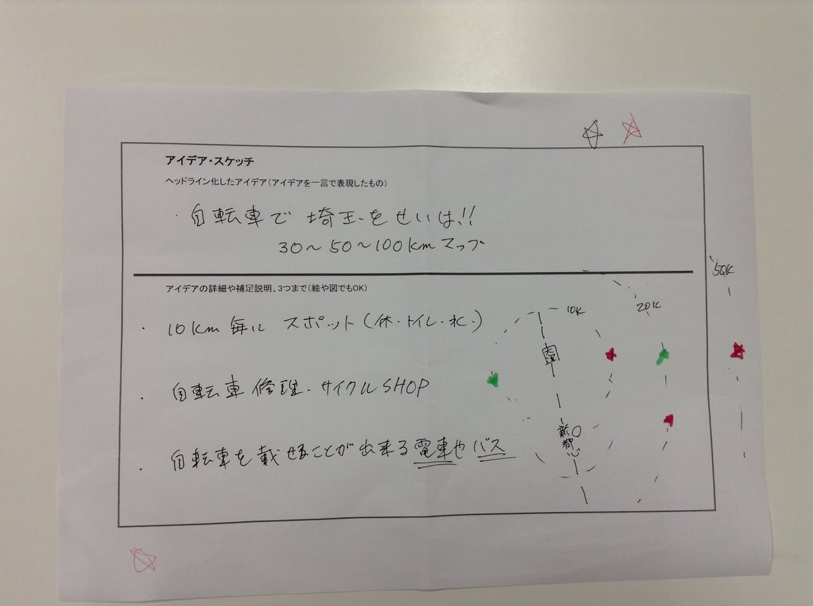

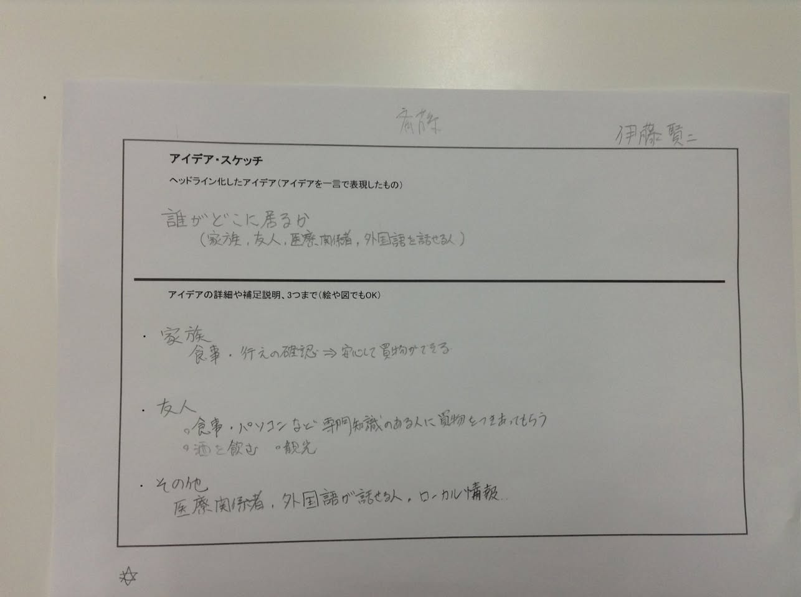

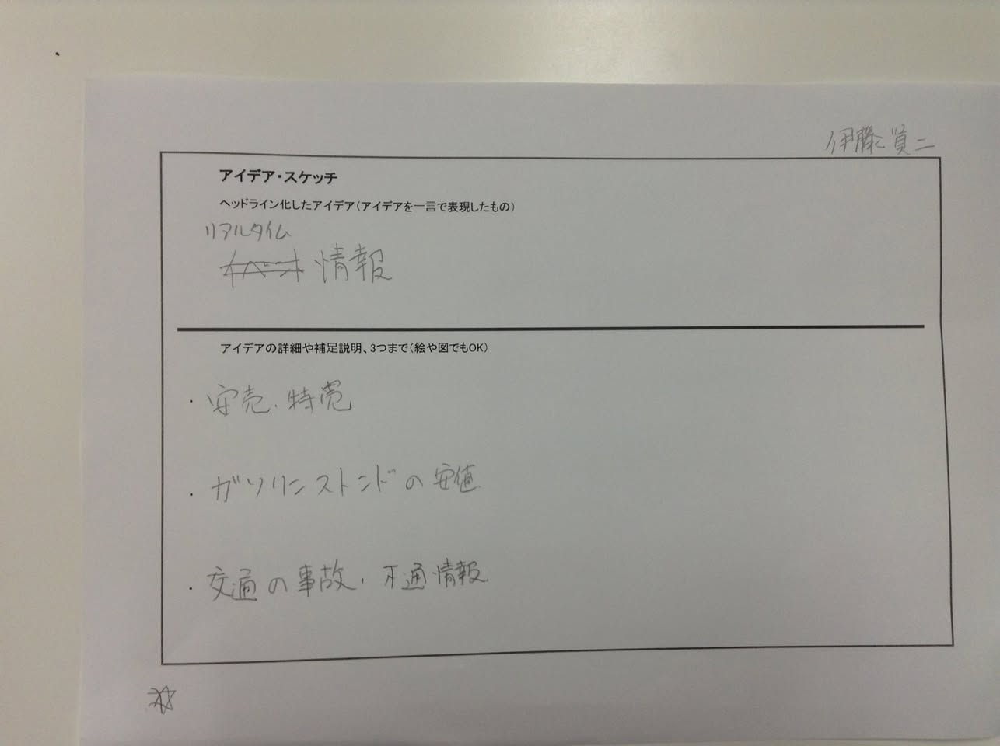

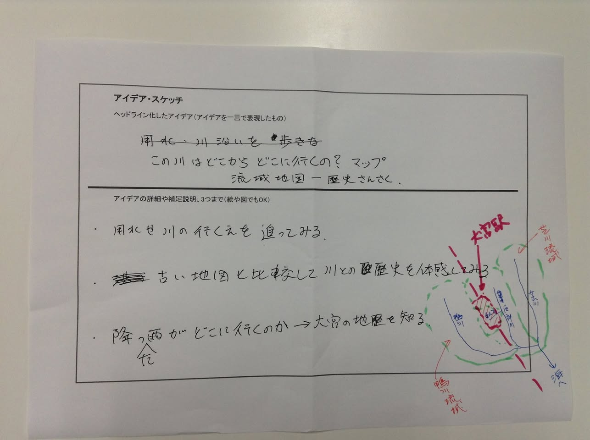

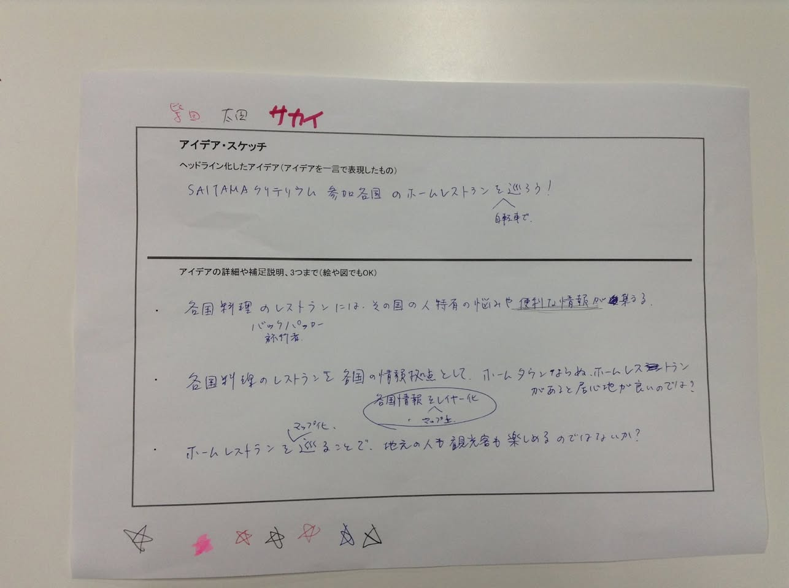

## 0061 — 2014-06-13 — 後藤 真太郎

- 投稿ID: 249146951953118
- 投稿URL: https://www.facebook.com/groups/186097664924714/posts/249146951953118/
- 要約: 本日のかながわオープンデータ推進地方議員会議設立総会に続いてのイベントです。月曜日はゼミ日ですので行けませんが、行かれた方がおられたらご報告お願いします。 HAMAKEI.COM 横浜から広がる「オープンデータ」活用の可能性-16日には神奈川県内自治体集まりフォーラムも いま、「オープンデータ」の活用が全国で進められている。
- コメント要約: 午前中は医者に行かなければならないので、午後から出る予定です。

本日のかながわオープンデータ推進地方議員会議設立総会に続いてのイベントです。月曜日はゼミ日ですので行けませんが、行かれた方がおられたらご報告お願いします。
HAMAKEI.COM
横浜から広がる「オープンデータ」活用の可能性-16日には神奈川県内自治体集まりフォーラムも
いま、「オープンデータ」の活用が全国で進められている。2012年に横浜から始まったWebサービス「税金はどこへいった？」は、オープンデータ活用の代表例だ。このサイトにアクセスすれば、自分の年収のうち、いくらが市税で、何の目的に使われているのか、1日あたりの金額で簡単に分かるようになっている。横浜市の「予算データ」を元に計測されているこのサービスは、税金の使途を「見える化」して、市民にわかりやすく伝える仕組みとして大きな注目を集めており、既に132の自治体の予算が「税金はどこへいった？」を利用して見ることができるようになった。今回は、こうした民と官がともになって、オープンデータ活用を進める横浜の…

### コメント — 天野 徹

午前中は医者に行かなければならないので、午後から出る予定です。

## 0062 — 2014-06-15 — 横堀 泰子

- 投稿ID: 249637771904036
- 投稿URL: https://www.facebook.com/groups/186097664924714/posts/249637771904036/
- 要約: 今週の木～土です。(^-^) 2014/06/19(木) 『市民が考える さいたま市まちづくりビジョン』発表と意見交換会 さいたま市 横堀 泰子さんから招待がありました 興味あり
- コメント要約: （コメントなし）

今週の木～土です。(^-^)
2014/06/19(木)
『市民が考える さいたま市まちづくりビジョン』発表と意見交換会
さいたま市
横堀 泰子さんから招待がありました
興味あり

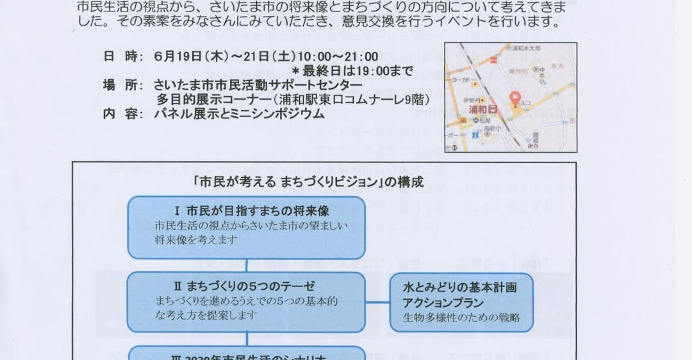

## 0063 — 2014-06-16 — 後藤 真太郎

- 投稿ID: 249993588535121
- 投稿URL: https://www.facebook.com/groups/186097664924714/posts/249993588535121/
- 要約: 6/21のアイデアソンの申込みサイトが勝ち上がりました。参加の方はこちらに登録お願いします。 ATND.ORG Code for SAITAMA アイデアソン
- コメント要約: （コメントなし）

6/21のアイデアソンの申込みサイトが勝ち上がりました。参加の方はこちらに登録お願いします。
ATND.ORG
Code for　SAITAMA アイデアソン

## 0064 — 2014-06-16 — 太田 一穂

- 投稿ID: 250310445170102
- 投稿URL: https://www.facebook.com/groups/186097664924714/posts/250310445170102/
- 要約: アイデアソン、いよいよ今週土曜日ですね！ この方法で、21日のアイデアソンイベント （ ） にさいたま市関連？の友達申請しまくってみました。 （さすがに無差別ではやってません） TIMESERVER.SEESAA.NET timeserverの雑記帳: facebookイベントで友達を招待する際に一度に全員チェックするブックマークレット
- コメント要約: （コメントなし）

アイデアソン、いよいよ今週土曜日ですね！
http://timeserver.seesaa.net/article/301626135.html
この方法で、21日のアイデアソンイベント
（ https://www.facebook.com/events/253560078165360/ ）
にさいたま市関連？の友達申請しまくってみました。
（さすがに無差別ではやってません）
TIMESERVER.SEESAA.NET
timeserverの雑記帳: facebookイベントで友達を招待する際に一度に全員チェックするブックマークレット

## 0065 — 2014-06-18 — 古田武士

- 投稿ID: 251327508401729
- 投稿URL: https://www.facebook.com/groups/186097664924714/posts/251327508401729/
- 要約: アイデアソン前に気になるニュースが 五輪会場一部さいたまへ変更を検討 地元は NHKニュース WWW3.NHK.OR.JP 五輪会場一部さいたまへ変更を検討 地元は NHKニュース
- コメント要約: なんと！ 予想通りではありますね。

アイデアソン前に気になるニュースが
五輪会場一部さいたまへ変更を検討 地元は　NHKニュース
WWW3.NHK.OR.JP
五輪会場一部さいたまへ変更を検討 地元は　NHKニュース

### コメント — 安部 邦昭

なんと！？

### コメント — 横堀 泰子

予想通りではありますね。

## 0066 — 2014-06-21 — 古田武士

- 投稿ID: 252212911646522
- 投稿URL: https://www.facebook.com/groups/186097664924714/posts/252212911646522/
- 要約: Code for SAITAMA アイデアソン（2014･06｡21） アイデアシート PDF DOC140621-20140621213814.pdf · バージョン1
- コメント要約: （コメントなし）

Code for SAITAMA アイデアソン（2014･06｡21）
アイデアシート
PDF
DOC140621-20140621213814.pdf · バージョン1

## 0067 — 2014-06-21 — 古田武士

- 投稿ID: 252213051646508
- 投稿URL: https://www.facebook.com/groups/186097664924714/posts/252213051646508/
- 要約: Code for SAITAMA アイデアソン（２０１４．０６．２１） コンセプトシート PDF DOC1406211-20140621213940.pdf · バージョン1
- コメント要約: （コメントなし）

Code for SAITAMA アイデアソン（２０１４．０６．２１）
コンセプトシート
PDF
DOC1406211-20140621213940.pdf · バージョン1

## 0068 — 2014-06-21 — 古田武士

- 投稿ID: 252213758313104
- 投稿URL: https://www.facebook.com/groups/186097664924714/posts/252213758313104/
- 要約: アイデアソンお疲れ様でした。本日のアイデアシートとコンセプトシートを公開しました。
- コメント要約: （コメントなし）

アイデアソンお疲れ様でした。本日のアイデアシートとコンセプトシートを公開しました。

## 0069 — 2014-06-22 — 石山 太一

- 投稿ID: 252328731634940
- 投稿URL: https://www.facebook.com/groups/186097664924714/posts/252328731634940/
- 要約: （要約なし）
- コメント要約: 石山さん ありがとうございます。 イベントでも 公開しましょう。 写真ありがとうございます。アイデアソンには新規の方々にご参加いただき感謝しております。半数が市の関係者で、今後、市役所の中で口コミにて拡散したりしていただけましたらおおきなウネリになる気配を感じました。

（本文なし。コメントからイベント関連性を確認）

### コメント — 横堀 泰子

石山さん ありがとうございます。
イベントでも 公開しましょう。
https://www.facebook.com/events/253560078165360/?ref=2&ref_dashboard_filter=upcoming

### コメント — 後藤 真太郎

写真ありがとうございます。アイデアソンには新規の方々にご参加いただき感謝しております。半数が市の関係者で、今後、市役所の中で口コミにて拡散したりしていただけましたらおおきなウネリになる気配を感じました。

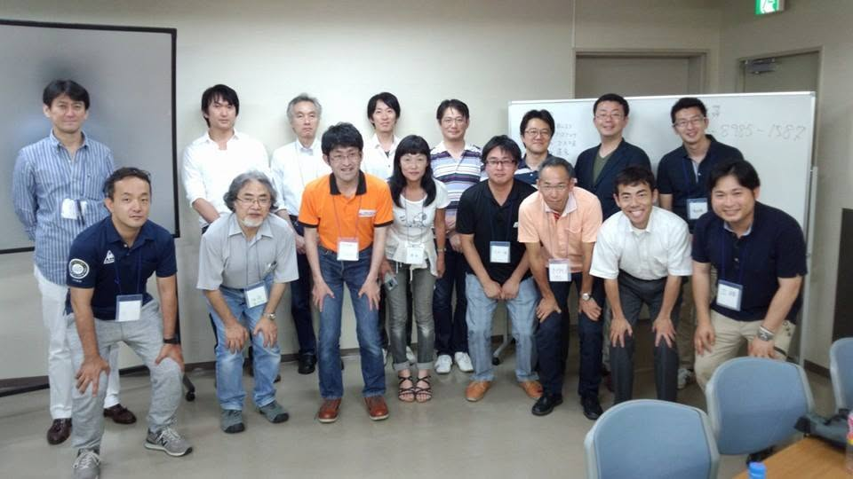

## 0070 — 2014-06-22 — 三神 尊志

- 投稿ID: 252369478297532
- 投稿URL: https://www.facebook.com/groups/186097664924714/posts/252369478297532/
- 要約: 昨日はありがとうございました！「コスプレ写真館」関連の聖地巡礼マップがありました。でも全て網羅しているわけではなさそう。まだまだあります。 アニメの聖地をカンタン検索｜聖地巡礼なら【聖地巡礼マップ】 SEICHIMAP.JP アニメの聖地をカンタン検索｜聖地巡礼なら【聖地巡礼マップ】
- コメント要約: 7末のハッカソンへのリクエストでしょうか? (^-^)v

昨日はありがとうございました！「コスプレ写真館」関連の聖地巡礼マップがありました。でも全て網羅しているわけではなさそう。まだまだあります。
アニメの聖地をカンタン検索｜聖地巡礼なら【聖地巡礼マップ】
SEICHIMAP.JP
アニメの聖地をカンタン検索｜聖地巡礼なら【聖地巡礼マップ】

### コメント — 横堀 泰子

7末のハッカソンへのリクエストでしょうか? (^-^)v

## 0071 — 2014-06-23 — 後藤 真太郎

- 投稿ID: 252506448283835
- 投稿URL: https://www.facebook.com/groups/186097664924714/posts/252506448283835/
- 要約: 次は、7/26-27のハッカソン。申込みサイトは です。 ATND.ORG Code for SAITAMA ハッカソン
- コメント要約: Atendに登録を躊躇されている方は↓をどうぞ。 ★7/26用 ★7/27 Facebookのイベントを 次のグループでshareしました。 あなた発！埼玉のここが好き！

次は、7/26-27のハッカソン。申込みサイトは　http://atnd.org/events/52446 です。
ATND.ORG
Code for　SAITAMA ハッカソン

### コメント — 後藤 真太郎

Atendに登録を躊躇されている方は↓をどうぞ。　　　　　　　　　　　　　　　　　　　　　　　　　　　　　　　　　　　　　　　　　　★7/26用 　　　　　　　　　　　　　　　https://www.facebook.com/events/650389695030282/?ref_dashboard_filter=upcoming
★7/27　　　　　　　　　　　　　　　　　　　　　　　　　　　　　 　　　　https://www.facebook.com/events/1498860970328108/?ref=2...

### コメント — 横堀 泰子

Facebookのイベントを 次のグループでshareしました。
あなた発！埼玉のここが好き！
さいたま市
フォーローをヨロシクです。
CfSへの参加/協賛/賛同/理解に 繋がればと 思います。

### コメント — 横堀 泰子

ハッカソン いよいよ明日になりましたね。(^-^)
CfS(Code for SAITAMA)初の アイデアソンからハッカソンの取組みです。
総勢 50名を超える参加になりそうです。
メインタテーマは4つ。
https://www.facebook.com/events/650389695030282/permalink/654500357952549/
1つでも多くの実現に繋げられればと思います。

## 0072 — 2014-06-26 — 後藤 真太郎

- 投稿ID: 253383951529418
- 投稿URL: https://www.facebook.com/groups/186097664924714/posts/253383951529418/
- 要約: 世界銀行のRace for Resilienceの報告から、 CODEIQ.JP 発展途上国×防災・減災の課題をいかにハックするか？「Race for Resilience」アイデアソン #race4r｜CodeIQ MAGAZINE 発展途上国では台風、地震、津波、洪水、干ばつなどの自然災害で、想像を絶するような多数の犠牲が生まれる。
- コメント要約: 今週末から、いよいよグローバル審査の発表会でロンドンに行って来ます！

世界銀行のRace for Resilienceの報告から、
CODEIQ.JP
発展途上国×防災・減災の課題をいかにハックするか？「Race for Resilience」アイデアソン #race4r｜CodeIQ MAGAZINE
発展途上国では台風、地震、津波、洪水、干ばつなどの自然災害で、想像を絶するような多数の犠牲が生まれる。こうした被害を未然に防ぐための、防災・減災技術にどのように貢献できるか。 ICTのノウハウやオープンデータを防災・減災に活用し、イノベーション推進を目的とした「グローバル防災・減災アイデアソン」が東京から始まった。

### コメント — 古橋 大地

今週末から、いよいよグローバル審査の発表会でロンドンに行って来ます！

## 0073 — 2014-06-26 — 長岡 素彦

- 投稿ID: 253386018195878
- 投稿URL: https://www.facebook.com/groups/186097664924714/posts/253386018195878/
- 要約: 2015防災世界会議日本CSOネットワーク(JCC2015)の長岡です。 第3回国連防災世界会議にに2015防災世界会議日本CSOネットワーク(JCC2015)は日本の各地や市民NGOの意見をまとめるためを日本のNGOが設立しました。
- コメント要約: 丸谷先生からみや、１月に行いました訓練の報告、世界銀行のRace for Resilience関係が錯綜して忙しくなるかと思います。セッション応募の案内等すでにリリースされている情報がありましたら情報提供お願いします。

2015防災世界会議日本CSOネットワーク(JCC2015)の長岡です。
第3回国連防災世界会議にに2015防災世界会議日本CSOネットワーク(JCC2015)は日本の各地や市民NGOの意見をまとめるためを日本のNGOが設立しました。
現在、「第6回アジア防災閣僚級会合」が開催されていますが、日本の各地や市民NGOも参画し、JCC2015代表団を派遣し、複数のセッションやブースアピールをして「アドボカシー活動」をしています。
また、会議とともに震災の経験世界に発信して考えるプロジェクトを東北の方々と行うためJCC2015の「防災世界会議の関連事業」のWGのメンバーとして長岡から連携のお願いをするかもしれませんが、よろしくお願いします。
★政府はともかく、市民NGOはハッカソンを視野に入れているのでよろしくお願いします。

### コメント — 後藤 真太郎

丸谷先生からみや、１月に行いました訓練の報告、世界銀行のRace for Resilience関係が錯綜して忙しくなるかと思います。セッション応募の案内等すでにリリースされている情報がありましたら情報提供お願いします。

### コメント — 長岡 素彦

第3回国連防災世界会議 in 仙台2015年３月 14 日（土）～18 日（水）
1.本会合は 国連ISDR、政府と公式開催パートナー（Organizing Partner）でほぼ固まっています。
この公式開催パートナー（Organizing Partner）がJCC2015の幹事団体・事務局団体(JCC2015は法人格を持たないので幹事団体・事務局団体が参画主体となります)のひとつである「ピースボート災害ボランティアセンター」がなり、JCC2015とともにNGOの意見を取りまとめ、とともに本会議の準備を進めています。

### コメント — 長岡 素彦

ですからお問い合わせは
仙台実行委員会(日本政府と仙台市)所管のサイドイベント「関連事業」のことだと思います。以下。
2015年３月 14 日（土）～18 日（水）（本体会議の開催期間中）
シンポジウム、セミナーなど会議形式のイベント
展示（ブースでの出展、ポスター・パネル展示等）
会場
東北大学　東日本大震災復興防災フォーラム（仮）
エル・パーク仙台　市民会館 女性
市民活動サポートセンター　　様々な担い手との連携
メディアテーク、公園　　防災と復興に関わる展示、消防車両などの屋外展示

### コメント — 長岡 素彦

仙台市所管のサイドイベント「関連事業」はまだ公募されてません。
・告知されるサイト
http://www.bosai-sendai.jp/
また、仙台市所管のサイドイベント上記のように東北大仕切り、仙台市民サポセン仕切り、男女共同参画センター仕切りなどがあり、縦割りです。防災は縦割りではできないのに。
BOSAI-SENDAI.JP
第3回国連防災世界会議 仙台開催実行委員会
第3回国連防災世界会議 仙台開催実行委員会

### コメント — 後藤 真太郎

丸谷先生は東北大学災害科学国際研究所所属で、この会議のコア部分を行うと言っておられました。災害支援部会、スマートICT部会が関与できる場面があったらお声掛けください。NPOの災害支援業務を標準化、災害支援NPOのネットワーク化もこの会議に合わせての議論でしょうね。

### コメント — 長岡 素彦

重要な視点です。いかして行きたいと思います。

### コメント — 後藤 真太郎

世銀プロジェクトのRace for Resilience関係はハッカソンを計画しているようで、そのメンバーはCode for Japan 関係で動かしてますので、Code for Saitamaも関係するはずです。

### コメント — 古橋 大地

Race for Resilience代表の古橋と申します。
第3回国連防災世界会議でも我々の世界防災減災ハッカソンの成果発表などいろいろと動きがあります。引き続き情報共有させていただければ幸いです。
http://raceforresilience.org/
RACEFORRESILIENCE.ORG
Race for Resilience
Race for Resilience

### コメント — 後藤 真太郎

古橋さん、グッドタイミング !!　 NPOの災害支援業務を標準化、災害支援NPOのネットワーク化の議論はピースポートがまとめているようですね。昨日のCERTのイベントに来てましたので事前にわかっていれば話せばよかった。年齢的に上村さんあたりが場を作ってくれるといいかも？

### コメント — 後藤 真太郎

こうした議論がCode for SaitmaのGrでできてしまうというのも凄いですね。

## 0074 — 2014-06-26 — 長岡 素彦

- 投稿ID: 253426458191834
- 投稿URL: https://www.facebook.com/groups/186097664924714/posts/253426458191834/
- 要約: 参考まで iSPP情報支援プロボノ・プラットフォームの長岡(発起人)です。 iSPPは災害時の情報支援を行うもので、Amazonの避難所欲しいものリストなどの企業のスキームづくりや総務省・内閣府などへの提言、そして情報行動調査『 3.11 被災地の証言 -東日本大震災 情報行動調査で検証するデジタル大国・日本の盲点- 』(解析データ別売り)を行ってます。
- コメント要約: 小島誠一郎氏もメンバーですね。彼は、ナホトカ事故時の戦友です。ITx災害にはご関係されてないのですか？ どうでしょう。いろいろとされているので聞いてみます。 小島氏と一緒に、NPO基盤地図情報活用研究会を運営しており、ITx災害には参加してます。

参考まで
iSPP情報支援プロボノ・プラットフォームの長岡(発起人)です。
iSPPは災害時の情報支援を行うもので、Amazonの避難所欲しいものリストなどの企業のスキームづくりや総務省・内閣府などへの提言、そして情報行動調査『 3.11　被災地の証言 -東日本大震災　情報行動調査で検証するデジタル大国・日本の盲点- 』(解析データ別売り)を行ってます。
★今週末に総会とセミナーを南相馬をメイン会場として東京と仙台を結んで３元中継で開催します。
4年度iSPP定時総会＆記念セミナーを開催します！ « iSPP 情報支援プロボノ・プラットフォーム
ISPP.JP
4年度iSPP定時総会＆記念セミナーを開催します！ « iSPP 情報支援プロボノ・プラットフォーム

### コメント — 後藤 真太郎

小島誠一郎氏もメンバーですね。彼は、ナホトカ事故時の戦友です。ITx災害にはご関係されてないのですか？

### コメント — 長岡 素彦

どうでしょう。いろいろとされているので聞いてみます。

### コメント — 後藤 真太郎

小島氏と一緒に、NPO基盤地図情報活用研究会を運営しており、ITx災害には参加してます。長岡さんはITx災害には参加されてましたか？

### コメント — 長岡 素彦

ITx災害には参加しておりませんでした。

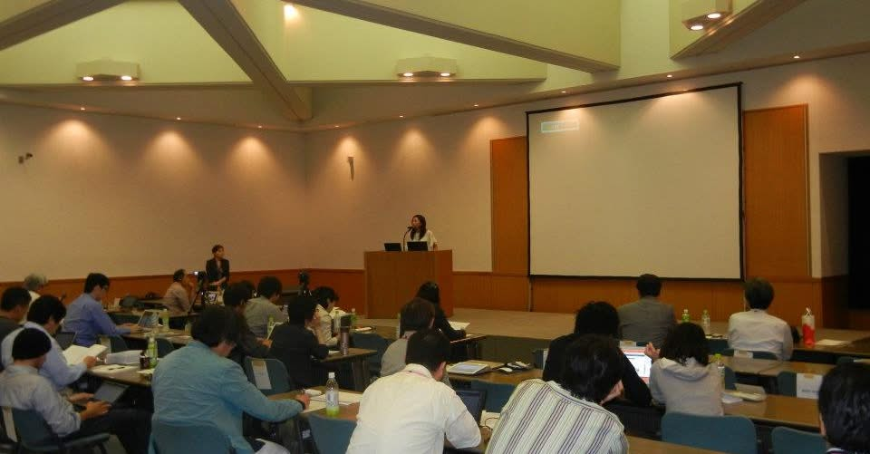

## 0075 — 2014-06-29 — 後藤 真太郎

- 投稿ID: 254250081442805
- 投稿URL: https://www.facebook.com/groups/186097664924714/posts/254250081442805/
- 要約: アイデアソンにも出てましたが、どこも問題意識は同じなんですね。このプロジェクトは総務省のG-空間事業に関係しているようです。うちの研究室でのドクター第一号がコンサルテーションしてます。
- コメント要約: （コメントなし）

アイデアソンにも出てましたが、どこも問題意識は同じなんですね。このプロジェクトは総務省のG-空間事業に関係しているようです。うちの研究室でのドクター第一号がコンサルテーションしてます。
SOUMU.GO.JP
www.soumu.go.jp

## 0076 — 2014-06-30 — 古田武士

- 投稿ID: 254461561421657
- 投稿URL: https://www.facebook.com/groups/186097664924714/posts/254461561421657/
- 要約: 本日の日経産業新聞にNTTComのWEBRTCをつかったCode for Japanのアイデアソンとハッカソンの記事が載っています。ご参考まで。 このコンテンツは現在ご利用いただけません 所有者がシェア先を一部の人のみに限定しているか、プライバシー設定が変更されたか、コンテンツが削除された、などの理由が考えられます。
- コメント要約: （コメントなし）

本日の日経産業新聞にNTTComのWEBRTCをつかったCode for Japanのアイデアソンとハッカソンの記事が載っています。ご参考まで。
このコンテンツは現在ご利用いただけません
所有者がシェア先を一部の人のみに限定しているか、プライバシー設定が変更されたか、コンテンツが削除された、などの理由が考えられます。

## 0077 — 2014-07-02 — 後藤 真太郎

- 投稿ID: 255299154671231
- 投稿URL: https://www.facebook.com/groups/186097664924714/posts/255299154671231/
- 要約: さいたま市のオープンデータを用いた避難所マップです。アイデアソンに参加された西村さん製作です。 NEOGIS.NET 地図情報システム・Web-GIS
- コメント要約: URLを変更しました。さいたま市を選んで表示してください。 これはUIや軽さがいいですね。背景地図も選べて、ある程度の範囲内で印刷や使用もできそうですし。 ぜひ、DIGなどとも組み合わせていきたいweb-GISです。

さいたま市のオープンデータを用いた避難所マップです。アイデアソンに参加された西村さん製作です。http://neogis.net/saigai/index_opl_spot.html
NEOGIS.NET
地図情報システム・Web-GIS

### コメント — 後藤 真太郎

URLを変更しました。さいたま市を選んで表示してください。

### コメント — 上村 貴広

これはUIや軽さがいいですね。背景地図も選べて、ある程度の範囲内で印刷や使用もできそうですし。
ぜひ、DIGなどとも組み合わせていきたいweb-GISです。

### コメント — 後藤 真太郎

そのご予定のようですよ。

### コメント — 上村 貴広

後藤先生
頼もしい限りですね。神奈川でも紹介させていただきました（今年度、県の予算で図上訓練予定です）。

## 0078 — 2014-07-04 — 後藤 真太郎

- 投稿ID: 256248227909657
- 投稿URL: https://www.facebook.com/groups/186097664924714/posts/256248227909657/
- 要約: 祭に使われる山車の位置をGISに表示したいが、私が熊谷で行っているような事が出来ないか、するにはどうしたらいいかという内容の相談が自治体からありました。 山車の台数が違うので不足分は作らないとできませんが、前向きに対応しますので、先方で検討されてから連絡が来ることになっています。
- コメント要約: これは、需要のある内容な気がします。 山車の位置情報は、例えば、スマホでアプリを起動して、数分ごとに位置情報を送信するアプリを開発出来れば、位置発信側の負担も少なく出来るような気がします。

祭に使われる山車の位置をGISに表示したいが、私が熊谷で行っているような事が出来ないか、するにはどうしたらいいかという内容の相談が自治体からありました。　http://gisportal2.ris.ac.jp/uchiwamatsuri/app/sp/map.php　　　　　　　　　　　　　　　　　　　　　　　　　　　　　　　　　　　　　　　　　山車の台数が違うので不足分は作らないとできませんが、前向きに対応しますので、先方で検討されてから連絡が来ることになっています。システムを利用するためには、システム利用の準備と併せて、市民を動かす仕組みが必要で、例えば「ICTで祭をHackする」ようなイベントを行ってその中で作ったらどうかという事も提案してあります。現在熊谷で利用している、山車の位置確認のシステムは、GPSで取得した位置情報をPHSアンテナ網を利用してウィルコムを通して大学のサーバーに送ってもらい、大学でGIS表示して配信するような仕組みになっています。何せ7年前に作ったシステムですのでタクシーの配車システムのように大きな設備になっており、今年のうちわ祭り7/20-22が終わったらリプレースしようと思っています。最近では、スマホや、XBeeやarduinoなどを利用すればもっとコンパクトにできますので、これらの利用も視野に入れております。このようなシステム作りに興味がある方がおられましたら連絡いただけましたらうれしいです。
GISPORTAL2.RIS.AC.JP
熊谷うちわ祭り

### コメント — 工藤 修

これは、需要のある内容な気がします。
山車の位置情報は、例えば、スマホでアプリを起動して、数分ごとに位置情報を送信するアプリを開発出来れば、位置発信側の負担も少なく出来るような気がします。
町内を練り歩くお祭りも多くあるので、結構需要は、高そうな気がします。(^ ^)

### コメント — 柴田 耕次

ペンディング中ですが、同じような事、会社のアプリでも実装予定機能リストに入ってました。まさに位置を取るアプリを作成してそれを表示させるようにする仕組みでした。
うぅ〜、やりたいのですが相変わらず時間が・・

### コメント — 後藤 真太郎

熊谷では、稼働させてから７年になりますが、平均２万アクセス/dayです。

### コメント — 後藤 真太郎

位置情報を何を使って送るか？当時はMVNOサービスがなかったので苦労しました。

### コメント — 後藤 真太郎

これ、川越の案件です。Code for Saitamaでやりますか？

### コメント — 後藤 真太郎

http://active-academy.net/2014-06-19-643
ACTIVE-ACADEMY.NET
祇園まつりオープンデータ動画制作＆マッピングパーティー | アクティブアカデミー
祇園まつりオープンデータ動画制作＆マッピングパーティー | アクティブアカデミー

### コメント — 後藤 真太郎

祇園では↑の企画があるようですね。先をこされる前に川越でやりますか？

### コメント — 太田 一穂

ソフトからハードから関わって来ますし、お祭なので様々な方に理解されやすい企画だと思います。時間もあるのでじっくりやりたいですね。

## 0079 — 2014-07-05 — 後藤 真太郎

- 投稿ID: 256578467876633
- 投稿URL: https://www.facebook.com/groups/186097664924714/posts/256578467876633/
- 要約: ハッカソンから生まれた数多くのアイデアが東北をますます元気にする！ : FUJITSU JOURNAL JOURNAL.JP.FUJITSU.COM ハッカソンから生まれた数多くのアイデアが東北をますます元気にする！
- コメント要約: 山寺さん。この業界で一番、マインドが合う方です。７/19・20の福島でのGreenHackathonも一緒に仕掛けてます。 こういうのって協力すると報酬があるの？

ハッカソンから生まれた数多くのアイデアが東北をますます元気にする！ : FUJITSU JOURNAL
JOURNAL.JP.FUJITSU.COM
ハッカソンから生まれた数多くのアイデアが東北をますます元気にする！ : FUJITSU JOURNAL

### コメント — 奥本 智寿美

山寺さん。この業界で一番、マインドが合う方です。７/19・20の福島でのGreenHackathonも一緒に仕掛けてます。http://hackathon.asia/flyer.pdf

### コメント — 後藤 真太郎

こういうのって協力すると報酬があるの？こそっと教えて下さい。

### コメント — 後藤 真太郎

富士通全体の営業方針がメーカ単独で仕事を取るスタイルから地域に根ざした団体と組んで行うスタイルに転換していくようです。その延長で、富士通がGIS普及推進研究会に会員登録していただきました。

## 0080 — 2014-07-07 — 古田武士

- 投稿ID: 257541724446974
- 投稿URL: https://www.facebook.com/groups/186097664924714/posts/257541724446974/
- 要約: 最大級の台風と梅雨前線の合わせ技で大雨の予想が出ていますね。 各地域ではハザードマップとしてPDFデータがありますが、あくまでも紙ベースでしかなくほかのデータとの重ね合わせができません。
- コメント要約: 浸水実績マップは、「声が上がったところだけ」をマップ化したもので、実際の浸水域とは限らないのだそうです。 「うち浸かった通報マップ」のようなものがあると、この浸水防災マップももっと役立つものに進化できるかもしれません。

最大級の台風と梅雨前線の合わせ技で大雨の予想が出ていますね。
各地域ではハザードマップとしてPDFデータがありますが、あくまでも紙ベースでしかなくほかのデータとの重ね合わせができません。
こういうデータがGISのデータ（shpやgeojsonやKML）で出せると
防災マップづくりがより進化します。
CITY.SAITAMA.JP
さいたま市／さいたま市浸水(内水)防災マップを作成しました
近年10年間(平成13年度から平成22年度)の間に市民の皆さんから通報があった浸水情報をもとに、地形情報を考慮して設定した内水による浸水想定区域(浸水する範囲とその程度)及び避難場所などを示したマップ…

### コメント — 安部 邦昭

浸水実績マップは、「声が上がったところだけ」をマップ化したもので、実際の浸水域とは限らないのだそうです。
「うち浸かった通報マップ」のようなものがあると、この浸水防災マップももっと役立つものに進化できるかもしれません。
ちなみに。
西区の避難所は、その9割以上が荒川の堤防決壊時に数ｍの浸水を受けるエリアにあります。何のための避難所やら・・・。

### コメント — 後藤 真太郎

こういうデータも必要ですが、5mDEMがあるのですから、累積水量マップや赤色地図に相当する資料を用意した方が浸水危険度を網羅的に評価できていいかと思います。先日の雹が降った地域も、豪雪で孤立集落が起きた地域も、東日本大震災で津波の被害にあった場所に微地形の影響が見られます。また、データにつぃては、今時GISで処理しない業者はいませんので、pdfや紙で納品すると同時に仕様書に、データ形式を規定して納品させることが必要です。今の状態で、GISでデータ提供してくださいと申し出ても、仕様書に記載がないのでデータ変換料を請求され、担当が業者にやり込められてしまって、データが出てこないのが普通です。埼玉県GIS普及推進研究会はそうした指導を10年以上行っておりますが担当者の人事異動で継承されてません。これもCode for SAITAMAで行うべき課題です。

### コメント — 安部 邦昭

やること山積ですね。自治体に対しては、「業者とのGISやICTに関する業務発注では、ココに注意せよ！マニュアル」のようなものを公表＆レクチャーしてもいいですね。

### コメント — 嘉山 陽一

国土数値情報に想定浸水のポリゴンはありますから、いろいろいじることはできます。ただ、本当は堤防が破れてから10分単位の想定浸水データがあるはずですけどそこまでは公開されていませんね。

### コメント — 後藤 真太郎

地価が安くなるから議会で承認されない場合が多いようです。栗橋の例は有名ですよね。

### コメント — 安部 邦昭

「不動産業者＋地主の利益＞市民の知る権利」の構図ですね。
情報を隠匿していたことによる不利益で訴えらないものでしょうかね？
地形や地勢は「事実」でしかないのに・・・。

### コメント — 後藤 真太郎

レクチャーをしました。組織が生産性をあげで評価されない体質ですから難しいですね。ガバナンスにもたよるのが日本的かなと。

### コメント — 後藤 真太郎

事実でも、それを公開する事で寝たこを起こすとだめなんですね。5374でも公開すると問い合わせが増えたら大変だという自治体もあります。ICT導入以前の課題です。

### コメント — 後藤 真太郎

不利益が理由の隠匿で訴えられたのか原発ですね。道路工事の事故もあります。社会的なインパクトによるようです。

### コメント — 嘉山 陽一

すいません。これは内水氾濫の話でしたね。私の前のポストは河川の氾濫のハザードマップの話だと勘違いしました。内水氾濫の場合は地形だけではなく下水道の雨水の流下能力や下水の上流の流域の情報も関係します。　http://www.slideshare.net/Yoichi_gmf/qgis-training-23 明日から国土交通大学校でQGISの講習をするのですが、こちらのテキストには国土数値情報の浸水想定区域のデータ利用例とともに、自治体がPDFで発行しているハザードマップからイメージをとりだしてジオリファレンスしてQGISであつかう方法も解説してあります。
SLIDESHARE.NET
QGIS training 2/3
QGIS training 2/3

## 0081 — 2014-07-12 — 後藤 真太郎

- 投稿ID: 259059410961872
- 投稿URL: https://www.facebook.com/groups/186097664924714/posts/259059410961872/
- 要約: オープンストリートマップで通った激辛商店街マップ 無印良品シティーガイドにも採用。 KYOTO-GEKIKARA.COM 京都激辛商店街 向日市｜激辛！
- コメント要約: 浦安では、全域OSMを整備し、防災訓練に使用するようです。

オープンストリートマップで通った激辛商店街マップ　　　　http://www.kyoto-gekikara.com/maps.php
無印良品シティーガイドにも採用。
http://www.muji.net/.../campaign.../img/pdf/CG_ikebukuro.pdf
KYOTO-GEKIKARA.COM
京都激辛商店街　向日市｜激辛！

### コメント — 後藤 真太郎

浦安では、全域OSMを整備し、防災訓練に使用するようです。

## 0082 — 2014-07-12 — 後藤 真太郎

- 投稿ID: 259120190955794
- 投稿URL: https://www.facebook.com/groups/186097664924714/posts/259120190955794/
- 要約: 7/24 品川区で浪江町とCode for Japanが本事業の開始から6月に開催されたハッカソンまでどのようなプロセスで進めてきたのかについて、浪江町の担当職員そしてNamieプロジェクト事務局メンバーの対談を中心に伝える会が開催されます。
- コメント要約: 後藤さん 参加されますか? とても興味があるのですが｡｡ 別件が3つ錯綜していて 考えているうちに期限12時を 過ぎていました。 事務局ですので参加する予定です。

7/24 品川区で浪江町とCode for Japanが本事業の開始から6月に開催されたハッカソンまでどのようなプロセスで進めてきたのかについて、浪江町の担当職員そしてNamieプロジェクト事務局メンバーの対談を中心に伝える会が開催されます。
浪江町民の方々とデザイナー、エンジニアがどのようにアイデア・プロトタイプを創ったのか、メンバーのエピソードも含めて共有します。
是非ご参加ください。
【日程】
７月２４日（木）
１９:１５開演（１９:００受付開始）
２１:３０終了
【会場】
日本マイクロソフト品川本社
（最寄駅）
JR 品川駅 港南口よりスカイウェイにて直結 徒歩 3 分
京浜急行 品川駅より 徒歩 6 分JR
【定員】
20名
【会費】
1,000円
【対象者】
Code for Namie、Code for Japan、オープンガバメントに興味のある自治体職員の方
主催・Code for Japan 自治体対応グループ
連絡先 jichitai@code4japan.org
CODEFORJAPAN.DOORKEEPER.JP
【自治体関係者受付専用】Code for Japan 自治体関係者勉強会vol.2
2014-07-24（木）19:15 - 21:30 ※このページは自治体関係者用のお申込ページです。 一般参加者の方は以下ページよりお申込ください。 Code for Japanはテクノロジーを活用して地域の課題を解決するための新しい公共サービスの開発・運営を支援していく市民参加型のコミュニティです。 今回は福島県浪江町役場とCode for Japanで取り組んでいる「タブレット端末事業"本当に住民が必要とする"アプリケーションを作り」について、自治体職員の方に向けて主に中間報告会を企画しました。 今後、Code for Japanと自治体で「ともに考え、ともに創る」プロジェク...

### コメント — 横堀 泰子

後藤さん 参加されますか?
とても興味があるのですが｡｡
別件が3つ錯綜していて
考えているうちに期限12時を
過ぎていました。

### コメント — 後藤 真太郎

事務局ですので参加する予定です。

### コメント — 安部 邦昭

都合が付きそうなので、行きたいです。

### コメント — 横堀 泰子

安部さん 無理そうなので 様子などを教えて下さい。
配布資料等 分けて戴けるとHappy！ (^-^)

### コメント — 後藤 真太郎

セキュリティが厳しいので事前に申し込みしないと入れません。各自で申し込んでください。

### コメント — 安部 邦昭

昨日、申し込みました！

### コメント — 安部 邦昭

先ほどメールが返ってきて、申し込みを完了したようです。

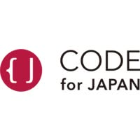

## 0083 — 2014-07-13 — 後藤 真太郎

- 投稿ID: 259545070913306
- 投稿URL: https://www.facebook.com/groups/186097664924714/posts/259545070913306/
- 要約: 6/26に開催された「ハッカソンのやり方を学ぶ」ワークショップのレポートが出来あがったようです。ご覧ください。 次回は7月31日(木)「Code for America Brigade活動に学ぶCode for X運営のヒント」。
- コメント要約: （コメントなし）

6/26に開催された「ハッカソンのやり方を学ぶ」ワークショップのレポートが出来あがったようです。ご覧ください。
次回は7月31日(木)「Code for America Brigade活動に学ぶCode for X運営のヒント」。
【ワークショップレポート】6/26開催「ハッカソンのやり方を学ぶ」　#codeforjapan... | Code for Japan - ともに考え、ともにつくる
CODE4JAPAN.ORG
【ワークショップレポート】6/26開催「ハッカソンのやり方を学ぶ」　#codeforjapan... | Code for Japan - ともに考え、ともにつくる

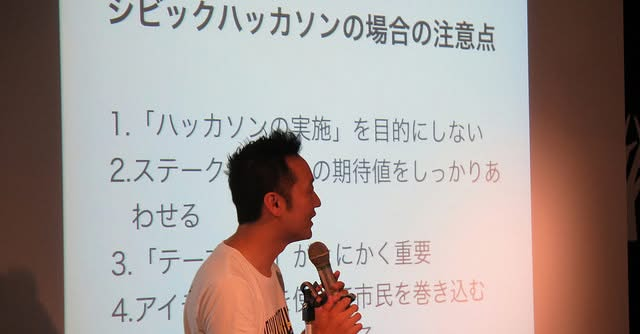

## 0084 — 2014-07-15 — 太田 一穂さんがグループのイベントを作成しました。

- 投稿ID: 260898414111305
- 投稿URL: https://www.facebook.com/groups/186097664924714/posts/260898414111305/
- 要約: 7/23 GIS勉強会〜OpenStreetMapからデータを抽出して表示する 2014/07/23(水) 7/23 GIS勉強会〜OpenStreetMapからデータを抽出して表示する さいたま市 参加者0人・興味あり0人
- コメント要約: （コメントなし）

7/23 GIS勉強会〜OpenStreetMapからデータを抽出して表示する
2014/07/23(水)
7/23 GIS勉強会〜OpenStreetMapからデータを抽出して表示する
さいたま市
参加者0人・興味あり0人

## 0085 — 2014-07-18 — 古田武士

- 投稿ID: 262557883945358
- 投稿URL: https://www.facebook.com/groups/186097664924714/posts/262557883945358/
- 要約: 埼玉県で企画しているアイデアソンの告知依頼がありましたので投稿します。 第1回の初日に参加しましたが、レゴを使った楽しいアイデアソンでした。 企画を出すというより自己表現力が問われる変わったアイデアソンです。
- コメント要約: マインドストームですかね。 おもしろそうですねぇ！

埼玉県で企画しているアイデアソンの告知依頼がありましたので投稿します。
http://www.pref.saitama.lg.jp/page/ideathon-robot140802.html
第1回の初日に参加しましたが、レゴを使った楽しいアイデアソンでした。
企画を出すというより自己表現力が問われる変わったアイデアソンです。
お時間の都合がつく方はご参加ください。
PREF.SAITAMA.LG.JP
第２回ロボットアイデアソンの参加者を募集します！～ロボットを活用したビジネスアイデアを競います～ - 埼玉県ホームページ

### コメント — 後藤 真太郎

マインドストームですかね。

### コメント — 柴田 重臣

おもしろそうですねぇ！

## 0086 — 2014-07-25 — 後藤 真太郎

- 投稿ID: 266963620171451
- 投稿URL: https://www.facebook.com/groups/186097664924714/posts/266963620171451/
- 要約: P19に着目。オープンデータがうたわれてます。 さいたま市にも取り上げてもらいましょう。 ONLINE.FLIPHTML5.COM 八王子市地域情報化計画アクションプラン 八王子市地域情報化計画アクションプラン
- コメント要約: ハッカソンが終ったら 研究会など 行いたいですね。

P19に着目。オープンデータがうたわれてます。http://online.fliphtml5.com/ipan/ozuj/　さいたま市にも取り上げてもらいましょう。
ONLINE.FLIPHTML5.COM
八王子市地域情報化計画アクションプラン
八王子市地域情報化計画アクションプラン

### コメント — 横堀 泰子

ハッカソンが終ったら 研究会など 行いたいですね。

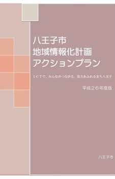

## 0087 — 2014-07-25 — 後藤 真太郎

- 投稿ID: 267107290157084
- 投稿URL: https://www.facebook.com/groups/186097664924714/posts/267107290157084/
- 要約: 【ハッカソン道具箱その１】 クライシスマッピングのushahidiをインストールしています。メールやTwitterで集められた情報を地図で集約して見ることが可能です。
- コメント要約: （コメントなし）

【ハッカソン道具箱その１】http://saigai.code4saitama.org/ushahidi/　　クライシスマッピングのushahidiをインストールしています。メールやTwitterで集められた情報を地図で集約して見ることが可能です。アカウトやTwitter連携は現在構築中です。（古田武士さんwrote）
SAIGAI.CODE4SAITAMA.ORG
Code for SAITAMA 防災地図

## 0088 — 2014-07-25 — 後藤 真太郎

- 投稿ID: 267108220156991
- 投稿URL: https://www.facebook.com/groups/186097664924714/posts/267108220156991/
- 要約: 【ハッカソン道具箱その2】 Wordpress使用。HP作成はCMS経由で編集可能です。 CODE4SAITAMA.ORG Code for SAITAMA | Just another WordPress site
- コメント要約: （コメントなし）

【ハッカソン道具箱その2】http://www.code4saitama.org
Wordpress使用。HP作成はCMS経由で編集可能です。
CODE4SAITAMA.ORG
Code for SAITAMA | Just another WordPress site

## 0089 — 2014-07-25 — 後藤 真太郎

- 投稿ID: 267108586823621
- 投稿URL: https://www.facebook.com/groups/186097664924714/posts/267108586823621/
- 要約: 【ハッカソン道具箱その3】知識集約用 Wikipediaとおなじmediawikiをインストールしています。Localwikiとして活用が可能です。編集はオープンアカウントにしています。
- コメント要約: （コメントなし）

【ハッカソン道具箱その3】知識集約用
http://wiki.code4saitama.org
Wikipediaとおなじmediawikiをインストールしています。Localwikiとして活用が可能です。編集はオープンアカウントにしています。
WIKI.CODE4SAITAMA.ORG
Code for SAITAMA

## 0090 — 2014-07-25 — 後藤 真太郎

- 投稿ID: 267109463490200
- 投稿URL: https://www.facebook.com/groups/186097664924714/posts/267109463490200/
- 要約: 【ハッカソン道具箱その4】 コンテンツが利用できます。 さいたま市の観光スポット | 社団法人さいたま観光国際協会 STIB.JP さいたま市の観光スポット | 社団法人さいたま観光国際協会
- コメント要約: （コメントなし）

【ハッカソン道具箱その4】http://www.stib.jp/kanko.html  コンテンツが利用できます。
さいたま市の観光スポット | 社団法人さいたま観光国際協会
STIB.JP
さいたま市の観光スポット | 社団法人さいたま観光国際協会

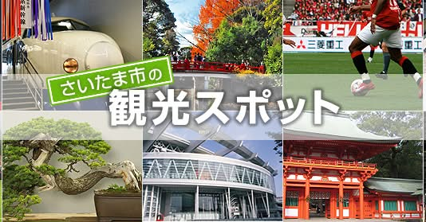

## 0091 — 2014-07-25 — 後藤 真太郎

- 投稿ID: 267112736823206
- 投稿URL: https://www.facebook.com/groups/186097664924714/posts/267112736823206/
- 要約: 【ハッカソン道具箱その6】埼玉ランチ情報局 大宮周辺のソーシャルなランチ情報 参加者に関係者もいますので利用方法を説明し直接確認するのが良いかも このコンテンツは現在ご利用いただけません 所有者がシェア先を一部の人のみに限定しているか、プライバシー設定が変更されたか、コンテンツが削除された、などの理由が考えられます。
- コメント要約: （コメントなし）

【ハッカソン道具箱その6】埼玉ランチ情報局 https://www.facebook.com/lunchpassport.saitama 大宮周辺のソーシャルなランチ情報　参加者に関係者もいますので利用方法を説明し直接確認するのが良いかも
このコンテンツは現在ご利用いただけません
所有者がシェア先を一部の人のみに限定しているか、プライバシー設定が変更されたか、コンテンツが削除された、などの理由が考えられます。

## 0092 — 2014-07-25 — 後藤 真太郎

- 投稿ID: 267113050156508
- 投稿URL: https://www.facebook.com/groups/186097664924714/posts/267113050156508/
- 要約: 【ハッカソン道具箱その5】ランチパスポート 写真等の著作権に注意
- コメント要約: （コメントなし）

【ハッカソン道具箱その5】ランチパスポート　https://www.facebook.com/lunchpassport.saitama　写真等の著作権に注意

## 0093 — 2014-07-25 — 後藤 真太郎

- 投稿ID: 267115970156216
- 投稿URL: https://www.facebook.com/groups/186097664924714/posts/267115970156216/
- 要約: 【ハッカソン道具箱その7】オープンストリートマップ さいたま新都心周辺 この地図は印刷して配布することができる、自由に使える地図です。
- コメント要約: （コメントなし）

【ハッカソン道具箱その7】オープンストリートマップ　さいたま新都心周辺　この地図は印刷して配布することができる、自由に使える地図です。

## 0094 — 2014-07-25 — 後藤 真太郎

- 投稿ID: 267116450156168
- 投稿URL: https://www.facebook.com/groups/186097664924714/posts/267116450156168/
- 要約: 【ハッカソン道具箱その8】 オープン化未 CITY.SAITAMA.JP さいたま市／さいたま市ガイドブック（平成25・26年度版）の電子書籍版を公開しています
- コメント要約: （コメントなし）

【ハッカソン道具箱その8】
http://www.city.saitama.jp/006/014/010/005/p035404.html   オープン化未
CITY.SAITAMA.JP
さいたま市／さいたま市ガイドブック（平成25・26年度版）の電子書籍版を公開しています

## 0095 — 2014-07-25 — 後藤 真太郎

- 投稿ID: 267122773488869
- 投稿URL: https://www.facebook.com/groups/186097664924714/posts/267122773488869/
- 要約: 【ハッカソン道具箱その12】 クラウドサーバー開発環境 Yahoo提供のクラウドサーバーの説明資料。印刷したものを当日配布します。
- コメント要約: （コメントなし）

【ハッカソン道具箱その12】
クラウドサーバー開発環境
https://attachment.fbsbx.com/file_download.php...
Yahoo提供のクラウドサーバーの説明資料。印刷したものを当日配布します。

## 0096 — 2014-07-26 — 若林福成

- 投稿ID: 267826420085171
- 投稿URL: https://www.facebook.com/groups/186097664924714/posts/267826420085171/
- 要約: 本日は皆様の貴重なお時間をいただき心から感謝しております。 また何かご不明な点などがございましたらお気軽にご連絡よろしくお願いいたします。
- コメント要約: さいたまとアニメの取り組みですが、近い事例で「TOKYO OTAKU MODE」があります。 アニメ、オタクともに、日本を代表するカルチャーであり、もはや国際語ですが、オタクをいうジャンルをイケてるクリエイティブで、オタクに関心のない層でも共感できる仕組みに仕上げています。

本日は皆様の貴重なお時間をいただき心から感謝しております。
また何かご不明な点などがございましたらお気軽にご連絡よろしくお願いいたします。

### コメント — Ken-ichi Kawamura

さいたまとアニメの取り組みですが、近い事例で「TOKYO OTAKU MODE」があります。
アニメ、オタクともに、日本を代表するカルチャーであり、もはや国際語ですが、オタクをいうジャンルをイケてるクリエイティブで、オタクに関心のない層でも共感できる仕組みに仕上げています。
情報があふれている今、単に情報を掲載するだけではダメで、いかに「今」をクリエイティブで吸い上げるか、うまく実現されている事例です。
http://otakumode.com/
https://otakumode.com/shop/special_feature/summeritem2014
アニメは国際的にも関心の高いとジャンルですので、やり方次第で大化けすると思います。もし、今後、Code for SAITAMAでも関われるようでしたらよろしくお願いいたします。

### コメント — 若林福成

素晴らしい事例の紹介ありがとうございます。
「やり方次第で大化けする」まさにその通りだと思います。
また後藤先生から機会をいただければ参加させていただきたいと思っております。
引き続きよろしくお願いいたします。

## 0097 — 2014-07-28 — 後藤 真太郎

- 投稿ID: 268724376662042
- 投稿URL: https://www.facebook.com/groups/186097664924714/posts/268724376662042/
- 要約: 若林君の活動です。県のアニメ立国政策には欠かせません。 このコンテンツは現在ご利用いただけません 所有者がシェア先を一部の人のみに限定しているか、プライバシー設定が変更されたか、コンテンツが削除された、などの理由が考えられます。
- コメント要約: 後藤先生！恐縮でございます。 また何かございましたらお気軽にご連絡くださいませ。 ハッカソンのコスプレ写真館のアウトプットです。 なるほど。新しい取組ですね! これは外国人向けのサービスですよね。

若林君の活動です。県のアニメ立国政策には欠かせません。
このコンテンツは現在ご利用いただけません
所有者がシェア先を一部の人のみに限定しているか、プライバシー設定が変更されたか、コンテンツが削除された、などの理由が考えられます。

### コメント — 若林福成

後藤先生！恐縮でございます。
また何かございましたらお気軽にご連絡くださいませ。

### コメント — 後藤 真太郎

ハッカソンのコスプレ写真館のアウトプットです。http://goo.gl/91vltJ

### コメント — 若林福成

なるほど。新しい取組ですね!!
これは外国人向けのサービスですよね。

### コメント — 中原 新太郎

ここって「らきすた」の聖地巡礼で有名な場所でしたっけ？

### コメント — 若林福成

中原さん！鷲宮はらき☆すたで有名な地域です。
是非1度お越しくださいませ。

## 0098 — 2014-07-30 — 後藤 真太郎

- 投稿ID: 269369546597525
- 投稿URL: https://www.facebook.com/groups/186097664924714/posts/269369546597525/
- 要約: ハッカソンに参加していただいたGunma GIS Geek の清水さんよりこのような評価をいただきました。次につなげましょう。 SHIMZ.ME 「Code for SAITAMA ハッカソン Hack for クリテリウム」に参加してきました。
- コメント要約: （コメントなし）

ハッカソンに参加していただいたGunma GIS Geek の清水さんよりこのような評価をいただきました。次につなげましょう。
SHIMZ.ME
「Code for SAITAMA ハッカソン Hack for クリテリウム」に参加してきました。
先週末の土日にCode for Saitamaハッカソンに参加してきました。 Code for　SAITAMA…

## 0099 — 2014-07-30 — 西村 正直

- 投稿ID: 269774396557040
- 投稿URL: https://www.facebook.com/groups/186097664924714/posts/269774396557040/
- 要約: 「Code for SAITAMA ハッカソン Hack for クリテリウム」お疲れ様でした。 「みんなで作るさいたまツアー」グループの皆様、プレゼンでは時間がなく、皆様の作業成果を全て発表できず、失礼しました。
- コメント要約: さいたま観光国際協会のものは了解済みです。

「Code for SAITAMA ハッカソン Hack for クリテリウム」お疲れ様でした。
「みんなで作るさいたまツアー」グループの皆様、プレゼンでは時間がなく、皆様の作業成果を全て発表できず、失礼しました。
成果を、「みんなで作ったさいたまツアー」として公開します。聖地の写真は著作権の問題がありそうなので削除しています。
さいたま観光国際協会様のデータはいいのかな？すみません、少しの間、ご了承ください。
http://neogis.dyndns.org/sai/index.html
ログイン後、主題地図でツアーを選択すると、そのツアーが表示されます。
右の「全域」チェックボックスはONのほうが使いやすいです。
２日間で結構入れたのですね。お疲れ様でした。
NEOGIS.DYNDNS.ORG
地図情報システム・Web-GIS

### コメント — 後藤 真太郎

さいたま観光国際協会のものは了解済みです。

## 0100 — 2014-08-01 — 古田武士

- 投稿ID: 270802543120892
- 投稿URL: https://www.facebook.com/groups/186097664924714/posts/270802543120892/
- 要約: 一昨年にも開催されたSotmが今年も開催されます。例の一億総伊能化のTシャツの時のイベントです。全世界のOSMのマッパーが参加されるイベントですので、予定は開けておいてください。
- コメント要約: （コメントなし）

一昨年にも開催されたSotmが今年も開催されます。例の一億総伊能化のTシャツの時のイベントです。全世界のOSMのマッパーが参加されるイベントですので、予定は開けておいてください。
小俣 博司さんからの投稿をシェアしました
小俣 博司
投稿先
Code for Japan 参加メンバー向けグループ
小俣 博司
State of the Map Japanの開催が発表されました！！
日本中のコアなマッパーが集まり、プレゼンテーション、チュートリアル
BoFセッション、基調講演、ライトニングトークなど多くのセッションが
行われます。
ぜひふるってご参加いただきたいので、まずはカレンダーにマルを
付け、マッピングパーティやその他の予定を調整してくださいね！
記
State of the Map Japan
主催： 一社）オープンストリートマップ・ファウンデーション・ジャパン
共催(予定):東京大学空間情報科学研究センター
後援(予定)：
OSGeo財団日本支部, 情報処理推進機構,
Open Knowledge Foundation Japan
期日：２０１４年１２月１３日（土）
場所：東京大学駒場第Ⅱキャンパス
（生産技術研究所内）
An 棟2階コンベンションホール

## 0101 — 2014-08-03 — 横堀 泰子

- 投稿ID: 271549573046189
- 投稿URL: https://www.facebook.com/groups/186097664924714/posts/271549573046189/
- 要約: 鯖江市のオープンデータ活用について 先程，HNKで特集していました。 市がデータをオープン化し，市民とのコラボで， 活用を図る。 市民側は，Code for Sabaeが動いているので しょうね。
- コメント要約: 鯖江市は突出した会社がリードしているので一般的なモデルにはならないと思います。多くのCode for XXはまちづくりの市民活動と連動しておりませんので、Civic HackのCivickの部分に踏み込めるかどうかに課題があるでしょう。

鯖江市のオープンデータ活用について
先程，HNKで特集していました。
市がデータをオープン化し，市民とのコラボで，
活用を図る。
市民側は，Code for Sabaeが動いているので
しょうね。
後藤さんは，このモデル展開を，狙っているの
でしょうか?

### コメント — 後藤 真太郎

鯖江市は突出した会社がリードしているので一般的なモデルにはならないと思います。多くのCode for XXはまちづくりの市民活動と連動しておりませんので、Civic HackのCivickの部分に踏み込めるかどうかに課題があるでしょう。Code for Americaのブリゲードはコーワーキングスペースを拠点にして活動しており、数年の活動経験がそのようなモデルを作ってきたのでしょう。Saitamaは最初から市民活動やプログラム開発者、建築家などが集まるコーワーキングスペースを拠点にすることができるので非常にいい環境から始めることができたと思ってます。さらに、クリテリウムを盛り上げようというハレの課題があり、これを目標にしているという設定もいいと思います。10年前から「正しいGIS方法を伝承、GISによる社会貢献、地域の会社のポテンシャルの向上を標榜し」、先行して動いていたGIS普及推進研究会の持つ測量会社-情報会社-自治体のネットワークを利用できますので、鯖江と横浜の中間のようなモデルができるのではないかと思います。

### コメント — 後藤 真太郎

まちづくりもそうですが、世代間のノウハウの伝承が重要で、往々にしてインターネットを使えるかどうかがネットワークを分断する原因となってしまいます。多くの地域は一世代上の組織がまちづくりを担ってますので、世代間のネットワークはまちづくりに必修なアイテムになります。市民活動と連動しないと、Civic HackのCivicがないことになり、こんなん出ましたけどってソフトを提示するだけになりかねません。

### コメント — 横堀 泰子

｢Saitamaは最初から市民活動やプログラム開発者、
建築家などが集まるコーワーキングスペースを拠点にすること
ができるので非常にいい環境から始めることができた｣
⇒7Fの事ですね。
星野さんも，｢住人｣同士のコラボも目指したいと，云われて
いたと思うので，CfSの強力な構成メンバ増の為の働きかけも，
お願いしたいですね。

### コメント — 横堀 泰子

【世代間のノウハウの伝承が重要】
リアルとFacebook，双方向のアプローチが有効と思います。
2年程度の方向性を固められたら，動いてみませんか?

## 0102 — 2014-08-06 — とよしま 亮介

- 投稿ID: 272858309581982
- 投稿URL: https://www.facebook.com/groups/186097664924714/posts/272858309581982/
- 要約: 春日部でこんな試み、見つけました。連携出来ないですかね？主催者情報などある人教えてくださいませー 写真の説明はありません。. 写真の説明はありません。. 写真の説明はありません。
- コメント要約: sumu cityというのもいいですね。春日部といえば清水さん、ごぞんじではないかな？ 土渕さんから情報もらいました^_^ どなたか参加出来ませんか？私はハネムーンの為…>_< おはよう御座います！

春日部でこんな試み、見つけました。連携出来ないですかね？主催者情報などある人教えてくださいませー
写真の説明はありません。. 写真の説明はありません。. 写真の説明はありません。

### コメント — 後藤 真太郎

sumu cityというのもいいですね。春日部といえば清水さん、ごぞんじではないかな？

### コメント — とよしま 亮介

土渕さんから情報もらいました^_^
どなたか参加出来ませんか？私はハネムーンの為…>_<
おはよう御座います！
主催はこちら『かすかべ地域デザイン研究所』と言う市民活動団体です。
普段は皆さんサラリーマンなどで働きながら定期的にイベントを主催しております。
年齢は20代と30代の方達で構成されており、市民団体としての活動に注目されております。
個人的には代表の方とも繋がっておりますが、今後は連携した活動が出来ないかと私も思っております。
17日は予定が有りイベントに参加出来るか微妙なのですが、もし行かれるのであれば、鷹野さんが代表ですので、土渕の名前を出して頂いても問題ありません。
宜しくお願い致します(^^)
https://m.facebook.com/KasukabeLocalDesignLaboratory
かすかべ 地域デザイン 研究所
かすかべ 地域デザイン 研究所

### コメント — 後藤 真太郎

何のイベントですか？8時間持つのかな？

### コメント — 清水 幸代

すみません、今見ました(^^;;
かすかべ地域デザイン研究所さんは、昨年も同じ時期にイベントやっていましたよ。
私の友人もいろいろ繋がっています。
今回のイベントは、まだ乞うご期待！の状態です。

### コメント — 後藤 真太郎

流石、祭り女子。繋がってますね。不動産屋さんの匂いがしますが、それでwinーwinになればいいですね。

### コメント — 後藤 真太郎

こんな記事がありました。http://blog.goo.ne.jp/.../e/8b1e9a83df03fde772058f7c5015f9d6
BLOG.GOO.NE.JP
春日部に地域デザイン研究所という若い人たちの集まり（2012.10.15） - シェラ・マンダラ・しょうわ町
春日部に地域デザイン研究所という若い人たちの集まり（2012.10.15） - シェラ・マンダラ・しょうわ町

### コメント — 横堀 泰子

どなたか参加されますか?
土曜と勘違いし，日曜午後に予定を入れてしまいました。
午前中なら，参加できますが｡｡

### コメント — 鷹野 寛之

こんにちは、横堀 泰子さんからご招待ただきました。鷹野と申します。
かすかべ地域デザイン研究所というところに所属しています。
今回のイベント、活動の内容を含めておって自己紹介させていただきます。
メンバーはとよしま 亮介様の紹介の通りですが、春日部に住んでいる、もしくは住んでいた20ー30代がメンバーで、仕事は春日部とは全く関係なく、それぞれがプロボノとして活動しています（費用も基本持ち出しで活動しています）一応NPOと同じ規約は設定していますが、いち市民団体です。
動けるのはほぼ週末のみとなっています。。
また書き込みさせていただきます。
よろしくお願い致します。

### コメント — とよしま 亮介

鷹野さん、ありがとうございます。ぜひ一度接点を持たせて頂ければ幸いです。今後ともよろしくお願いいたします。

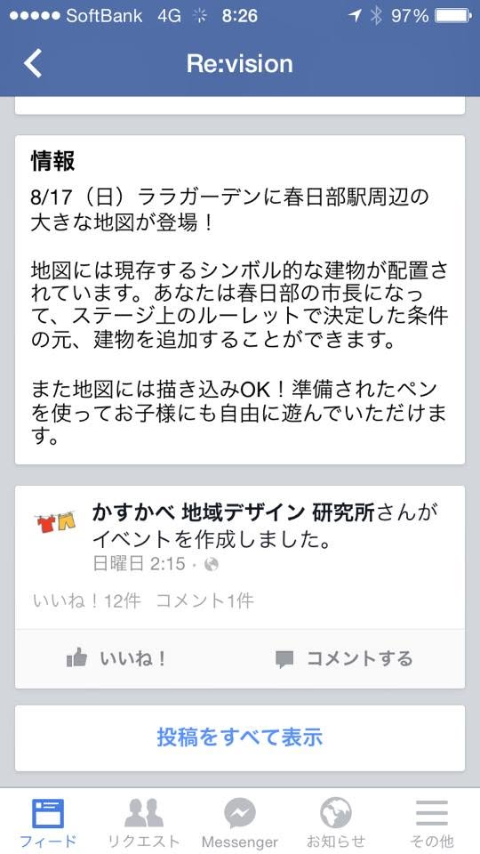

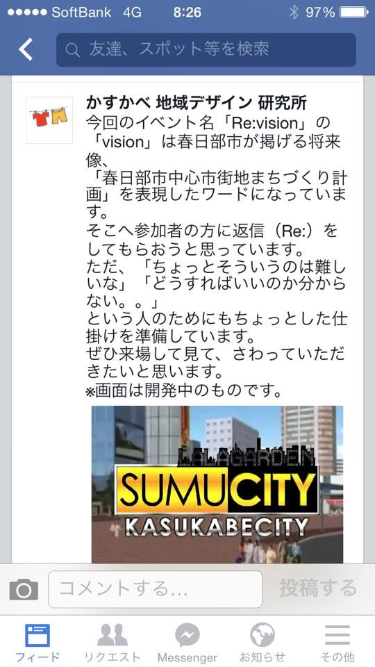

## 0103 — 2014-08-08 — 太田 一穂さんは7Fにいます。

- 投稿ID: 273728942828252
- 投稿URL: https://www.facebook.com/groups/186097664924714/posts/273728942828252/
- 要約: 太田 一穂 さいたま市 【忘れ物お知らせ】 7Fの忘れ物コーナーにPanasonicのACアダプタがありました。6/4に発見とあります。OpenStreetMapのステッカーが貼ってあるので、こちらの関係者ではないでしょうか？
- コメント要約: あの…特定しました。違うかな。 羽田さん、ありがとうございます。ただ、違うっぽいですね。 OSMのステッカーは3月のマッピングパーティーのときから7Fにあったので、それ以降です、多分。

太田 一穂
さいたま市
【忘れ物お知らせ】
7Fの忘れ物コーナーにPanasonicのACアダプタがありました。6/4に発見とあります。OpenStreetMapのステッカーが貼ってあるので、こちらの関係者ではないでしょうか？— 場所: 7F
写真の説明はありません。. 写真の説明はありません。

### コメント — 羽田 一樹

あの…特定しました。違うかな。

### コメント — 太田 一穂

羽田さん、ありがとうございます。ただ、違うっぽいですね。
OSMのステッカーは3月のマッピングパーティーのときから7Fにあったので、それ以降です、多分。

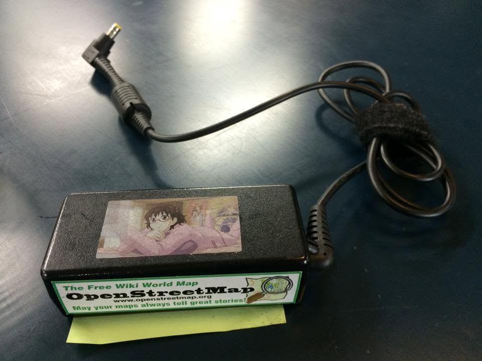

## 0104 — 2014-08-08 — 古田武士

- 投稿ID: 273842556150224
- 投稿URL: https://www.facebook.com/groups/186097664924714/posts/273842556150224/
- 要約: 本日で、ハッカソンで借りたクラウドの利用期限がきれます。 各チームにヒアリングしてデータの退避と移行しています。 下記の３URLを閲覧してデータが見れるのを確認しています。
- コメント要約: （コメントなし）

本日で、ハッカソンで借りたクラウドの利用期限がきれます。
各チームにヒアリングしてデータの退避と移行しています。
下記の３URLを閲覧してデータが見れるのを確認しています。
サーバーのログインアカウントはまだ作成していませんが週明けには
ログインできるようにします。
http://csp.code4saitama.org
http://book.code4saitama.org/criterium/
http://wifi.code4saitama.org
です。
Selfie de Saitama
CSP.CODE4SAITAMA.ORG
Selfie de Saitama

## 0105 — 2014-08-12 — 後藤 真太郎

- 投稿ID: 275367889331024
- 投稿URL: https://www.facebook.com/groups/186097664924714/posts/275367889331024/
- 要約: ラズパイでgvsigを動かした例をご存知の方おられますか？gvsigはユネスコのファンドで出来ており、教育を視野に入れた機能も充実してます。小学生が、ラズパイで動かしスクラッチと同じようにGISで遊ぶことができたら凄い。
- コメント要約: GISキャンプに参加していただいた平田さん（埼玉県GIS普及推進研究会、元パスコのGIS研究所長）の紹介文です。 ご紹介いただき、ありがとうございました。訳文が硬くて読みにくいですね。

ラズパイでgvsigを動かした例をご存知の方おられますか？gvsigはユネスコのファンドで出来ており、教育を視野に入れた機能も充実してます。小学生が、ラズパイで動かしスクラッチと同じようにGISで遊ぶことができたら凄い。共同研究者が日本語化の窓口になっているので事務作業は楽かと思います。

### コメント — 後藤 真太郎

GISキャンプに参加していただいた平田さん（埼玉県GIS普及推進研究会、元パスコのGIS研究所長）の紹介文です。http://www.jsurvey.jp/jfs/bunka/bunka3-4.pdf

### コメント — 平田 更一

ご紹介いただき、ありがとうございました。訳文が硬くて読みにくいですね。

### コメント — 嘉山 陽一

RaspberryPIでSpatialiteGUIを動かすとこまではなんとかできました。SpatiaLiteGISはちょっときつかったかな。gvSIGは本体を動かすのは結構きついかもしれません。Androidとかフューチャフォン用の軽量gvSIGがあったので、それあたりならRaspberryPIでもなんとかいくかもしれません。gvSIG本体はなんか独自のJavaフレームワークを使っていたからそのあたりが動くかどうか（マシンパワー的に）でしょうね。どなたか夏休みの課題研究に面白いトライになります。

### コメント — 後藤 真太郎

嘉山さん、ありがとうございます。svgisのユーザーって日本では少ないですね。翻訳の計画は無かったようです。

### コメント — 嘉山 陽一

FOSS4GハンドブックのgvSIGの解説ページは私が書きました。あとはOSGeoの関西の林さんがちょっといじっておられたようで、何年か前のバルセロナのFOSS4GカンファレンスでgvSIGの開発者と話をしていたような記憶があります。

### コメント — 後藤 真太郎

翻訳用のキットは日本に送られているようですので対応しようかと思いはじめてます。

## 0106 — 2014-08-12 — 後藤 真太郎

- 投稿ID: 275369892664157
- 投稿URL: https://www.facebook.com/groups/186097664924714/posts/275369892664157/
- 要約: ハッカソンの成果を使って、クリテリウムやアニたま祭で公開できるよう、地図からアクセスできたり、個々のニーズに対応できるような埼玉県のアニメ聖地巡礼ツアー紹介サイトを作っています。
- コメント要約: 飯能かな、後秩父 JA.WIKIPEDIA.ORG 埼玉県を舞台とした作品一覧 - Wikipedia 埼玉県を舞台とした作品一覧 - Wikipedia 新潟の升村（ますむら）さん運営のさいたま市内のドラマ・映画ロケ地DBです。

ハッカソンの成果を使って、クリテリウムやアニたま祭で公開できるよう、地図からアクセスできたり、個々のニーズに対応できるような埼玉県のアニメ聖地巡礼ツアー紹介サイトを作っています。是非、入れてほしい巡礼地を教えて下さい。スポット的なもの、スポットを結んでストーリーのあるもの、、、何でも結構です。

### コメント — 川畑光功

飯能かな、後秩父

### コメント — 川畑光功

http://ja.wikipedia.org/.../%E5%9F%BC%E7%8E%89%E7%9C%8C...
JA.WIKIPEDIA.ORG
埼玉県を舞台とした作品一覧 - Wikipedia
埼玉県を舞台とした作品一覧 - Wikipedia

### コメント — 吉永 篤史

新潟の升村（ますむら）さん運営のさいたま市内のドラマ・映画ロケ地DBです。
http://loca.ash.jp/info/addr/ktstst.htm
LOCA.ASH.JP
埼玉県さいたま市 ロケ地情報
埼玉県さいたま市 ロケ地情報

### コメント — とよしま 亮介

杉戸宿場巡り
http://www.kankou.sugito.info/wp2/?page_id=2133
KANKOU.SUGITO.INFO
日光街道宿場めぐり　杉戸宿 | すぎナビ
日光街道宿場めぐり　杉戸宿 | すぎナビ

### コメント — とよしま 亮介

あと、ありがちだけど七福神
地図にピンドロしてあります
http://www.kankou.sugito.info/wp2/?page_id=2138
KANKOU.SUGITO.INFO
日光街道すぎと七福神めぐり | すぎナビ
日光街道すぎと七福神めぐり | すぎナビ

### コメント — 松島 康生

蓮田にこんな所が･･･

### コメント — 渡辺 潤

久喜市鷲宮の「らきすた」が県内だと知られていますか？
9月にはアニメ神輿が担がれるそうでして。
http://www.wasimiya.org/
WASIMIYA.ORG
久喜市商工会鷲宮支所（旧鷲宮商工会）ホームページ
久喜市商工会鷲宮支所（旧鷲宮商工会）ホームページ

### コメント — 川畑光功

因みに公共コミュニケーション学会にて、同様の研究会を発足予定ですー

### コメント — 渡辺 潤

「あの花」秩父市でもあるようです。
範囲がやや広域になるかもしれません。
http://navi.city.chichibu.lg.jp/event/small.html?1299565521
NAVI.CITY.CHICHIBU.LG.JP
イベント-秩父観光なび
イベント-秩父観光なび

### コメント — 後藤 真太郎

ありがとうございます。鷲宮神社はココは立正OBでアニメを活用した地域活性化のコンサルテーションを行っている若林福成君のお膝元ですので面的に充実するはずです。

## 0107 — 2014-08-13 — 長岡 素彦

- 投稿ID: 275836735950806
- 投稿URL: https://www.facebook.com/groups/186097664924714/posts/275836735950806/
- 要約: 私たち2015防災世界会議日本CSOネットワークの仙台WGミーティングをせんだい・みやぎNPOセンター代表理事やNGOと昨日行いました。 本会議、仙台市の公募のパブリックプログラムとは別に、ジェンダーのセッションと市民のセッションが仙台市の管轄で行われます。
- コメント要約: ITx災害でセッションを作ろうとしているのですか？結構人集めもいるし、お金もかかります。R4Rやピースポートが出すので任せるか思案してます。国際通貨基金の時はマイクロソフト+社会創発塾におんぶにだっこでしたが裏（表）番組にレガートのセッションがあって身内のみのセッションになりました。

私たち2015防災世界会議日本CSOネットワークの仙台WGミーティングをせんだい・みやぎNPOセンター代表理事やNGOと昨日行いました。
本会議、仙台市の公募のパブリックプログラムとは別に、ジェンダーのセッションと市民のセッションが仙台市の管轄で行われます。そのうち市民のセッションはせんだい・みやぎNPOセンターと市が協働で、市民運営で行います。
詳細はまた、ご連絡します。
あと、「IT×災害」からは会津さん(長岡が発起人であるiSPPの代表)が参加しました。

### コメント — 後藤 真太郎

ITx災害でセッションを作ろうとしているのですか？結構人集めもいるし、お金もかかります。R4Rやピースポートが出すので任せるか思案してます。国際通貨基金の時はマイクロソフト+社会創発塾におんぶにだっこでしたが裏（表）番組にレガートのセッションがあって身内のみのセッションになりました。

### コメント — 長岡 素彦

ITx災害でセッションを作ろうとしているのかは、会津さんに聞いてください。
私はITx災害には関係していないので。

### コメント — 後藤 真太郎

ありがとうございます。発起人であるのでご存知かと思いました。ITx災害が動いているような気配は感じませんね。で、長岡さんは2015防災世界会議日本CSOネットワークで何をされようとしているのでしょうか？ここにアップされるのは協力依頼があるのでしょうか？できる事は行いますので遠慮なくお伝えください。

### コメント — 長岡 素彦

協力依頼ではなく、Code forの皆様への情報提供です。
長岡は本会議、パブリックプログラムにかぶせて、全体として「みんなの防災世界会議」を行いたいと思っております。
ということでーー
繰り返しになりますが
本会議と本会議のサイドイベントは政府関係者と国連関係、NGOは原則はECOSOC参加資格のあるNGOです。
仙台市の公募のパブリックプログラムは公募開始してます。応募者負担です。
これらと別の仙台市の管轄のジェンダーのセッションと市民のセッションがあり、市民のセッションはテーマが分野ではなく、「つながる」のようなテーマです。

### コメント — 後藤 真太郎

パブリックプログラムへの応募については前掲の通りです。ピースポートが取りまとめてます。R4Rは別枠のようですが、Code for Japanのメンバーと概ね同じですのでCode for Saitamaもまったく無関係ではないかと思ってます。

### コメント — 長岡 素彦

丁寧なご説明ありがとうござます。

## 0108 — 2014-08-14 — 横堀 泰子

- 投稿ID: 276172175917262
- 投稿URL: https://www.facebook.com/groups/186097664924714/posts/276172175917262/
- 要約: 立教大経営学部ゼミと富士通 コラボのアイデアソンの成果発表会。 各チーム 数日かけて 準備した模様です。 このコンテンツは現在ご利用いただけません 所有者がシェア先を一部の人のみに限定しているか、プライバシー設定が変更されたか、コンテンツが削除された、などの理由が考えられます。
- コメント要約: （コメントなし）

立教大経営学部ゼミと富士通 コラボのアイデアソンの成果発表会。
各チーム 数日かけて 準備した模様です。
このコンテンツは現在ご利用いただけません
所有者がシェア先を一部の人のみに限定しているか、プライバシー設定が変更されたか、コンテンツが削除された、などの理由が考えられます。

## 0109 — 2014-08-17 — 横堀 泰子

- 投稿ID: 277623445772135
- 投稿URL: https://www.facebook.com/groups/186097664924714/posts/277623445772135/
- 要約: ｢Code for SAITAMA｣と｢さいたま･まちプラン市民会議｣の接点がありそうと 行ってみました。 午前中 顔を出して 名刺交換して来ました。 〈鷹野さん〉 〈広場〉 2014/08/17(日) Re:vision 埼玉県 春日部市 さいたま市とシェアされています 興味あり
- コメント要約: （コメントなし）

｢Code for SAITAMA｣と｢さいたま･まちプラン市民会議｣の接点がありそうと 行ってみました。
午前中 顔を出して 名刺交換して来ました。
〈鷹野さん〉 https://www.facebook.com/events/744430358949636/permalink/751301491595856/]
〈広場〉 https://www.facebook.com/events/744430358949636/permalink/751304654928873/]
2014/08/17(日)
Re:vision
埼玉県 春日部市
さいたま市とシェアされています
興味あり

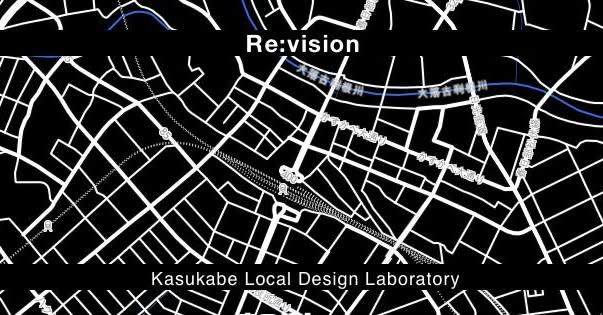

## 0110 — 2014-08-20 — 横堀 泰子

- 投稿ID: 278650649002748
- 投稿URL: https://www.facebook.com/groups/186097664924714/posts/278650649002748/
- 要約: 東京メトロ主催ですが｡｡ オープンデータ活用コンテスト | 未来とメトロ | 東京メトロ 10th anniversary TOKYOMETRO10TH.JP オープンデータ活用コンテスト | 未来とメトロ | 東京メトロ 10th anniversary
- コメント要約: （コメントなし）

東京メトロ主催ですが｡｡
オープンデータ活用コンテスト | 未来とメトロ | 東京メトロ　10th　anniversary
TOKYOMETRO10TH.JP
オープンデータ活用コンテスト | 未来とメトロ | 東京メトロ　10th　anniversary

## 0111 — 2014-08-20 — 横堀 泰子

- 投稿ID: 278655922335554
- 投稿URL: https://www.facebook.com/groups/186097664924714/posts/278655922335554/
- 要約: FUMI.ME 東京メトロ オープンデータ活用コンテストについての懸念 以下はFacebook上での議論をまとめたものです． 東京メトロさんは以前から"オープンデータ"を行うという宣…
- コメント要約: （コメントなし）

FUMI.ME
東京メトロ オープンデータ活用コンテストについての懸念
以下はFacebook上での議論をまとめたものです． 東京メトロさんは以前から"オープンデータ"を行うという宣…

## 0112 — 2014-08-23 — 後藤 真太郎

- 投稿ID: 280121215522358
- 投稿URL: https://www.facebook.com/groups/186097664924714/posts/280121215522358/
- 要約: Civic HackのCivicってサイレントマジョリティを動かすことなんです。マッピングパーティ、アイデアソン、ハッカソンを行ってきて得られた成果を形にするのは今しかありません。
- コメント要約: イケメンチームってイケメンでなくても参加できるんですかという質問がありました。クリテリウム参加選手の中からイケメンを投票するソフトです。すいません言葉数が足らなくて、、、^^;; 撮影周りでご協力できる事があれば

Civic HackのCivicってサイレントマジョリティを動かすことなんです。マッピングパーティ、アイデアソン、ハッカソンを行ってきて得られた成果を形にするのは今しかありません。ツアーチームはクラウドファンディングの準備を具体的に始めます。セルフィーチーム、イケメンチームも一緒にどうですか？責任者にはご異論なければ私がなります。wifiは、クリテリウムに間に合わせる工程は、難しいので、さいたま市情報産業協議会等と組んで、別途、さいたま市などに提案しましょう。ハッカソンに参加してなくても、このソフト作成に興味があって、ボランティアでも参加したいと思われる方は連絡ください。アニメの聖地に行って、コスプレ写真が撮れるソフトなどでは、自撮用のコスプレ画像を作成する方や、聖地巡礼ツアーを作る方など、多彩なメンバーを必要とします。

### コメント — 後藤 真太郎

イケメンチームってイケメンでなくても参加できるんですかという質問がありました。クリテリウム参加選手の中からイケメンを投票するソフトです。すいません言葉数が足らなくて、、、^^;;

### コメント — 吉永 篤史

撮影周りでご協力できる事があれば

## 0113 — 2014-08-29 — 後藤 真太郎

- 投稿ID: 283704591830687
- 投稿URL: https://www.facebook.com/groups/186097664924714/posts/283704591830687/
- 要約: 今年のアニ玉祭のテーマは「アニメと観光」です。ハッカソンの成果を社会還元するための観光ツアーのソフトを準備してます。乞うご期待。
- コメント要約: テーマは「アニメと観光」。埼玉県内を舞台にしたアニメ作品『あの日見た花の名前を僕達はまだ知らない。』（秩父市）、『らき☆すた』（久喜市鷲宮町）、『神様はじめました』（川越市）、『ヤマノススメ』（飯能市）のほか、今年は全国よりアニメ・マンガの舞台地が大集合する。

今年のアニ玉祭のテーマは「アニメと観光」です。ハッカソンの成果を社会還元するための観光ツアーのソフトを準備してます。乞うご期待。
http://www.oricon.co.jp/news/2041070/full/
ORICON.CO.JP
第2回『アニ玉祭』10月開催　テーマは「アニメと観光」 (中川翔子) ニュース-ORICON STYLE-
昨年10月に開催されたアニメ・マンガの総合イベント『第2回アニ玉祭（アニメ・マンガまつりin埼玉）』が、10月11日・12日に埼玉・大宮ソニックシティで開催される。テーマは「アニメと観光」。埼玉県内を舞台にしたアニメ作品『あの日見た花の名前を僕達はまだ知らない。』（秩父市）、『らき☆すた』（久喜市鷲宮町）、『神様はじめました』（川越市）、『ヤマノススメ』（飯能市）のほか、今年は全国よりアニメ・マンガの舞台地が大集合する。　同イベントでは、さまざまなイベントの開催を予定。世界最大のアニソンフェス“アニサマ”の「アニ玉祭」特別ジョイン・・・・・

### コメント — 後藤 真太郎

テーマは「アニメと観光」。埼玉県内を舞台にしたアニメ作品『あの日見た花の名前を僕達はまだ知らない。』（秩父市）、『らき☆すた』（久喜市鷲宮町）、『神様はじめました』（川越市）、『ヤマノススメ』（飯能市）のほか、今年は全国よりアニメ・マンガの舞台地が大集合する。、、、だそうです。

## 0114 — 2014-08-31 — 後藤 真太郎

- 投稿ID: 284933221707824
- 投稿URL: https://www.facebook.com/groups/186097664924714/posts/284933221707824/
- 要約: ハッカソン以降のアプリの開発方針につき以下のように考えてます。 ご協力よろしくお願いします。 情報の確実性をもとめるためプロジェクトにご協力いただける方は、 以下に参加表明お願いします。
- コメント要約: Code for SaitamaはCivicHackで地域課題を解決し、アイデアソン、ハッカソンのアウトプットをやりっぱなしにしないことを標榜しています。^^;;

ハッカソン以降のアプリの開発方針につき以下のように考えてます。
ご協力よろしくお願いします。
情報の確実性をもとめるためプロジェクトにご協力いただける方は、
以下に参加表明お願いします。
１．アプリの内容
①ツアーチームのアプリに、アニメ聖地巡礼を含むツアーのポイントにセルフィーのアプリを連携させ、聖地や観光地に行ってセルフィー写真とブログを残せるような機能を実現させる。
②イケメンチームのアプリとの接点は、セルフィー写真を見て投票させる機能を組み込めば連携が考えられるが今回は組み込まない。また、写真の著作権の調整で時間を要することが想定される。
③Wifiについては、自治体などへの企画書として発展させ、今回は対象としない。
④対象とする利用者
アニメファンを主とする観光客、外国人はスケジュールの関係で今年度は対象としない。
２．スケジュール
10/5 ラブ祭（於：大宮東口・西口商店街）にてCode for Saitamaのブースで説明。デモが間に合いそうなら実施。
10/11-12 アニ玉祭（於：さいたまアリーナ）で若林福成氏（埼玉県アニメ関係プロジェクト委員）の物販ブースでデモ、説明。
（Code for Summitと重なるので調整が必要）
http://animeanime.jp/article/2014/07/29/19617.html
３．ファンド
クラウドファンディングにより行うが、確実性がなく、大きな費用は期待できないので既存プロジェクトや可能性のあるクライアントからの寄付を期待するが、基本的にボランティアでできる内容を想定。
４．担当
①地図データ表示：川村（+数名調整中）
②GISによるデータ作成・管理環境の提供：西村
③ツアーコンテンツ作成：後藤、立正大学
④セルフィー写真機能：古田＋α？
⑤FaceBookによるプロジェクトの見える化：横堀
５．その他
インフルエンサーの確保
アップした記事にコメントをアップしてもらう。自転車サイドにも配慮し、影響力のある人の参加を呼びかける。
ANIMEANIME.JP
第2回アニ玉祭開催決定　アニメ・マンガの聖地・埼玉が再びカルチャー発信 | アニメ！アニメ！
「第2回アニ玉祭」の開催を記念して、「アニメ・マンガの聖地」となる埼玉県内4地域（川越市、久喜市鷲宮、秩父市、飯能市）において、スマートフォンアプリ「舞台めぐり」とタイアップした周遊イベント「埼玉聖地横断ラリー」を開催する。

### コメント — 後藤 真太郎

Code for SaitamaはCivicHackで地域課題を解決し、アイデアソン、ハッカソンのアウトプットをやりっぱなしにしないことを標榜しています。^^;;

## 0115 — 2014-09-01 — 古田武士

- 投稿ID: 285168518350961
- 投稿URL: https://www.facebook.com/groups/186097664924714/posts/285168518350961/
- 要約: 先日の土曜日に全国のCode for Japan 主催のBrigade Meetupという全国のCode for Xとして活動している方々の発表会のイベントがありました。
- コメント要約: 報告、お疲れ様でした。 ご苦労様でした。 お疲れ様でした〜！ 報告、ご苦労様でした。 イベントページのほうにもシェアお願いします お疲れ様です！ 大変勉強になるイベントでした。

先日の土曜日に全国のCode for Japan 主催のBrigade Meetupという全国のCode for Xとして活動している方々の発表会のイベントがありました。
Code for SAITAMAとしても先日のHack for クリテリウムについて発表しました。
その時に使った資料を共有します。
Hack for クリテリウム
SLIDESHARE.NET
Hack for クリテリウム

### コメント — 酒井 千富

報告、お疲れ様でした。

### コメント — 後藤 真太郎

ご苦労様でした。

### コメント — 柴田 耕次

お疲れ様でした〜！！

### コメント — 伊藤 賢二

報告、ご苦労様でした。

### コメント — 鈴木 まなみ

イベントページのほうにもシェアお願いします

### コメント — 牧内 穂高

お疲れ様です！

### コメント — 古田武士

大変勉強になるイベントでした。また新たな気持でCode for SAITAMAを盛り上げていきます。

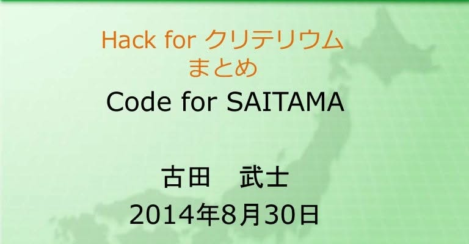

## 0116 — 2014-09-06 — 安部 邦昭

- 投稿ID: 288641428003670
- 投稿URL: https://www.facebook.com/groups/186097664924714/posts/288641428003670/
- 要約: 古田さん、お疲れ様でした。 CHUNICHI.CO.JP 地域の課題 ＩＴで解決 金沢発の活動 全国拡大 金沢市で二〇一三年、全国に先駆けて発足した、ＩＴで地域の課題を解決する「シビックテック」に取り組む市民グループが全国で増えている。
- コメント要約: （コメントなし）

古田さん、お疲れ様でした。
CHUNICHI.CO.JP
地域の課題　ＩＴで解決　金沢発の活動　全国拡大
金沢市で二〇一三年、全国に先駆けて発足した、ＩＴで地域の課題を解決する「シビックテック」に取り組む市民グループが全国で増えている。

## 0117 — 2014-09-08 — 安部 邦昭

- 投稿ID: 289385577929255
- 投稿URL: https://www.facebook.com/groups/186097664924714/posts/289385577929255/
- 要約: 昨日の朝、途中からたまたま見ました。 はっ！そっか！"ハッカソン"で技術革新 - 放送内容 - NHK総合 NHK.OR.JP はっ！そっか！"ハッカソン"で技術革新 - 放送内容 - NHK総合
- コメント要約: "はっ、そっか"でハッカソンっていうベタなオヤジギャグ最高です。先日のブリゲイドミートアップで聞いた"行動 for 会津"も良かったですし、テッキーにしかわからないジャーゴンを翻訳する努力必要ですね。

昨日の朝、途中からたまたま見ました。
はっ！そっか！！"ハッカソン"で技術革新　-　放送内容　-　NHK総合
NHK.OR.JP
はっ！そっか！！"ハッカソン"で技術革新　-　放送内容　-　NHK総合

### コメント — 柴田 重臣

"はっ、そっか"でハッカソンっていうベタなオヤジギャグ最高です。先日のブリゲイドミートアップで聞いた"行動 for 会津"も良かったですし、テッキーにしかわからないジャーゴンを翻訳する努力必要ですね。

### コメント — 横堀 泰子

私も途中から観ました。3日掛けていましたね。

## 0118 — 2014-09-12 — 後藤 真太郎

- 投稿ID: 290760944458385
- 投稿URL: https://www.facebook.com/groups/186097664924714/posts/290760944458385/
- 要約: ハッカソンの成果の１つ、観光ツアーアプリ。クリテリ、アニ玉祭の前に、らぶ祭に向けて着々と出来つつあります。画面イメージは後日として、 んなデータを作ってます。私もやりたいと思われる方、大歓迎です。
- コメント要約: （コメントなし）

ハッカソンの成果の１つ、観光ツアーアプリ。クリテリ、アニ玉祭の前に、らぶ祭に向けて着々と出来つつあります。画面イメージは後日として、http://kumacom.jp/community/?bbs_id=250　んなデータを作ってます。私もやりたいと思われる方、大歓迎です。観光ツアー以外に飲食店の入力も始めてます。これはまた写真の利用許可を取るのが大変。
KUMACOM.JP
あついぞホッとcom::さいたま観光ツアー - ホーム

## 0119 — 2014-09-14 — 鷹野 寛之

- 投稿ID: 291211554413324
- 投稿URL: https://www.facebook.com/groups/186097664924714/posts/291211554413324/
- 要約: 柏の葉で開かれるイベント情報です。三井さんがかなり力を入れられている印象があります。 津田大介・家入一真と考える“これからの街の育て方”アイデアソン KOILHACK.PEATIX.COM 津田大介・家入一真と考える“これからの街の育て方”アイデアソン
- コメント要約: 関さん、矢吹さん企画のですね。HackCamp最初の企画では？ 面白そうですね。鷹野さんは参加されますか? 技術的なことは分かりませんが参加しようと思います。

柏の葉で開かれるイベント情報です。三井さんがかなり力を入れられている印象があります。
津田大介・家入一真と考える“これからの街の育て方”アイデアソン
KOILHACK.PEATIX.COM
津田大介・家入一真と考える“これからの街の育て方”アイデアソン

### コメント — 後藤 真太郎

関さん、矢吹さん企画のですね。HackCamp最初の企画では？

### コメント — 横堀 泰子

面白そうですね。鷹野さんは参加されますか?

### コメント — 鷹野 寛之

技術的なことは分かりませんが参加しようと思います。

## 0120 — 2014-09-16 — 後藤 真太郎

- 投稿ID: 291698907697922
- 投稿URL: https://www.facebook.com/groups/186097664924714/posts/291698907697922/
- 要約: 千葉市は、道路のくぼみや壁の落書きなど、市民が気付いた身近な問題をスマートフォンで撮影して投稿してもらう取り組みを今月中旬から始めることになり、協力してくれる市民を募集しています。
- コメント要約: （コメントなし）

千葉市は、道路のくぼみや壁の落書きなど、市民が気付いた身近な問題をスマートフォンで撮影して投稿してもらう取り組みを今月中旬から始めることになり、協力してくれる市民を募集しています。埼玉県、さいたま市の公開したオープンデータ利用も考えなければいけません。10/31(金)１３：００～１７：００に浦和 埼玉会館にて、オープンデータと地方自治体というセミナーを開催します。日程の確保お願いします。
スマホで問題解決 協力者を募集 千葉市　NHKニュース
WWW3.NHK.OR.JP
スマホで問題解決 協力者を募集 千葉市　NHKニュース

## 0121 — 2014-09-16 — 後藤 真太郎

- 投稿ID: 291701007697712
- 投稿URL: https://www.facebook.com/groups/186097664924714/posts/291701007697712/
- 要約: 以下のようなセミナーを予定してます。日程の確保お願いします。 詳細は追って連絡します。
- コメント要約: （コメントなし）

以下のようなセミナーを予定してます。日程の確保お願いします。
詳細は追って連絡します。
オープンデータと地方自治体
■日時：10/31 (金)13:00-17:00
■場所：埼玉県建設会館
■費用：資料代1000円（但し、埼玉県GIS普及推進研究会メンバーは無料）
■主催;埼玉県GIS普及推進研究会
■共催：Code for Saitama（予定）、市民キャビネットスマートICT部会（予定）
■内容（若干の変更の可能性がありますのでご了承下さい)
1. 自治体とオープンデ-タ(30分)
オープンデータに関する国の施策を紹介します。
JIPDEC 坂下哲也 氏
2. 横浜市のオープンデータへの取り組み(30分)
関東地方でオープンデータへの取り組みを始め、市民へデータの利用からビジネスへ構築を呼びかけしている事例を紹介してもらいます。
横浜市(調整中)
3. 民間会社のオープンデータへの取り組み(30分)
比較的早くからアメリカのオープンデータの政策を紹介、企業としてのビ ジネス参加を経験している事例を紹介してもらいます。
株式会社パスコ 北川正己氏
4. 国土地理院のオープンデータの取り組み(30分)
日本最大のオープンデータ供給元としての立場、現状について語ってもらいます。
国土地理院関東地方測量部
5. パネルデスカッション(司会:平田更一)
上記の4名の方と埼玉県 GIS普及推進研究会の会員が参加して、県内
のオープンデータの今後を話し合います。
■連絡先：
立正大学　地球環境科学部　環境システム学科　後藤研（360-0194　熊谷市万吉1700）gotoken★ris.ac.jp（★を@にかえてください。）
■申込先：http://goo.gl/fBml6O

## 0122 — 2014-09-16 — 後藤 真太郎

- 投稿ID: 291729207694892
- 投稿URL: https://www.facebook.com/groups/186097664924714/posts/291729207694892/
- 要約: 以下のようなセミナーを開催します。是非、ご参加ください。 防災勉強会 －災害から身を守るために NY（ニューヨーク）の事例（CERT）から学ぶー 日時 ： ９月３０日（火）１８：３０～２０：３０ 場所 ： 港区神明いきいきプラザ 費用 ： 無料 申込みは 迄お願いします。
- コメント要約: （コメントなし）

以下のようなセミナーを開催します。是非、ご参加ください。
防災勉強会
－災害から身を守るために NY（ニューヨーク）の事例（CERT）から学ぶー
日時　：　９月３０日（火）１８：３０～２０：３０
場所　：　港区神明いきいきプラザ
http://www.toratopia.com/s_index.html
費用　：　無料
申込みはhttp://goo.gl/4lAcXG　迄お願いします。
DOCS.GOOGLE.COM
防災勉強会 －災害から身を守るために　NY（ニューヨーク）の事例（CERT）から学ぶー
阪神淡路大震災では人命救助をした人の64%が近所の人によるものでした。日本では都市部では自主防災組織が十分機能していないケースも見られ、関東直下型地震の際にどこまで機能するかどうかが懸念されます。今回は、日本の自主防災組織に相当するCERT（Community Emergency Response Team）の説明および、CERTによりNew Yorkのような都市部でにより行われているで行われている災害支援業務の訓練Map your Neighbourhoodを日本版に焼き直した「隣人マップ」の説明とその利用、さらに、それらのトリアージ等での利用方法について学びます。 ■日時　：　９月３０日…

## 0123 — 2014-09-24 — 安部 邦昭出典: 日経クロステック ＩＴ

- 投稿ID: 294403847427428
- 投稿URL: https://www.facebook.com/groups/186097664924714/posts/294403847427428/
- 要約: 安部 邦昭 岩手県、すごい！ ITPRO.NIKKEIBP.CO.JP 岩手県がスマホ位置ゲー「Ingress」を観光振興などに活用 岩手県は米Googleが提供中の位置情報を利用したスマートフォン（スマホ）向けゲーム「Ingress（イングレス）」を、観光振興や地域活性化に活用する試みを始めると2014年9月24日、発表した。
- コメント要約: （コメントなし）

安部 邦昭
岩手県、すごい！
ITPRO.NIKKEIBP.CO.JP
岩手県がスマホ位置ゲー「Ingress」を観光振興などに活用
岩手県は米Googleが提供中の位置情報を利用したスマートフォン（スマホ）向けゲーム「Ingress（イングレス）」を、観光振興や地域活性化に活用する試みを始めると2014年9月24日、発表した。25日に広報や観光、復興推進などの担当者10人を集めた研究会を県庁内に発足、26日に初会合を開く。ゲームのプレーヤーを狙った誘致イベントの開催や情報発信への活用方法を検討、来年以降の実施を目指す。自治体がIngressの活用に動き出すのは全国で初めて。

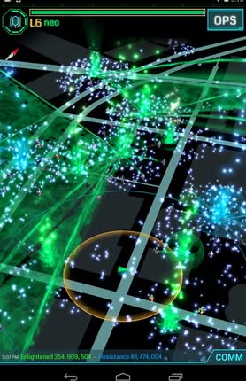

## 0124 — 2014-09-27 — とよしま 亮介

- 投稿ID: 295375667330246
- 投稿URL: https://www.facebook.com/groups/186097664924714/posts/295375667330246/
- 要約: 起業に一歩を踏み出すチャンス『創業スクールｉｎ杉戸町』 「起業で地域を元気に！
- コメント要約: （コメントなし）

起業に一歩を踏み出すチャンス『創業スクールｉｎ杉戸町』
「起業で地域を元気に！（無料創業セミナー＆スクール説明会）」
～10.5 女性起業家さんから本当の話を聞いてみよう～
「日本再興戦略」にも掲げられている日本の開業率向上の為、
創業に必要な財務・税務等の創業に必要な基本的知識の習得や
ビジネスプランの作成支援を行う、創業スクールを10月30日より開校します。
創業に必要な全てを学べるスクールは、のべ７日間。
以下の２コースをご用意しました。
●女性起業家コース　主な対象者：女性　開催は木曜の午後（託児あり）
●ベーシックコース　主な対象者：一般　開催は土曜の午後
全国から各分野のプロフェッショナルが杉戸町に集結！
創業したい皆さんを全力で応援します！！
しかも、受講料はどちらのコースでも破格の10,800円！（嬉しい！）
そして、まずはじめに10月5日には
地域で起業し活躍している先輩方を招き、
起業のきっかけやポイント、心掛けるべきことなど、
実体験の中から得られた経験や知識を語って頂く「無料セミナー」、
～10.5 女性起業家さんから本当の話を聞いてみよう～
を開催します。
上記スクールについての説明会や個別相談も実施します（託児もあります）。
すぐに創業したい方、
いつかは創業したい方、
創業ってそもそも何？と思う方、
どんな方でも気軽にご参加いただけます。
皆さんのご参加をお待ちしております！！！
セミナー開催概要
名称　起業に一歩を踏み出すチャンス「創業スクールｉｎ杉戸町」
～10.5 女性起業家さんから本当の話を聞いてみよう（無料セミナー）～
日時　平成２６年１０月５日（日）１４：００～１７：３０
会場　春日部市市民活動センター（春日部市南1-1-7東部地域振興ふれあい拠点施設４階）
主催　公益社団法人日本サードセクター経営者協会
後援　杉戸町
協力　ＮＰＯ法人すぎとＳＯＨＯクラブ、杉戸町商工会、春日部市民活動センター他
所管　経済産業省・中小企業庁（平成26年度地域創業促進支援事業）
お申し込み・お問い合わせ
ＮＰＯ法人すぎとＳＯＨＯクラブ
TEL　0480-31-0055（月～金9:30～17:30）
FAX　0480-31-0055（２４時間）
Mail jimu★sugito.com（２４時間）★を@に変換してください

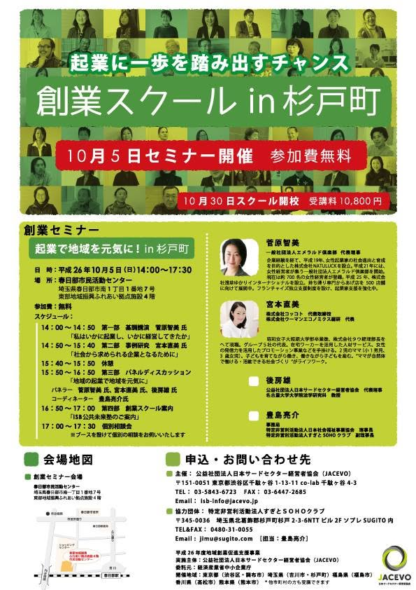

## 0125 — 2014-09-29 — 古田武士

- 投稿ID: 296078967259916
- 投稿URL: https://www.facebook.com/groups/186097664924714/posts/296078967259916/
- 要約: 一昨日、昨日とCode for SAITAMAとして協力した、いばらきハッカソンがNHKにて放映されました。 昨日は、メンターの仕事が一段落し時間がありましたので、日立駅前のミニマッピングパーティも開催しました。
- コメント要約: ご活躍の認知度が広がり、素晴らしいですね。 先日は、D3.jsの件でお世話になり、ありがとうございました。 今はQGISを勉強しながら、東京都や日野市のデータを扱っていますが、標高のメッシュデータを文字型から数値型に変換するだけでも一苦労で・・・時間がかかって難儀しています。

一昨日、昨日とCode for SAITAMAとして協力した、いばらきハッカソンがNHKにて放映されました。
http://www3.nhk.or.jp/lnews/mito/1074539151.html...
昨日は、メンターの仕事が一段落し時間がありましたので、日立駅前のミニマッピングパーティも開催しました。
http://www.openstreetmap.org/#map=17/36.59131/140.65938
参加メンバーに役所の方も交えて実施したところかなりの好感触を得られました。今後、茨城でもマッピングパーティをしていきたいとのことです。引き続きCode for SAITAMAは他のBrigadeの支援をしていきます。
まずは報告まで。
WWW3.NHK.OR.JP
県北地域をＰＲするアプリ作り - NHK茨城県のニュース
県北地域をＰＲすることなどをテーマにスマートフォンのアプリを開発するイベントが日立市で開かれました。このイベントは、普及が進むスマートフォン…

### コメント — 天野 徹

ご活躍の認知度が広がり、素晴らしいですね。。。
先日は、D3.jsの件でお世話になり、ありがとうございました。
今はQGISを勉強しながら、東京都や日野市のデータを扱っていますが、標高のメッシュデータを文字型から数値型に変換するだけでも一苦労で・・・時間がかかって難儀しています。
この世界も、いろいろな苦労があると実感しています、、、
今後ともよろしくお願いいたします。

### コメント — 飯田 哲

マッピングしようぜ (/･ω･)/

### コメント — 後藤 真太郎

どんどん広がっていくといいですね。

### コメント — 後藤 真太郎

天野先生、＞メッシュデータを文字型から数値型に変換するだけでも一苦労で　、、、　基盤数値情報に5ｍメッシュデータがありあすよ。現状では、メッシュデータの扱いはARCGISのSurface Analysisの方が機能的に上ですので余裕があるようでしたら1ライセンス持ってもいいかと思います。

### コメント — 佐藤 俊秀

マッピングするぜ！

### コメント — 嘉山 陽一

http://www.slideshare.net/Yoichi_gmf/qgis-training-13　http://www.slideshare.net/Yoichi_gmf/qgis-training-23　　　QGISのバージョンが古いですがQGISでの基盤地図5mメッシュのあつかいはこのあたりに解説してあります

### コメント — 天野 徹

お金がないので、ArcGISは入れられません。文系は金欠なのです。
5mメッシュはDLして解凍したらXMLファイルしか作成されませんでしたが。。。何を間違ったんでしょう??

### コメント — 後藤 真太郎

XMLファイルを選択されたんですね。

### コメント — 天野 徹

シェイプファイルかcsvが希望なんですが。。。メニューではXML以外の選択がないような感じで。。。初心者なもので、済みません。

### コメント — 後藤 真太郎

XMLからshpへの変換ソフトは出てますよ。

### コメント — 天野 徹

フリーでありますか。。。定評のあるもの、御紹介いただければ。。。
それから、QGISで標高データを文字列からrealに変換しようとしているのですが、これがなかなか。良い方法がありましたら、教えていただけると助かります。。。

### コメント — 天野 徹

unknownの変換を
CASE WHEN "G04d_002"!='unknown' THEN 0
ELSE toreal("G04d_002") END
でやろうとすると、unknownをdoubleに変換できない
と言われて、それ以上進めません

### コメント — 天野 徹

後藤先生。。。済みません。case文は解決したのですが。。。メッシュの四隅に赤い×がついてしまいます。。。これを取り除くことはできますでしょうか。。。

### コメント — 古田武士

天野先生、このスレッドでの関係のない話題は別のスレッドでしていただけますでしょうか。すみません。

### コメント — 天野 徹

いえ。。。こちらこそ済みません。後藤先生、有難うございました。

## 0126 — 2014-09-29 — 後藤 真太郎

- 投稿ID: 296091647258648
- 投稿URL: https://www.facebook.com/groups/186097664924714/posts/296091647258648/
- 要約: 以下のようなセミナーの開催が明日に迫りました。近所のマッピングしてコミュニティーを作り、隣保関係を醸成することで災害から身を守ろうという話です。これもCode for Saitamaのメンバーが協働してます。
- コメント要約: お、まだ間に合います? 間に合います。 明日、勉強させていただきます。 どうぞ宜しくお願いします。 中央区ですが、港区に聴講希望を出しOKを頂きました。しかし、まちひとサイトとしての取材はNOで、記録には残せません、、、、、う そうですか。

以下のようなセミナーの開催が明日に迫りました。近所のマッピングしてコミュニティーを作り、隣保関係を醸成することで災害から身を守ろうという話です。これもCode for Saitamaのメンバーが協働してます。是非、ご参加ください。
-----------------
防災勉強会
－災害から身を守るために NY（ニューヨーク）の事例（CERT）から学ぶー
日時　：　９月３０日（火）１８：３０～２０：３０
場所　：　港区神明いきいきプラザ　http://www.toratopia.com/s_index.html
費用　：　無料
申込みはhttp://goo.gl/4lAcXG　迄お願いします。
DOCS.GOOGLE.COM
防災勉強会 －災害から身を守るために　NY（ニューヨーク）の事例（CERT）から学ぶー
阪神淡路大震災では人命救助をした人の64%が近所の人によるものでした。日本では都市部では自主防災組織が十分機能していないケースも見られ、関東直下型地震の際にどこまで機能するかどうかが懸念されます。今回は、日本の自主防災組織に相当するCERT（Community Emergency Response Team）の説明および、CERTによりNew Yorkのような都市部でにより行われているで行われている災害支援業務の訓練Map your Neighbourhoodを日本版に焼き直した「隣人マップ」の説明とその利用、さらに、それらのトリアージ等での利用方法について学びます。 ■日時　：　９月３０日…

### コメント — 川畑光功

お、まだ間に合います?

### コメント — 後藤 真太郎

間に合います。

### コメント — 松島 康生

明日、勉強させていただきます。
どうぞ宜しくお願いします。

### コメント — 藤井 俊公

中央区ですが、港区に聴講希望を出しOKを頂きました。しかし、まちひとサイトとしての取材はNOで、記録には残せません、、、、、う

### コメント — 後藤 真太郎

そうですか。USTにリアルタイムにアップするのはＸのようです。個人で録画してアップするならよかったかも。

### コメント — 土井 裕之

私も参加させていただきます。次の用事が町屋であるので中座します。

## 0127 — 2014-10-02 — 古田武士

- 投稿ID: 297134257154387
- 投稿URL: https://www.facebook.com/groups/186097664924714/posts/297134257154387/
- 要約: Code for SAITAMAの１０月のイベント第１弾は らぶさいに出店します。ジオキャッシング入門の【おおみや宝探し】を実施します。ぜひともご参加ください。
- コメント要約: （コメントなし）

Code for SAITAMAの１０月のイベント第１弾は らぶさいに出店します。ジオキャッシング入門の【おおみや宝探し】を実施します。ぜひともご参加ください。
もっとこのまちが好きになる「らぶさい2014」みんなの文化祭さんからの投稿をシェアしました
もっとこのまちが好きになる「らぶさい2014」みんなの文化祭
Code for SAITAMAでは、大宮の街の街歩きイベント 【おおみや宝探し】を行います。当日、宝の地図を販売します。豪華景品も出ますのでぜひともご参加ください。

## 0128 — 2014-10-07 — 後藤 真太郎

- 投稿ID: 298892366978576
- 投稿URL: https://www.facebook.com/groups/186097664924714/posts/298892366978576/
- 要約: 以下のようなセミナーを開催します。多くの方々の参加をお待ちしております。
- コメント要約: 後藤先生 「４．国土地理院のオープンデータの取り組み」の講師が「横浜市政策局 関口昌幸氏」となっていますが？ 修正しました。

以下のようなセミナーを開催します。多くの方々の参加をお待ちしております。
オープンデータと地方自治体
■日時：2014/10/31 (金)13:00-17:00
■場所：埼玉会館　http://www.saf.or.jp/saitama/access/
■費用：1000円（資料代）
（但し、埼玉県GIS普及推進研究会メンバーは無料）
■主催：埼玉県GIS普及推進研究会
■共催：Code for Saitama、市民キャビネットスマートICT部会
■内容：
１．自治体とオープンデータ　JIPDEC 坂下哲也 氏
２．横浜市のオープンデータへの取り組み　　横浜市政策局　関口昌幸氏
３．民間会社のオープンデータへの取り組み　株式会社パスコ 北川正己氏
４．国土地理院のオープンデータの取り組み
国土地理院地理空間情報調整官　石関隆幸氏
５．パネルデスカッション(司会：平田更一)
上記の4名の方と埼玉県 GIS普及推進研究会の会員が参加して、
県内のオープンデータの今後について議論します。
■申込み：http://goo.gl/fBml6O　に登録願いします。

### コメント — 落合 司郎

後藤先生
「４．国土地理院のオープンデータの取り組み」の講師が「横浜市政策局　関口昌幸氏」となっていますが？

### コメント — 後藤 真太郎

修正しました。

## 0129 — 2014-10-09 — 後藤 真太郎

- 投稿ID: 299849056882907
- 投稿URL: https://www.facebook.com/groups/186097664924714/posts/299849056882907/
- 要約: 10/10-12にCode for Japan Summitが開催されます。Code for Saitamaからも羽鳥さん、古田さん、太田さん、後藤の4人がメンターとして参加します。
- コメント要約: （コメントなし）

10/10-12にCode for Japan Summitが開催されます。Code for Saitamaからも羽鳥さん、古田さん、太田さん、後藤の4人がメンターとして参加します。Code for Japan全体の活動や、他のBrigadeの活動やhttp://summit.code4japan.org/　を知る良い機会ですし、お子様連れでも参加しやすいよう、Coder Dojoや子供向けのワークショップもあります。ご都合よろしければ是非ご参加ください。
年に一度のシビックテックの祭典「Code for Japan Summit 2014」開催！
SUMMIT.CODE4JAPAN.ORG
年に一度のシビックテックの祭典「Code for Japan Summit 2014」開催！

## 0130 — 2014-10-14 — 安部 邦昭

- 投稿ID: 301739100027236
- 投稿URL: https://www.facebook.com/groups/186097664924714/posts/301739100027236/
- 要約: こんなシンポジウムがあるそうです。 2014/11/07(金) 第3回OpenGLAM JAPANシンポジウム 「オープンデータ化するアーカイブの現在」 横浜市 興味あり
- コメント要約: （コメントなし）

こんなシンポジウムがあるそうです。
2014/11/07(金)
第3回OpenGLAM JAPANシンポジウム 「オープンデータ化するアーカイブの現在」
横浜市
興味あり

## 0131 — 2014-10-24 — 後藤 真太郎

- 投稿ID: 305193719681774
- 投稿URL: https://www.facebook.com/groups/186097664924714/posts/305193719681774/
- 要約: 【オープンデータアイデアソン向け資料#1】
- コメント要約: （コメントなし）

【オープンデータアイデアソン向け資料#1】https://docs.google.com/.../1DqZUvd3PVj8HvIja.../viewform...

## 0132 — 2014-10-27 — 古田武士

- 投稿ID: 306216206246192
- 投稿URL: https://www.facebook.com/groups/186097664924714/posts/306216206246192/
- 要約: 宮前区のアイデアソンに参加しています。総勢130人の大所帯のビッグアイデアソンです。
- コメント要約: （コメントなし）

宮前区のアイデアソンに参加しています。総勢130人の大所帯のビッグアイデアソンです。

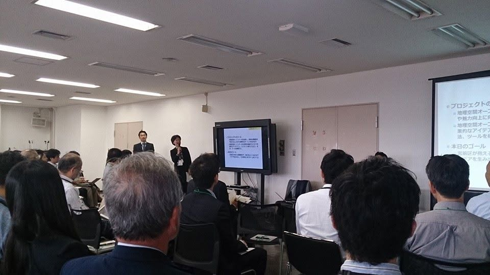

## 0133 — 2014-11-27 — 後藤 真太郎

- 投稿ID: 316374748563671
- 投稿URL: https://www.facebook.com/groups/186097664924714/posts/316374748563671/
- 要約: 12/3 に開催概要 - オープンデータシンポジウム2014が開催されます。 参加されませんか？ 開催概要 - オープンデータシンポジウム2014 VLED.OR.JP 開催概要 - オープンデータシンポジウム2014
- コメント要約: （コメントなし）

12/3 に開催概要 - オープンデータシンポジウム2014が開催されます。http://www.vled.or.jp/symposium2014/　参加されませんか？
開催概要 - オープンデータシンポジウム2014
VLED.OR.JP
開催概要 - オープンデータシンポジウム2014

## 0134 — 2014-12-05 — 古田武士

- 投稿ID: 319381614929651
- 投稿URL: https://www.facebook.com/groups/186097664924714/posts/319381614929651/
- 要約: 埼玉県のオープンデータとしてバス会社を横断したバスロケーションシステムシステムの公募が始まりました。 Code for SAITAMAとしてはオープンデータのサンプルデータが出てきた段階でアイデアソン・ハッカソンをしたいと思っています。
- コメント要約: ビジネスモデルを考えねば。

埼玉県のオープンデータとしてバス会社を横断したバスロケーションシステムシステムの公募が始まりました。
http://www.pref.saitama.lg.jp/page/bus-opendate-koukoku.html
Code for SAITAMAとしてはオープンデータのサンプルデータが出てきた段階でアイデアソン・ハッカソンをしたいと思っています。
PREF.SAITAMA.LG.JP
出歩きやすいまちづくり事業（埼玉県バス情報オープンデータ化検討業務委託）に関するプロポーザル方式（簡易公募型）の手続き開始について - 埼玉県ホームページ

### コメント — 後藤 真太郎

ビジネスモデルを考えねば。

## 0135 — 2014-12-11 — 石山 太一

- 投稿ID: 321569121377567
- 投稿URL: https://www.facebook.com/groups/186097664924714/posts/321569121377567/
- 要約: Code for SAITAMA の皆さん、先に行われたクリテリウムの件です。 アイデアソンの結果を受け、後藤先生、古田さんとともに、NTTにWi-fiの設置協力依頼に行きました。
- コメント要約: （コメントなし）

Code for SAITAMA の皆さん、先に行われたクリテリウムの件です。
アイデアソンの結果を受け、後藤先生、古田さんとともに、NTTにWi-fiの設置協力依頼に行きました。
クリテ当日は私も予定があり、会場には行けませんでしたが、Wi-fiの提供が実現していたのですね。団体の大きな(小さいけど)実績になった気がします。
先ほど私の会社にNTT公共営業部の方がいらっしゃり、当団体の提言から、当日のWi-fi設置等は公共営業部で実施させていただきました！との報告がありました。
私も当日の様子を検証しておらず、大変無責任で申し訳ありませんでした。時期を見て当日の使用状況等を多角面から分析し、今後の有効性評価を行いたいと思います。
直近の依頼にかかわらず、設置等を行っていただいたNTTさいたま支店に厚くお礼申し上げます。
次は、スーパーアリーナで東京オリンピック(バスケ)の開催がありそうです。日赤埼玉病院及び小児医療センター等設置の関係を含め、次のミッションが発生しますね！

## 0136 — 2014-12-28 — 長岡 素彦

- 投稿ID: 328563004011512
- 投稿URL: https://www.facebook.com/groups/186097664924714/posts/328563004011512/
- 要約: 失礼します。 長岡@2015防災世界会議日本CSOネットワークです。 世界防災会議において2015防災世界会議日本CSOネットワークは、本会議での働きかけとともに、東北や各国の市民ともに市民世界防災会議を行います。
- コメント要約: 素晴らしい試みですね。協力することがありましたら連絡ください。ITx災害もRace for Rもイベントがありますので忙しくなりそうですね。 よろしくお願いします。

失礼します。
長岡@2015防災世界会議日本CSOネットワークです。
世界防災会議において2015防災世界会議日本CSOネットワークは、本会議での働きかけとともに、東北や各国の市民ともに市民世界防災会議を行います。
現在、この市民防災世界会議に向けて、準備を進めております。
市民防災世界会議
日程：2015年3月14日（土）-17日（火）
場所：仙台市市民活動サポートセンター、東京エレクトロンホール宮城(宮城県民会館)
主催：防災からまちづくりを考える実行委員会、外務省NGO研究会
企画・運営：2015防災世界会議日本CSOネットワーク
http://jcc2015.net/civil_society/
★～それだけでなく、普通のひとの声をとどけるキャンペーン
「Road toSendai」を行います。
これは、2015防災世界会議日本CSOネットワークのパートナー団体でもあるアジアの防災国際団体ADRRNが主体で国連機関のUNISDRの協力で行われているアウェアネス・キャンペーンです。
本会議に向けて、自分の宣言を書き、写真に撮り、投稿をするものです。
世界で10万通を目指し、開催国である日本の目標は5000通です。
現在、英語のチラシが完成しており日本語のチラシが完成しましたらお知らせします。
市民防災世界会議 | 2015防災会議日本CSOネットワーク
JCC2015.NET
市民防災世界会議 | 2015防災会議日本CSOネットワーク

### コメント — 後藤 真太郎

素晴らしい試みですね。協力することがありましたら連絡ください。ITx災害もRace for Rもイベントがありますので忙しくなりそうですね。

### コメント — 長岡 素彦

よろしくお願いします。
また、ITx災害もRace for Rの仙台会議での発表日をここでお知らせください。

### コメント — 後藤 真太郎

プログラムが公開されてます。　　　　　　　　　　　http://www.bosai-sendai.jp/doc/pf_event.pdf

## 0137 — 2014-12-28 — 後藤 真太郎

- 投稿ID: 328722173995595
- 投稿URL: https://www.facebook.com/groups/186097664924714/posts/328722173995595/
- 要約: 1/23-24に杉戸町にて第2回協働型災害訓練を実施します。今年1/24-25に開催した第1回目には60団体、350人が参加するという大規模なもので、組織図のような構成で行います。
- コメント要約: （コメントなし）

1/23-24に杉戸町にて第2回協働型災害訓練を実施します。今年1/24-25に開催した第1回目には60団体、350人が参加するという大規模なもので、組織図のような構成で行います。情報関係は、1/23には災害を想定した情報共有の訓練。1/24には、ご近所防災マッピングパーティーを行います。是非、ご参加下さい。http://kumacom.jp/community/?bbs_id=252
写真の説明はありません。. 写真の説明はありません。

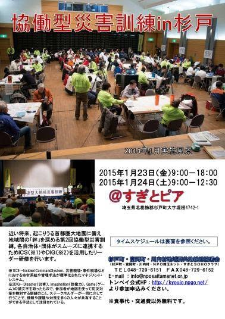

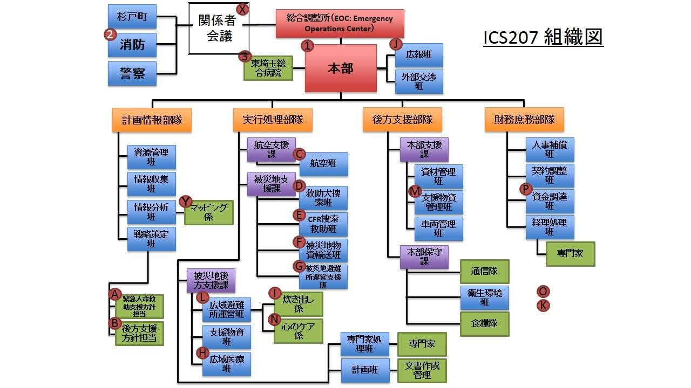

## 0138 — 2014-12-29 — 酒井 千富

- 投稿ID: 328860663981746
- 投稿URL: https://www.facebook.com/groups/186097664924714/posts/328860663981746/
- 要約: 27,28日に前橋で行われました、高校生対象のハッカソン成果です( )b ぐんまラブな作品群！ 株式会社ブレインファームさんからの投稿をシェアしました 株式会社ブレインファーム 投稿先 ぐんま高校生!
- コメント要約: （コメントなし）

27,28日に前橋で行われました、高校生対象のハッカソン成果です(
)b
ぐんまラブな作品群！
株式会社ブレインファームさんからの投稿をシェアしました
株式会社ブレインファーム
投稿先
ぐんま高校生!!アイデアソンハッカソン/2014年末!!
アイデアソン・ハッカソン 二日間で開発したScratchのゲーム
全10チームの「チーム名」&「ゲームタイトル」をご紹介！
--
■大賞
チームカラス（鈴木・黒崎）
害虫退治！ぐんまちゃ〜ん
http://scratch.mit.edu/projects/41298460/
--
■特別賞（Code for Gunma 賞）
樽納豆組（田村・野口）
作物を作ろう！ in 群馬
http://scratch.mit.edu/projects/41298126/
--
■特別賞
チーム私立（加藤・正田・荒）
群馬博士になろう！
http://scratch.mit.edu/projects/41298454/
--
Happyスマイルチーム（川島・太田）
ぐんまをたべる ver.1
http://scratch.mit.edu/projects/41298462/
--
浜橘組（浜田・橘）
間違い探し
http://scratch.mit.edu/projects/41298466/
--
チームTAS（徳江・新井・須田）
ごみ？を分別せよ！
http://scratch.mit.edu/projects/41298472/
--
チーム群馬ちゃん（田辺・澤田・吉田）
防災クイズ
http://scratch.mit.edu/projects/41298470/
--
チーム樹愛ナンバースリーというもの（信澤・岡田・小沢）
群馬ちゃん・クイズの旅
http://scratch.mit.edu/projects/41298474/
--
チームGirls♡（栗田・岡田）
Be a Hero of Tomioka
http://scratch.mit.edu/projects/41298468/
--
アプリ塾（中嶋・佐藤）
群馬の迷路
http://scratch.mit.edu/projects/41304034/
--
群馬県のマスコット「ぐんまちゃん」使用許諾 26-191412 号

## 0139 — 2014-12-29 — 後藤 真太郎

- 投稿ID: 329135490620930
- 投稿URL: https://www.facebook.com/groups/186097664924714/posts/329135490620930/
- 要約: 和光市のオープンデータの取組です。 CITY.WAKO.LG.JP 和光市/和光市のオープンデータへの取組 文字の大きさ、色を変更する機能は、JavaScriptが無効なため使用できません。
- コメント要約: 和光市では職員勉強会を立ち上げてますが、当市のオープンデータを用いた取り組みが何か出来ないか考えています。オープンデータの入門書を読んで勉強中です。先進地域に学べればと思います。

和光市のオープンデータの取組です。
CITY.WAKO.LG.JP
和光市/和光市のオープンデータへの取組
文字の大きさ、色を変更する機能は、JavaScriptが無効なため使用できません。JavaScriptを有効にするかブラウザの調節機能をご利用ください。

### コメント — 渡辺 潤

和光市では職員勉強会を立ち上げてますが、当市のオープンデータを用いた取り組みが何か出来ないか考えています。オープンデータの入門書を読んで勉強中です。先進地域に学べればと思います。

### コメント — 後藤 真太郎

アイデアソンしましょう。個々で考えて蛸壺に入るのは良くありません。

### コメント — 渡辺 潤

そうですね。皆さんとアイデアソンしながら、いい活用の仕方を見出だせればと思います。取り上げていただく機会ありましたら、宜しくお願いします。

### コメント — 後藤 真太郎

1/16に北浦和公民館でオープンデータアイデアソン、1/31にハッカソンを行います。和光市のデータも紹介していただけますか？静岡の杉本直也さんから事例を紹介していただきます。是非、オープンデータ担当の方とご参加ください。

### コメント — 渡辺 潤

和光市のデータ確認してきます。静岡県の杉本さんのお話お伺いしたいです。担当者にも行けるか打合せます。

### コメント — 後藤 真太郎

埼玉県、さいたま市、和光市、越谷市、、、これだけオープンデータ化が進んでくると、協議会が必要ですね。各自治体のオープンデータが既得権や助成金の縛りにハマってこれまでの失敗を繰り返す前に手を打つ必要があります。できたアプリをCC By提供を担当業者との契約書に明記する必要があります。これをしないとGISのように各課バラバラで同じデータの重複入力が発生します。

### コメント — 渡辺 潤

全県的に足並みを揃えるか、独自に進むのか、現時点では不透明ですが、ＧＩＳのように各庁舎や各課で統一性が取れないと勿体無いですね。そのあたりもアイデアソンで協議できればと思います。

### コメント — 後藤 真太郎

全県的に足並みを揃える なんてGISの例を見てもそろう筈がありません。先ずデータがオープンになってCC Byで提供されれば流通していきます。データの様式を統一するなんて考えない方が良いと思います。様式を公開してくれるだけで流通していきます。業者泣かせではありますが、統合型GISの成立を妨げてきたのは業者の責任もあります。全てのデータをオープンにするわけでもないし、個人情報保護法に係るデータなど対象にしなければいいわけです。GISの検討が始まって35年くらいになりますが、いまだに解決されてないのがデータ流通の問題です。全てが解決するなんてありえませんよ。出来る事からコツコツとですね。

## 0140 — 2015-01-10 — 柴田 耕次

- 投稿ID: 333010383566774
- 投稿URL: https://www.facebook.com/groups/186097664924714/posts/333010383566774/
- 要約: Ingressを活用している自治体一覧(まとめ) INGRESS(イングレス)速報 Ingressを活用している自治体一覧(まとめ)
- コメント要約: 東日本だけ？ 小規模市町村でも経費的に導入可能なシステムでしょうか？ とよしま 亮介 言われてみれば、イングレスの話題は北海道・東北・関東がおおいですね〜 渡辺 潤 イングレスっていうgoogleが提供している位置ゲームで陣取り合戦みたいなものです。

Ingressを活用している自治体一覧(まとめ)
INGRESS(イングレス)速報
Ingressを活用している自治体一覧(まとめ)

### コメント — とよしま 亮介

東日本だけ？

### コメント — 渡辺 潤

小規模市町村でも経費的に導入可能なシステムでしょうか？

### コメント — 柴田 耕次

とよしま 亮介 言われてみれば、イングレスの話題は北海道・東北・関東がおおいですね〜
渡辺 潤 イングレスっていうgoogleが提供している位置ゲームで陣取り合戦みたいなものです。なのでシステム的には経費は必要ありません。活用したイベントをどう組みたてるかあたりが肝なのかなと思います。

## 0141 — 2015-01-15 — とよしま 亮介

- 投稿ID: 334615663406246
- 投稿URL: https://www.facebook.com/groups/186097664924714/posts/334615663406246/
- 要約: いよいよ明日開催です！ 皆さん、ぜひご参加ください！ オープンデータアイデアソン／ハッカソン開催のご案内 【開催主旨】 公共データを二次利用しやすい形でオープン化する「オープンデータ」の取組は、民間における公共データの活用を促進し、経済活性化等を促進するものとして期待されています。
- コメント要約: （コメントなし）

いよいよ明日開催です！！
皆さん、ぜひご参加ください！！
オープンデータアイデアソン／ハッカソン開催のご案内
【開催主旨】
公共データを二次利用しやすい形でオープン化する「オープンデータ」の取組は、民間における公共データの活用を促進し、経済活性化等を促進するものとして期待されています。
埼玉県でも、埼玉県、さいたま市、和光市などでオープンデータが公開されており、それらのデータの利活用が求められております。Code for Saitamaではこれらの動向を踏まえ、一組織のみでオープンデータ利用の方法を検討するのではなく、情報共有しながらオープンデータの利活用を支援すべく、以下のようにオープンデータアイデアソン、ハッカソンを開催します。
【１月１６日　オープンデータアイデアソンイベント】
「アイデアソン」とは、アイデア(Idea)とマラソン(Marathon) を合わせた造語で、特定のテーマについてグループ単位でアイデアを出し合い、それをまとめていく形式のイベントのことをいいます。
全国でも積極的にオープンデータを公開している静岡県庁の杉本氏を招いてオープンデータ活用についての基調講演。そして、アイデアソンでは、自治体が公開している実際のオープンデータを活用しグループワークを行います。
基調講演・講師プロフィール
杉本 直也氏
1971年、静岡県藤枝市出身。静岡県庁の情報政策課に勤務し、「眠れる情報資産」と言われる自治体が保有する情報を「オープンデータ」として積極的に公開し、アプリ開発などの民間活用事例などを生み出している。
イベント名：オープンデータアイデアソン～眠れる情報資産でアプリ開発！～
日時：2015年1月16日（金）13時～17時
会場：北浦和公民館（〒330-0074さいたま市浦和区北浦和2-19-25）
対象：本テーマに共感を持つ方であれば、どなたでも参加いただけます
定員：５０名
参加費：無料
詳細ページ：
https://www.facebook.com/events/842165239180533/
【１月３１日　オープンデータハッカソンイベント】
「ハッカソン」（英語: hackathon）とはソフトウェア開発分野のプログラマやグラフィックデザイナー、ユーザインタフェース設計者、プロジェクトマネージャらが集中的に共同作業をするソフトウェア関連プロジェクトのイベントです。
1月16日実施予定のアイデアソンでのアイデアをもとに実際にソフトウェアに展開していきます。
日時：２０１５年１月３１日（日）１０時〜１７時
会場：大宮市民会館おおみや　第３会議室
最寄り駅　JR　大宮駅東口徒歩15分
住所　〒330-0844　さいたま市大宮区下町3-47-8
TEL.048-641-6131　FAX.048-641-6133
【Code for Saitamaについて】
事務局：〒360-0194　埼玉県熊谷市万吉1700（立正大学地球環境科学部環境システム学科後藤研究室内）
代表者：後藤真太郎
設立：2014年1月8日
Tel：048-539-1653　　Fax：048-539-1653
活動内容：テクノロジーを活用したアクションを創発する活動を支援していく非営利団体
2015/01/16(金)
1/16 オープンデータアイデアソン
北浦和公民館

## 0142 — 2015-01-30 — 後藤 真太郎

- 投稿ID: 340677546133391
- 投稿URL: https://www.facebook.com/groups/186097664924714/posts/340677546133391/
- 要約: 本日の東京新聞の埼玉中央版に先日のアイデアソンを大きく取り上げていただきました。明日はハッカソン。さいたま市の情報政策局長をはじめ、行政関係者も多く参加していただきます。
- コメント要約: （コメントなし）

本日の東京新聞の埼玉中央版に先日のアイデアソンを大きく取り上げていただきました。明日はハッカソン。さいたま市の情報政策局長をはじめ、行政関係者も多く参加していただきます。
http://www.tokyo-np.co.jp/.../201.../CK2015013002000168.html

## 0143 — 2015-02-01 — 古田武士

- 投稿ID: 341571712710641
- 投稿URL: https://www.facebook.com/groups/186097664924714/posts/341571712710641/
- 要約: 前回のアイデアソンでおいでいただいた大石様が紹介した静岡のバスロケーションシステムについてのアイデアソンが掛川で開かれました。その模様がNHK静岡のニュースになっています。
- コメント要約: 異業種の意見をまとめる仕組みとして協議会が必要かと思います。これを急がないといけませんね。 昨日はどうでしたか？ 残念ながら、アイデアを発表される方がいらっしゃなかったのでチームが出来ませんでした。

前回のアイデアソンでおいでいただいた大石様が紹介した静岡のバスロケーションシステムについてのアイデアソンが掛川で開かれました。その模様がNHK静岡のニュースになっています。
http://www3.nhk.or.jp/lnews/shizuoka/3035025011.html
これに負けないくらいの盛り上がりを目指します。
WWW3.NHK.OR.JP
オープンデータ意見交換会 - NHK静岡県のニュース
自治体などが持っているデータを公開する「オープンデータ」を使いやすくするためのアイデアを出し合う意見交換会が掛川市で開かれました。これは静岡…

### コメント — 後藤 真太郎

異業種の意見をまとめる仕組みとして協議会が必要かと思います。これを急がないといけませんね。

### コメント — 藤井 政登

昨日はどうでしたか？

### コメント — 古田武士

残念ながら、アイデアを発表される方がいらっしゃなかったのでチームが出来ませんでした。4チームで開発することになり藤井さんのアイデアを採用して作ることができませんでした。
センサーのお返しはいかがしましょうか。

### コメント — 藤井 政登

そのままお持ちください。そのうち役に立てば。

### コメント — 古田武士

ありがとうございます。僕の方で勉強してアプリ作ってみます。

### コメント — 藤井 政登

３月になれば暇ができると思うんですが。センサーもう１台必要でしたら送ります。

### コメント — 古田武士

まずは1台だけでやってみます。

### コメント — 後藤 真太郎

並ぶの嫌いチームは残念でした。別のスレッドの方が良いかもしれませんが話題になったついでに、、、。部品に入っていた焦電型赤外線センサーでどのように個体数をカウントするのでしょうか？一人当たりの温感の閾値が難しいように思いました。センサーを購入するとすればhttp://akizukidenshi.com/catalog/g/gM-08767/　のようなものでいいのでしょうか？
AKIZUKIDENSHI.COM
焦電型赤外線センサーモジュール（焦電人感センサ）　ＳＢ６１２Ａ: センサ一般 秋月電子通商 電子部品 ネット通販
焦電型赤外線センサーモジュール（焦電人感センサ）　ＳＢ６１２Ａ: センサ一般 秋月電子通商 電子部品 ネット通販

### コメント — 藤井 政登

2人が一緒に入ってきた場合は、無理です。簡易版です。CCDなどで、画像を取得。opencvなどで解析が正解だと思います。

## 0144 — 2015-02-02 — 安部 邦昭

- 投稿ID: 342290052638807
- 投稿URL: https://www.facebook.com/groups/186097664924714/posts/342290052638807/
- 要約: さいたま市で販売されていた72図郭の「さいたま市地形図」が、無料でダウンロード出来るようになったそうです。代わりに、紙版は現在の販売分が終了したら廃止だそうです。
- コメント要約: アイデアソンの時、情報政策課の方にはお願いしてますが、どうせなら、 Shape File で出してほしいですね。 ライセンス的にはどうなんでしょう。 確かに元データがあるのであれば、シェイプファイルで書き出してもらったほうが、機械可読になり便利ですね。

さいたま市で販売されていた72図郭の「さいたま市地形図」が、無料でダウンロード出来るようになったそうです。代わりに、紙版は現在の販売分が終了したら廃止だそうです。
CITY.SAITAMA.JP
さいたま市／さいたま市地形図（印刷版）がダウンロードできます
当サイトではJavaScriptを使用しています。 ブラウザの設定でJavaScriptの使用を無効にしている場合、一部の機能が正確に動作しない恐れがあります。 当サイトをご覧の際はJavaScriptの使用を有効にしてください。

### コメント — 後藤 真太郎

アイデアソンの時、情報政策課の方にはお願いしてますが、どうせなら、 Shape File で出してほしいですね。

### コメント — 柴田 重臣

ライセンス的にはどうなんでしょう。
確かに元データがあるのであれば、シェイプファイルで書き出してもらったほうが、機械可読になり便利ですね。

### コメント — 後藤 真太郎

室蘭の例が参考になるかと思います。

### コメント — 安部 邦昭

EPS希望の方は直接連絡を、とありますので、shapeもありそうですね。

### コメント — 後藤 真太郎

さいたま市と行おうと企画中のアイデアソン、ハッカソンではこの地図をベースにすべきでしょうね。ご近所防災マップのベース地図にもなります。

## 0145 — 2015-02-05 — 上村 貴広

- 投稿ID: 343167209217758
- 投稿URL: https://www.facebook.com/groups/186097664924714/posts/343167209217758/
- 要約: 全国初だそうです。 需要はあるのでしょうか！ バスも乗り換え検索サイトで - NHK 首都圏 NEWS WEB NHK.OR.JP バスも乗り換え検索サイトで - NHK 首都圏 NEWS WEB
- コメント要約: グーグルマップなどでルート検索すると都バスはルートに入って来て重宝しているので個人的には当然需要あると思いますが。便利になるのは間違いないですし。 逆にこれまでバスが組み込まれていなかったほうが不思議なぐらいです。

全国初だそうです。
需要はあるのでしょうか！？
バスも乗り換え検索サイトで - NHK 首都圏 NEWS WEB
NHK.OR.JP
バスも乗り換え検索サイトで - NHK 首都圏 NEWS WEB

### コメント — Seiji Fukuda

グーグルマップなどでルート検索すると都バスはルートに入って来て重宝しているので個人的には当然需要あると思いますが。便利になるのは間違いないですし。

### コメント — 柴田 重臣

逆にこれまでバスが組み込まれていなかったほうが不思議なぐらいです。地域によってはバス必須ですし。

### コメント — 酒井 千富

ヤフーの乗り換え案内には路線バスのデータも入っているので重宝してます。逆に群馬県のバス会社が提供している乗り換え案内（バスのみ）は全く使えません(^^ゞ

### コメント — 古田武士

これが、前回紹介した埼玉県のバスロケーションシステムのやつです。バスロケーションシステムがオープンデータになるので乗り換え案内業者にも提供することで相互利用が可能になることです。完成するタイミングでこのデータのハッカソンをしようと思っています。

### コメント — 後藤 真太郎

基本設計が行われている段階ですので公開できない内容もありますが、Code for Saitamaのマネージメント能力が問われるプロジェクトになりそうですね。

## 0146 — 2015-02-27 — 古田武士

- 投稿ID: 351496701718142
- 投稿URL: https://www.facebook.com/groups/186097664924714/posts/351496701718142/
- 要約: Code for Saitamaと前地自治会がタッグを組んでご近所防災マップを作成したことの発表会が先日開催されました。その時の取材記事になります。
- コメント要約: Code for Saitamaの記載もありますね。どんどん広げましょう。

Code for Saitamaと前地自治会がタッグを組んでご近所防災マップを作成したことの発表会が先日開催されました。その時の取材記事になります。
http://www.qualitysaitama.com/?p=33304

### コメント — 後藤 真太郎

Code for Saitamaの記載もありますね。どんどん広げましょう。

## 0147 — 2015-03-09 — 横堀 泰子

- 投稿ID: 355911091276703
- 投稿URL: https://www.facebook.com/groups/186097664924714/posts/355911091276703/
- 要約: 防災マップづくりも進んでいる事例です。 2015/03/14(土) 第7回 桜区まちづくりシンポジウム 2015 プラザウエスト さいたま市桜区道場４丁目３−１ 横堀 泰子さんから招待がありました 興味あり
- コメント要約: （コメントなし）

防災マップづくりも進んでいる事例です。
2015/03/14(土)
第7回 桜区まちづくりシンポジウム 2015
プラザウエスト さいたま市桜区道場４丁目３−１
横堀 泰子さんから招待がありました
興味あり

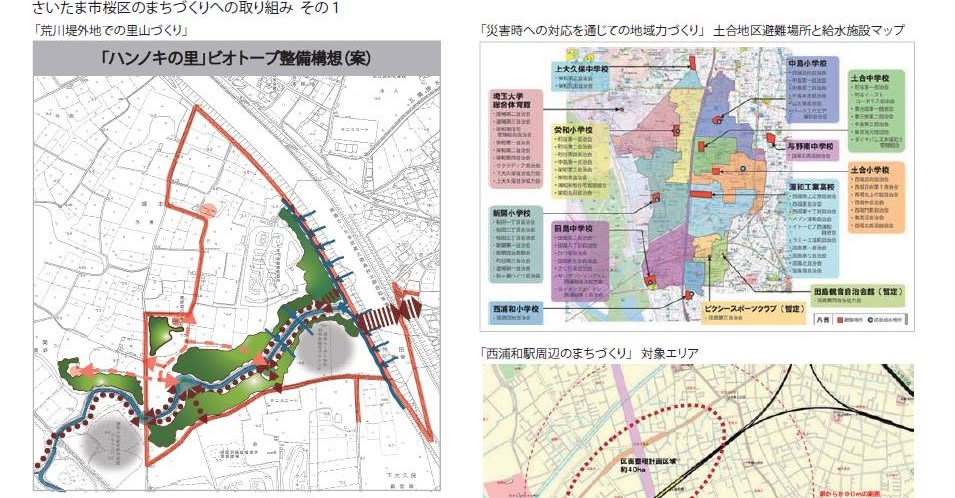

## 0148 — 2015-03-13 — 太田 一穂

- 投稿ID: 357944131073399
- 投稿URL: https://www.facebook.com/groups/186097664924714/posts/357944131073399/
- 要約: そろそろお花見の季節ですね。 思えばCode for SAITAMA最初のイベントもお花見時期の大宮（公園）マッピングパーティーでした。 3/29にCIVIC TECH FORUMがありますので、今年は4月4日（土）にお花見＆マッピングパーティ＆Ingressな集いを開こうと思います。
- コメント要約: CIVIC TECH FORUM 2015 WIRED.JP 3/29開催！ CIVIC TECH FORUM 2015 powered by WIRED 3/29開催！

そろそろお花見の季節ですね。
思えばCode for SAITAMA最初のイベントもお花見時期の大宮（公園）マッピングパーティーでした。
3/29にCIVIC TECH FORUMがありますので、今年は4月4日（土）にお花見＆マッピングパーティ＆Ingressな集いを開こうと思います。場所はさいたま市をちょっと離れて川越はどうかなと思ってます。ここぞという名所があれば書き込みよろしくお願いいたします！m(_ _)m

### コメント — 太田 一穂

CIVIC TECH FORUM 2015
http://wired.jp/special/ctf2015/
WIRED.JP
3/29開催！ CIVIC TECH FORUM 2015 powered by WIRED
3/29開催！ CIVIC TECH FORUM 2015 powered by WIRED
プレビューを削除

## 0149 — 2015-03-23 — 石山 太一

- 投稿ID: 362125897321889
- 投稿URL: https://www.facebook.com/groups/186097664924714/posts/362125897321889/
- 要約: 本日のCode for Saitama 出席の皆さん、お疲れ様でした。私は他の会議とトリプルヘッダーで中座しましたが、取れて良かったです！ お疲れ様でした！
- コメント要約: ありがとうございます。これからが真剣勝負ですね。 実は昨日の、もう１件も絡んでます。簡単なアプリの開発やUIのアイデアなど、コラボをお願いいたします。 ありがとうございます。

本日のCode for Saitama 出席の皆さん、お疲れ様でした。私は他の会議とトリプルヘッダーで中座しましたが、取れて良かったです！　お疲れ様でした！

### コメント — 後藤 真太郎

ありがとうございます。これからが真剣勝負ですね。

### コメント — 石山 太一

実は昨日の、もう１件も絡んでます。簡単なアプリの開発やUIのアイデアなど、コラボをお願いいたします。

### コメント — 古田武士

ありがとうございます。

### コメント — 石山 太一

と言いつつ、私はこのだび異動になりました。中央区総務課で、総務・防災が担当です。落ち着いたら自治連の皆さん集めて、DIGからのマッピングなんかもいいですねぇ~

### コメント — 後藤 真太郎

防災ですか。是非、協働型訓練にご参加いただけると嬉しいです。杉戸市で行っている訓練。多い時は！60のNPO、350人参加してます。

### コメント — 石山 太一

やりましょう！　自治会に働きかけてみます！

## 0150 — 2015-03-23 — 太田 一穂

- 投稿ID: 362185767315902
- 投稿URL: https://www.facebook.com/groups/186097664924714/posts/362185767315902/
- 要約: 【お花見イベント】 来週末はCIVIC TECH FORUM 2015、 4/11はArduinoワークショップがありますので その間を縫って、今年は川越でお花見、マッピングパーティー、Ingressイベントを行います。
- コメント要約: （コメントなし）

【お花見イベント】
来週末はCIVIC TECH FORUM 2015、
4/11はArduinoワークショップがありますので
その間を縫って、今年は川越でお花見、マッピングパーティー、Ingressイベントを行います。
Code for SAITAMA、今年はさいたま市を越えて埼玉県全体に広げていきたいですね。
https://www.facebook.com/events/1418239738488078/
2015/04/04(土)
Code for SAITAMA 川越お花見マッピングパーティーポータルハッカソン
埼玉県 川越市

## 0151 — 2015-03-25 — 後藤 真太郎

- 投稿ID: 362851060582706
- 投稿URL: https://www.facebook.com/groups/186097664924714/posts/362851060582706/
- 要約: 川崎市のWi-Fi整備方針検討結果が出ました。さいたま市にも適用可能な部分が多いので是非ご一読ください。オープンデータ、バスロケ、ご近所マッピング、、、Code for SAITAMAの出番が多くなりそうですね。
- コメント要約: 昨年のハッカソンで出たアイデアの方が新規性があるように思います。企画書にしたらどうでしょう？ ライティング人員を増やしましょう。 皆さん、周りに該当のプロボノいませんか？

川崎市のWi-Fi整備方針検討結果が出ました。さいたま市にも適用可能な部分が多いので是非ご一読ください。オープンデータ、バスロケ、ご近所マッピング、、、Code for SAITAMAの出番が多くなりそうですね。
CITY.KAWASAKI.JP
川崎市：「かわさきWi－Fi整備方針」検討結果の報告について

### コメント — 後藤 真太郎

昨年のハッカソンで出たアイデアの方が新規性があるように思います。企画書にしたらどうでしょう？

### コメント — とよしま 亮介

ライティング人員を増やしましょう。
皆さん、周りに該当のプロボノいませんか？

## 0152 — 2015-03-26 — 土井 裕之

- 投稿ID: 363178973883248
- 投稿URL: https://www.facebook.com/groups/186097664924714/posts/363178973883248/
- 要約: このニュースは、 当団体としては、 どう見ますか？
- コメント要約: znet townのIDがどういうライセンスで価格が知りたいですね。 うちの本家の地図エンジン使ってくれると嬉しいですが。 でも、znet townと言うことはweb用でなくて庁内のクライアントサーバーシステムでの利用ということなので直接的には競合しません。

このニュースは、
当団体としては、
どう見ますか？
http://s.response.jp/article/2015/03/26/247464.html

### コメント — 古田武士

znet townのIDがどういうライセンスで価格が知りたいですね。
うちの本家の地図エンジン使ってくれると嬉しいですが。

### コメント — 古田武士

でも、znet townと言うことはweb用でなくて庁内のクライアントサーバーシステムでの利用ということなので直接的には競合しません。

### コメント — 古田武士

複製許可の拡大解釈で何かcode for SAITAMAの地図作成に応用できたらいいですね。

### コメント — 後藤 真太郎

災害の時に常に行われていることですので復興期の前までは影響はないと思います。が、復興期に入ると金額が発生しますので被災県はそこでびっくりします。情報ボランティアが介入して済むならいいのですが、データ形式が公開されないので数百万のツールを買わされたりした経験があります。タダほど高いものは無いとはこのことです。ゼンリンだけに頼らず、家屋図があるならこのメンテナンスを平時の業務のなかで全庁的に行なうような工夫をしなければゼンリンに足下を見られます。ゼンリンのデータで罹災証明できればいいですがどうせ現地に行く必要がありますので考えものです。法的な家屋の図面は税の業務で使ってますので行政の持つデータより精度がいいものはなく、ゼンリンも行政が作った都市計画基本図をなぞって作っているに過ぎません。行政のデータや、国土地理院の基盤地図情報を上手く使う仕組みを運用する必要があります。埼玉では埼玉県GIS普及推進研究会がしどうしてますが他のとの調整が必要になったり、専門職が置けないのでなかなか浸透しません。私が、Code for を提案した理由の一つでもあります。

### コメント — 後藤 真太郎

東日本大震災でゼンリンの地図と震災後の空中写真を重ね合わせで内閣府が半壊、全壊の判断をするために、GISを持っている大学が呼び出され、30万戸のデータをとりました。うちの大学は30人のボランティアを集めて7万戸のデータを作りました。緊急時の被害戸数の把握にはいいですが罹災証明には使えませんので事前の準備が必要です。是非、議会で発言していただけましたら嬉しいです。

### コメント — 土井 裕之

古田さん、後藤さん、ありがとうございます。

## 0153 — 2015-04-26 — 安部 邦昭

- 投稿ID: 374163142784831
- 投稿URL: https://www.facebook.com/groups/186097664924714/posts/374163142784831/
- 要約: まだよく読んでいませんが、こんな記事がありました。 オープンガバメントで住民サービスが向上 - 先進自治体に学ぶICT活用法 SALESFORCE.COM オープンガバメントで住民サービスが向上 - 先進自治体に学ぶICT活用法
- コメント要約: 担当からすればオープンガバメント、オープンデータって迷惑な話なんですが、それをして評価されるようにしなければいけませんね。そんな簡単に評価制度は変更できないし、、、ここが難しい所です。

まだよく読んでいませんが、こんな記事がありました。
オープンガバメントで住民サービスが向上　- 先進自治体に学ぶICT活用法
SALESFORCE.COM
オープンガバメントで住民サービスが向上　- 先進自治体に学ぶICT活用法

### コメント — 後藤 真太郎

担当からすればオープンガバメント、オープンデータって迷惑な話なんですが、それをして評価されるようにしなければいけませんね。そんな簡単に評価制度は変更できないし、、、ここが難しい所です。先ずは、オープンデータって何なのか市民レベルでわかるようにすることですが、5374や千葉レポのように先ず市民の目に触れる部分から手をつけるのは正解だと思います。

### コメント — 酒井 千富

少し前にディスクロージャーが話題になってましたが、オープンガバメントが同じ轍を踏まないようにするには、後藤さんが言われるように市民の評価が重要ですね。
データをオープンにすることでクレームや批判を受けるだけでは、役所の方も萎縮して自己防衛に走ってしまい、かえって逆効果になたりします。

### コメント — 後藤 真太郎

GISに係る行政コストを下げるために12年前に埼玉県GIS普及推進研究会を作りデータ流通を浸透させるためにCode forに係わってますので本丸は行政コストの効率化、オープンガバメントなんですが先は長いですね。

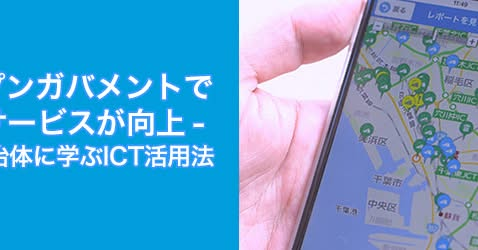

## 0154 — 2015-04-27 — 古田武士

- 投稿ID: 374357246098754
- 投稿URL: https://www.facebook.com/groups/186097664924714/posts/374357246098754/
- 要約: Code for SAITAMAの古田です。 ネパールの地震をうけて、HOTが立ち上がっています。 JOSMの使い方がわかる方はご協力ください。 4/29 13:00から ７Fにて簡単ではありますが、JOSMの使い方及びHOTへの参加の仕方の講習会を行います。
- コメント要約: JOSMでなくてIDというWEBアプリで編集することも可能ですよ 確かにそうですね。 今回のネパールはBingだと雲に隠れた部分が多いのでMapbox 衛星写真をつかうのでIDとだとレイヤーの設定とかがしんどいのでJOSMに限定しています。

Code for SAITAMAの古田です。
ネパールの地震をうけて、HOTが立ち上がっています。
JOSMの使い方がわかる方はご協力ください。
http://tasks.hotosm.org/
4/29 13:00から ７Fにて簡単ではありますが、JOSMの使い方及びHOTへの参加の仕方の講習会を行います。あくまでも、任意でのご参加ですのでイベント等は建てずお好きな時間に来ていただけたら結構です。
僕は、終日７Fにいる予定です。
TASKS.HOTOSM.ORG
OSM Tasking Manager -

### コメント — 嘉山 陽一

JOSMでなくてIDというWEBアプリで編集することも可能ですよ

### コメント — 古田武士

確かにそうですね。

### コメント — 古田武士

今回のネパールはBingだと雲に隠れた部分が多いのでMapbox 衛星写真をつかうのでIDとだとレイヤーの設定とかがしんどいのでJOSMに限定しています。

### コメント — 嘉山 陽一

背景図切り替えはここのチェックボックスだけですよ

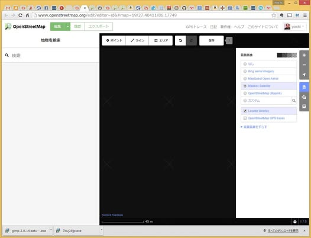

### コメント — 古田武士

なるほど、いちいち、カスタムレイヤーを入力するものだと思っていました。

### コメント — 後藤 真太郎

2次災害に備えSRTMで累積水量マップを作ろうとしてますが精度が高いDEMデータご存知ですか？

### コメント — 後藤 真太郎

Code for SAITAMAt担当の地域はありますか？

### コメント — 古田武士

当日のHOTの状況を見て決めたいと思います。

### コメント — 後藤 真太郎

地域も重要ですがテーマとして、文化財の破壊状況を集合知で集めたらどうでしょう。お釈迦様の聖地テラウラコッタが気になります。

## 0155 — 2015-05-07 — 酒井 千富

- 投稿ID: 377298282471317
- 投稿URL: https://www.facebook.com/groups/186097664924714/posts/377298282471317/
- 要約: 地理院でこんな公簿をしているのですね。避難誘導など先日のオープンデータハッカソンでアプリを作りませんでしたっけ？ GSI.GO.JP 防災アプリの公募を２７年度も実施｜国土地理院 国土地理院ホームページではJavaScriptを使用しています。
- コメント要約: むー、実証実験が鎌倉市ですかー。かなり汎用性が必要になりそうですね

地理院でこんな公簿をしているのですね。避難誘導など先日のオープンデータハッカソンでアプリを作りませんでしたっけ？
GSI.GO.JP
防災アプリの公募を２７年度も実施｜国土地理院
国土地理院ホームページではJavaScriptを使用しています。すべての機能をご利用いただくにはJavascriptを有効にしてください。

### コメント — 萩原 崇之

むー、実証実験が鎌倉市ですかー。かなり汎用性が必要になりそうですね

## 0156 — 2015-05-10 — 酒井 千富

- 投稿ID: 378210142380131
- 投稿URL: https://www.facebook.com/groups/186097664924714/posts/378210142380131/
- 要約: 今日は朝からイベントですが、昨晩（明朝）巨大多重CFづくりに参加・・・ 群馬、新潟、長野合同オペレーションでした( )b 写真の説明はありません。. 写真の説明はありません。
- コメント要約: このオぺーレーション毎週木曜日の14:40-17:40のリモートセンシング実習と終了後の大学で行うモクモク会で取り上げようと思います。アクティブラーニングの題材として、クライシスマッピングやネパール支援、イングレス等を取り上げてます。

今日は朝からイベントですが、昨晩（明朝）巨大多重CFづくりに参加・・・
群馬、新潟、長野合同オペレーションでした(
)b
写真の説明はありません。. 写真の説明はありません。

### コメント — 後藤 真太郎

このオぺーレーション毎週木曜日の14:40-17:40のリモートセンシング実習と終了後の大学で行うモクモク会で取り上げようと思います。アクティブラーニングの題材として、クライシスマッピングやネパール支援、イングレス等を取り上げてます。

### コメント — 酒井 千富

イングレスから生まれるコミュの性格やバーチャルがリアルに結び付くことでより地域を意識した活動など興味深い現象ですよね。
大学での講義も一度、受講したいです(^^ゞ
実際のオペでは通信ツール、位置情報共有ツールなどを駆使し目的の共有や命令系統などＩＣＳに通じるところもあり、普段の訓練になりそうだなぁって思ってます。

### コメント — 後藤 真太郎

位置情報共有ツールって何を使ったんでしょう？

### コメント — 後藤 真太郎

リモートセンシング実習ではネパール大地震の評価をとりあげてます。EARDS、ArcGIS10が60ライセンスありそれらを使ってます。いつでもどうぞ。

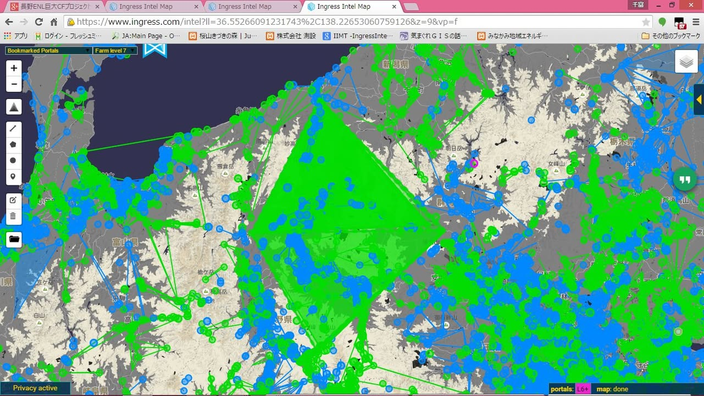

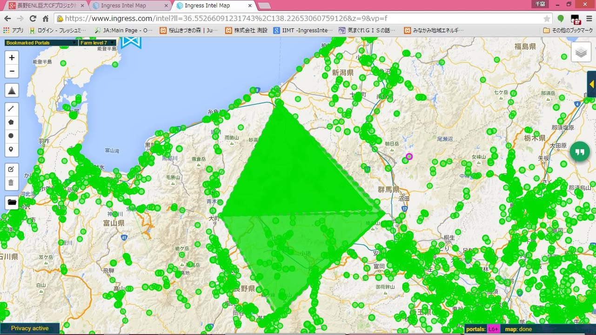

## 0157 — 2015-05-11 — 安部 邦昭

- 投稿ID: 378417719026040
- 投稿URL: https://www.facebook.com/groups/186097664924714/posts/378417719026040/
- 要約: 今朝ですが、こんなニュースがありました。 詳細が分かりませんが、自治体に対してのみの公開なのでしょうか？ 地方創生実現に向けビッグデータ充実へ NHKニュース WWW3.NHK.OR.JP 地方創生実現に向けビッグデータ充実へ NHKニュース
- コメント要約: 今、話題のRESASですね。 モダンブラウザでのアクセスが必要ですが（Chromeが指定されています）、個人でもみることができる部分もあります。元になったデータを公開して欲しいですが、このシステムを利用した何かを考えるアイデアソンとか面白そうですね。

今朝ですが、こんなニュースがありました。
詳細が分かりませんが、自治体に対してのみの公開なのでしょうか？
地方創生実現に向けビッグデータ充実へ　NHKニュース
WWW3.NHK.OR.JP
地方創生実現に向けビッグデータ充実へ　NHKニュース

### コメント — 柴田 重臣

今、話題のRESASですね。
モダンブラウザでのアクセスが必要ですが（Chromeが指定されています）、個人でもみることができる部分もあります。元になったデータを公開して欲しいですが、このシステムを利用した何かを考えるアイデアソンとか面白そうですね。
https://resas.go.jp/
RESAS.GO.JP
RESAS -地域経済分析システム-
RESAS -地域経済分析システム-

## 0158 — 2015-05-13 — 後藤 真太郎

- 投稿ID: 378895305644948
- 投稿URL: https://www.facebook.com/groups/186097664924714/posts/378895305644948/
- 要約: 5/23 熊谷アイデアソン -日本一熱い熊谷の夏をHackしよう- を開催します。特にうちわ祭、CoolSareを盛り上げるアイデアを募集します。 是非、ご参加ください。
- コメント要約: （コメントなし）

5/23 熊谷アイデアソン -日本一熱い熊谷の夏をHackしよう- を開催します。特にうちわ祭、CoolSareを盛り上げるアイデアを募集します。https://goo.gl/Cje9db　是非、ご参加ください。

## 0159 — 2015-05-15 — 安部 邦昭

- 投稿ID: 379556338912178
- 投稿URL: https://www.facebook.com/groups/186097664924714/posts/379556338912178/
- 要約: こんなのがあるそうです！ イベント告知★INGRESS × 地方自治体「INGRESSで観光振興ができるって本当ですか？」(定員100名) KAKERU.ME イベント告知★INGRESS × 地方自治体「INGRESSで観光振興ができるって本当ですか？
- コメント要約: 安部さん 情報ありがとうございます。会社休めたら行ってみたいと思います。横須賀市の担当者の講義興味あります。 参加予定(^-^)/

こんなのがあるそうです！
イベント告知★INGRESS × 地方自治体「INGRESSで観光振興ができるって本当ですか？」(定員100名)
KAKERU.ME
イベント告知★INGRESS × 地方自治体「INGRESSで観光振興ができるって本当ですか？」(定員100名)

### コメント — 渡辺 潤

安部さん
情報ありがとうございます。会社休めたら行ってみたいと思います。横須賀市の担当者の講義興味あります。

### コメント — 加藤 貴文

参加予定(^-^)/

## 0160 — 2015-05-23 — 酒井 千富さんは後藤 真太郎さんと一緒にいます。

- 投稿ID: 383279635206515
- 投稿URL: https://www.facebook.com/groups/186097664924714/posts/383279635206515/
- 要約: 酒井 千富 立正大学でのアイデアソン、はじまり～— 後藤 真太郎さんと一緒です。
- コメント要約: 行けなくてすみません。

酒井 千富
立正大学でのアイデアソン、はじまり～— 後藤 真太郎さんと一緒です。

### コメント — 横田 良一

行けなくてすみません。

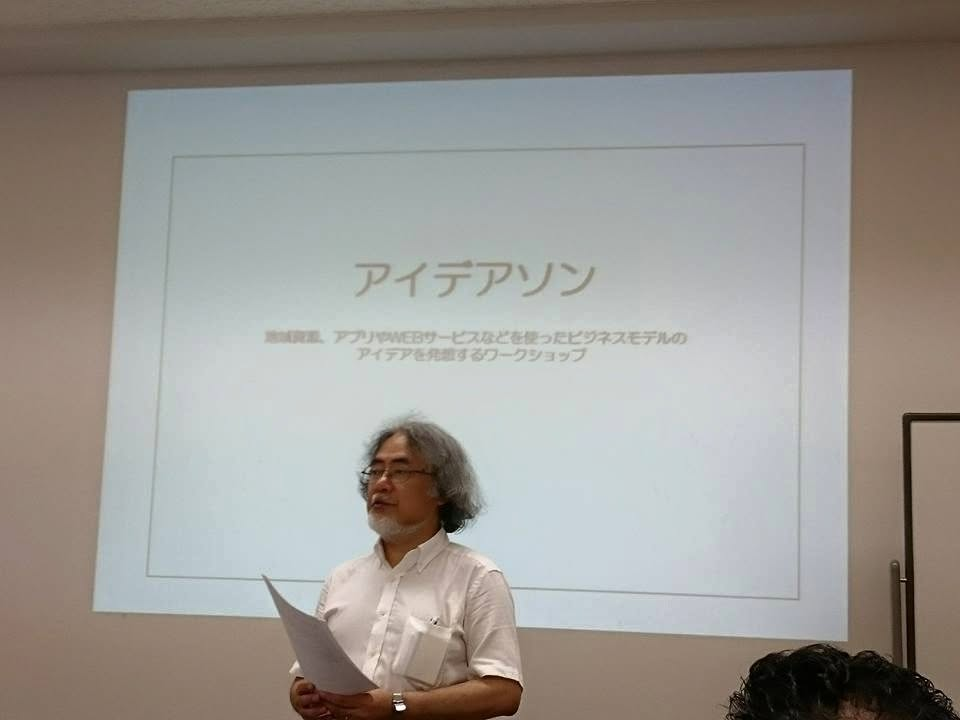

## 0161 — 2015-05-27 — 後藤 真太郎

- 投稿ID: 384570808410731
- 投稿URL: https://www.facebook.com/groups/186097664924714/posts/384570808410731/
- 要約: 今週末、浦和埼玉会館で地方創生について、地域情報化に非常に理解のある牧慎太郎氏(総務省)に講演していただきます。是非、参考にしてください。
- コメント要約: 行きたいのですが、お昼に予定が(涙)よろしくお伝えください。 参加したいのですが、伺えません。残念です。 残念ですね。牧氏は地域情報化のプロジェクトの推進者で、地域SNS推進者、ユーザでもあります。

今週末、浦和埼玉会館で地方創生について、地域情報化に非常に理解のある牧慎太郎氏(総務省)に講演していただきます。是非、参考にしてください。http://hibinokeiko.blog.jp/archives/31525007.html

### コメント — 天野 徹

行きたいのですが、お昼に予定が(涙)よろしくお伝えください。。。

### コメント — 古川 純子

参加したいのですが、伺えません。残念です。

### コメント — 後藤 真太郎

残念ですね。牧氏は地域情報化のプロジェクトの推進者で、地域SNS推進者、ユーザでもあります。地域情報化と地方創生の関係の説明を説明していただけると思います。

### コメント — 後藤 真太郎

牧氏の話を受けて埼玉県ではどうかとう話題を地元から、さらに、埼玉県GIS普及推進研究会の推薦で電子国土賞を受賞したスマホで道路のデコボコを計測するシステムの話をしていただくことになってます。地域情報化を使った地域創生、正にシビックテックの目指すところであり、これをCode for SAITAMAがやらねば誰がやるの？ですね。

### コメント — 後藤 真太郎

夢物語・フニャラフニャラで何となく元気が出るような地域創生の話ではなく、具合的な地域課題を解決するICTによる地域創生にシビックテックをどう活かすか考えるいい機会。是非、ご参加下さい。

### コメント — 加藤 貴文

ぜひ、勉強にお伺いしたいのですが可能でしょうか？
また、開催の詳細はありますか？

### コメント — 後藤 真太郎

https://www.facebook.com/events/431065813740769/　です。宜しくお願いします。

### コメント — 後藤 真太郎

地方創生を商品券販売と思い込んでいる方にもお薦め。

### コメント — 渡辺 潤

シビックテックと地方創世のご講義、勉強させていただければと思います。空前絶後の機会とありましたので、楽しみにしています。

### コメント — 後藤 真太郎

十分その価値はあるかと。しかも無料。

## 0162 — 2015-05-27 — 後藤 真太郎

- 投稿ID: 384591171742028
- 投稿URL: https://www.facebook.com/groups/186097664924714/posts/384591171742028/
- 要約: トリエンナーレでは今年度からTANeFUNeを使ったイベントが始まります。Code for SAITAMAにもGISを使ったアイデアを求められています。共に考えませんか？
- コメント要約: （コメントなし）

トリエンナーレでは今年度からTANeFUNeを使ったイベントが始まります。Code for SAITAMAにもGISを使ったアイデアを求められています。共に考えませんか？
https://www.facebook.com/TANeFUNe.Maizuru?ref=profile
TANeFUNe

## 0163 — 2015-05-28 — 太田 一穂

- 投稿ID: 384952761705869
- 投稿URL: https://www.facebook.com/groups/186097664924714/posts/384952761705869/
- 要約: 来週のCode for Japan 井戸端会議は、初の浦和開催となります。 2015/06/04(木) 第75回 Code for Japan 井戸端会議 さいたま市 参加者7人・興味あり16人
- コメント要約: （コメントなし）

来週のCode for Japan 井戸端会議は、初の浦和開催となります。
https://www.facebook.com/events/397586270445990/
2015/06/04(木)
第75回 Code for Japan 井戸端会議
さいたま市
参加者7人・興味あり16人

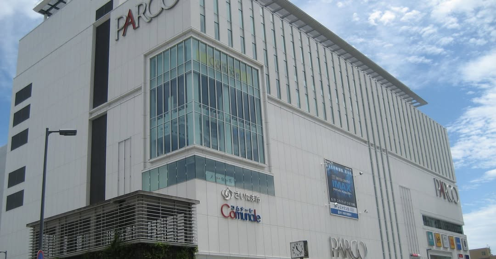

## 0164 — 2015-06-01 — 後藤 真太郎

- 投稿ID: 386670191534126
- 投稿URL: https://www.facebook.com/groups/186097664924714/posts/386670191534126/
- 要約: 【トリエンナーレ・スタディーツアー】 トリエンナーレに向けて、Code for SAITAMAの活動に期待がかかっております。イベントは2016年度ですが、今年からスタディーツアーを実施し、本イベントに出展してくるアーティストに情報提供するというものです。
- コメント要約: スリバチ学会と一緒に浦和のコミセン裏あたりのダイダラボッチ伝説のある地形調査を行い、DEMデータの提供、見沼田んぼの歴史的建造物（伏越、掛渡井、関枠）の位置の確認とヒトとの関係、微地形調査、、、、等どうでしょうか？

【トリエンナーレ・スタディーツアー】
トリエンナーレに向けて、Code for SAITAMAの活動に期待がかかっております。イベントは2016年度ですが、今年からスタディーツアーを実施し、本イベントに出展してくるアーティストに情報提供するというものです。
Code for SAITAMAはこの中で、
・研究会のなかでのアイディアソンや、アイディアソン、ハッカソンなどの開催。
・2016年度にも自主的な活動継続により、アプリ開発などトリエンナーレを盛り上げる活動。
本年度については、さいたま市と行うアイデアソンハッカソンをオープンデータを使ったトリエンナーレ仕様を含むようにすれば実績はでるかと思っています。
つきまして、
①Code for SAITAMAとしてこれにかかわるかどうか？
②どのようにかかわるか？
③アイデアソン、ハッカソンとトリエンナーレをどうするあわせるか？
④その他
につきご意見下さい。
地図作家の深澤さんも参加されており、「埼玉スリバチ学会」にもお声かけしてはというアイディアも上がっています。
http://saitamasuribachi.blog.jp/archives/cat_582656.html
深澤さんは、埼玉スリバチ学会のもととなった「東京スリバチ学会」にご縁があり、連携のタネがあるかもしれないとのことです。
http://www.amazon.co.jp/dp/4862488234
埼玉スリバチ学会のWeb情報を拝見すると・・・
2015埼玉スリバチ学会スケジュール
2015年計画の予定を変更しました。基本的に毎月3週目の土曜日にしました。
5月16日(土)…指扇支台Ⅰフィールドワーク（西大宮スタート）
6月21日(日)…与野支台フィールドワーク【6月13日
6月6日
6月21日から変更）
7月18日(土)…指扇支台Ⅱフィールドワーク（指扇駅スタート）
9月19日(土)…鳩ヶ谷支台と赤山陣屋（仮）
10月17日(土)…未定（企画募集中）
11月21日(土)…未定（企画募集中）
12月19日(土)…未定（企画募集中）
その他、ご要望によりイベントを開催します！ 下見なしになる可能性があります。知っている方が参加してくださると幸いです。
とあり、スタディーズと絡んでもらえたら面白そうでもあります。
このような情報も含め、第一回研究会では、10月までの研究会各回のテーマ仮決めと、スタディーズに加わってもらえたら面白そうな人や組織のリストアップをする予定となってます。
埼玉スリバチ学会Blog　Saitama　Suribachi Society Blogs
SAITAMASURIBACHI.BLOG.JP
埼玉スリバチ学会Blog　Saitama　Suribachi Society Blogs

### コメント — 後藤 真太郎

スリバチ学会と一緒に浦和のコミセン裏あたりのダイダラボッチ伝説のある地形調査を行い、DEMデータの提供、見沼田んぼの歴史的建造物（伏越、掛渡井、関枠）の位置の確認とヒトとの関係、微地形調査、、、、等どうでしょうか？

### コメント — 吉永 篤史

トリエンナーレの種船プロジェクトでは、元荒川の和船祭りとのコラボも調整中のようです。見沼の龍神伝説は見沼田んぼ建設反対農民の創話という説もあり興味深いです。

### コメント — 後藤 真太郎

運営委員会と間違えてアップしてしましましたので内容の一部を修正しました。^^;;

### コメント — 後藤 真太郎

大戸第六展神社界隈にもいわつき和船祭りがあるんですね。九頭竜講は残ってますか？

### コメント — 後藤 真太郎

元荒川和船祭り　https://www.youtube.com/watch?v=RI8JJgB4pYw
YOUTUBE.COM
元荒川和船まつり（H25.08.18） 乗船体験
元荒川和船まつり（H25.08.18） 乗船体験

### コメント — 後藤 真太郎

種船の移動ルートに沿った情報が整理されているといいですね。

### コメント — 後藤 真太郎

大宮高鼻の氷川神社参道は大宮台地の中央にあって、大宮台地の中の見沼谷地と高沼谷地を参道と境内の背後と前面に祭祀している。氷川神社一の鳥居は高沼谷地支流の北端に位置し、そこからは遠く南の荒川の低地から江戸王子の山々の一望があった。（見沼田んぼの景観学）・・・・新都心周辺では、こんな原風景を再現したい。

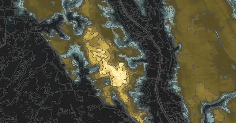

## 0165 — 2015-06-02 — 後藤 真太郎

- 投稿ID: 387036118164200
- 投稿URL: https://www.facebook.com/groups/186097664924714/posts/387036118164200/
- 要約: 6/6-7に立正大学熊谷キャンパスにて祭り、Cool Shareをテーマにしたハッカソンを開催します。プログラムを組まなくても色んな参加方法がありますので是非ご参加ください。
- コメント要約: アイデアソンで評価が高かったアイデアでチームビルディングの後、以下の3つにまとめられました。この展開からハッカソンを始めます。一部は今年のうちわ祭りで使われるかも。

6/6-7に立正大学熊谷キャンパスにて祭り、Cool Shareをテーマにしたハッカソンを開催します。プログラムを組まなくても色んな参加方法がありますので是非ご参加ください。
https://www.facebook.com/events/1160003510683865/
申し込みは、https://goo.gl/RmGbp9
2015/06/06(土)
熊谷ハッカソン -日本一熱い熊谷の夏をHackしよう-
埼玉県 熊谷市
後藤 真太郎さんから招待がありました

### コメント — 後藤 真太郎

アイデアソンで評価が高かったアイデアでチームビルディングの後、以下の3つにまとめられました。この展開からハッカソンを始めます。一部は今年のうちわ祭りで使われるかも。①位置情報ゲームと連動して地域資源を紹介する「熊谷ローカルイングレス」②うちわ祭で現在地から山車・屋台までのルートを案内する「山車レーダー」③動画配信サイトを介してうちわ祭に仮想参加する「超うちわ祭会議」

### コメント — 後藤 真太郎

今日の埼玉新聞をご覧ください。

## 0166 — 2015-06-08 — 後藤 真太郎

- 投稿ID: 389008777966934
- 投稿URL: https://www.facebook.com/groups/186097664924714/posts/389008777966934/
- 要約: 熊谷ハッカソン、菅間さんにまとめていただきました。ありがとうございます。 熊谷ハッカソン@立正大学まとめ CHIHOCHU.JP 熊谷ハッカソン@立正大学まとめ
- コメント要約: 菅間さんありがとうございます。あとで読ませていただきます。 ＞皆様 認識の違い等がありましたらご指摘ください。

熊谷ハッカソン、菅間さんにまとめていただきました。ありがとうございます。
熊谷ハッカソン@立正大学まとめ
CHIHOCHU.JP
熊谷ハッカソン@立正大学まとめ

### コメント — 渡辺 潤

菅間さんありがとうございます。あとで読ませていただきます。

### コメント — 菅間 紀夫

＞皆様
認識の違い等がありましたらご指摘ください。

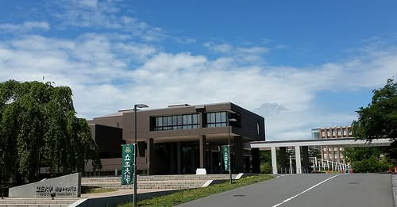

## 0167 — 2015-06-10 — 後藤 真太郎

- 投稿ID: 390162314518247
- 投稿URL: https://www.facebook.com/groups/186097664924714/posts/390162314518247/
- 要約: 6/6-7の熊谷ハッカソンで作った「熊谷ローカルイングレス」。Code for SAITAMAの古田さんの舵とりで開発されました。緑、青のマークはイングレスのポータルです。
- コメント要約: クールシェアの店舗、熊谷の史跡などとIntelMapの情報を同じ画面で重ねあわせることができればいいのですがIITCの敷居が高い ! せっかく古田さんに作っていただいたので、ローカルイングレス熊谷版の情報を補強・補充して行ければと思います。

6/6-7の熊谷ハッカソンで作った「熊谷ローカルイングレス」。Code for SAITAMAの古田さんの舵とりで開発されました。緑、青のマークはイングレスのポータルです。これにクールシェアの店舗、熊谷の史跡などを重ねあわせることができます。さらに、重ねあわせる情報は熊谷Wikiでどんどん更新できるという優れもの。こんなソフトが、集合知を繋ぎ合わせれば1日半で出来てしまうというのも凄いでしょう。
http://kumagaya.code4saitama.org/map.html
KUMAGAYA.CODE4SAITAMA.ORG
Kumagaya Local Ingress

### コメント — 後藤 真太郎

クールシェアの店舗、熊谷の史跡などとIntelMapの情報を同じ画面で重ねあわせることができればいいのですがIITCの敷居が高い !!

### コメント — 渡辺 潤

せっかく古田さんに作っていただいたので、ローカルイングレス熊谷版の情報を補強・補充して行ければと思います。また、フィールドワークやマッピングパーティーと組み合わせて発展できればと思います。

## 0168 — 2015-06-16 — 石山 太一

- 投稿ID: 392934967574315
- 投稿URL: https://www.facebook.com/groups/186097664924714/posts/392934967574315/
- 要約: 誰に連絡したらよいかわからないので。 後藤先生でよろしいでしょうか。 Ｄｉｇ(フィールドワークで)で、本日依頼が来ました。南区の３自治会合同での開催で、１０月頃、自治会長をはじめ２０人くらいで開催したいとのことです。
- コメント要約: 了解しました。日程調整させてください。 了解です。中心が自治会役員と防災士(防災アドバイサー)になります。また、さいたま市自主防災組織連絡会の会長にも声をかけておきます。

誰に連絡したらよいかわからないので。。。　後藤先生でよろしいでしょうか。
Ｄｉｇ(フィールドワークで)で、本日依頼が来ました。南区の３自治会合同での開催で、１０月頃、自治会長をはじめ２０人くらいで開催したいとのことです。
会場は、南区ですが浦和区の前地自治会のすぐ近くになります。

### コメント — 後藤 真太郎

了解しました。日程調整させてください。

### コメント — 石山 太一

了解です。中心が自治会役員と防災士(防災アドバイサー)になります。また、さいたま市自主防災組織連絡会の会長にも声をかけておきます。フィールドワークと少々の座学も欲しいとのこと。多目的ホールを予約してあるそうです。

### コメント — 後藤 真太郎

日程調整どうしましょう。

### コメント — 石山 太一

まず、実施日ですが、１０月１７日(土)でお願いしたいと連絡がありました。この日以外はなかなか調整がつかないとのこと。また、多目的室(小さい体育館)を取ってありますので、雨プロはそこでできると思います。いかがでしょうか？

### コメント — 後藤 真太郎

岩槻のマッピングパーティーがありますので日程調整できると助かります。

### コメント — 石山 太一

了解しました。問い合わせしてみます。

### コメント — 石山 太一

問い合わせたところ、いつが大丈夫か、ご提案くださいとのことです。空いている日程をいくつか提示し、決めたいと考えます。地区自治連合同なので、なかなか空いている日を明確に提示できない・・・　との事です。

### コメント — 後藤 真太郎

メッセージにて連絡させていただきました。よろしくお願いします。

## 0169 — 2015-06-20 — 後藤 真太郎

- 投稿ID: 395346590666486
- 投稿URL: https://www.facebook.com/groups/186097664924714/posts/395346590666486/
- 要約: NHKのニュースになりました。Code for SAITAMAも活動紹介、ブース展示してます。 WWW3.NHK.OR.JP 全国初 オープンデータ自治体サミット開催へ NHKニュース 少子高齢化が進むなか、介護や子育てなど地域課題の解決にオープンデータを積極的に活用していこうと、自治体関係者が集まって、取り組みの現状や課題…
- コメント要約: 450人の参加者が予定されているようです。関心の高さがわかります。

NHKのニュースになりました。Code for SAITAMAも活動紹介、ブース展示してます。
WWW3.NHK.OR.JP
全国初 オープンデータ自治体サミット開催へ　NHKニュース
少子高齢化が進むなか、介護や子育てなど地域課題の解決にオープンデータを積極的に活用していこうと、自治体関係者が集まって、取り組みの現状や課題…

### コメント — 後藤 真太郎

450人の参加者が予定されているようです。関心の高さがわかります。

## 0170 — 2015-06-25 — 後藤 真太郎

- 投稿ID: 399229853611493
- 投稿URL: https://www.facebook.com/groups/186097664924714/posts/399229853611493/
- 要約: オープンデータ自治体サミット 2015/6/24でのCode for SAITAMAの発表資料です。ご笑覧下さい。 【オープンデータ自治体サミット 2015/6/24】Code for SAITAMA発表資料 SLIDESHARE.NET 【オープンデータ自治体サミット 2015/6/24】Code for SAITAMA発表資料
- コメント要約: Code for SAITAMAの今までの経緯や今後の展望までわかるので、若い人に紹介する材料にシェアさせていただきますね。 後藤さん、昨日はありがとうございました！

オープンデータ自治体サミット 2015/6/24でのCode for SAITAMAの発表資料です。ご笑覧下さい。
【オープンデータ自治体サミット 2015/6/24】Code for SAITAMA発表資料
SLIDESHARE.NET
【オープンデータ自治体サミット 2015/6/24】Code for SAITAMA発表資料

### コメント — 山中 邦久

Code for SAITAMAの今までの経緯や今後の展望までわかるので、若い人に紹介する材料にシェアさせていただきますね。

### コメント — 関口 昌幸

後藤さん、昨日はありがとうございました！

### コメント — 後藤 真太郎

こちらこそお世話になりました。分科会でのフューチャーセッションの司会、素晴らしかったです。

## 0171 — 2015-07-02 — 後藤 真太郎

- 投稿ID: 404436539757491
- 投稿URL: https://www.facebook.com/groups/186097664924714/posts/404436539757491/
- 要約: 地域課題の解決促進を目指してーー経済産業省がスタートアップと自治体のマッチングイベントを開催
- コメント要約: （コメントなし）

地域課題の解決促進を目指してーー経済産業省がスタートアップと自治体のマッチングイベントを開催
http://thebridge.jp/2015/06/jipdec-event-startup

## 0172 — 2015-07-05 — 古田武士

- 投稿ID: 409516772582801
- 投稿URL: https://www.facebook.com/groups/186097664924714/posts/409516772582801/
- 要約: マッチングファンド事業第一弾として大宮盆栽村でマッピングパーティをおこないます。 再来年の世界盆栽大会にちなんだマッピングパーティです。 世界盆栽大会の詳細は以下になります。
- コメント要約: 申込みは まで。 PEATIX.COM Code for SAITAMA 大宮盆栽村マッピングパーティー Code for SAITAMA 大宮盆栽村マッピングパーティー ①「再来年は世界盆栽大会がある大宮盆栽村」→世界盆栽大会の会場は、さいたまスーパーアリーナ、大宮ソニックシティ、パレスホテル大宮、となっています。

マッチングファンド事業第一弾として大宮盆栽村でマッピングパーティをおこないます。
再来年の世界盆栽大会にちなんだマッピングパーティです。
世界盆栽大会の詳細は以下になります。
http://www.city.saitama.jp/004/001/001/p037950.html
大宮盆栽美術館の講義室を一日借りきって地域の情報をできるだけ深堀りしていこうとしう趣旨でOSMに登録することやLocalwikiに情報をまとめるなど他にはないマニアックなガイドマップができればいいなと思っています。
ぜひともみなさんのご参加待っています。
https://www.facebook.com/events/1448980108740546/
申込みはこちらにお願いします。
http://ptix.co/1ICw8kO

### コメント — 後藤 真太郎

https://www.facebook.com/events/1448980108740546/

### コメント — 後藤 真太郎

申込みは　http://ptix.co/1ICw8kO　まで。
PEATIX.COM
Code for SAITAMA 大宮盆栽村マッピングパーティー
Code for SAITAMA 大宮盆栽村マッピングパーティー

### コメント — 井上 拓巳

①「再来年は世界盆栽大会がある大宮盆栽村」→世界盆栽大会の会場は、さいたまスーパーアリーナ、大宮ソニックシティ、パレスホテル大宮、となっています。大宮盆栽美術館はサブ会場という扱いです。
②「盆栽美術館を一日借りきって」→正しくは、「大宮盆栽美術館の講座室を一日借りきって」です。
誤解が無いように念のためお伝えします。

### コメント — 井上 拓巳

http://www.city.saitama.jp/004/001/001/p037950.html
CITY.SAITAMA.JP
さいたま市／第8回世界盆栽大会inさいたま
さいたま市／第8回世界盆栽大会inさいたま

### コメント — 古田武士

了解しました。修正します。すみませんでした。

## 0173 — 2015-07-06 — 後藤 真太郎

- 投稿ID: 410764135791398
- 投稿URL: https://www.facebook.com/groups/186097664924714/posts/410764135791398/
- 要約: マッピングパーティーの成果が大会の成功に繋がりますようにしたいものです。 World Bonsai Friendship Federation
- コメント要約: （コメントなし）

マッピングパーティーの成果が大会の成功に繋がりますようにしたいものです。
World Bonsai Friendship Federation

## 0174 — 2015-07-08 — 後藤 真太郎

- 投稿ID: 413386262195852
- 投稿URL: https://www.facebook.com/groups/186097664924714/posts/413386262195852/
- 要約: 今年度、Code for SAITAMA （ がマッチングファンド事業でさいたま市と協働で行うオープンデータ利用のマッピングパーティーやアイデアソン、ハッカソンの事業実施スケジュールは以下のようになってます。
- コメント要約: このコメントは、シェアできないんですね。 加藤さん、シェア歓迎です。 ↑シェアボタンが表示されていないんですよね… 公開範囲の設定とか？ 横から失礼します。 非公開グループでの投稿なので、この投稿を引用する事はできないのだと思います。

今年度、Code for SAITAMA （https://www.facebook.com/groups/186097664924714/）
がマッチングファンド事業でさいたま市と協働で行うオープンデータ利用のマッピングパーティーやアイデアソン、ハッカソンの事業実施スケジュールは以下のようになってます。ご興味ある方、日程の確保お願いします。変更もありえますので、詳細はその都度確認ください。
① 第１回マッピングパーティー（まち歩き×ＩＴ）　詳細は別紙
内容：北区盆栽町の歴史を学び、まちなかの史跡・施設等を調査、マッピングする。
日時：2015年7月18日　13:00-17:00
会場：大宮盆栽美術館
② 第１回オープンデータアイデアソン
内容：トリエンナーレ等のイベントに伴う市内観光、まちづくり、子育て、介護を
テーマにしたアプリのアイデアを作る。
日時：2015年9月5日　13:00-17:00
会場：未定
③ 第１回オープンデータハッカソン
内容：トリエンナーレ等のイベントに伴う市内観光、まちづくりを主テーマにしたアプリ
を開発する。
日時：2015年9月12日　10:00-17:00
会場：未定
④ 第２回マッピングパーティー（まち歩き×ＩＴ）
内容：岩槻の歴史を学び、まちなかの史跡・施設等を調査、マッピングする。
日時：2015年10月17日　10:00-17:00
会場：岩槻本丸公民館（予定）
⑤ 第２回オープンデータアイデアソン
内容：子育て、介護を主テーマにしたアプリのアイデアを作る。
日時：2015年12月12日　10:00-17:00
会場：未定
⑥ 第２回オープンデータハッカソン
内容：子育て、介護を主テーマにしたアプリを開発する。
日時：2016年1月16日　13:00-17:00　17日　10:00-17:00
会場：未定

### コメント — 加藤 貴文

このコメントは、シェアできないんですね。

### コメント — 後藤 真太郎

加藤さん、シェア歓迎です。

### コメント — 加藤 貴文

↑シェアボタンが表示されていないんですよね…
公開範囲の設定とか？

### コメント — 安部 邦昭

横から失礼します。
非公開グループでの投稿なので、この投稿を引用する事はできないのだと思います。
cfsのfbページでも同じ内容を用意しますので、少々お待ちください。

### コメント — 安部 邦昭

後藤先生、「浦和市民活動～」ではなく、「さいたま市市民活動サポートセンター」です！

### コメント — 加藤 貴文

グループ自体が非公開だったんですね(^^)

### コメント — 安部 邦昭

加藤さん、こちらにご用意しました。
https://www.facebook.com/permalink.php?story_fbid=862153693838941&id=683681868352792

### コメント — 後藤 真太郎

修正ありがとうございます。会場は調整中ですので事前に確認お願いします。

## 0175 — 2015-07-09 — 古田武士

- 投稿ID: 413638872170591
- 投稿URL: https://www.facebook.com/groups/186097664924714/posts/413638872170591/
- 要約: 県のオープンデータにいらん規約がつきすぎていてオープンになっていないと、Code for SAITAMAのエージェント（協力者）の清水さんが指摘しています。CC BY SAと免責事項さえあればいいのになぜこうなった。
- コメント要約: オープンデータと言わない方が良かったのかと思いますが、、、そのうち、オープンデータの目的外使用禁止などと言われたりして。 去年の2014試行版では、それなりにオープンだったので(それでも規約多いけど)、担当者が変わったか試行版のデータカタログにクレームが入ったか、とにかく内部で変化があったのだと思われます。

県のオープンデータにいらん規約がつきすぎていてオープンになっていないと、Code for SAITAMAのエージェント（協力者）の清水さんが指摘しています。CC BY SAと免責事項さえあればいいのになぜこうなった。
SHIMZ.ME
埼玉県の「オープンデータ」がいろんな意味で凄い！
「オープンとはなんぞや？」という哲学的な問いすら浮かぶ事例をみかけたので記事にしてみた。 おさらい Open …

### コメント — 後藤 真太郎

オープンデータと言わない方が良かったのかと思いますが、、、そのうち、オープンデータの目的外使用禁止などと言われたりして。

### コメント — 清水正行

去年の2014試行版では、それなりにオープンだったので(それでも規約多いけど)、担当者が変わったか試行版のデータカタログにクレームが入ったか、とにかく内部で変化があったのだと思われます。
http://www.pref.saitama.lg.jp/.../saitamaken.../index.html
PREF.SAITAMA.LG.JP
埼玉県オープンデータカタログ（2014試行版）
埼玉県オープンデータカタログ（2014試行版）

### コメント — 後藤 真太郎

自治体の情報部門ってセキュリティー管理が主ですからその感覚を変えてもらわないと。知事選が近いので意見は聞いてもらえると思いますが。

### コメント — 星野 邦敏

あっ、これ、僕も思いました。オープンデータでは無いなと。

### コメント — 羽鳥 健太郎

オープンライセンスの勉強会をやればよかったと悔やまれます。今からでも遅くないので(遅いかな)、ぜひやりましょう。

### コメント — 清水正行

CC-BYで再公開されました。　https://www.pref.saitama.lg.jp/a0301/kouhoujouhou-data.html
PREF.SAITAMA.LG.JP
広報情報データの利用について
広報情報データの利用について

### コメント — 安部 邦昭

おっ、早かったですね！

## 0176 — 2015-07-19 — 後藤 真太郎

- 投稿ID: 416233235244488
- 投稿URL: https://www.facebook.com/groups/186097664924714/posts/416233235244488/
- 要約: 昨日のマッピングパーティーがニュースになりました。 大宮盆栽村で「マッピングパーティー」 地域を歩いて地図作り ／埼玉（みんなの経済新聞ネットワーク） - Yahoo!
- コメント要約: （コメントなし）

昨日のマッピングパーティーがニュースになりました。
大宮盆栽村で「マッピングパーティー」　地域を歩いて地図作り　／埼玉（みんなの経済新聞ネットワーク） - Yahoo!ニュース
HEADLINES.YAHOO.CO.JP
大宮盆栽村で「マッピングパーティー」　地域を歩いて地図作り　／埼玉（みんなの経済新聞ネットワーク） - Yahoo!ニュース

## 0177 — 2015-07-19 — Mihoko Hatanakaさんがアルバム「2015年7月18日(土) 大宮盆栽村マッピングパーティ」に貢献しました

- 投稿ID: 416272111907267
- 投稿URL: https://www.facebook.com/groups/186097664924714/posts/416272111907267/
- 要約: 写真の説明はありません。. 写真の説明はありません。. 写真の説明はありません。. 写真の説明はありません。. 写真の説明はありません。
- コメント要約: 大宮盆栽村マッピングパーティに参加された皆さん、お疲れ様でした。LocalWikiで使えそうな画像があれば、遠慮なくお使いください。 皆さま 昨日はありがとうございました。

写真の説明はありません。. 写真の説明はありません。. 写真の説明はありません。. 写真の説明はありません。. 写真の説明はありません。

### コメント — 羽鳥 健太郎

大宮盆栽村マッピングパーティに参加された皆さん、お疲れ様でした。LocalWikiで使えそうな画像があれば、遠慮なくお使いください。

### コメント — Mihoko Hatanaka

皆さま　昨日はありがとうございました。羽鳥さんの後に私の写真も追加させていただきました。石井さんの写真の後へ貼りました。お役に立てる物があればご利用下さい。

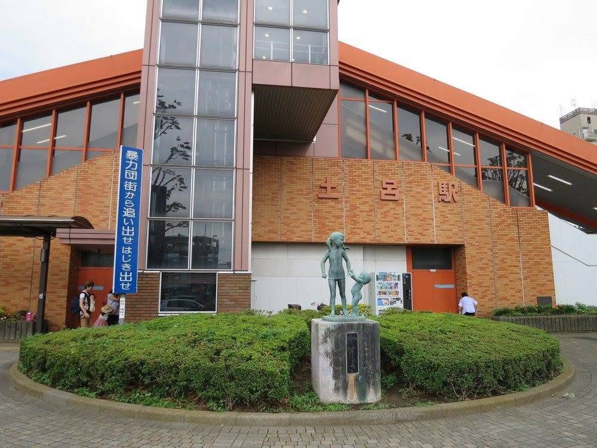

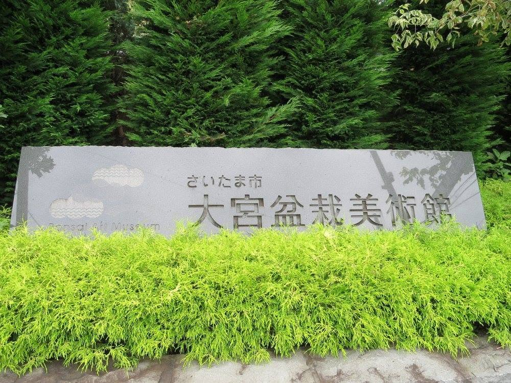

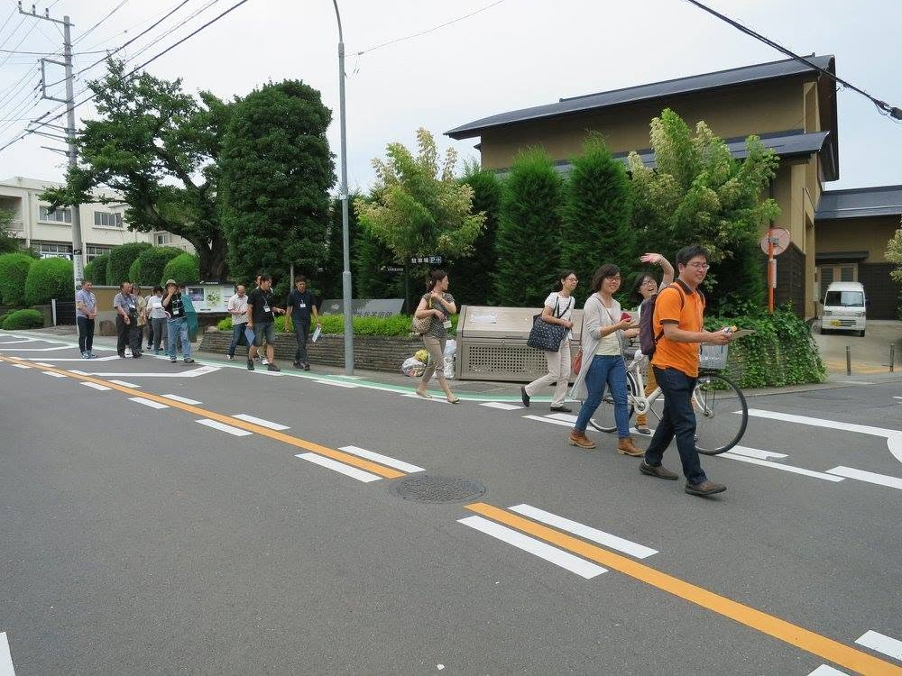

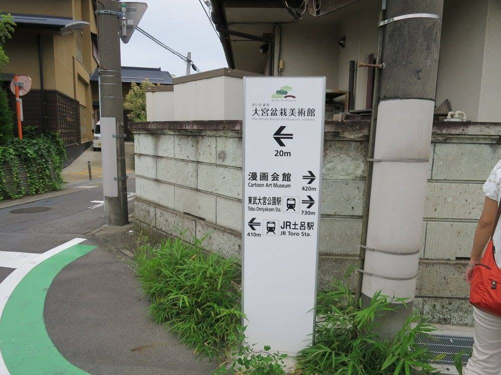

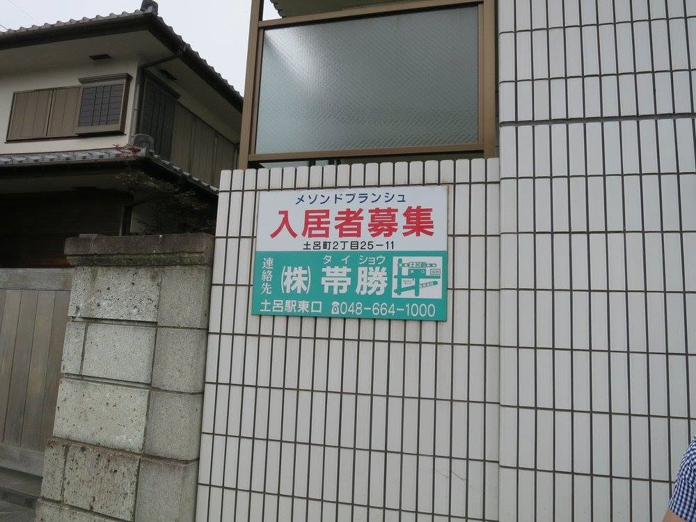

## 0178 — 2015-07-21 — 太田 一穂

- 投稿ID: 416747381859740
- 投稿URL: https://www.facebook.com/groups/186097664924714/posts/416747381859740/
- 要約: 今週木曜日のCode for Japan 井戸端会議は大宮のコワーキングスペースOffice7Fで開催されます。 2015/07/23(木) 第82回 Code for Japan 井戸端会議 さいたま市 参加者5人・興味あり8人
- コメント要約: （コメントなし）

今週木曜日のCode for Japan 井戸端会議は大宮のコワーキングスペースOffice7Fで開催されます。
2015/07/23(木)
第82回 Code for Japan 井戸端会議
さいたま市
参加者5人・興味あり8人

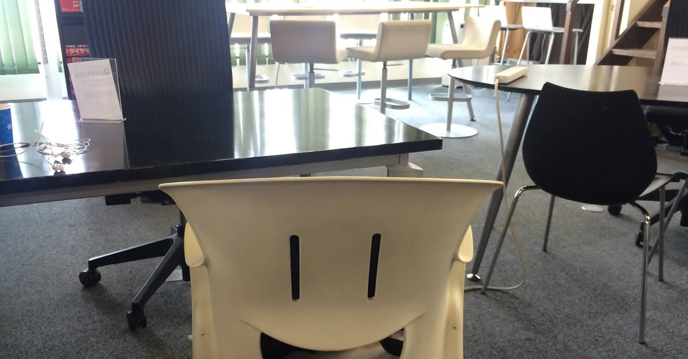

## 0179 — 2015-07-24 — 後藤 真太郎さんがグループのイベントを作成しました。

- 投稿ID: 417411725126639
- 投稿URL: https://www.facebook.com/groups/186097664924714/posts/417411725126639/
- 要約: 第１回オープンデータアイデアソン2015 - さいたま市マッチングファンド補助事業- 2015/09/05(土) 第１回オープンデータアイデアソン2015 - さいたま市マッチングファンド補助事業- さいたま市 後藤 真太郎さん、他友達10人が参加しました
- コメント要約: （コメントなし）

第１回オープンデータアイデアソン2015　- さいたま市マッチングファンド補助事業-
2015/09/05(土)
第１回オープンデータアイデアソン2015　- さいたま市マッチングファンド補助事業-
さいたま市
後藤 真太郎さん、他友達10人が参加しました

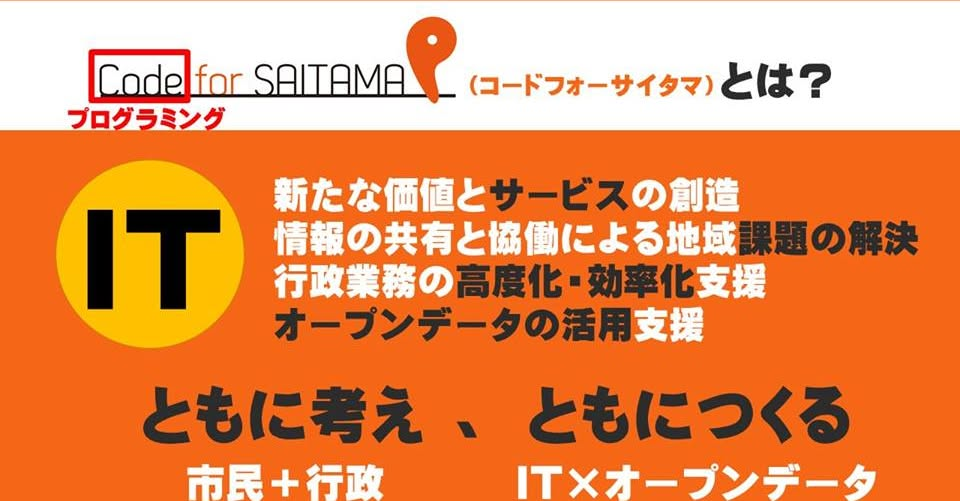

## 0180 — 2015-07-24 — 後藤 真太郎さんがグループのイベントを作成しました。

- 投稿ID: 417414891792989
- 投稿URL: https://www.facebook.com/groups/186097664924714/posts/417414891792989/
- 要約: 第１回オープンデータハッカソン2015 - さいたま市マッチングファンド補助事 2015/09/12(土) 第１回オープンデータハッカソン2015 - さいたま市マッチングファンド補助事 さいたま市 参加者17人
- コメント要約: （コメントなし）

第１回オープンデータハッカソン2015　- さいたま市マッチングファンド補助事
2015/09/12(土)
第１回オープンデータハッカソン2015　- さいたま市マッチングファンド補助事
さいたま市
参加者17人

## 0181 — 2015-07-24 — 後藤 真太郎さんがグループのイベントを作成しました。

- 投稿ID: 417418008459344
- 投稿URL: https://www.facebook.com/groups/186097664924714/posts/417418008459344/
- 要約: 第２回マッピングパーティー2015 - さいたま市マッチングファンド補助事業- 2015/10/17(土) 第２回マッピングパーティー2015 - さいたま市マッチングファンド補助事業- さいたま市 参加者15人
- コメント要約: （コメントなし）

第２回マッピングパーティー2015 - さいたま市マッチングファンド補助事業-
2015/10/17(土)
第２回マッピングパーティー2015 - さいたま市マッチングファンド補助事業-
さいたま市
参加者15人

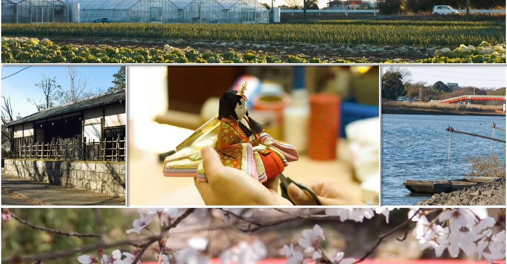

## 0182 — 2015-07-24 — 後藤 真太郎さんがグループのイベントを作成しました。

- 投稿ID: 417475718453573
- 投稿URL: https://www.facebook.com/groups/186097664924714/posts/417475718453573/
- 要約: 【スケジュール確認用】第２回オープンデータアイデアソン - さいたま市マッチングファンド補助事業- 2015/12/12(土) 【スケジュール確認用】第２回オープンデータアイデアソン - さいたま市マッチングファンド補助事業- 武蔵浦和コミュニティセンター第10集会室（サウスピア8階） 後藤 真太郎さん、他友達9人が参加しました
- コメント要約: （コメントなし）

【スケジュール確認用】第２回オープンデータアイデアソン　- さいたま市マッチングファンド補助事業-
2015/12/12(土)
【スケジュール確認用】第２回オープンデータアイデアソン　- さいたま市マッチングファンド補助事業-
武蔵浦和コミュニティセンター第10集会室（サウスピア8階）
後藤 真太郎さん、他友達9人が参加しました

## 0183 — 2015-07-25 — とよしま 亮介

- 投稿ID: 417688758432269
- 投稿URL: https://www.facebook.com/groups/186097664924714/posts/417688758432269/
- 要約: こんなハッカソンも。 WWW.ITMEDIA.CO.JP 任天堂、Facebook本社で「スーパーマリオメーカー」発売記念ハッカソン 任天堂がFacebook本社で「スーパーマリオメーカー」を題材としたハッカソンを開催する。
- コメント要約: （コメントなし）

こんなハッカソンも。
WWW.ITMEDIA.CO.JP
任天堂、Facebook本社で「スーパーマリオメーカー」発売記念ハッカソン
任天堂がFacebook本社で「スーパーマリオメーカー」を題材としたハッカソンを開催する。

## 0184 — 2015-07-25 — 太田 一穂

- 投稿ID: 417822998418845
- 投稿URL: https://www.facebook.com/groups/186097664924714/posts/417822998418845/
- 要約: こちらでたてたイベントは「非公開グループのイベント」となるため、こちらのメンバーにしか見えません。現在fbページの公開イベントとして立て直しをしております。詳細まで決まり次第、招待、シェアなどで拡散していきますのでよろしくお願いします。
- コメント要約: （コメントなし）

こちらでたてたイベントは「非公開グループのイベント」となるため、こちらのメンバーにしか見えません。現在fbページの公開イベントとして立て直しをしております。詳細まで決まり次第、招待、シェアなどで拡散していきますのでよろしくお願いします。
https://www.facebook.com/.../Code-for.../683681868352792...
Code for SAITAMA

## 0185 — 2015-07-26 — 後藤 真太郎さんがグループのイベントを作成しました。

- 投稿ID: 418077185060093
- 投稿URL: https://www.facebook.com/groups/186097664924714/posts/418077185060093/
- 要約: 第２回オープンデータハッカソン - さいたま市マッチングファンド補助事業- 2016/01/16(土) 第２回オープンデータハッカソン - さいたま市マッチングファンド補助事業- さいたま市 後藤 真太郎さんから招待がありました
- コメント要約: （コメントなし）

第２回オープンデータハッカソン　- さいたま市マッチングファンド補助事業-
2016/01/16(土)
第２回オープンデータハッカソン　- さいたま市マッチングファンド補助事業-
さいたま市
後藤 真太郎さんから招待がありました

## 0186 — 2015-07-27 — 後藤 真太郎

- 投稿ID: 418326595035152
- 投稿URL: https://www.facebook.com/groups/186097664924714/posts/418326595035152/
- 要約: 盆栽町のマッピングパーティでお世話になったつくりえさんのワークショップです。興味のある方、どうぞご参加ください。 プライベートグループ • メンバー638人 探せる☆さいたまのハンドメイド系イベント＆モノづくりワークショップ
- コメント要約: （コメントなし）

盆栽町のマッピングパーティでお世話になったつくりえさんのワークショップです。興味のある方、どうぞご参加ください。
プライベートグループ • メンバー638人
探せる☆さいたまのハンドメイド系イベント＆モノづくりワークショップ

## 0187 — 2015-07-27 — 太田 一穂

- 投稿ID: 418402641694214
- 投稿URL: https://www.facebook.com/groups/186097664924714/posts/418402641694214/
- 要約: 今週木曜日の【Code for Japan 井戸端会議】は浦和の市民活動サポートセンターで開催となりました。途中参加自由ですのでお気軽にどうぞ！
- コメント要約: （コメントなし）

今週木曜日の【Code for Japan 井戸端会議】は浦和の市民活動サポートセンターで開催となりました。途中参加自由ですのでお気軽にどうぞ！
https://www.facebook.com/events/1625424191058023/
--------------------------------------------
Code for Japan 井戸端会議 概要
--------------------------------------------
Code for Japan 井戸端会議 はCode for Japanに関心がある方が気軽に議論したり相談しあったりする為の場です。
なんといっても井戸端ですのでかたくるしいルールなどは一切ありません。
基本的には毎週木曜日の夜に定期開催されています。
どうぞ都合の良いときにふるってご参加下さい。
当日はオンライン参加も可能です。オンライン参加をご希望の方は別途主催者までご連絡下さい。
井戸端会議なので、好きに来て好きなことをしていただいて構わないのですが、
こんなことを想定しています。
・事前もしくはその場で提示された議題についての議論
・なんでも相談
・Code for Japan に関係する作業をする
・プログラミングの勉強
・オープンデータに関する雑談
・技術的な相談事をしたい
・もくもくと作業をする
・打ち合わせ
2015/07/30(木)
第83回 Code for Japan 井戸端会議
さいたま市
参加者6人・興味あり7人

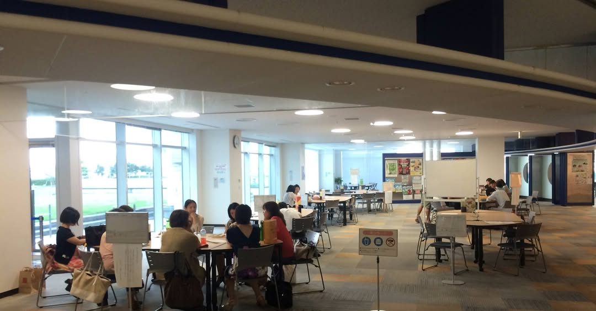

## 0188 — 2015-08-19 — 古田武士

- 投稿ID: 425351207666024
- 投稿URL: https://www.facebook.com/groups/186097664924714/posts/425351207666024/
- 要約: 横浜で統計データのワークショップに参加しています。 経産省がつくったRESASでつくった地図になります。 ２０２０年度の人口増減です。 さいたま市は２０２０年度も人口は増加しますがその周りの地域は減少しています。
- コメント要約: （コメントなし）

横浜で統計データのワークショップに参加しています。
経産省がつくったRESASでつくった地図になります。
２０２０年度の人口増減です。
さいたま市は２０２０年度も人口は増加しますがその周りの地域は減少しています。（増加地域に囲まれた中で減っているのは蕨市です。）

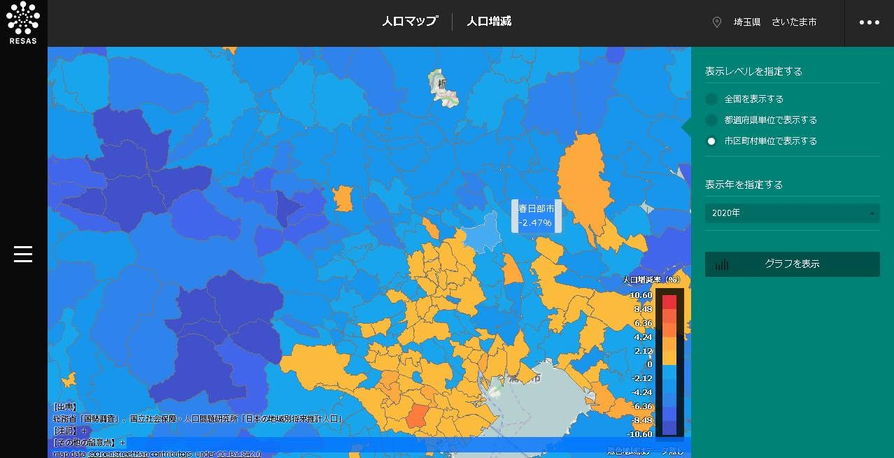

## 0189 — 2015-08-30 — 太田 一穂

- 投稿ID: 429031460631332
- 投稿URL: https://www.facebook.com/groups/186097664924714/posts/429031460631332/
- 要約: 9/5にアイデアソン、9/12にハッカソンと9月の土曜日はCode for SAITAMAのイベント続きですがね。 その次の9/19にはCode for Japanの浪江町タブレット事業関連のイベントが大宮であります！
- コメント要約: （コメントなし）

9/5にアイデアソン、9/12にハッカソンと9月の土曜日はCode for SAITAMAのイベント続きですがね。
その次の9/19にはCode for Japanの浪江町タブレット事業関連のイベントが大宮であります！
福島県浪江町では避難生活を送っている町民各世帯へのタブレットの配布をおこなっています。そして、タブレットの操作に不慣れな町民が多いため、福島県内外での町民向け講習会を実施しています。講習会には多くの町民の方がいらっしゃいますが、タブレット利用のスキルは様々で、個別の応対やサポートが必要になります。
サポートスタッフとして参加してみませんか？これまでに浪江町やCode for Japanの活動に参加したことがない方ももちろん大歓迎です。
詳細・お申込みはこちらです。
https://www.facebook.com/events/679774048789805/
＝＝＝参考＝＝＝
浪江プロジェクトについて詳しくはこちら
http://codefornamie.org/
タブレット配布事業についてはこちら
http://www.town.namie.fukushima.jp/sosh…/2/201405tablet.html
2015/09/19(土)
タブレット講習会サポート(9/19埼玉会場)
さいたま市
Code for Namie 応援団主催

## 0190 — 2015-08-31 — 安部 邦昭

- 投稿ID: 429623013905510
- 投稿URL: https://www.facebook.com/groups/186097664924714/posts/429623013905510/
- 要約: ingressで避難訓練！ 朝のNHK・・・だったか、ニュースでもやっていましたね。 ヒカリエで「イングレス」を活用した初の避難訓練 防災ガールが企画 SHIBUKEI.COM ヒカリエで「イングレス」を活用した初の避難訓練 防災ガールが企画
- コメント要約: 古橋さんが中心となってやっていましたね。災害対策用のミッションを作ってたみたいですね。 11月のNPO防災まつりでも企画できないでしょうか？ ポータル申請が一時、中断しているようですね。

ingressで避難訓練！！
朝のNHK・・・だったか、ニュースでもやっていましたね。
ヒカリエで「イングレス」を活用した初の避難訓練　防災ガールが企画
SHIBUKEI.COM
ヒカリエで「イングレス」を活用した初の避難訓練　防災ガールが企画

### コメント — 古田武士

古橋さんが中心となってやっていましたね。災害対策用のミッションを作ってたみたいですね。

### コメント — 山中 邦久

11月のNPO防災まつりでも企画できないでしょうか？

### コメント — 酒井 千富

ポータル申請が一時、中断しているようですね。申請会が出来なくなった(^^ゞ
伊藤園の災害対応自販機めぐりとか(^^)

### コメント — 後藤 真太郎

NPOまつりでは近くのポータル集めてミッション作ったらどうでしょう？東京都の帰宅困難者支援では、代々木公園隣の国立オリンピック記念青少年総合センターが一時避難所になってますのでそこに移動する過程でミッションできるかも？近すぎてミッションが作れない？ミッション申請の時間はどれくらいかかるのでしょうか？

### コメント — 山中 邦久

NPOの帰宅難民の会も解散していて伝手がないので、最新の「防災ガール」での担当者などにコンタクトは取れないでしょうかね。防災まつりの目玉にもなる企画だと思います。

### コメント — 後藤 真太郎

協賛が集まればできますが、防災ガールは手ブラは嫌がるでしょう。おあとがよろしいようで、、、　(^_^;)

## 0191 — 2015-09-02 — Takashi Iki

- 投稿ID: 430104450524033
- 投稿URL: https://www.facebook.com/groups/186097664924714/posts/430104450524033/
- 要約: 【見どころ追加のご連絡】 9/3(木)19:30～開催 LIGのおもしろブログハッカソン ～LIG 秘伝のコンテンツ企画術を伝授～ 先日もご案内させて頂いた、おもしろブログハッカソン。
- コメント要約: （コメントなし）

【見どころ追加のご連絡】
9/3(木)19:30～開催 LIGのおもしろブログハッカソン
～LIG 秘伝のコンテンツ企画術を伝授～
http://e2d3.connpass.com/event/18682/
先日もご案内させて頂いた、おもしろブログハッカソン。
データビジュアライゼーションで「おもしろコンテンツ」を作成するハッカソンです。
この度、jQueryと同じ文法で動作する、Web3D描画ライブラリ「jThree」入門講座も開催できる運びとなりました！あと、ドリンクスポンサーとして、「野菜くらぶ」さんがご参画。世にも珍しい「レタスのクラフトビール」をご堪能頂けます！
【見どころ、楽しみどころ、味わいどころ】
・LIG 秘伝のコンテンツ企画術
・ビジュアライゼーションツールE2D3 開発入門講座
・Web3D描画ライブラリ「jThree」の産みの親による入門講座 ←★New
・レタスのクラフトビール ←★New
・優秀作品はLIGブログに掲載されるチャンス
・などなど
エンジニア、デザイナー、ライターの方々。大歓迎ですので、是非遊びに来てください！
ご興味ありそうなご友人の方にもお知らせいただければ嬉しく思います。
LIGのおもしろブログハッカソン (2015/09/12 09:30〜)
E2D3.CONNPASS.COM
LIGのおもしろブログハッカソン (2015/09/12 09:30〜)

## 0192 — 2015-09-03 — 石山 太一

- 投稿ID: 430652643802547
- 投稿URL: https://www.facebook.com/groups/186097664924714/posts/430652643802547/
- 要約: 第1回オープンデータアイデアソンの報道発表
- コメント要約: （コメントなし）

第1回オープンデータアイデアソンの報道発表
http://www.city.saitama.jp/.../008/003/004/006/p042781.html

## 0193 — 2015-09-03 — 後藤 真太郎

- 投稿ID: 430701243797687
- 投稿URL: https://www.facebook.com/groups/186097664924714/posts/430701243797687/
- 要約: さいたま市と行う協働事業、9/5のアイデアソンと9/12のハッカソンにつき、さいたま市より以下のように記者発表になりました。ご興味ある方のご参加をお待ちしてます。
- コメント要約: （コメントなし）

さいたま市と行う協働事業、9/5のアイデアソンと9/12のハッカソンにつき、さいたま市より以下のように記者発表になりました。ご興味ある方のご参加をお待ちしてます。
CITY.SAITAMA.JP
さいたま市／（平成27年9月2日記者発表）平成27年度さいたまマッチングファンド一般助成事業「第1回オープンデータアイデアソン」「第1回オープンデータハッカソン」を開催し�
当サイトではJavaScriptを使用しています。 ブラウザの設定でJavaScriptの使用を無効にしている場合、一部の機能が正確に動作しない恐れがあります。 当サイトをご覧の際はJavaScriptの使用を有効にしてください。

## 0194 — 2015-09-09 — 後藤 真太郎

- 投稿ID: 433081700226308
- 投稿URL: https://www.facebook.com/groups/186097664924714/posts/433081700226308/
- 要約: 9/5のオープンデータアイデアソンで絞られたハッカソンテーマは以下の３つです。 コンセプトシートはココ： これをもとに9/12のハッカソンに挑みます。 アイデアソンに参加されていない方はコンセプトシートを見て、参加チームをご判断ください。
- コメント要約: 予想通り、①のBen-Joyが異様な盛り上がり。モックもできているとは。

9/5のオープンデータアイデアソンで絞られたハッカソンテーマは以下の３つです。
コンセプトシートはココ：https://goo.gl/BvVpE9
これをもとに9/12のハッカソンに挑みます。
アイデアソンに参加されていない方はコンセプトシートを見て、参加チームをご判断ください。
尚、戦略作成にあたって、各々秘密のFacebookグループを作成しましたのでそこでご議論下さい。参加ｗご検討されている方は各グループにご参加していただき議論に参加されることをお勧めします。
① BEN-JOY 思い出のさいたま
きれいなトイレ、汚いトイレ、バリアフリーなどのトイレ情報を提供するアプリ。
https://www.facebook.com/groups/433233476866879/
② マルチビューサポートシステム
動物などの視点で風景を観るとどうみえるでしょう？他の用途にも利用可能ですのでマルチな利用方法を視野に入れることが出来るアプリ。
https://www.facebook.com/groups/958321550892403/
③ さいトリForever for everyone
来年開催されるさいたまトリエンナーレをみんなで楽しむための口コミサイト。案内は勿論、参加型のイベントなど色んな場所で同時多発的に行われるイベントの目える化ツールです。キッズトリエンナーレも実現させましょう。
https://www.facebook.com/groups/901532233263352/
DROPBOX.COM
150905第1回オープンデータアイデアソン
Shared with Dropbox

### コメント — 後藤 真太郎

予想通り、①のBen-Joyが異様な盛り上がり。モックもできているとは。

## 0195 — 2015-09-28 — 太田 一穂

- 投稿ID: 438687172999094
- 投稿URL: https://www.facebook.com/groups/186097664924714/posts/438687172999094/
- 要約: 今週木曜日のCode for Japan 井戸端会議は大宮のコワーキングスペースOffice7Fで開催されます。僕はマッピングパーティ準備などの作業していようと思います。
- コメント要約: （コメントなし）

今週木曜日のCode for Japan 井戸端会議は大宮のコワーキングスペースOffice7Fで開催されます。僕はマッピングパーティ準備などの作業していようと思います。
https://www.facebook.com/events/681618758642215/
2015/10/01(木)
第91回 Code for Japan 井戸端会議
さいたま市
参加者9人・興味あり11人

## 0196 — 2015-09-29 — 後藤 真太郎

- 投稿ID: 438853112982500
- 投稿URL: https://www.facebook.com/groups/186097664924714/posts/438853112982500/
- 要約: さいたま市が初の「オープンデータハッカソン」 トイレアプリなど開発 OMIYA.KEIZAI.BIZ さいたま市が初の「オープンデータハッカソン」 トイレアプリなど開発
- コメント要約: （コメントなし）

さいたま市が初の「オープンデータハッカソン」　トイレアプリなど開発
OMIYA.KEIZAI.BIZ
さいたま市が初の「オープンデータハッカソン」　トイレアプリなど開発

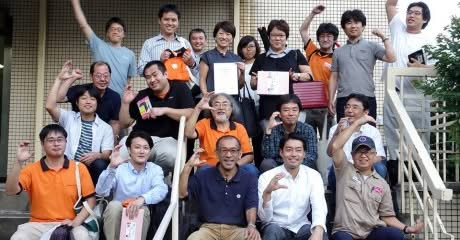

## 0197 — 2015-09-30 — 後藤 真太郎

- 投稿ID: 439041759630302
- 投稿URL: https://www.facebook.com/groups/186097664924714/posts/439041759630302/
- 要約: GIS学会(10/10-11)の前日の10/9 、以下のように埼玉県GIS普及推進研究会の例会を開催します。会員以外での参加可能ですので是非ご参加ください。
- コメント要約: 申込みはこちらにお願いします。 DOCS.GOOGLE.COM 埼玉県GIS普及推進研究会例会 埼玉県GIS普及推進研究会例会

GIS学会(10/10-11)の前日の10/9 、以下のように埼玉県GIS普及推進研究会の例会を開催します。会員以外での参加可能ですので是非ご参加ください。
--------------------------
埼玉県GIS普及推進研究会例会
「オープンデータ時代の測量・情報産業について考える」
公共データを二次利用しやすい形でオープン化する「オープンデータ」の取組は、民間における公共データの活用を促進し、経済活性化等を促進するものとして期待されています。
埼玉県でも、さいたま市をはじめ、埼玉県、和光市、川越市、越谷市、川口市、戸田市、北本市などでオープンデータが公開されており、それらのデータの利活用が求められております。
今回は、このような流れにあって、測量業務・情報産業がどのように変わっていくべきかをワークショップ形式で考えてみようと思います。
日時：平成27年10月9日（金）14:30-17:00
場所：埼玉県男女共同参画センター第一セミナー室
https://www.pref.saitama.lg.jp/withyou/access.html
（〒330-0081 埼玉県さいたま市中央区新都心２−２
ホテルブリランテ武蔵野Tel: 048-601-3111 ）
費用：
埼玉県GIS普及推進研究会会員及び自治体関係者：無料
研究会会員企業に所属する社員の方の参加費も無料とします。
上記以外は資料代として1000円徴収させていただきます。
主催：埼玉県GIS普及推進研究会
共催：Code for SAITAMA
プログラム：
14:00-14:30 受付
14:30-14:40 開会・挨拶
14:40-15:30 地図利用におけるコンプライアンス～オープンデータの活用～
浅野和仁（富田林市上下水道部理事兼次長兼下水道課長）
15:30-17:00 ワークショップ
テーマ：オープンデータ時代の測量・情報産業について考える
主旨説明
インプットワーク（情報提供）
話題提供：自治体、Code for関係者を予定
テーマ出し
チーム分け
グーループワーク
発表
17:00　 終了
17:30 交流会（有料）
連絡・申込み：
立正大学・地球環境科学部・環境システム学科・後藤研究室
〒360-0194 埼玉県熊谷市万吉1700　TEL& FAX: 048-539-1653
E-mail: gotoken@ris.ac.jp
交通案内
PREF.SAITAMA.LG.JP
交通案内

### コメント — 後藤 真太郎

申込みはこちらにお願いします。https://goo.gl/SZQeFW
DOCS.GOOGLE.COM
埼玉県GIS普及推進研究会例会
埼玉県GIS普及推進研究会例会

## 0198 — 2015-10-04 — 太田 一穂

- 投稿ID: 439945236206621
- 投稿URL: https://www.facebook.com/groups/186097664924714/posts/439945236206621/
- 要約: 10/17岩槻マッピングパーティー、peatixページもたてました。 自分の写真フォルダには岩槻らしい写真がなかったもので、岩槻らしいカバー画像お持ちの方、ご提供をお待ちしておりますm(_ _)m 歴史と人形のまち岩槻マッピングパーティー PEATIX.COM 歴史と人形のまち岩槻マッピングパーティー 返信1件を見る
- コメント要約: 後ほどおくります！

10/17岩槻マッピングパーティー、peatixページもたてました。
自分の写真フォルダには岩槻らしい写真がなかったもので、岩槻らしいカバー画像お持ちの方、ご提供をお待ちしておりますm(_ _)m
歴史と人形のまち岩槻マッピングパーティー
PEATIX.COM
歴史と人形のまち岩槻マッピングパーティー
返信1件を見る

### コメント — 吉永 篤史

後ほどおくります！

## 0199 — 2015-10-09 — 後藤 真太郎

- 投稿ID: 441029199431558
- 投稿URL: https://www.facebook.com/groups/186097664924714/posts/441029199431558/
- 要約: 10/10-11 第24回GIS学会が以下のように開催されます。Code for SAITAMAのメンバーも発表します。また、来年度は25周年の年に当たり、立正大学品川キャンパスが開催校になりますので、さいたまにもご協力いただけなくてなりませんので雰囲気を味わっていただけますと助かります。
- コメント要約: （コメントなし）

10/10-11 第24回GIS学会が以下のように開催されます。Code for SAITAMAのメンバーも発表します。また、来年度は25周年の年に当たり、立正大学品川キャンパスが開催校になりますので、さいたまにもご協力いただけなくてなりませんので雰囲気を味わっていただけますと助かります。
会場：慶應義塾大学　三田キャンパス　南校舎4F-5F（〒108-8345 東京都港区三田2-15-45）
http://www.gisa-japan.org/conferences/
プログラム：http://www.gisa-japan.org/file/0929prog.pdf
学会発表を聞く事は有料ですが、以下の特別セッション、ハンズオンセッションは無料ですので是非ご参加ください。
■特別セッション（無料、受付不要）
http://www.gisa-japan.org/file/spse.pdf
10/10 12：40-14：20 会場A （447教室）
データビジュアライ ゼーションの現在
10/10 12：40-14：20 会場B （443教室）
オープンデータ時代 の学校教育におけるGIS
10/10 14：30-16：10
災害対応における 自治体GISと外部支援の可能性
10/10 14：30-16：10 会場B （443教室）
アジアにおける FOSS4Gの現状
10/10 16：20-18：00　会場A （447教室）
オープンデータと自治体GIS
10/11 9:00-12:50 会場A （447教室）
第8回マイクロジオ データ研究会～国・地方自治体によるマイクロジオデータ活用1-2
■ハンズオンセッション（無料、但し事前の連絡が必要）
http://www.gisa-japan.org/file/ho.pdf
（1）：　SfM多視点ステレオ写真測量による簡単三次元モデリング
（2）：　GIS教育の効果的なカリキュラムについて
～Esri社　Joseph Kerskiを迎えて
（3）：　Geopaparazzi ハンズオン
GISA-JAPAN.ORG
第24回学術研究発表大会（2015年）｜GISA 地理情報システム学会
第24回学術研究発表大会（2015年）のページです。地理情報システム学会は、GISに関わるあらゆる理論的・応用的研究を行い、議論し、発展させてゆくことを目的とし、学術・文化・産業等の多方面に貢献しています。

## 0200 — 2015-10-11 — Hiroyoshi Ishiideさんは古田武士さん、
他2人
と一緒です。

- 投稿ID: 441675946033550
- 投稿URL: https://www.facebook.com/groups/186097664924714/posts/441675946033550/
- 要約: Hiroyoshi Ishiide アップロードが遅くなり申し訳ありません。先日（9月5日）のアイデアソンの写真です。— 友達: 古田武士さん、 他2人
- コメント要約: （コメントなし）

Hiroyoshi Ishiide
アップロードが遅くなり申し訳ありません。先日（9月5日）のアイデアソンの写真です。— 友達: 古田武士さん、
他2人

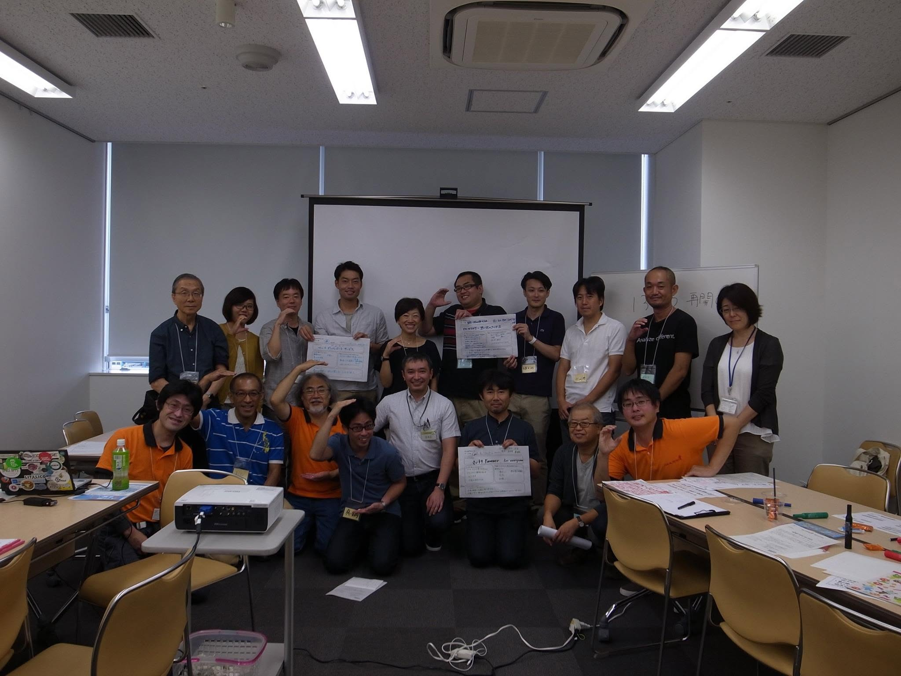

## 0201 — 2015-10-20 — 後藤 真太郎

- 投稿ID: 443919695809175
- 投稿URL: https://www.facebook.com/groups/186097664924714/posts/443919695809175/
- 要約: 岩槻マッピングパーティご苦労様でした。同様のイベントで海老名のものがとりあげられてます。 WWW.TOWNNEWS.CO.JP 市内名所、ウェブでＰＲ | 海老名 | タウンニュース パソコンを使った情報通信技術で地域活性化を目指す市民グループ「Code for Kanagawa」が10月４日、地元情報をインターネット上の百科事典「ウィキペディア」で...
- コメント要約: （コメントなし）

岩槻マッピングパーティご苦労様でした。同様のイベントで海老名のものがとりあげられてます。
WWW.TOWNNEWS.CO.JP
市内名所、ウェブでＰＲ | 海老名 | タウンニュース
パソコンを使った情報通信技術で地域活性化を目指す市民グループ「Code for Kanagawa」が10月４日、地元情報をインターネット上の百科事典「ウィキペディア」で...

## 0202 — 2015-10-20 — 後藤 真太郎

- 投稿ID: 443938285807316
- 投稿URL: https://www.facebook.com/groups/186097664924714/posts/443938285807316/
- 要約: さいたまトリエンナーレに向け、10/27よりさいたまスタディーズ 連続セミナーが始まります。初日は「地図とデータで見るさいたま」というテーマでCode for SAITAMAの私と安倍さんがトークします。
- コメント要約: チラシが公開されました。

さいたまトリエンナーレに向け、10/27よりさいたまスタディーズ 連続セミナーが始まります。初日は「地図とデータで見るさいたま」というテーマでCode for SAITAMAの私と安倍さんがトークします。このようなさいたまを元気にするための議論が昼夜問わずサポセンで行われている事を知ってもらう意味でも多くの方々のご参加をお待ちしてます。
さいたまスタディーズ 連続セミナー | さいたまトリエンナーレ2016
SAITAMATRIENNALE.JP
さいたまスタディーズ 連続セミナー | さいたまトリエンナーレ2016

### コメント — 後藤 真太郎

チラシが公開されました。

### コメント — 後藤 真太郎

（本文なし）

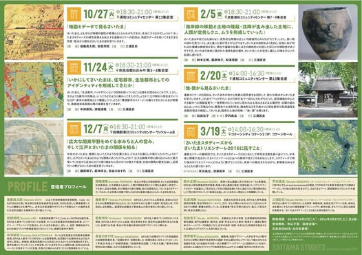

### コメント — 後藤 真太郎

（本文なし）

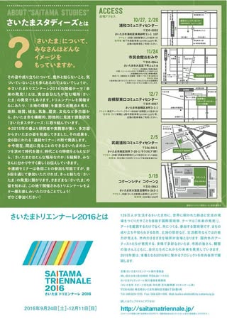

## 0203 — 2015-10-23 — 後藤 真太郎

- 投稿ID: 444480365753108
- 投稿URL: https://www.facebook.com/groups/186097664924714/posts/444480365753108/
- 要約: 11/26-28に日本科学未来館でG空間Expoが開催され、GISに関する様々な展示や講演が行われます。Code for SAITAMAは、期間中、1Fのコミュニケーションロビーにてブースで浦和区の前地地区で実際に使用されている「ご近所防災マップ」の展示、11/27には古田武士氏から「ご近所防災マップ」のプレゼンテーションがあります。
- コメント要約: 古田さんのプレゼンって何時頃からですか？

11/26-28に日本科学未来館でG空間Expoが開催され、GISに関する様々な展示や講演が行われます。Code for SAITAMAは、期間中、1Fのコミュニケーションロビーにてブースで浦和区の前地地区で実際に使用されている「ご近所防災マップ」の展示、11/27には古田武士氏から「ご近所防災マップ」のプレゼンテーションがあります。http://www.g-expo.jp/geofes/
また、11/28の第4回地理院地図パートナーネットワーク会議にて熊谷のうちわ祭で山車の位置を表示した10年の経験を元に、実際の社会に使用されているGISの事例を私が紹介する事になっております。
http://www.g-expo.jp/symposium/program.html#d28-2
その他、会場では地図やGISを使った様々なゲームやイベントが行われてます。Code for SAITAMAのブースにはメンバーがお待ちしておりますのでのでご家族でお気軽にご来場下さい。
G-EXPO.JP
講演・シンポジウム｜G空間EXPO2015
返信2件を見る

### コメント — 酒井 千富

古田さんのプレゼンって何時頃からですか？

## 0204 — 2015-10-23 — 安部 邦昭

- 投稿ID: 444538932413918
- 投稿URL: https://www.facebook.com/groups/186097664924714/posts/444538932413918/
- 要約: 今朝のnhkニュースで、マッピングパーティーが紹介されていました。 写真の説明はありません。. 写真の説明はありません。. 写真の説明はありません。. 写真の説明はありません。
- コメント要約: （コメントなし）

今朝のnhkニュースで、マッピングパーティーが紹介されていました。
写真の説明はありません。. 写真の説明はありません。. 写真の説明はありません。. 写真の説明はありません。. 写真の説明はありません。

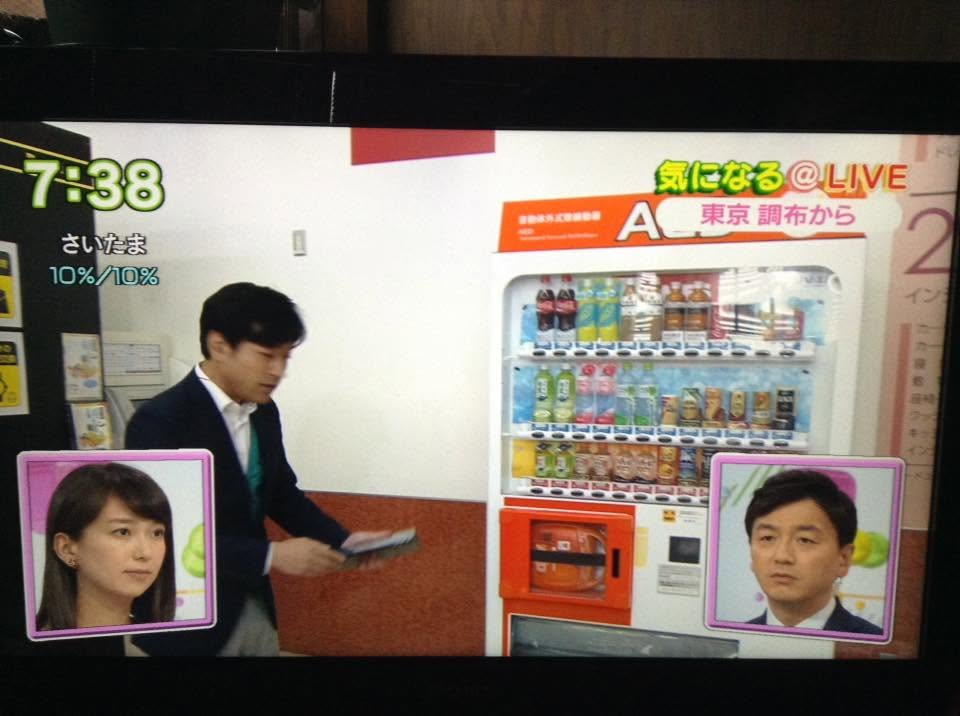

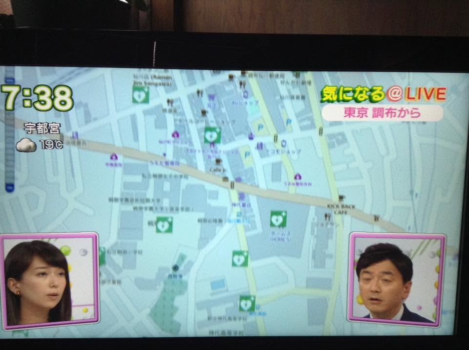

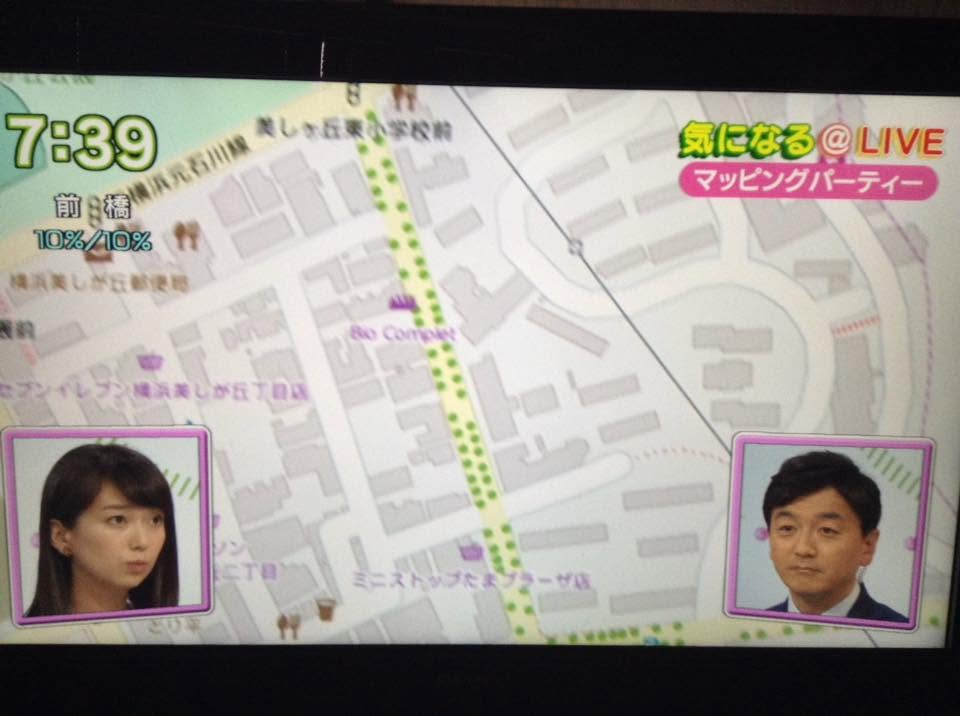

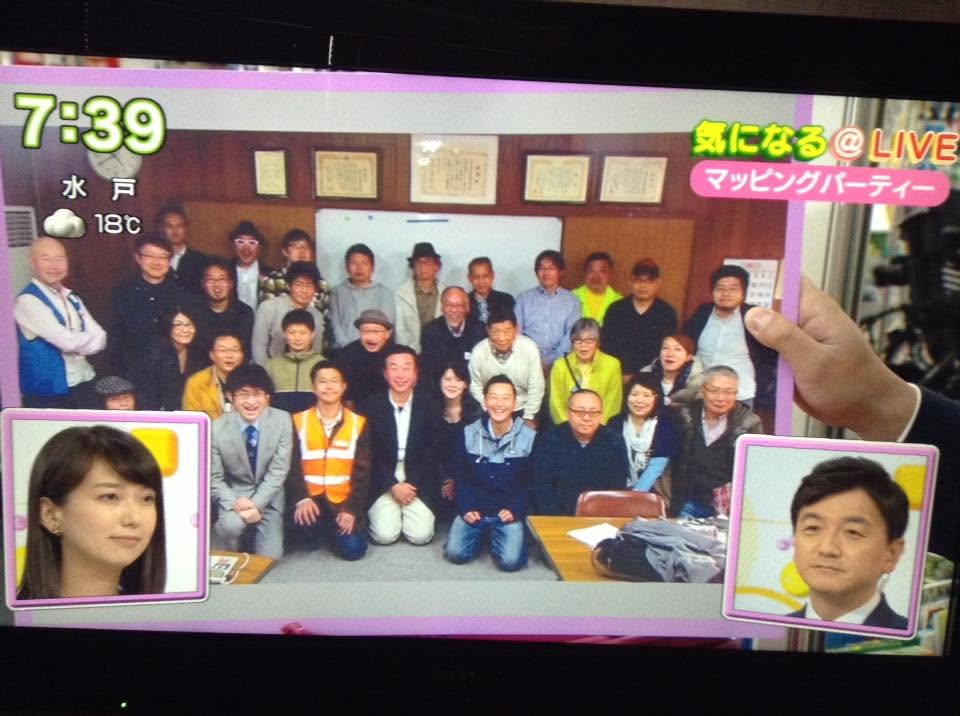

## 0205 — 2015-10-23 — 後藤 真太郎

- 投稿ID: 444565842411227
- 投稿URL: https://www.facebook.com/groups/186097664924714/posts/444565842411227/
- 要約: このプロジェクト、オープンデータ利用との関わりがあるハズ。フォローしていきたいと思います。 2015年度第5回レギュラー・ワークショップ「認知症とのつきあい方のデザイン」 | 東京大学i.school ISCHOOL.T.U-TOKYO.AC.JP 2015年度第5回レギュラー・ワークショップ「認知症とのつきあい方のデザイン」 | 東京大学i.school
- コメント要約: 思わず、読み進んでしまいました。こっちを↓ HIDEYUKI-HORII.NET イノベーション教育の散歩道 イノベーション教育の散歩道

このプロジェクト、オープンデータ利用との関わりがあるハズ。フォローしていきたいと思います。
2015年度第5回レギュラー・ワークショップ「認知症とのつきあい方のデザイン」 | 東京大学i.school
ISCHOOL.T.U-TOKYO.AC.JP
2015年度第5回レギュラー・ワークショップ「認知症とのつきあい方のデザイン」 | 東京大学i.school

### コメント — 中野 一惠

思わず、読み進んでしまいました。こっちを↓
http://hideyuki-horii.net/wordpress/
HIDEYUKI-HORII.NET
イノベーション教育の散歩道
イノベーション教育の散歩道

## 0206 — 2015-10-25 — 太田 一穂

- 投稿ID: 445053642362447
- 投稿URL: https://www.facebook.com/groups/186097664924714/posts/445053642362447/
- 要約: 昨年の第1回に引き続き、11/6〜8日の3日間、年に一度のシビックテックのショーケース、Code for Japan Summit 2015 が開催されます。 Code for SAITAMAは、ブース展示や、11/7土曜日の「マッピングパーティーワークショップ」、「池袋マッピングパーティー」で関わっております。
- コメント要約: （コメントなし）

昨年の第1回に引き続き、11/6〜8日の3日間、年に一度のシビックテックのショーケース、Code for Japan Summit 2015 が開催されます。
Code for SAITAMAは、ブース展示や、11/7土曜日の「マッピングパーティーワークショップ」、「池袋マッピングパーティー」で関わっております。
参加費も無料となりましたので、気軽にご参加ください！
Code for Japan Summit 2015「Party＆Start！」
CFJSUMMIT2015.PEATIX.COM
Code for Japan Summit 2015「Party＆Start！」

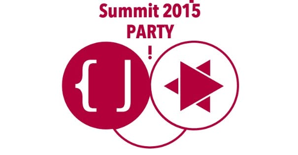

## 0207 — 2015-10-27 — 太田 一穂

- 投稿ID: 445467358987742
- 投稿URL: https://www.facebook.com/groups/186097664924714/posts/445467358987742/
- 要約: 今週末の土日に池袋で、IBM Bluemixを使ったアイデアソン・ハンズオン・ハッカソンがあります。 BluemixはCIVICTECHとの相性がとても良く、比較的容易にテクノロジーを活用した課題解決提案のプロトタイピングが可能とのこと。
- コメント要約: （コメントなし）

今週末の土日に池袋で、IBM Bluemixを使ったアイデアソン・ハンズオン・ハッカソンがあります。
BluemixはCIVICTECHとの相性がとても良く、比較的容易にテクノロジーを活用した課題解決提案のプロトタイピングが可能とのこと。
翌週11/7（土）には、Code for Japan Summit内の「IBM Bluemixセッション」にて、プレゼンテーション＆受賞コンテンストがあります！
IBM Bluemix ハンズオン＆ハッカソン あなたの街を変えるアプリを作ろう
PEATIX.COM
IBM Bluemix ハンズオン＆ハッカソン あなたの街を変えるアプリを作ろう

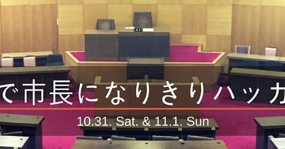

## 0208 — 2015-10-29 — 後藤 真太郎

- 投稿ID: 445825165618628
- 投稿URL: https://www.facebook.com/groups/186097664924714/posts/445825165618628/
- 要約: 11/25はここでCode for SAITAMAのメンバー2人がICTによる地域連携・シビックテックの実践について話します。ICTの来し方行く末について考えましょう。
- コメント要約: （コメントなし）

11/25はここでCode for SAITAMAのメンバー2人がICTによる地域連携・シビックテックの実践について話します。ICTの来し方行く末について考えましょう。是非、ご来場ください。https://www.facebook.com/events/971048806293136/
2015/11/25(水)
関東ICT推進NPO連携協議会 埼玉県地域連携交流会- 埼玉県におけるICT活用事例-
埼玉県 春日部市
後藤 真太郎さんから招待がありました
興味あり

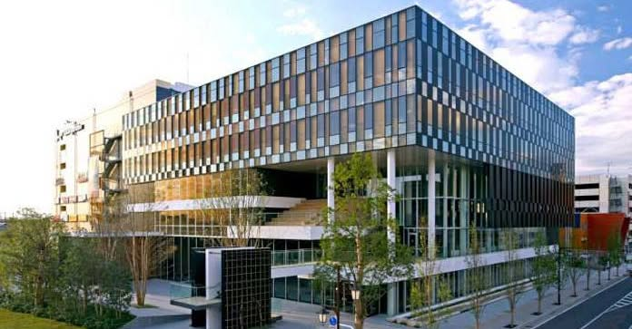

## 0209 — 2015-10-30 — 太田 一穂

- 投稿ID: 446164668918011
- 投稿URL: https://www.facebook.com/groups/186097664924714/posts/446164668918011/
- 要約: 【池袋は埼玉】 来週末のCode for Japan Summit 2015でマッピングパーティーやります！その直前に「マッピングパーティーの始め方」ワークショップもあります。
- コメント要約: （コメントなし）

【池袋は埼玉】
来週末のCode for Japan Summit 2015でマッピングパーティーやります！その直前に「マッピングパーティーの始め方」ワークショップもあります。
https://www.facebook.com/events/488767151305916/
2015/11/07(土)
【11/7土曜】Code for SAITAMA 池袋マッピングパーティー【Code for Toshima共催】
東京都東京都 豊島区

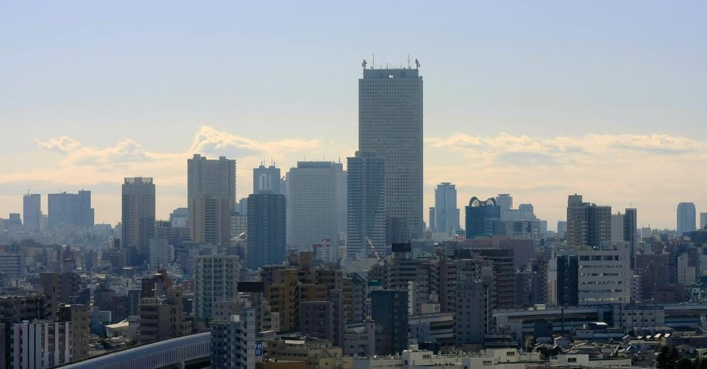

## 0210 — 2015-11-03 — 後藤 真太郎

- 投稿ID: 447105255490619
- 投稿URL: https://www.facebook.com/groups/186097664924714/posts/447105255490619/
- 要約: 「広報東京都」に掲載しているテキスト情報をオープンデータとして公開されました。 KOHO.METRO.TOKYO.JP WEB広報東京都［オープンデータ］｜東京都 東京都が毎月提供する「WEB広報東京都」のホームページ。
- コメント要約: 広報のデータがオープンデータになっていると、印刷物の受注会社が代わる度に再入力や写真の撮り直しがひつようになりましたが、その必要がなくなるというメリットがあります。

「広報東京都」に掲載しているテキスト情報をオープンデータとして公開されました。
KOHO.METRO.TOKYO.JP
WEB広報東京都［オープンデータ］｜東京都
東京都が毎月提供する「WEB広報東京都」のホームページ。東京都の施策やイベント、講座、募集などの最新情報が盛りだくさん！

### コメント — 後藤 真太郎

広報のデータがオープンデータになっていると、印刷物の受注会社が代わる度に再入力や写真の撮り直しがひつようになりましたが、その必要がなくなるというメリットがあります。さいたまでもどうでしょうか？

## 0211 — 2015-11-06 — 後藤 真太郎

- 投稿ID: 447721025429042
- 投稿URL: https://www.facebook.com/groups/186097664924714/posts/447721025429042/
- 要約: Code for Shiga/Biwakoの活動紹介です。山車にi-Beaconつけてお祭りをハックしてます。11/8 13:00-にはワークショップがあります 後藤 真太郎さんからの投稿をシェアしました 写真の説明はありません。
- コメント要約: （コメントなし）

Code for Shiga/Biwakoの活動紹介です。山車にi-Beaconつけてお祭りをハックしてます。11/8 13:00-にはワークショップがあります
後藤 真太郎さんからの投稿をシェアしました
写真の説明はありません。. 写真の説明はありません。. 写真の説明はありません。
後藤 真太郎
Code for Shiga/Biwakoの活動紹介です。山車にi-Beaconつけてお祭りをハックしてます。11/8 13:00-にはワークショップがあります。

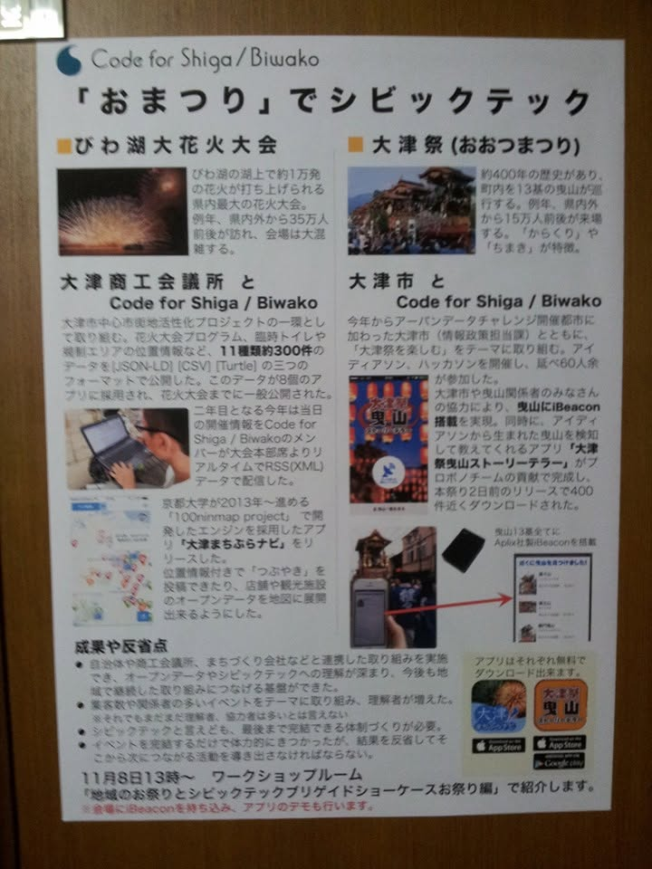

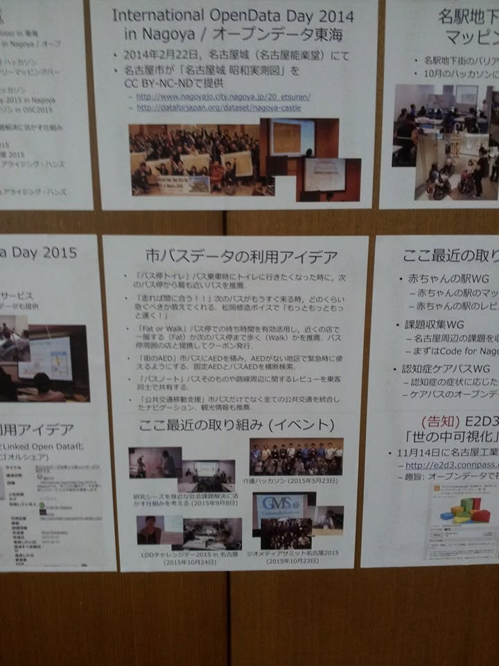

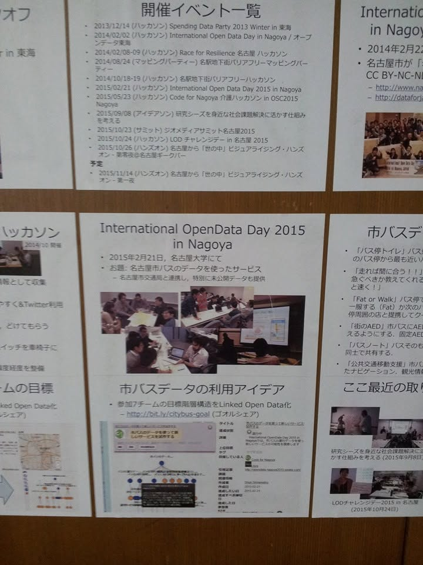

## 0212 — 2015-11-06 — 後藤 真太郎

- 投稿ID: 447721068762371
- 投稿URL: https://www.facebook.com/groups/186097664924714/posts/447721068762371/
- 要約: Code for Summit（11/6-8 於：旧豊島区役所庁舎4F）で電子工作kit LittleBitsを使ったワークショップが行われてます。これを作った方はなんと小学生。
- コメント要約: （コメントなし）

Code for Summit（11/6-8 於：旧豊島区役所庁舎4F）で電子工作kit LittleBitsを使ったワークショップが行われてます。これを作った方はなんと小学生。街をつくるようです。3日間でどこまでできるか楽しみですね。
後藤 真太郎さんからの投稿をシェアしました
後藤 真太郎
Code for Summit（11/6-8 於：旧豊島区役所庁舎4F）で電子工作kit LittleBitsを使ったワークショップが行われてます。これを作った方はなんと小学生。街をつくるようです。3日間でどこまでできるか楽しみですね

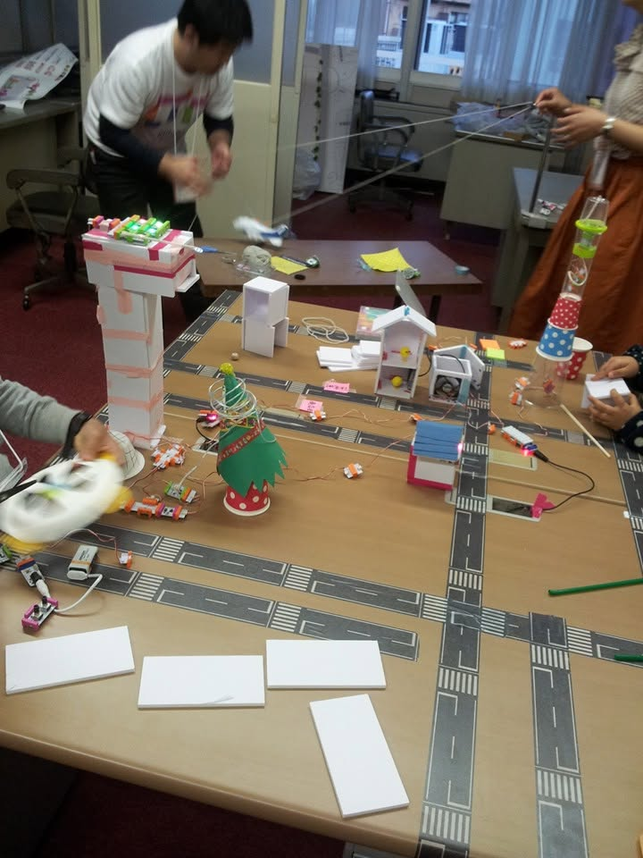

## 0213 — 2015-11-10 — 後藤 真太郎

- 投稿ID: 448713951996416
- 投稿URL: https://www.facebook.com/groups/186097664924714/posts/448713951996416/
- 要約: 11/14-15、代々木公園で行う防災まつり期間中、ShakeOut を予定してます。NPOまつり、NPO防災まつりにご参加を計画の方は、当日の受付もありますが、事前に申込みしていただけますとうれしいです。
- コメント要約: （コメントなし）

11/14-15、代々木公園で行う防災まつり期間中、ShakeOut　http://www.shakeout.jp/　を予定してます。NPOまつり、NPO防災まつりにご参加を計画の方は、当日の受付もありますが、事前に申込みしていただけますとうれしいです。現在登録者は2000人を越えており、5000人を目標にしております。
申込みはこちら：http://saigai-v.net/npobousai/shakeout/shakeoutin/
SHAKEOUT.JP
The Great Japan ShakeOut
[ShakeOut(シェイクアウト)]は2008年、防災関係者らの発案でスタートした米国最大の防災訓練です。The Great Japan ShakeOut 訓練参加者を募集しています。

## 0214 — 2015-11-18 — 後藤 真太郎

- 投稿ID: 450269381840873
- 投稿URL: https://www.facebook.com/groups/186097664924714/posts/450269381840873/
- 要約: 11/25 春日部にて関東ICT推進NPO連携協議会が開催されます。Code for SAITAMAのシビックテックに関する活動紹介等などが行われます。是非、ご参加ください。
- コメント要約: （コメントなし）

11/25 春日部にて関東ICT推進NPO連携協議会が開催されます。Code for SAITAMAのシビックテックに関する活動紹介等などが行われます。是非、ご参加ください。https://www.facebook.com/events/971048806293136/
2015/11/25(水)
関東ICT推進NPO連携協議会 埼玉県地域連携交流会- 埼玉県におけるICT活用事例-
埼玉県 春日部市
後藤 真太郎さんから招待がありました
興味あり

## 0215 — 2015-11-19 — 太田 一穂

- 投稿ID: 450651338469344
- 投稿URL: https://www.facebook.com/groups/186097664924714/posts/450651338469344/
- 要約: 来週11/26のCode for Japan 井戸端会議は大宮のコワーキングスペース7Fで行います。 お気軽にご参加下さい！ 2015/11/26(木) 第98回 Code for Japan 井戸端会議 さいたま市 参加者6人・興味あり25人
- コメント要約: 卓球台があった一年前に比べて、テイストが変わってきてますね。なんとなくオサレ感がアップしたような。

来週11/26のCode for Japan 井戸端会議は大宮のコワーキングスペース7Fで行います。
お気軽にご参加下さい！
https://www.facebook.com/events/643223832487064/
2015/11/26(木)
第98回 Code for Japan 井戸端会議
さいたま市
参加者6人・興味あり25人

### コメント — 柴田 重臣

卓球台があった一年前に比べて、テイストが変わってきてますね。なんとなくオサレ感がアップしたような。

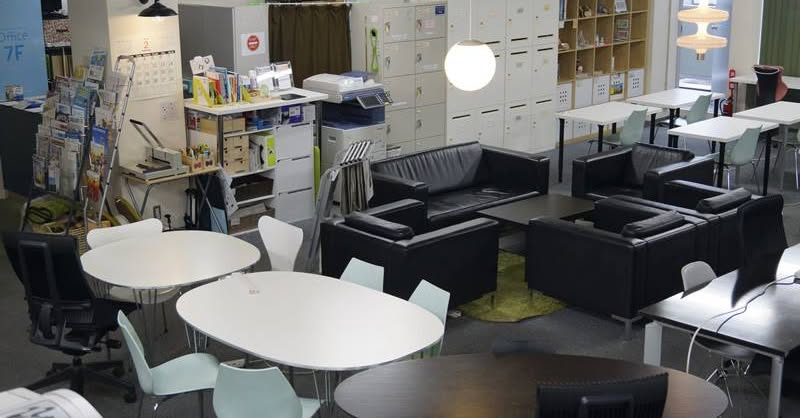

## 0216 — 2015-11-26 — 後藤 真太郎

- 投稿ID: 452247698309708
- 投稿URL: https://www.facebook.com/groups/186097664924714/posts/452247698309708/
- 要約: 第2回目の報告です。次回は、12/7 岩槻にて さいたま国際芸術祭さんからの投稿をシェアしました 写真の説明はありません。. 写真の説明はありません。 さいたま国際芸術祭 【さいたまスタディーズ連続セミナー第２回】 さいたまスタディーズ連続セミナー第２回の報告です！
- コメント要約: （コメントなし）

第2回目の報告です。次回は、12/7 岩槻にて
さいたま国際芸術祭さんからの投稿をシェアしました
写真の説明はありません。. 写真の説明はありません。
さいたま国際芸術祭
【さいたまスタディーズ連続セミナー第２回】
さいたまスタディーズ連続セミナー第２回の報告です！
11月24日（火）午後６時半から市民会館おおみやにて、「さいたまスタディーズ連続セミナー」第２回を開催しました。
「いかにしてさいたまは、住宅都市、生活都市としてのアイデンティティを形成してきたのか」をテーマとして進められ、主に明治時代以降のさいたまの都市形成とその特徴について触れた後、なぜさいたまは人々から居住先として選ばれてきたのか、「理想都市のイメージ」の根源と実態を探るため、様々な地図や写真、記録を用いながら、さいたまの近現代の様子を見ていきました。
ところで、会場となった「市民会館おおみや」は、元々はどのような場所だったかご存知でしょうか？
明治時代に開業した大宮町の製糸工場の一つ「大宮山丸製糸場」の跡地で、蒸気機関車が展示されている、隣りの「山丸公園」の名前もこれに由来しています。さいたま新都心のコクーンシティも、「片倉大宮製糸場」の跡地に建てられたもので、「コクーン（cocoon）」は、英語で「繭（まゆ）」を意味しています。
大宮が、かつて製糸産業で大いに栄えていたことは大変興味深く、今回のセミナーでは、まちが近代から現在に至るまで、様々な形に姿を変え発展する中で、人々の記憶から徐々に消えつつある、さいたま各地の魅力や特徴を取り上げるだけではなく、現状の課題も踏まえ、今後のまちづくりにどのように活かしていくべきかも語られました。
次回、連続セミナー第３回は、12月7日（月）午後６時半から岩槻駅東口コミュニティセンターで開催され、さいたまと河川（水）の関係を中心に、中世・近世のさいたまを見ていきます。
ご期待ください！

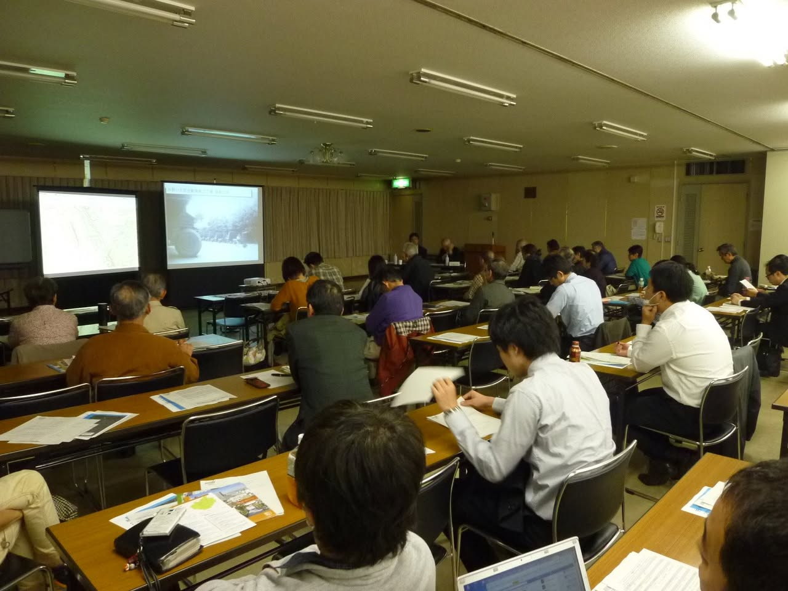

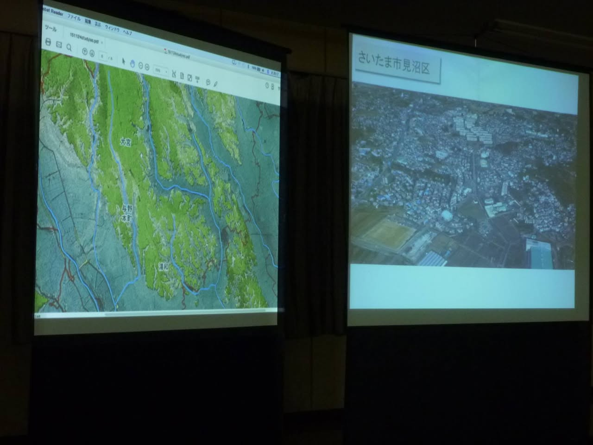

## 0217 — 2015-12-01 — 太田 一穂

- 投稿ID: 453480481519763
- 投稿URL: https://www.facebook.com/groups/186097664924714/posts/453480481519763/
- 要約: 明後日ですが、浦和の市民活動サポートセンターで Code for Japan 井戸端会議開催です。ふらりと寄っていただければ幸いです 2015/12/03(木) 第99回 Code for Japan 井戸端会議 さいたま市 参加者9人・興味あり19人
- コメント要約: （コメントなし）

明後日ですが、浦和の市民活動サポートセンターで Code for Japan 井戸端会議開催です。ふらりと寄っていただければ幸いです
https://www.facebook.com/events/1666018097011877/
2015/12/03(木)
第99回 Code for Japan 井戸端会議
さいたま市
参加者9人・興味あり19人

## 0218 — 2015-12-03 — 後藤 真太郎

- 投稿ID: 453871391480672
- 投稿URL: https://www.facebook.com/groups/186097664924714/posts/453871391480672/
- 要約: さいたまトリエンナーレさいたまスタディーズ第3回は12/7 岩槻駅東口市民活動センターで開催されます。10月に開催された岩槻マッピングパーティのフォローに最適ですので、是非、ご予定していただけますようお願いします。
- コメント要約: 日時：2015年12月7日（月）18:30～21:00 (開場 18:10) 会場：岩槻駅東口コミュニティセンター ワッツルームB 講師：藤原悌子、若林祥文、長谷川ます代 進行：三浦匡史 SAITAMATRIENNALE.JP さいたまスタディーズ 連続セミナー | さいたまトリエンナーレ2016 さいたまスタディーズ 連続セミナー | さいたまトリエンナーレ2016 参加します 藤原節に乞うご期待。

さいたまトリエンナーレさいたまスタディーズ第3回は12/7 岩槻駅東口市民活動センターで開催されます。10月に開催された岩槻マッピングパーティのフォローに最適ですので、是非、ご予定していただけますようお願いします。

### コメント — 後藤 真太郎

https://saitamatriennale.jp/event/787/　　　　　　　　　　　　　日時：2015年12月7日（月）18:30～21:00 (開場 18:10)
会場：岩槻駅東口コミュニティセンター ワッツルームB
講師：藤原悌子、若林祥文、長谷川ます代
進行：三浦匡史
SAITAMATRIENNALE.JP
さいたまスタディーズ 連続セミナー | さいたまトリエンナーレ2016
さいたまスタディーズ 連続セミナー | さいたまトリエンナーレ2016

### コメント — 吉永 篤史

参加します

### コメント — 後藤 真太郎

藤原節に乞うご期待。

## 0219 — 2015-12-04 — 後藤 真太郎

- 投稿ID: 454175464783598
- 投稿URL: https://www.facebook.com/groups/186097664924714/posts/454175464783598/
- 要約: さいたま市とCode for SAITAMAとの協働で行うオープンデータアイデアソン。いよいよ終盤戦を迎えました。先ず。12/12にアイデアソンを開催します。これまでの成果もブラシアップして来年開催されるトリエンナーレ、盆栽大会、クリテリウム、東京オリンピックに使えるアプリや地域課題を解決するアプリ開発を目指します。
- コメント要約: （コメントなし）

さいたま市とCode for SAITAMAとの協働で行うオープンデータアイデアソン。いよいよ終盤戦を迎えました。先ず。12/12にアイデアソンを開催します。これまでの成果もブラシアップして来年開催されるトリエンナーレ、盆栽大会、クリテリウム、東京オリンピックに使えるアプリや地域課題を解決するアプリ開発を目指します。申込みはこちら：
第2回オープンデータアイデアソン2015
PEATIX.COM
第2回オープンデータアイデアソン2015

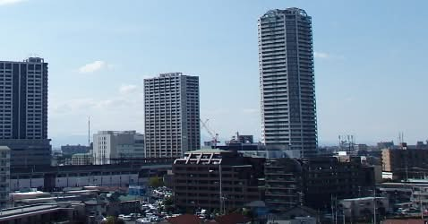

## 0220 — 2015-12-06 — 後藤 真太郎

- 投稿ID: 454709788063499
- 投稿URL: https://www.facebook.com/groups/186097664924714/posts/454709788063499/
- 要約: さいたま市とCode for SAITAMAの共同で行う12/12,1/16-17のオプンデータアイデアソンハッカソンのフライヤーを作り、本日、さいたま市内（浦和西口〜武蔵浦和近辺）の朝日・読売を対象に、新聞の折り込み広告にて配布しました。
- コメント要約: 申込みはこちら： PEATIX.COM 第2回オープンデータアイデアソン2015 第2回オープンデータアイデアソン2015 さいたま市市民活動センターで一穂さんに出くわして1枚もらいました。

さいたま市とCode for SAITAMAの共同で行う12/12,1/16-17のオプンデータアイデアソンハッカソンのフライヤーを作り、本日、さいたま市内（浦和西口〜武蔵浦和近辺）の朝日・読売を対象に、新聞の折り込み広告にて配布しました。
このイベントも終盤戦を迎え、12/12のアイデアソンでは、これまでの成果もブラシアップして来年開催されるトリエンナーレ、盆栽大会、クリテリウム、東京オリンピックに使えるアプリや子育て、介護などにおける地域課題を解決するアプリ開発を目指します。

### コメント — 後藤 真太郎

申込みはこちら：http://peatix.com/event/132528
PEATIX.COM
第2回オープンデータアイデアソン2015
第2回オープンデータアイデアソン2015

### コメント — 山中 邦久

さいたま市市民活動センターで一穂さんに出くわして1枚もらいました。

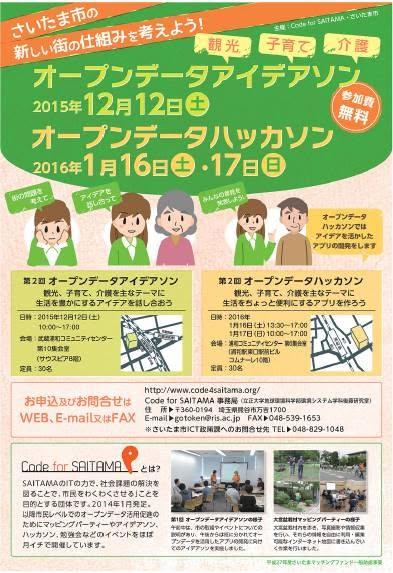

## 0221 — 2015-12-14 — Hiroyoshi Ishiideさんは太田 一穂さんと一緒にいます。

- 投稿ID: 456411051226706
- 投稿URL: https://www.facebook.com/groups/186097664924714/posts/456411051226706/
- 要約: Hiroyoshi Ishiide 第2回オープンデータアイデアソンの写真です。たくさんの方にご参加いただき、ありがとうございました。ところで、最後にご質問をいただいたように、このイベントとオープンデータとの関係性がはっきりとしていなくて、準備の段階でもう少し整理してシナリオを練っておくべきだったかもしれません。
- コメント要約: 石井出さん、お疲れ様でした＆素敵な写真をありがとうございます！ 「オープンデータ」については確かにそうですね。目指すところはもっと先にあるわけですし、本当は横文字でなくてもっと良い言葉が必要なんでしょうね。

Hiroyoshi Ishiide
第2回オープンデータアイデアソンの写真です。たくさんの方にご参加いただき、ありがとうございました。ところで、最後にご質問をいただいたように、このイベントとオープンデータとの関係性がはっきりとしていなくて、準備の段階でもう少し整理してシナリオを練っておくべきだったかもしれません。「オープンデータ」アイデアソンというよりは、「オープンガバメント・アイデアソン」としたほうが実態に近かったかなと思っております。— 太田 一穂さんと一緒です。
写真の説明はありません。. 写真の説明はありません。. 写真の説明はありません。. 写真の説明はありません。. 写真の説明はありません。

### コメント — 太田 一穂

石井出さん、お疲れ様でした＆素敵な写真をありがとうございます！
「オープンデータ」については確かにそうですね。目指すところはもっと先にあるわけですし、本当は横文字でなくてもっと良い言葉が必要なんでしょうね。その点では台湾の「開放資料」は良いなあと思いました。

### コメント — 古田武士

アイデアソンでオープンデータにこだわりすぎると狭くなりがちです。
ハッカソンでオープンデータを使うように推奨することのほうがいいかもしれません。

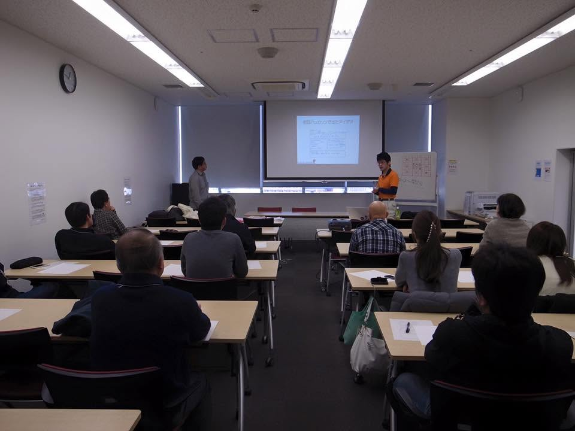

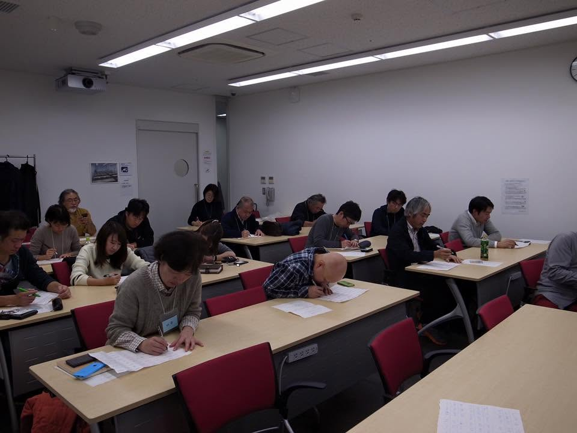

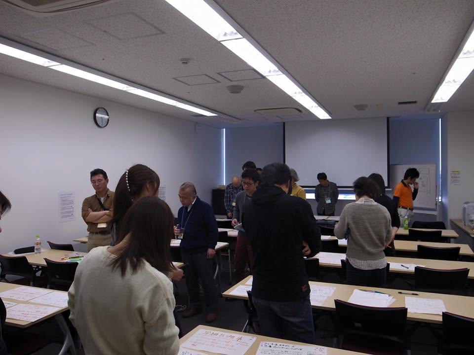

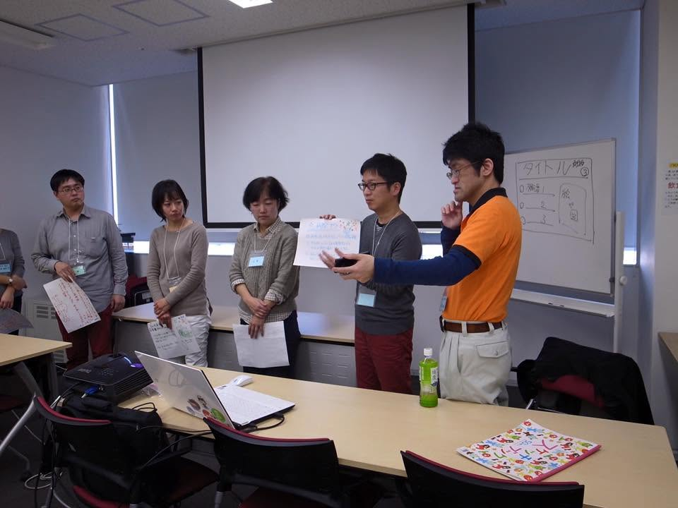

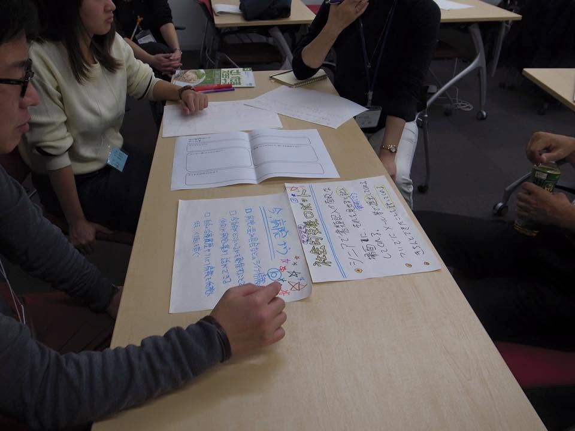

## 0222 — 2015-12-23 — 後藤 真太郎

- 投稿ID: 459293324271812
- 投稿URL: https://www.facebook.com/groups/186097664924714/posts/459293324271812/
- 要約: 1/29-30の協働型訓練のフライヤーが出来ました。是非ご参加下さい。 とよしま 亮介さんからの投稿をシェアしました とよしま 亮介さんがカバー写真を変更しました。
- コメント要約: （コメントなし）

1/29-30の協働型訓練のフライヤーが出来ました。是非ご参加下さい。https://www.facebook.com/events/1680404155513104/
とよしま 亮介さんからの投稿をシェアしました
とよしま 亮介さんがカバー写真を変更しました。
【更新情報】２日目のワークショップ
テーマ名　［ファシリテーター］＜情報提供団体＞
テーマ１　民間災害救助犬の利活用［池本］＜全日本救助犬団体協議会＞
テーマ２　自家用ヘリコプターの利活用［横路］＜市民航空支援センター＞
テーマ３　ICTの利活用～ご近所防災マップ（野外活動）～［後藤］＜立正大学
テーマ４　地域医療と地域防災［中野］＜東埼玉総合病院＞
テーマ５　無線航空機（ドローン）の利活用［松島］＜総務省情報通信研究機構＞
テーマ６　災害ボランティアの養成［山中］＜ＣＦＲ・市民救助隊＞
【変更情報】２日目の予定
９：００～　救助犬デモンストレーション
９：２０～　プロポーザルワークショップ
１１：３０～　ランチタイム・プロポーザルまとめ
１２：３０～　プロポーザルタイム
※以前以後の予定は従来通りです
--------------------------------------------------------
～首都圏災害に備えよう～
市民による市民のための「第３回協働型災害訓練 in 杉戸」
協働型災害訓練について
東日本大震災の経験と教訓を生かすべく、
平成25年度国土交通省広域的地域間共助推進事業としてスタートした「協働型災害訓練」。
大規模災害時には一人でも多くの命を助けるために、効率と統一された災害対応が必要になります。
この訓練では、米国で誕生した災害版ISOと呼ばれるICS（Incident（現場） Command（指揮） System（システム））を用い、
将来発生し得る大規模災害発生時に即時助け合いの対応ができる仕組みをつくることを目指しています。
協働型災害訓練の目的
1 将来発生し得る大規模災害発生時に即時助け合いの対応ができる仕組みをつくる
2 同時被災リスクの少ない複数の地域を集め、平時からの繋がりをつくる
3 行政・民間企業・ＮＰＯ等の多様な主体が地域を越えて広く連携する
4 保有する資源・ノウハウ・マンパワーなどを有機的に結び付ける
5 ＤＩＧを用い、自主防災組織のリーダーの資質と能力の向上を図る
6 一人でも多くの命を救うことができるようＩＣＳを用いる
開催概要
日時　平成28年1月29日（金）9:00～18:00
平成28年1月30日（土）9:00～17:10
会場　彩の国いきいきセンター・すぎとピア（埼玉県北葛飾郡杉戸町大字堤根4742-1）
費用　参加費無料（食事代別）
主催　杉戸町・富岡町・川内村地域間共助推進協議会
共催　市民キャビネット災害支援部会・スマート ICT 部会・立正大学地球環境科学部
協賛　この事業は赤い羽根共同募金の助成を受けて活動しています
お問い合わせ・申し込み
協働型災害訓練事務局（NPO埼玉ネット）
TEL 048-729-6151　FAX 048-729-6152
Mail info@saitamanet.or.jp
WEB http://www.kunren.wix.com/sugito

## 0223 — 2015-12-24 — 古田武士

- 投稿ID: 459868077547670
- 投稿URL: https://www.facebook.com/groups/186097664924714/posts/459868077547670/
- 要約: 外国人の動向調査でこういうサービスが開始されました。有料サービスなので必要に応じて加入するのもいいかもしれません。
- コメント要約: おぉ、なるほど。今月末までに登録すれば、1月末までは無料で試用できるんですね。 ”料金は月額1980円（税抜）だが、現在はトライアル期間で、2015年12月末までに登録した人は2016年1月末まで無料で利用できる。

外国人の動向調査でこういうサービスが開始されました。有料サービスなので必要に応じて加入するのもいいかもしれません。
【趣味のインターネット地図ウォッチ】 訪日外国人観光客の動態を地図上で可視化できる「インバウンド・レーダー」 - INTERNET Watch
INTERNET.WATCH.IMPRESS.CO.JP
【趣味のインターネット地図ウォッチ】 訪日外国人観光客の動態を地図上で可視化できる「インバウンド・レーダー」 - INTERNET Watch

### コメント — 柴田 重臣

おぉ、なるほど。今月末までに登録すれば、1月末までは無料で試用できるんですね。
”料金は月額1980円（税抜）だが、現在はトライアル期間で、2015年12月末までに登録した人は2016年1月末まで無料で利用できる。”

### コメント — 後藤 真太郎

そうなんですよ。来月のハッカソンでは無料で使用できるんです。「税金はどこへいった？」ならぬ、「外国人はどこへ行った？」ですね。

## 0224 — 2015-12-29 — 後藤 真太郎

- 投稿ID: 461353667399111
- 投稿URL: https://www.facebook.com/groups/186097664924714/posts/461353667399111/
- 要約: diamond.jp 今、クラウドファンディングをやって、この内容が身にしみてわかります。しかしながら、こうした仕組みを先進的に始めた鶴ヶ島市は凄い。 「オープンデータ」という基盤の活用で官民一体となって地域の課題を解決する DIAMOND.JP 「オープンデータ」という基盤の活用で官民一体となって地域の課題を解決する 返信1件を見る
- コメント要約: アイデアソンで作ったアイデアをハッカソンで形にする。さらに実用にするためにはファンディングが必要ですが、その機能を内部に抱えているという図式。実用化の際にアクセンチアの社員がプロボノとして参加しているのも実装化できた肝かと。

diamond.jp
今、クラウドファンディングをやって、この内容が身にしみてわかります。しかしながら、こうした仕組みを先進的に始めた鶴ヶ島市は凄い。
「オープンデータ」という基盤の活用で官民一体となって地域の課題を解決する
DIAMOND.JP
「オープンデータ」という基盤の活用で官民一体となって地域の課題を解決する
返信1件を見る

### コメント — 後藤 真太郎

アイデアソンで作ったアイデアをハッカソンで形にする。さらに実用にするためにはファンディングが必要ですが、その機能を内部に抱えているという図式。実用化の際にアクセンチアの社員がプロボノとして参加しているのも実装化できた肝かと。

### コメント — 小川 美穂子

後藤先生、全く理解できませ～ん。英語の専門用語。。。

### コメント — 小川 美穂子

またいつか勉強会やってください。

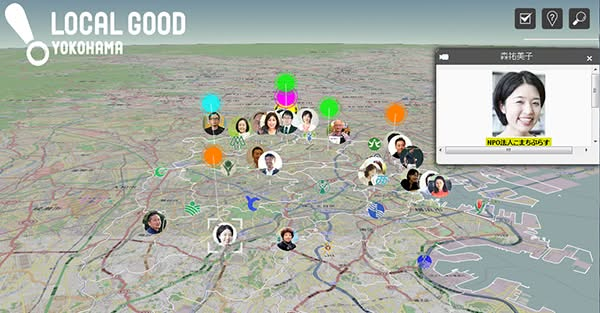

## 0225 — 2016-01-03 — 松尾 道夫

- 投稿ID: 462886207245857
- 投稿URL: https://www.facebook.com/groups/186097664924714/posts/462886207245857/
- 要約: 第３回協働型災害訓練in杉戸参加者募集中 転送・転載歓迎 ●協働型災害訓練in杉戸 主催 杉戸町・富岡町・川内村地域間共助推進協議会 共催 市民キャビネット災害支援部会・スマートICT部会・立正大学地球環境科学部 主幹 すぎとＳＯＨＯクラブ、ＮＰＯ埼玉ネット 協賛 この事業は、赤い羽根共同募金の助成を受けて開催しています。
- コメント要約: （コメントなし）

第３回協働型災害訓練in杉戸参加者募集中
転送・転載歓迎
●協働型災害訓練in杉戸
主催　杉戸町・富岡町・川内村地域間共助推進協議会
共催　市民キャビネット災害支援部会・スマートICT部会・立正大学地球環境科学部
主幹　すぎとＳＯＨＯクラブ、ＮＰＯ埼玉ネット
協賛　この事業は、赤い羽根共同募金の助成を受けて開催しています。
日時　平成28年１月29日（金）9：00～18：00
平成28年１月30日（土）9：00～17：30
場所　杉戸町　彩の国いきいきセンター・すぎとピア（埼玉県北葛飾郡杉戸町大字堤根4742-1）東武動物公園東口徒歩30分
参加費　無料（食事代、交通費除く）
特徴　阪神淡路大震災・東日本大震災・ネパール地震・豪雨催外等の緊急出動・復興支援を担った実動部隊と大学・研究者が協働して、ＩＣＳを基盤として、ＤＩＧ・ＨＵＧ等を活用しています。さらに災害時における行政とＮＰＯの先進的な「関係者会議」の訓練、自主防災組織に対する避難所運営シュミレーションゲーム（東日本大震災経験者参加）地域医療機関との連携等を取り入れています。
参加申し込み・詳細はhttp://kyoujo.npgo.net/　を確認ください。
●訓練研究会の案内
日時　平成28年１月５日（火）17：30－20：00
場所　埼玉ＮＰＯハウス（〒331-0823　埼玉県さいたま市北区日進町２丁目544番地1）
【アクセス】日進駅南口より西郵便局通り（七夕通りより１本東側のイオン大宮店へ行く通り）徒歩５分。
内容：
17：30－20：00　協働型災害訓練in杉戸　研究会
会議終了後20：00　から埼玉ＮＰＯハウスで新年会を開催します。（会費1,000円）
【以下訓練研究会を埼玉ＮＰＯハウスで行います】
日時　平成28年１月12日（火）17：30－20：00
日時　平成28年１月19日（火）17：30－20：00
日時　平成28年１月26日（火）17：30－20：00
※公開しています。ご興味がある方はご参加ください。
KYOUJO.NPGO.NET
「広域的地域間共助」推進事業

## 0226 — 2016-01-18 — 後藤 真太郎

- 投稿ID: 467418063459338
- 投稿URL: https://www.facebook.com/groups/186097664924714/posts/467418063459338/
- 要約: こういう手もあるようですね。熊谷の某ホテルもインバウンド用に宿が取れないくらい利用されているようです。企画してから軌道に乗せるのに１０年かかったとか。イベントの時のホテル不足の対策とイベントがない時の対策とのバランスが地域課題ですね。
- コメント要約: ３月５日までには何とか形にしたいですね 期待してます。

こういう手もあるようですね。熊谷の某ホテルもインバウンド用に宿が取れないくらい利用されているようです。企画してから軌道に乗せるのに１０年かかったとか。イベントの時のホテル不足の対策とイベントがない時の対策とのバランスが地域課題ですね。1/16-17と行ったオープンデータハッカソンで作られた空き家対策アプリ「AKIYA」の出番も近い。
nohttp://zasshi.news.yahoo.co.jp/article?a=20160115-00000004-sasahi-bus_all
観光客「名古屋城には行かない」のに…今、名古屋で宿がとれない理由〈ＡＥＲＡ〉（dot.） - Yahoo!ニュース
ZASSHI.NEWS.YAHOO.CO.JP
観光客「名古屋城には行かない」のに…今、名古屋で宿がとれない理由〈ＡＥＲＡ〉（dot.） - Yahoo!ニュース

### コメント — 小野 浩

３月５日までには何とか形にしたいですね

### コメント — 松島 勲

期待してます。

## 0227 — 2016-01-20 — 後藤 真太郎

- 投稿ID: 468105373390607
- 投稿URL: https://www.facebook.com/groups/186097664924714/posts/468105373390607/
- 要約: 3/5のインターナショナルオープンデータデイ、オープンデータ関連イベントの成果公開フォーラム開催として登録しておきました。
- コメント要約: （コメントなし）

3/5のインターナショナルオープンデータデイ、オープンデータ関連イベントの成果公開フォーラム開催として登録しておきました。

## 0228 — 2016-01-27 — 後藤 真太郎

- 投稿ID: 470287723172372
- 投稿URL: https://www.facebook.com/groups/186097664924714/posts/470287723172372/
- 要約: とよしま 亮介さんからの投稿をシェアしました 写真の説明はありません。. 写真の説明はありません。. 写真の説明はありません。. 写真の説明はありません。 とよしま 亮介 いよいよ、開催が迫ってきました！
- コメント要約: （コメントなし）

とよしま 亮介さんからの投稿をシェアしました
写真の説明はありません。. 写真の説明はありません。. 写真の説明はありません。. 写真の説明はありません。
とよしま 亮介
いよいよ、開催が迫ってきました！
当日は報道各社さんも取材にお越しいただけるとのこと、感謝！
参加表明がまだの方は、イベントページでポッチとお願いします＾＾
～首都圏災害に備えよう～
市民による市民のための「第３回協働型災害訓練 in 杉戸」
【見どころ!!】
１日目には、セレモニーを開催。地域首長をはじめ議員の来賓を予定しています。
チェックインワークでは、防災先進国アメリカの事例を紹介（市民キャビネット山中氏）。
テレビなどでお馴染みの災害リスク研究所の松島氏からは、実際の発災時に考えておくべき、地図上からは見えない地形や高低差などについての講演を行っていただきます。
図上訓練は上記の通り行います。条件付与カードなどを充実し、今年は昨年よりも進化したＩＣＳが学べるＤＩＧとなっています。
フィードバックタイムでは、富岡町・川内村それぞれが「震災から間もなく５年。私たちの今」と題して、今の町の様子を赤裸々に語ってくださいます。
２日目は、数々の災害で活躍している日本捜索救助犬協会（全日本救助犬団体協議会（代表牧原秀樹氏）所属）による救助犬パフォーマンスが行われます。
その後、各分野のプロフェッショナルがリーダーとなった、プロポーザルワークショップを行います。
テーマ１　民間災害救助犬の利活用＜日本捜索救助犬協会＞
テーマ２　自家用ヘリコプターの利活用＜市民航空支援センター＞
テーマ３　ICTの利活用～ご近所防災マップ・情報提供～（野外活動含む）＜立正大学
テーマ４　地域医療と地域防災＜東埼玉総合病院＞
テーマ５　無線航空機（ドローン）の利活用＜総務省情報通信研究機構＞
テーマ３は、外に出てマッピングを行います。テーマ５は、総務省が現在実験を行っている無線航空機についての状況共有も行われます。
午後、2日目のセレモニーを行い、周辺首長や議員の来賓を予定しています。
シミュレーションゲームでは全国で導入が進んでいるＨＵＧを行います。実際に避難所を運営する際の緊迫感が体験できるのでお勧めです。ＢＵＧはまだ中身が見えていないので乞うご期待です。
【更新情報】２日目のワークショップ
テーマ名　［ファシリテーター］＜情報提供団体＞
テーマ１　民間災害救助犬の利活用［池本］＜全日本救助犬団体協議会＞
テーマ２　自家用ヘリコプターの利活用［横路］＜市民航空支援センター＞
テーマ３　ICTの利活用～ご近所防災マップ（野外活動）～［後藤］＜立正大学
テーマ４　地域医療と地域防災［中野］＜東埼玉総合病院＞
テーマ５　無線航空機（ドローン）の利活用［松島・酒井］＜総務省情報通信研究機構＞
テーマ６　災害ボランティアの養成［山中］＜ＣＦＲ・市民救助隊＞
【変更情報】２日目の予定
９：００～　救助犬デモンストレーション
９：２０～　プロポーザルワークショップ
１１：３０～　ランチタイム・プロポーザルまとめ
１２：３０～　プロポーザルタイム
※以前以後の予定は従来通りです
開催概要
日時　平成28年1月29日（金）9:00～18:00
平成28年1月30日（土）9:00～17:10
会場　彩の国いきいきセンター・すぎとピア（埼玉県北葛飾郡杉戸町大字堤根4742-1）
費用　参加費無料（食事代別）
主催　杉戸町・富岡町・川内村地域間共助推進協議会
共催　市民キャビネット災害支援部会・スマート ICT 部会・立正大学地球環境科学部
協賛　この事業は赤い羽根共同募金の助成を受けて活動しています
お問い合わせ・申し込み
協働型災害訓練事務局（NPO埼玉ネット）
TEL 048-729-6151　FAX 048-729-6152
Mail info@saitamanet.or.jp
WEB http://www.kunren.wix.com/sugito
Facebookイベントページ　http://on.fb.me/1nMi1C1

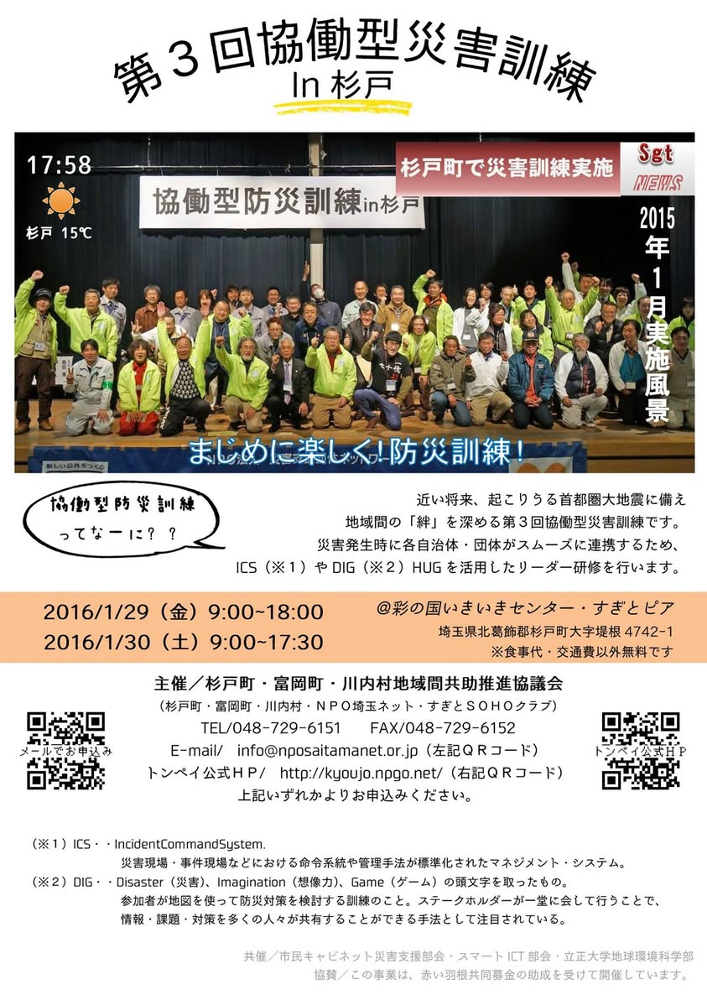

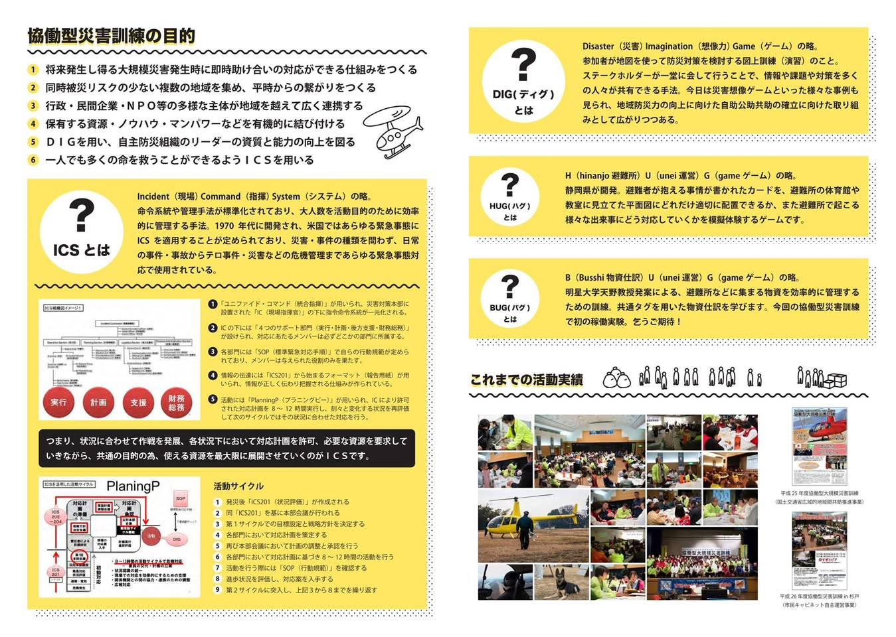

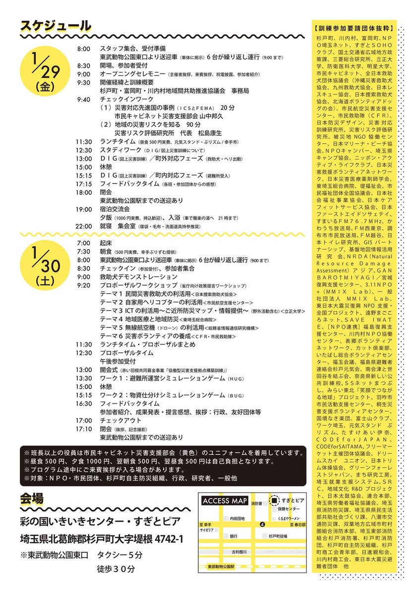

## 0229 — 2016-02-11 — 後藤 真太郎

- 投稿ID: 475472595987218
- 投稿URL: https://www.facebook.com/groups/186097664924714/posts/475472595987218/
- 要約: いよいよその時がやって来ました。 Saitamarch*Ingress: 「Saitamach*Ingress」を３月２７日（日）に開催します！ STIBINGRESS.BLOGSPOT.JP Saitamarch*Ingress: 「Saitamach*Ingress」を３月２７日（日）に開催します！
- コメント要約: 期待しています。 桜はまだですかね？ 桜の見頃ですね おおッ、こういう時に役立つのはマッピングパーティーで作ったマップですね。 私、さいたマーチ2日間、30キロコース申し込んでおりますから、このイングレス、参加しましょう！

いよいよその時がやって来ました。
Saitamarch*Ingress: 「Saitamach*Ingress」を３月２７日（日）に開催します！
STIBINGRESS.BLOGSPOT.JP
Saitamarch*Ingress: 「Saitamach*Ingress」を３月２７日（日）に開催します！

### コメント — 新井 正男

期待しています。

### コメント — 後藤 真太郎

桜はまだですかね？

### コメント — 吉永 篤史

桜の見頃ですね

### コメント — 後藤 真太郎

おおッ、こういう時に役立つのはマッピングパーティーで作ったマップですね。

### コメント — 土井 裕之

私、さいたマーチ2日間、30キロコース申し込んでおりますから、このイングレス、参加しましょう！

### コメント — 後藤 真太郎

歩きスマホはいけませんが

## 0230 — 2016-02-26 — 後藤 真太郎

- 投稿ID: 480276745506803
- 投稿URL: https://www.facebook.com/groups/186097664924714/posts/480276745506803/
- 要約: 3/5はインターナショナルオープンデータデイです。今年度さいたま市のマッチングファンドで行った事業報告を中心に報告します。今回は、アーバンデザインセンターみそのをお借りして新しい施設を利用させていただくことになりましたので施設紹介なども予定しております。
- コメント要約: （コメントなし）

3/5はインターナショナルオープンデータデイです。今年度さいたま市のマッチングファンドで行った事業報告を中心に報告します。今回は、アーバンデザインセンターみそのをお借りして新しい施設を利用させていただくことになりましたので施設紹介なども予定しております。https://www.facebook.com/events/1665861730335167/
2016/03/05(土)
【3/5土曜】オープンデータデイ2016 in さいたま
アーバンデザインセンターみその
市民キャビネット・スマートICT部会とシェアされています

## 0231 — 2016-03-01 — 後藤 真太郎

- 投稿ID: 481583672042777
- 投稿URL: https://www.facebook.com/groups/186097664924714/posts/481583672042777/
- 要約: 埼玉県からも川越の事例で奨励賞が出ています。おめでとうございます。
- コメント要約: アニメ関係では マンガを切り口とした訪日観光の普及啓発と地域への誘客導線 の構築（株式会社JTBグローバルマーケティング＆トラベル）

埼玉県からも川越の事例で奨励賞が出ています。おめでとうございます。
ICTを活用した見える化による地域活性化とバスサービスの確保
（イーグルバス株式会社）
SOUMU.GO.JP
総務省｜地方創生に資する「地域情報化大賞2015」表彰事例の発表及びシンポジウム『「地域ICTサミット2015」〜地方創生におけるIoTの可能性〜』の開催
総務省は、地方創生に資する「地域情報化大賞2015」表彰事例の募集を平成27年10月9日から11月13日まで行い、全体で85件の応募がありました。これらについて審査を実施し、下記のとおり表彰事例が決定しましたのでお知らせします。 　また、本賞の表彰式を含むシンポジウムを下記のとおり開催します。

### コメント — 後藤 真太郎

アニメ関係では　　　　　　　　　　　　　　　　　　　　　　　マンガを切り口とした訪日観光の普及啓発と地域への誘客導線
の構築（株式会社JTBグローバルマーケティング＆トラベル）

## 0232 — 2016-03-03 — 後藤 真太郎

- 投稿ID: 482225581978586
- 投稿URL: https://www.facebook.com/groups/186097664924714/posts/482225581978586/
- 要約: インターナショナル・オープンデータディ in SAITAMAのお知らせ Code for SAITAMAは埼玉県内の社会的課題に対し、コンピュータ技術を使って課題解決を図ろうとしている団体です。
- コメント要約: （コメントなし）

インターナショナル・オープンデータディ　in SAITAMAのお知らせ
Code for SAITAMAは埼玉県内の社会的課題に対し、コンピュータ技術を使って課題解決を図ろうとしている団体です。
年に一度、世界で同時にイベントを開催するオープンデータのお祭り、インターナショナル・オープンデータデイ2016が、2016年3月5日に開催され、Code for SAITAMAも昨年に引き続きオープンデータデイのイベントを開催します。
今年度のCode for SAITAMAは、さいたまマッチングファンドでさいたま市と共催のマッピングパーティー、アイデアソン、ハッカソンを2回づつ行いました。他にも Code forJapan Summit 2016 をはじめ各地で活動の幅を広げておりました。そういった活動のまとめとして、このインターナショナル・オープンデータデイ2016に参加します。
場所：アーバンデザインセンターみその
日時 2016年3月5日 土曜日 13時から17時まで
費用：無料
プログラム（若干の変更の可能性があります。）：
13:00-13:30 受付
13:30-13:40 挨拶・主旨説明
13:40-14:10 アーバンデザインセンターとは？
14:10-14:20 休憩
14:20-16:00 マッチングファンド事業の説明
盆栽村マッピングパーティー
岩槻マッピングパーティー
第１・2回アイデアソン・ハッカソンの成果
E-シニア
トリエンナーレ for Ever（BENJOYを含む）
AKIYA（空き家対策プロジェクト）
16:00-16:30ワークショップ
－Code for SAITAMAは浦和美園周辺の地域課題にどう貢献できるか―
16:30-16:50 発表・振り返り
16:50-17:00 まとめ
17:00 閉会
終了後、交流会（有料）を予定しております。是非、ご参加ください。
参加申込みはこちら。https://www.facebook.com/events/1665861730335167/1670366683218005/

## 0233 — 2016-03-05 — 古田武士

- 投稿ID: 482816721919472
- 投稿URL: https://www.facebook.com/groups/186097664924714/posts/482816721919472/
- 要約: IODD 2016 での発表資料をシェアします。 International open data day 2016 ハッカソン成果発表 SLIDESHARE.NET International open data day 2016 ハッカソン成果発表
- コメント要約: （コメントなし）

IODD　2016 での発表資料をシェアします。
International open data day 2016 ハッカソン成果発表
SLIDESHARE.NET
International open data day 2016 ハッカソン成果発表

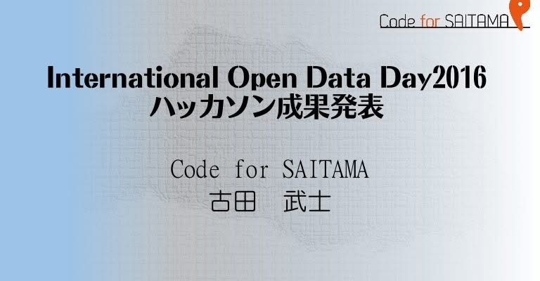

## 0234 — 2016-03-25 — 後藤 真太郎

- 投稿ID: 490669121134232
- 投稿URL: https://www.facebook.com/groups/186097664924714/posts/490669121134232/
- 要約: ご参加ください。 川越お花見マッピングパーティ (2016/03/26 11:00〜) CONNPASS.COM/EVENT/29067/ 川越お花見マッピングパーティ (2016/03/26 11:00〜)
- コメント要約: （コメントなし）

ご参加ください。
川越お花見マッピングパーティ (2016/03/26 11:00〜)
CONNPASS.COM/EVENT/29067/
川越お花見マッピングパーティ (2016/03/26 11:00〜)

## 0235 — 2016-03-25 — 後藤 真太郎

- 投稿ID: 490698667797944
- 投稿URL: https://www.facebook.com/groups/186097664924714/posts/490698667797944/
- 要約: オープンデータになってるとさらにいいのですが。説明に時間がかかりそうです。4/3の国宝聖天山マッピングパーティで使います。 熊谷観光・文化財ナビ「ここくま」公開: 熊谷市文化財日記 KUMAGAYASIBUNKAZAI.BLOG.SO-NET.NE.JP 熊谷観光・文化財ナビ「ここくま」公開: 熊谷市文化財日記
- コメント要約: （コメントなし）

オープンデータになってるとさらにいいのですが。説明に時間がかかりそうです。4/3の国宝聖天山マッピングパーティで使います。
熊谷観光・文化財ナビ「ここくま」公開: 熊谷市文化財日記
KUMAGAYASIBUNKAZAI.BLOG.SO-NET.NE.JP
熊谷観光・文化財ナビ「ここくま」公開: 熊谷市文化財日記

## 0236 — 2016-03-28 — 後藤 真太郎

- 投稿ID: 492568587610952
- 投稿URL: https://www.facebook.com/groups/186097664924714/posts/492568587610952/
- 要約: 4月のCode for SAITAMAのイベントは、熊谷の国宝聖天山歓喜院でのマッピングパーティーです。多くの方の参加をお待ちしてます。 聖天山歓喜院： 世界遺産の宝庫、京都では毎月マッピングパーティーが行われています。
- コメント要約: （コメントなし）

4月のCode for SAITAMAのイベントは、熊谷の国宝聖天山歓喜院でのマッピングパーティーです。多くの方の参加をお待ちしてます。
聖天山歓喜院：
http://www.city.kumagaya.lg.jp/kanko/midokoro/menum…youdenzan/
世界遺産の宝庫、京都では毎月マッピングパーティーが行われています。写真1は二条城のマッピングの結果です。このようにデータを作っておけば、観光マップやレストランガイド、商店街のガイドなどの印刷物にも使えます。
Code for SAITAMAでは、これまでに、大宮神社、さいたま新都心、盆栽町、岩槻城、川越等でマッピングパーティーを開催し、まちづくりとのコラボを行ってきました。
＊マッピングパーティーというのは、皆で自由に使える地図（オープンストリートマップといいます。通常OSMと呼ばれています。）を作るワークショップです。史跡めぐりと併せて行えば歴史の勉強にもなりますし、ウォーキングと併せて行えばまちの発見が出来るなど色んな組み合わせがあります。
日時：2016年4月3日 10:00-17:00
費用：無料（交通費、交流会参加費は有料）
スケジュール（変更の可能性あり）：
9:15　熊谷駅北口、聖天山、太田行バス乗り場集合
9:30   太田行バス乗車（乗リ遅れたら自力で移動してください。太田行き、聖天山行き、西小泉駅行きに乗ってください。）
10:00  聖天山着
10:00-10:45 お休み処にて説明会
10:45-15:00 班に分かれてマッピング
15:00-16:00 まとめ
16:00-16:30 熊谷に移動
16:30-16:45 熊谷堤に移動
16:45- 花見
19:00  解散
バス時刻表：
http://www.asahibus.jp/html/time/kuma02_20150314.pdf
WWW.CITY.KUMAGAYA.LG.JP
www.city.kumagaya.lg.jp

## 0237 — 2016-04-02 — 後藤 真太郎

- 投稿ID: 495425557325255
- 投稿URL: https://www.facebook.com/groups/186097664924714/posts/495425557325255/
- 要約: Code for Todaで子供プログラミング教室が始まりました。 山中 邦久さんからの投稿をシェアしました 写真の説明はありません。. 写真の説明はありません。
- コメント要約: （コメントなし）

Code for Todaで子供プログラミング教室が始まりました。
山中 邦久さんからの投稿をシェアしました
写真の説明はありません。. 写真の説明はありません。. 写真の説明はありません。. 写真の説明はありません。. 写真の説明はありません。
山中 邦久
今日は子供のプログラム学習のワークショップでした｡ほとんど宣伝らしいこともしなかったのに予約なしの子も加わって６人の参加で、１回目としては大成功でした｡評価もよく、もっとやりたい、今度はいつとの子供たちの声とお母さんたちの感想や意見も聞けて、次回の参考になるばかりか、積極的にやる気になりました。

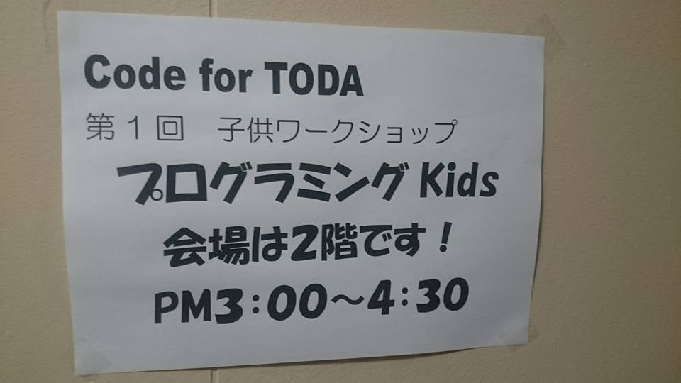

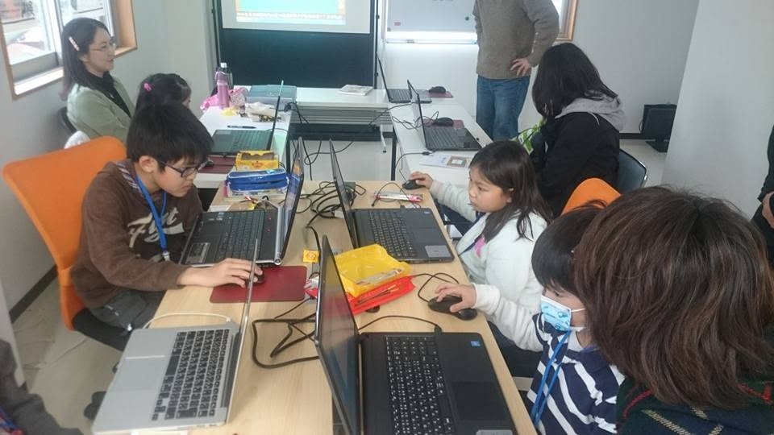

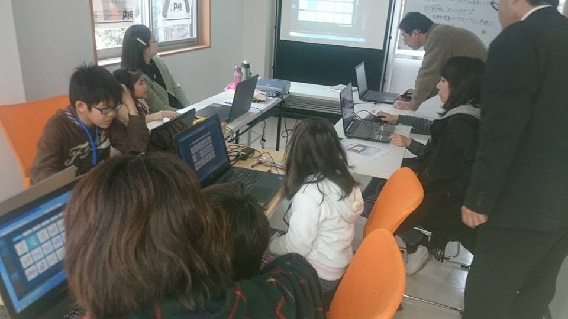

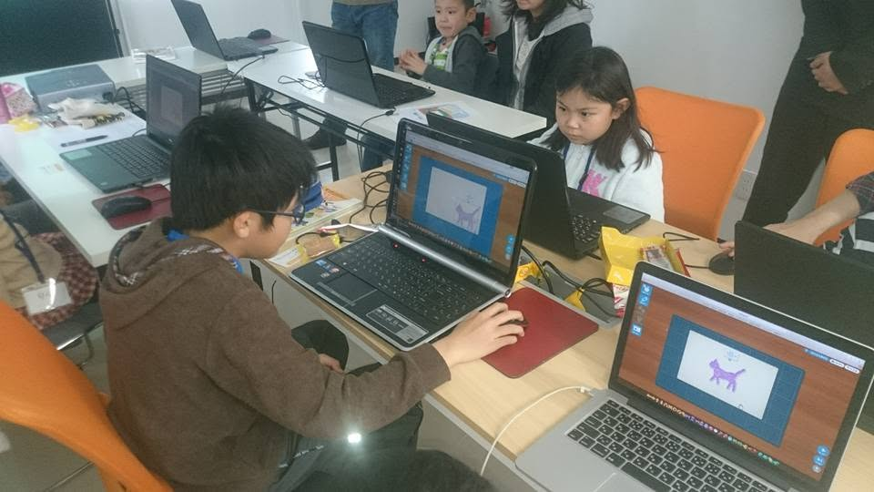

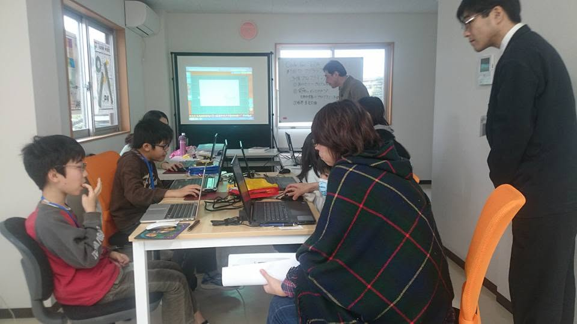

## 0238 — 2016-04-06 — 太田 一穂

- 投稿ID: 496881837179627
- 投稿URL: https://www.facebook.com/groups/186097664924714/posts/496881837179627/
- 要約: 先日のオープンデータハッカソンの空き家チームの会合を浦和パルコ9階の市民活動サポートセンターでゆるゆると開いてますが、諸事情が重なりあまり人いませんので「井戸端会議」を行おうと思います。
- コメント要約: 中央ラウンジ、白いエレベーター降りてすぐのところです。僕はオープンストリートマップの書き込みをしてます。 太田さん、9階ですよん！

先日のオープンデータハッカソンの空き家チームの会合を浦和パルコ9階の市民活動サポートセンターでゆるゆると開いてますが、諸事情が重なりあまり人いませんので「井戸端会議」を行おうと思います。電源タップは確保しましたので、ふらっと立ち寄れる人は是非是非。21時過ぎまでやってます
返信3件を見る

### コメント — 太田 一穂

中央ラウンジ、白いエレベーター降りてすぐのところです。僕はオープンストリートマップの書き込みをしてます。

### コメント — 安部 邦昭

太田さん、9階ですよん！

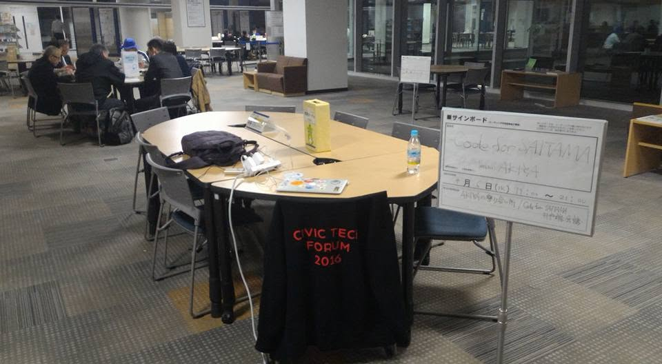

## 0239 — 2016-04-28 — 太田 一穂

- 投稿ID: 504632879737856
- 投稿URL: https://www.facebook.com/groups/186097664924714/posts/504632879737856/
- 要約: 5月5日に、埼玉に来る前に僕が住んでいた府中でマッピングパーティーやります。昨年のCode for Japan Summit 2015で知り合った府中の小林さんとの企画です。
- コメント要約: （コメントなし）

5月5日に、埼玉に来る前に僕が住んでいた府中でマッピングパーティーやります。昨年のCode for Japan Summit 2015で知り合った府中の小林さんとの企画です。
大國魂神社の例大祭「くらやみ祭」をみながら周辺の町並みを歩いて回ります。OpenStreetMapやLocalWiki中心に、できるだけ初心者むけにゆったりやろうと思ってます。途中参加自由です。
https://www.facebook.com/events/227304584325687/
2016/05/05(木)
府中くらやみまつりマッピング　~まち歩きと祭りと地図づくり体験~
けやき並木、旧甲州街道、大國魂神社
OpenStreetMap Japan Communityとシェアされています

## 0240 — 2016-05-05 — 後藤 真太郎

- 投稿ID: 506934432841034
- 投稿URL: https://www.facebook.com/groups/186097664924714/posts/506934432841034/
- 要約: ハッカソンの賞品に使わせていただいているうなぎ煎餅の新しいメニューができました。是非お試しください。 うなぎ煎餅「UNAGI RED」発売～さいたま市 WWW.QUALITYSAITAMA.COM うなぎ煎餅「UNAGI RED」発売～さいたま市
- コメント要約: 山椒の味が微妙に効いてビールのおつまみにピッタリ。 後藤 真太郎先生 ご無沙汰しております。投稿、有難うございました。

ハッカソンの賞品に使わせていただいているうなぎ煎餅の新しいメニューができました。是非お試しください。
うなぎ煎餅「UNAGI RED」発売～さいたま市
WWW.QUALITYSAITAMA.COM
うなぎ煎餅「UNAGI RED」発売～さいたま市

### コメント — 後藤 真太郎

山椒の味が微妙に効いてビールのおつまみにピッタリ。

### コメント — 菩提寺 由美子

後藤 真太郎先生
ご無沙汰しております。投稿、有難うございました。

## 0241 — 2016-05-15 — 石橋 宏太

- 投稿ID: 510583122476165
- 投稿URL: https://www.facebook.com/groups/186097664924714/posts/510583122476165/
- 要約: ---「人口増加都市ブンセキ」のご紹介--- 投入したコスト（歳出）に対してどのような行政サービスが生まれ、その行政サービスは社会にどのような影響を与え、地域住民の満足度にどのような影響を与えたかが問われている自治体において他の市町村とのベンチマークは非常に大切なこと。
- コメント要約: 埼玉県でRESAS利用の講習会がはじまりますのでそのタイミングで利用者拡大に繋がったらいいですね。 後藤さん、ありがとうございます！ きっとみなさんのお役に立てるツールだと思いますのでまずは知っていただけるようがんばります。

---「人口増加都市ブンセキ」のご紹介---
投入したコスト（歳出）に対してどのような行政サービスが生まれ、その行政サービスは社会にどのような影響を与え、地域住民の満足度にどのような影響を与えたかが問われている自治体において他の市町村とのベンチマークは非常に大切なこと。
「人口増加都市ブンセキ」はそのベンチマークを支援するためのプラットフォームを提供いたします。
＜「人口増加都市ブンセキ」の主な機能＞
1. 人口、福祉、医療、治安、行財政など21の分野811のデータ項目を最大35年分収録しており幅広いベンチマークが可能
2. 結果をグラフと表の両方で表示
3. そのままのデータのみならず、「人口当たり」、「面積当たり」、「前年対比増減率」など単位化することで市町村同士をベンチマークすることが可能
4. 特定の市町村に加えて全市町村・市・町村・類似団体・都道府県の平均も合わせてベンチマークすることが可能
5. ベンチマーク機能
・データベンチマーク
特定の市町村の２つのデータをベンチマーク。主に投資したコストに対して期待する成果の相関を見るなど２つのデータ間の相関を見ることが可能。
例.　◯◯県△△村の「人口」と「税収」を「前年対比増減率」で時系列にベンチマーク
・市町村時系列ベンチマーク
２つの市町村の特定のデータ項目に関して時系列に比較
例.　◯◯県△△村と××県◯◯村の「人口当たり転出者数」を時系列にベンチマーク
・市町村分野別ベンチマーク
２つの市町村をある分野のデータを横に並べて比較
例.　◯◯県△△村と××県◯◯村の2013年「主要目的別歳出項目」をベンチマーク
6. 合算が可能なデータ項目の場合は合併市町村のデータを合算して表示することができるため合併市町村の時系列比較が可能
7. 表示される全てのグラフはjpg、png、svg、pdf形式でダウンロードすることができるため容易に二次利用が可能
8. 表示される全ての表データはcsv形式でダウンロードすることができるため容易に二次利用が可能
9. 特定分野のデータを全市町村、全市、全町村、類似団体、都道府県単位でダウンロードすることができるため俯瞰的なデータ確認が可能
例.　類似団体町村V-2の「人口５歳階級別」データをダウンロード
14日の無償トライアルもご利用いただけますので、ぜひ一度試してみてください。
よろしくお願いいたします。
本件に関するお問い合わせ、ご意見、ご感想は下記までお気軽にご連絡いただければ幸いです。
ミエルカ・ラボ（株式会社　社会価値’見える化’研究所）
石橋宏太
e-mail:kota.ishibashi@visualization-labo.com
tel:048-782-7663
人口増加都市ブンセキについて
VISUALIZATION-LABO.JP
人口増加都市ブンセキについて

### コメント — 後藤 真太郎

埼玉県でRESAS利用の講習会がはじまりますのでそのタイミングで利用者拡大に繋がったらいいですね。

### コメント — 石橋 宏太

後藤さん、ありがとうございます！
きっとみなさんのお役に立てるツールだと思いますのでまずは知っていただけるようがんばります。

### コメント — 後藤 真太郎

県からRESASの講習会とアイデアソン、ハッカソンと併せてどうでしょうかというイベント案件が出てきました。これに人工都市ブンセキも併せて行ったらどうでしょうか？とすると７月16日（土）のご都合は如何でしょうか？午前中のインプットワークがRESAS、午後最初のインプットワークがブンセキ、その後アイデアソン。

### コメント — 石橋 宏太

後藤さん、ありがとうございます。 RESASと肩を並べさせていただくというのは大変恐縮ですが、皆さんのお役に立てれば幸いです。
7/16（土）は予定を開けておきますのでご紹介をいただければ幸いです。
また、「人口増加都市」自体まだまだそれほど知られていないため必要があればご説明に伺います。
宜しくお願い致します。

### コメント — 後藤 真太郎

地産地消のGiSは大切にしないと

## 0242 — 2016-05-24 — 後藤 真太郎さんがCode for SAITAMA～さいたまのIT×市民活動をわくわくする～のプライバシー設定を「プライベート」から「公開」に変更しました。

- 投稿ID: 513670772167400
- 投稿URL: https://www.facebook.com/groups/186097664924714/posts/513670772167400/
- 要約: （要約なし）
- コメント要約: Code for SATAMAの準備段階に非公開で立ち上げたこのグループ、切り替えの制限が緩和されたこともあり、皆さんのご要望もあって公開することにしました。不都合がおありでしたらご意見お願いします。

（本文なし。コメントからイベント関連性を確認）

### コメント — 後藤 真太郎

Code for SATAMAの準備段階に非公開で立ち上げたこのグループ、切り替えの制限が緩和されたこともあり、皆さんのご要望もあって公開することにしました。不都合がおありでしたらご意見お願いします。

### コメント — 太田 一穂

こちらが非公開であったため、Code for Japan のブリゲイド申請にあたって公開ページを立ち上げた経緯があります。
https://www.facebook.com/Code-for-Saitama-683681868352792/
・FBグループは情報交換、議論の場
・FBページはイベント告知用
と使い分けてきました。今後もこの棲み分けは変わらないかなと思いますが、こちらに関してもご意見があればお願い致します。
Code for SAITAMA
非営利団体
熊谷市 (Japan・埼玉県)
プレビューを削除

### コメント — 後藤 真太郎

それでいいと思います。

## 0243 — 2016-05-30 — 後藤 真太郎

- 投稿ID: 515790131955464
- 投稿URL: https://www.facebook.com/groups/186097664924714/posts/515790131955464/
- 要約: ニューヨーク市での事例ですが、NYC311 とオープンデータ活用の取組み： を読むとシビックテックの5年分いや日本の場合は10年分？の仕事のネタが発見できます。
- コメント要約: 後藤先生、ありがとうございます。NYCは前ブルームバーグ市長の時代に311による行政サービス向上があり、現ビル・デブラシオ市長のもとでも、継続してデジタル化による市政の向上に取り組んでいるようです。

ニューヨーク市での事例ですが、NYC311 とオープンデータ活用の取組み：http://www.clair.or.jp/j/forum/pub/docs/400.pdf　を読むとシビックテックの5年分いや日本の場合は10年分？の仕事のネタが発見できます。よくもここまでできたものですね。5/31のGIS普及推進研究会で「GISの地産地消」の話で取り上げます。
CLAIR.OR.JP
www.clair.or.jp

### コメント — 柴田 重臣

後藤先生、ありがとうございます。NYCは前ブルームバーグ市長の時代に311による行政サービス向上があり、現ビル・デブラシオ市長のもとでも、継続してデジタル化による市政の向上に取り組んでいるようです。日本の場合は庁内ワークフローの再構成など311サービスを導入する以前のハードルも高そうですが、この方向は確かに10年分のネタになっていると思います。先日はデジタルプレイブックという方針も発表されました。
http://www.civicwave.jp/archives/52133144.html
CIVICWAVE.JP
ニューヨーク市がデジタルプレイブックを公表【柴田重臣】 : CivicWave
ニューヨーク市がデジタルプレイブックを公表【柴田重臣】 : CivicWave

### コメント — 柴田 重臣

なお、こちらはNYC 311サービス更改の設計提案依頼書（RFP）です。現システムはアクセンチュアが構築していますが、現状および課題がわかります。
http://reinventalbany.org/.../NYC-311-CSMS-Replacement...

### コメント — 柴田 重臣

311システムを支えるCRMやIVRシステム屋さんの業界団体が実施しているカンファレンスのページにも全米各地の311システムの資料が多数あるようです。
http://www.csweek.org/.../2016/311/Presentations/2016.aspx
CSWEEK.ORG

### コメント — 後藤 真太郎

やはり、柴田さんが注目されてましたか。30年以上かけてもGISの統合化ができないのはそれなりの理由があるのですが、その上、オープンデータ利用となるとさらなる困難あります。というか、一部の自治体を除いて、現場の議論になっていないのが現状です。日本でのシビックテックの場合、業務改善の段階から始めなければならないので疲れてしまいますが、悔しいですけどNYC311はかなりの部分を完成しているようです。NYC311の中にはEmergency Managementもあります。NIMS、ICSが導入されているからこそ出来るんでしょうね。

### コメント — 後藤 真太郎

ニューヨークにいた方の談ですと普通に使っているようです。

### コメント — 後藤 真太郎

NYC311アンドロイド版は↓　https://play.google.com/store/apps/details...

## 0244 — 2016-06-06 — 後藤 真太郎

- 投稿ID: 519035424964268
- 投稿URL: https://www.facebook.com/groups/186097664924714/posts/519035424964268/
- 要約: Code for Todaにより戸田で2回目の子どもプログラミングが開催されました。100人参加とのこと。大盛況です。 山中 邦久さんからの投稿をシェアしました 写真の説明はありません。
- コメント要約: （コメントなし）

Code for Todaにより戸田で2回目の子どもプログラミングが開催されました。100人参加とのこと。大盛況です。
山中 邦久さんからの投稿をシェアしました
写真の説明はありません。. 写真の説明はありません。. 写真の説明はありません。. 写真の説明はありません。
山中 邦久
昨日はCode for TODAの地域デビューという訳ではないが、２度目の子供プログラミングのワークショップ開催だった。５人の仲間たちと商店会のウィング祭りに参加。４４人の子供たち、保護者を含めると１００人近い参加者相手で午前午後と4クラスはさすがつかれた。
4時半ぐらいから8時まで地域交流センターの広場の屋台でお疲れ会の飲み会でいい気分で解散となった。もう十分にビアガーデンの季節だ。
またやってくれといわれているが、7月の笹目コミセンでのワークショップをやってから考えることにしたい。（fbのグループページにも報告してある）

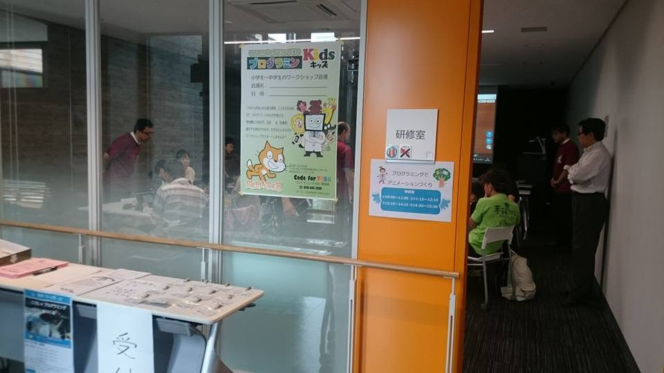

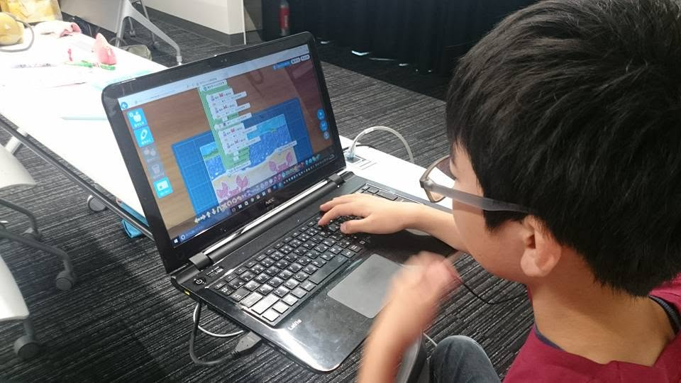

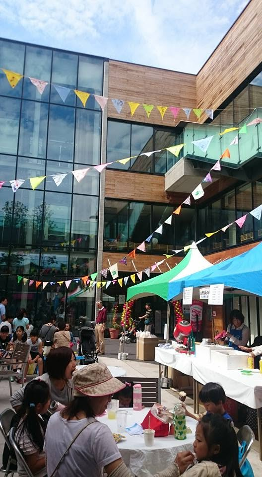

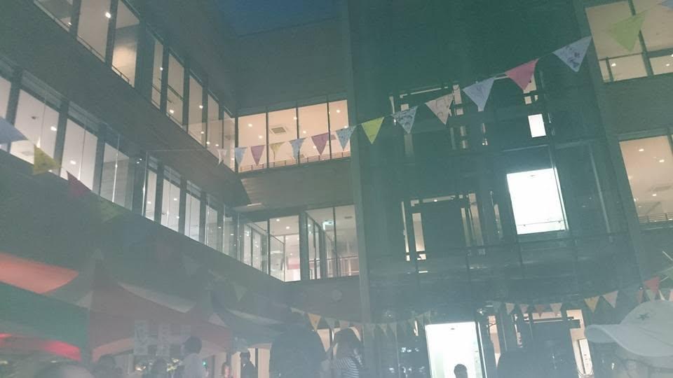

## 0245 — 2016-06-10 — 後藤 真太郎

- 投稿ID: 520171444850666
- 投稿URL: https://www.facebook.com/groups/186097664924714/posts/520171444850666/
- 要約: 埼玉県GIS普及推進研究会、Code for SAITAMAが中心になって、アーバンデータチャレンジのさいたま支部を運営することになりました。 活動内容はこれまでの延長線であり、オープンデータを使った地域課題の解決方法を共に考え共に作っていきます。
- コメント要約: お伺いはできなさそうなので、Ustの配信を見させていただきます!

埼玉県GIS普及推進研究会、Code for SAITAMAが中心になって、アーバンデータチャレンジのさいたま支部を運営することになりました。
活動内容はこれまでの延長線であり、オープンデータを使った地域課題の解決方法を共に考え共に作っていきます。ご協力お願いします。6/27にキックオフを行いさいたま支部もプレゼンすることになっております。ご都合よろしければご参加下さい。
アーバンデータチャレンジ2016 キックオフ「地域課題解決の輪を広げ、全国に！〜30地域拠点が一挙に集結〜」
URBANDATA-CHALLENGE.JP
アーバンデータチャレンジ2016 キックオフ「地域課題解決の輪を広げ、全国に！〜30地域拠点が一挙に集結〜」
返信1件を見る

### コメント — 藤倉 潤一郎

お伺いはできなさそうなので、Ustの配信を見させていただきます!

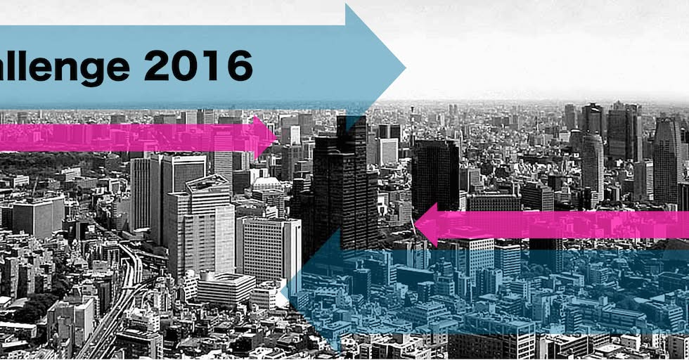

## 0246 — 2016-06-10 — 後藤 真太郎

- 投稿ID: 520438361490641
- 投稿URL: https://www.facebook.com/groups/186097664924714/posts/520438361490641/
- 要約: 災害時の位置情報提供アプリ勉強会のお知らせ 5/31のGIS普及推進研究会総会ではお世話になりました。 事業計画に災害時に位置情報付きの写真を行政に提供するための訓練を行うという方向性が認められました。
- コメント要約: 時間とれたら伺います

災害時の位置情報提供アプリ勉強会のお知らせ
5/31のGIS普及推進研究会総会ではお世話になりました。
事業計画に災害時に位置情報付きの写真を行政に提供するための訓練を行うという方向性が認められました。埼玉県と県下の測量会社は災害時の被害をモニタリングして情報提供するという災害支援協定を結んでおります。この延長で写真をジオタグ付きで撮影してtwitterなどに提供することを検討始めたく思います。
つきまして、先ず、どんなソフトがあるか、使い勝手はどうか？などの情報を交換する会を開催したいと考えております。和光市での災害情報提供事例は、
http://www.slideshare.net/maod1/121-42702804　を参照ください。
日時：6月15日　18:30-20:30
場所：さいたま市市民活動サポートセンター　南ラウンジのAB
（浦和駅東口駅前のパルコビル9階）
http://www.saitamacity-support.jp/.../index00040000.html
会費：無料
プログラム：
・埼玉測量設計業協会における災害時の情報収集体制
埼玉県GIS普及推進研究会メンバー（調整中）
・スマートフォンによる位置情報提供ソフトの事例
嘉山 陽一氏（朝日航洋/OSGeo財団）
無料で入手できるスマホ用位置情報提供ソフトとしてgeopaparazziなどのソフトを紹介していただきます。
・バンプレコーダーでの位置情報提供アプリ開発の取り組み
八木浩一氏（バンプレコーダー株式会社、スマートドライブメーター製作委員会(スマドラ)、災害時交通流監視システム研究会(災害交通研)）
災害時の被災状況モニタリングや路面性状調査や平時のバスロケーションシステムの実装など位置情報提供アプリ開発の取組につき紹介していただきます。
・官民共同の災害時情報集体制のあり方につき議論
終了後、交流会を予定しております。是非、ご参加ください。
連絡先：
〒360-0194 埼玉県熊谷市万吉1700
立正大学・地球環境科学部・環境システム学科・後藤研究室
FAX : 048-539-1653  E-mail: gotken@ris.ac.jp
ツイッター　災害情報　収集　共有
SLIDESHARE.NET
ツイッター　災害情報　収集　共有

### コメント — 酒井 千富

時間とれたら伺います

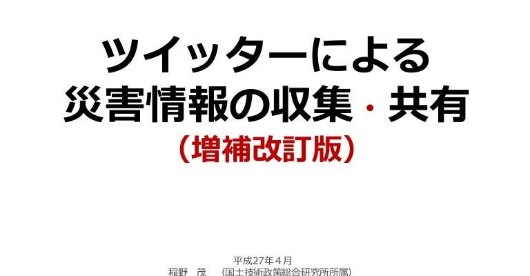

## 0247 — 2016-06-14 — 後藤 真太郎

- 投稿ID: 521840444683766
- 投稿URL: https://www.facebook.com/groups/186097664924714/posts/521840444683766/
- 要約: さいたま市の地産品Webサービス、人口増加都市を使った政策立案の講習会の案内です。Code for SAITAMAにも協力いただいてます。是非、ご参加ください。
- コメント要約: （コメントなし）

さいたま市の地産品Webサービス、人口増加都市を使った政策立案の講習会の案内です。Code for SAITAMAにも協力いただいてます。是非、ご参加ください。
https://www.facebook.com/events/1493368727348594/?ti=cl
人口増加都市
ウェブサービス「人口増加都市」を使って、実際の政策を作ってみよう！
このイベントはキャンセルされました

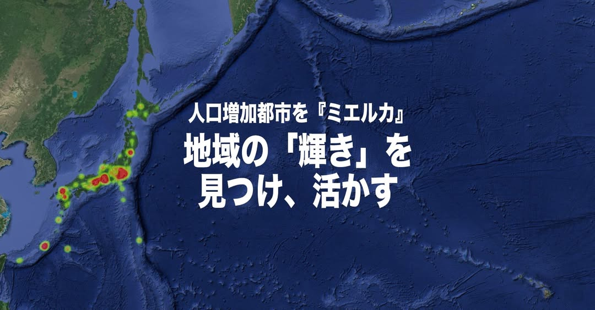

## 0248 — 2016-07-09 — 羽鳥 健太郎

- 投稿ID: 531374413730369
- 投稿URL: https://www.facebook.com/groups/186097664924714/posts/531374413730369/
- 要約: 7月13日(水)に「地理空間情報 x ビジネス x オープンソースGIS 勉強会！」があります。もしよろしかったらどうぞ。 地理空間情報 x ビジネス x オープンソースGIS 勉強会！
- コメント要約: ( ´･∀･)ﾉ 水曜日です えっと修正しました (^^;

7月13日(水)に「地理空間情報 x ビジネス x オープンソースGIS 勉強会！」があります。もしよろしかったらどうぞ。
地理空間情報 x ビジネス x オープンソースGIS 勉強会！ (2016/07/13 19:30〜)
E2D3.CONNPASS.COM
地理空間情報 x ビジネス x オープンソースGIS 勉強会！ (2016/07/13 19:30〜)

### コメント — 太田 一穂

( ´･∀･)ﾉ 水曜日です

### コメント — 羽鳥 健太郎

えっと修正しました (^^;

## 0249 — 2016-07-13 — 太田 一穂

- 投稿ID: 532891423578668
- 投稿URL: https://www.facebook.com/groups/186097664924714/posts/532891423578668/
- 要約: 7/16(土)にさいたま新都心（北与野駅）で「オープンデータで主題図を作ろう－地理学x市民活動で地域を見える化する－」イベントがあります。途中参加もOKですのでよろしくお願いします！
- コメント要約: （コメントなし）

7/16(土)にさいたま新都心（北与野駅）で「オープンデータで主題図を作ろう－地理学x市民活動で地域を見える化する－」イベントがあります。途中参加もOKですのでよろしくお願いします！
https://www.facebook.com/events/825236170943103/
2016/07/16(土)
オープンデータで主題図を作ろう－地理学x市民活動で地域を見える化する－
さいたま市
参加者15人・興味あり78人

## 0250 — 2016-09-07 — 後藤 真太郎

- 投稿ID: 555081764692967
- 投稿URL: https://www.facebook.com/groups/186097664924714/posts/555081764692967/
- 要約: 9/22 主題図を通して地域課題を見える化することを目的とし、以下のようなイベントを開催します。多くの方の参加をお待ちしてます。 2016/09/22(木) アーバンデータチャレンジ 2016 in 埼玉 ♪ 主題図で地域課題を解決しよう ♪ 大宮北公民館大会議室
- コメント要約: （コメントなし）

9/22 主題図を通して地域課題を見える化することを目的とし、以下のようなイベントを開催します。多くの方の参加をお待ちしてます。
2016/09/22(木)
アーバンデータチャレンジ 2016 in 埼玉 ♪ 主題図で地域課題を解決しよう ♪
大宮北公民館大会議室

## 0251 — 2016-09-10 — 後藤 真太郎

- 投稿ID: 556386861229124
- 投稿URL: https://www.facebook.com/groups/186097664924714/posts/556386861229124/
- 要約: 9/22（祝休）開催予定のアーバンデータチャレンジ in 埼玉 では地域の課題を主題図（マップ）で見える化することにより課題解決の糸口を見つけることを目的としております。
- コメント要約: （コメントなし）

9/22（祝休）開催予定のアーバンデータチャレンジ in 埼玉
https://www.facebook.com/events/1147580585316886/
では地域の課題を主題図（マップ）で見える化することにより課題解決の糸口を見つけることを目的としております。9/22の本番のイベントに備え、地域課題を共有しようと以下のように「課題解決しナイト」を開催します。この場を借りて問題意識が確認できる場として利用して下さい。
2016/09/15(木)
第1回 課題解決しナイト
さいたま市
さいたま市とシェアされています

## 0252 — 2016-09-15 — 後藤 真太郎

- 投稿ID: 558494944351649
- 投稿URL: https://www.facebook.com/groups/186097664924714/posts/558494944351649/
- 要約: 本日の「課題解決しナイト」の参考にしてください。 限界集落という「未来」から見える、シビックテックの底力～ウィズグループ代表取締役 奥田浩美氏 - 電通報 DENTSU-HO.COM 限界集落という「未来」から見える、シビックテックの底力～ウィズグループ代表取締役 奥田浩美氏 - 電通報
- コメント要約: （コメントなし）

本日の「課題解決しナイト」の参考にしてください。
限界集落という「未来」から見える、シビックテックの底力～ウィズグループ代表取締役　奥田浩美氏 - 電通報
DENTSU-HO.COM
限界集落という「未来」から見える、シビックテックの底力～ウィズグループ代表取締役　奥田浩美氏 - 電通報

## 0253 — 2016-09-16 — 後藤 真太郎

- 投稿ID: 558825324318611
- 投稿URL: https://www.facebook.com/groups/186097664924714/posts/558825324318611/
- 要約: 9/15 の課題解決しナイトでCode for SAITAMAメンバーの高柳さんが行ったグラフィックレコーディングのアウトプット。この内容と にアップされている内容などをもとに9/22のイベントで地図を作ります。
- コメント要約: （コメントなし）

9/15 の課題解決しナイトでCode for SAITAMAメンバーの高柳さんが行ったグラフィックレコーディングのアウトプット。この内容とhttps://www.facebook.com/events/1147580585316886/  にアップされている内容などをもとに9/22のイベントで地図を作ります。コンピュータに詳しくない方でもアイデアを出していただいたり、プレゼン資料を作ったり、デザインしたりする人が必要です。是非、ご参加をご検討ください。
Code for SAITAMAさんからの投稿をシェアしました
写真の説明はありません。. 写真の説明はありません。. 写真の説明はありません。
Code for SAITAMA
投稿先
第1回 課題解決しナイト
本日のグラフィックファシリテーション。

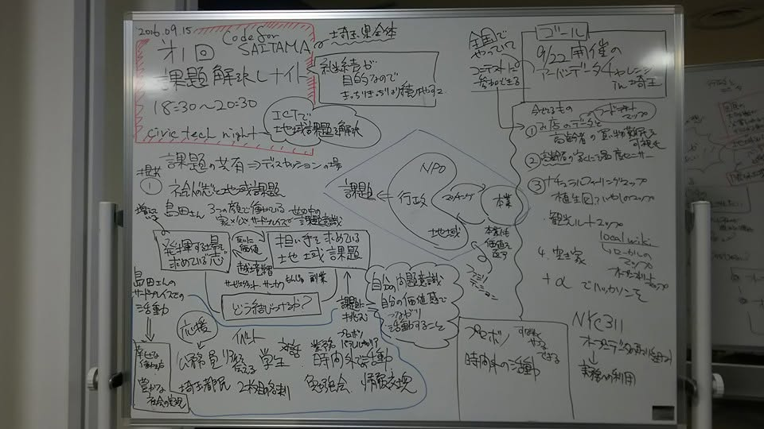

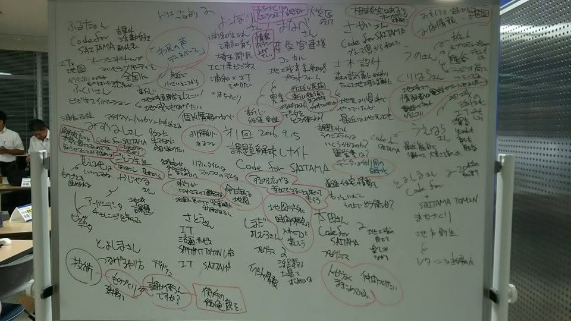

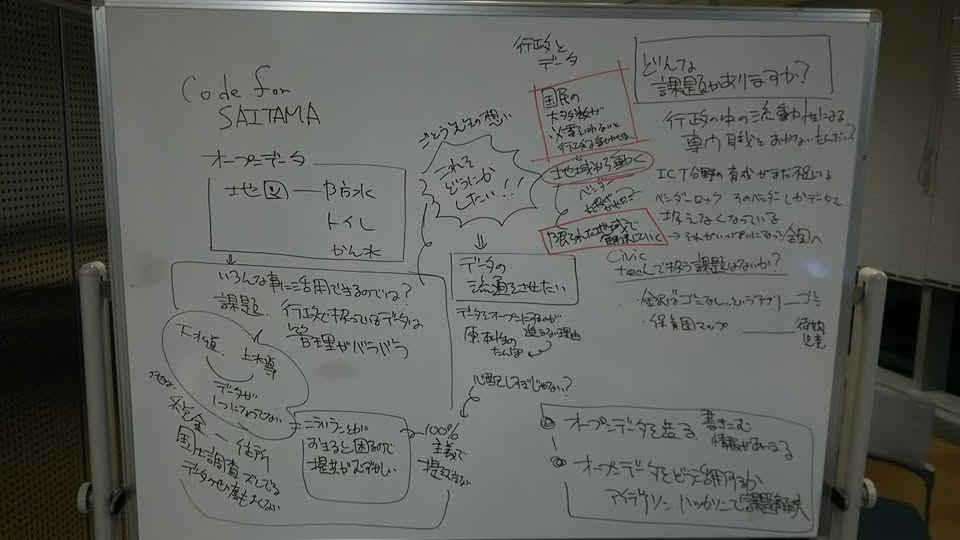

## 0254 — 2016-09-19 — 後藤 真太郎

- 投稿ID: 560125797521897
- 投稿URL: https://www.facebook.com/groups/186097664924714/posts/560125797521897/
- 要約: 9/15に話題提供していただいた島田さんが「課題解決しナイト」の感想を書かれてます。化学反応が起きた予感。こういうのを地道に続けてシビックテックを行なうエコシステムができていくといいですね。
- コメント要約: （コメントなし）

9/15に話題提供していただいた島田さんが「課題解決しナイト」の感想を書かれてます。化学反応が起きた予感。こういうのを地道に続けてシビックテックを行なうエコシステムができていくといいですね。わくわく。
AMEBLO.JP
『サードプレイスの活動は繋がっていた』
急に “繋がっていた” って何のこと？そう思いますよね。先日、あるイベントにお招きいただいて、そこで参加者の皆さんにお話をさせていただいたときに、自分自身が話…

## 0255 — 2016-09-24 — 太田 一穂

- 投稿ID: 562102067324270
- 投稿URL: https://www.facebook.com/groups/186097664924714/posts/562102067324270/
- 要約: 今度の日曜（9/25）、IoT（モノのインターネット）をテーマにしてもくもく会を開きます。「もくもく会」は各自が黙々と作業する会ですが、みんなで何ができるかわいわいやりたいので「もくもくわいわい相談会」にしてます。
- コメント要約: （コメントなし）

今度の日曜（9/25）、IoT（モノのインターネット）をテーマにしてもくもく会を開きます。「もくもく会」は各自が黙々と作業する会ですが、みんなで何ができるかわいわいやりたいので「もくもくわいわい相談会」にしてます。気軽にご参加ください！
僕は、Amazonで買ったセンサー20種類を持っていきます〜！
併せてリトルビッツの体験会も開催します。
http://peatix.com/event/201120
IoTもくもくわいわい相談会＠北与野
PEATIX.COM
IoTもくもくわいわい相談会＠北与野

## 0256 — 2016-10-18 — 太田 一穂

- 投稿ID: 573166826217794
- 投稿URL: https://www.facebook.com/groups/186097664924714/posts/573166826217794/
- 要約: 岩槻映画祭のプレイベントが今週末にあります。主催者の吉永さんには、昨年の岩槻マッピングパーティでお世話になりました。 2016/10/23(日) 岩槻キャンドルシネマナイト 東北自動車道岩槻IC 岩槻ヘリポート付近特設会場 埼玉県さいたま市 岩槻区柏崎950
- コメント要約: （コメントなし）

岩槻映画祭のプレイベントが今週末にあります。主催者の吉永さんには、昨年の岩槻マッピングパーティでお世話になりました。
https://www.facebook.com/events/1653233934987953/
2016/10/23(日)
岩槻キャンドルシネマナイト
東北自動車道岩槻IC 岩槻ヘリポート付近特設会場 埼玉県さいたま市 岩槻区柏崎950

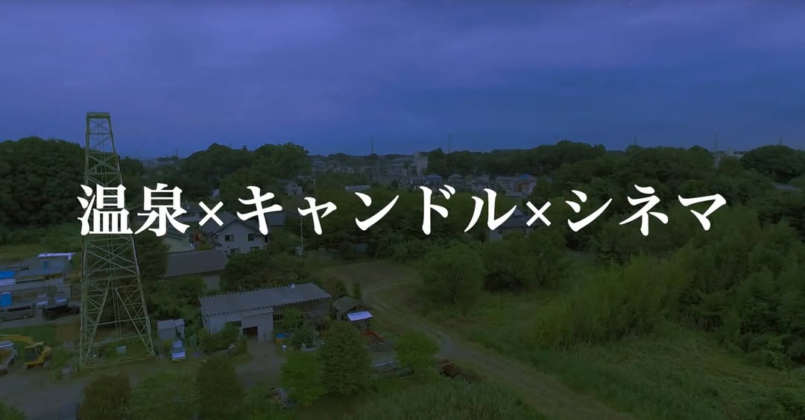

## 0257 — 2016-10-27 — 太田 一穂

- 投稿ID: 578035822397561
- 投稿URL: https://www.facebook.com/groups/186097664924714/posts/578035822397561/
- 要約: 【Code for Japan Summit 2016】 昨年に引き続き、11/19,20の2日間、年に一度のシビックテックのショーケース、Code for Japan Summit 2016 が開催されます。
- コメント要約: （コメントなし）

【Code for Japan Summit 2016】
昨年に引き続き、11/19,20の2日間、年に一度のシビックテックのショーケース、Code for Japan Summit 2016 が開催されます。
Code for SAITAMAは、ブース展示や「お祭り」「防災・減災」「防災マッピング」「マッピングパーティ報告会」等で関わってます。横浜市金沢区でちょっと遠いですが、参加費無料なのでご参加ください！
https://www.facebook.com/events/300744356962467/
2016/11/19(土)
Code for Japan Summit 2016
神奈川県横浜市金沢区総合庁舎

## 0258 — 2016-10-30 — 後藤 真太郎

- 投稿ID: 579577792243364
- 投稿URL: https://www.facebook.com/groups/186097664924714/posts/579577792243364/
- 要約: 良い企画です。是非ご参加下さい。 EVENTDOTS.JP 東京で考える地方創生！RESAS API ハッカソン - dots. [ドッツ] 日時：2016/11/06（日） 場所：東京都渋谷 概要：RESAS（Regional Economy and Society Analyzing Syste...
- コメント要約: （コメントなし）

良い企画です。是非ご参加下さい。
EVENTDOTS.JP
東京で考える地方創生！RESAS API ハッカソン - dots. [ドッツ]
日時：2016/11/06（日） 場所：東京都渋谷 概要：RESAS（Regional Economy and Society Analyzing Syste...

## 0259 — 2016-10-31 — 後藤 真太郎

- 投稿ID: 579892422211901
- 投稿URL: https://www.facebook.com/groups/186097664924714/posts/579892422211901/
- 要約: Code for Japanさんからの投稿をシェアしました Code for Japan 投稿先 Code for Japan Summit 2016 Code for Japan Summit 2016の前日11/18(金)にはプレイベントとして、ミニデータアカデミーと前夜祭を開催します！
- コメント要約: （コメントなし）

Code for Japanさんからの投稿をシェアしました
Code for Japan
投稿先
Code for Japan Summit 2016
Code for Japan Summit 2016の前日11/18(金)にはプレイベントとして、ミニデータアカデミーと前夜祭を開催します！
サミットはもちろん、こちらにもぜひご参加ください！
◆ミニデータアカデミー〜データによる政策立案を体験しよう！〜
Code for Japan Summitのプレイベントとしてデータアカデミーの体験会を開催します！
データアカデミーとは、行政におけるデータを活用した政策立案の推進を目的とした行政職員や市民向けのセミナーです。
今回、Tableau Japan株式会社に協力いただき、専門知識がなくても利用できるデータ分析ツールを体験いただくことで、今後の政策立案に活かしていただきたいと考えています。
また、実際にデータアカデミーをおこなっている神戸市職員や関係者をお招きし、お話を伺います。
日時：11月18日（金）14:30~18:00
場所：FabCafe MTRL(2f)
参加料：無料
FBイベントページ：https://www.facebook.com/events/322679491421167/
参加申し込みページ：https://goo.gl/forms/cX2EtSvDms47MkIF3
◆サミット前夜祭 with TMCN
サミット前日に東京都内で前夜祭をおこないます！
今回はTMCNさんとのコラボでお送りします。CfJとTMCNによるライトニングトークをお楽しみください！
日時： 11月18日(金) 19:00～22:00
場所：FabCafe TOKYO(1F)
FBイベントページ：https://www.facebook.com/events/1146646335417015/
参加申し込みページ：http://cfjsummit2016festival.peatix.com/
2016/11/18(金)
ミニデータアカデミー　〜データによる政策立案を体験しよう！〜
東京都東京都 渋谷区
CfJ Summit 2016 企画運営グループとシェアされています
興味あり

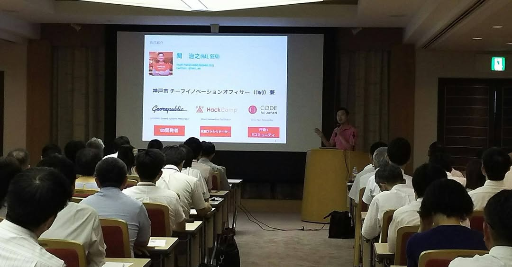

## 0260 — 2016-11-07 — 後藤 真太郎

- 投稿ID: 583726305161846
- 投稿URL: https://www.facebook.com/groups/186097664924714/posts/583726305161846/
- 要約: 12/1 地理情報システムを代表して「災害時のリスク情報管理におけるGISの役割」について話します。参加申し込みも始まってます。多くの方のご参加をお待ちしてます。
- コメント要約: （コメントなし）

12/1 地理情報システムを代表して「災害時のリスク情報管理におけるGISの役割」について話します。参加申し込みも始まってます。多くの方のご参加をお待ちしてます。
http://janet-dr.com/07_event/event13.html
第２回 防災学術連携シンポジウム
激甚化する台風・豪雨災害とその対策
日　時：平成28年12月1日（木曜日）10:00～18:00
会　場：日本学術会議講堂（東京都港区六本木7-22-34）
主　催：日本学術会議 防災減災・災害復興に関する学術連携委員会、防災学術連携体
JANET-DR.COM
防災学術連携体
防災減災・災害復興に関わる学会のネットワークです。

## 0261 — 2016-11-14 — 長岡 素彦

- 投稿ID: 586832948184515
- 投稿URL: https://www.facebook.com/groups/186097664924714/posts/586832948184515/
- 要約: みなさま、19日にセッションを行う一般社団法人地域連携プラットフォーム の長岡です。これはシビックテックと同じ「世界をサステナブルにするイノベーション」をテーマにするものです。
- コメント要約: （コメントなし）

みなさま、19日にセッションを行う一般社団法人地域連携プラットフォーム の長岡です。これはシビックテックと同じ「世界をサステナブルにするイノベーション」をテーマにするものです。
https://www.facebook.com/events/371201999935198/
2016/11/19(土)
市民・企業・行政ですすめるイノベーションとESD　Code for Japan Summit2016セッション
神奈川県横浜市金沢区総合庁舎
興味あり

## 0262 — 2016-11-19 — 後藤 真太郎

- 投稿ID: 588816961319447
- 投稿URL: https://www.facebook.com/groups/186097664924714/posts/588816961319447/
- 要約: アーバンデータチャレンジのイベントで埼玉の名物として出品した「うなぎ煎餅」、歌ができました。 菩提寺 由美子さんからの投稿をシェアしました 菩提寺 由美子 偶然の結果「うなぎ煎餅の歌」を作る事になりました。
- コメント要約: シェアさせていただきます。

アーバンデータチャレンジのイベントで埼玉の名物として出品した「うなぎ煎餅」、歌ができました。
菩提寺 由美子さんからの投稿をシェアしました
菩提寺 由美子
偶然の結果「うなぎ煎餅の歌」を作る事になりました。音符も書けず楽譜も読めず歌も音痴(カラオケ経験無し）の状態ですが　皆様のお陰でＣＤにする事が出来ました。
地元さいたまを皆様に知って頂きたいとの想いで起業したのが6年前。その後さいたまＰＲのお土産を作りたいと「うなぎ煎餅」を企画製造したのが3年前。
さいたま（浦和界隈）は蒲焼の発祥の地でもあり　また100年以上の歴史のあるサッカーの町なんです。
作詞作曲そして歌まで手掛けました。
お時間のある時　聞いてみてくださいませ。
この場をお借りして　沢山の方にご協力頂きました事　お礼申し上げます。
またＣＤ完成を記念して　うなぎ煎餅とうなぎレッド煎餅オリジナルＣＤ付を　ＪＲさいたま新都心駅すぐイトーヨーカドー大宮店にて期間限定数量限定にて　間もなく販売致します。
うなぎ煎餅のうた
YOUTUBE.COM
うなぎ煎餅のうた
関連度の高い順

### コメント — 新井 正男

シェアさせていただきます。

## 0263 — 2016-11-19 — 後藤 真太郎

- 投稿ID: 588896041311539
- 投稿URL: https://www.facebook.com/groups/186097664924714/posts/588896041311539/
- 要約: 11/19-20 神奈川県横浜市金沢区総合庁舎でCode for Japan Summit を行ってます。 明日13:30- お祭りセッションを行います。各地からICTでお祭りを盛り上げている達人が集まって苦労話をしていただき今後のあり方を議論します。
- コメント要約: （コメントなし）

11/19-20 神奈川県横浜市金沢区総合庁舎でCode for Japan Summit を行ってます。http://summit2016.code4japan.org/
明日13:30- お祭りセッションを行います。各地からICTでお祭りを盛り上げている達人が集まって苦労話をしていただき今後のあり方を議論します。大津、千葉、高円寺、埼玉からは熊谷から参戦し、セミナーを運営しておりますのでどうぞご参加下さい。川越などの事例もフロアからある予定です。また、明日1日中、お祭りセッションのブースもありますのでシステムの紹介をしております。お立ち寄り下さい。
セッション紹介文から：　　　　　　　　　　　　　　　　　　　　　　　古来から「お祭り」は地域をまとめる大切な役割を担っていて、言わば「地域課題解決の手段」の一つとして取り組まれ、継続されてきた。担い手不足が問題になるお祭りが増える中、テクノロジーをお祭りに取り入れることは、地域課題解決の有効な手段になったのか？　それを持続可能な仕組みにするにはどうすればいいのか？　を「熊谷」「高円寺」「松戸」「大津」の4地域で取り組まれた事例を紹介しながら考えてみる。
http://summit2016.code4japan.org/festival-civic-tech/
お祭り × シビックテック
SUMMIT2016.CODE4JAPAN.ORG
お祭り × シビックテック

## 0264 — 2016-12-11 — 後藤 真太郎

- 投稿ID: 599434796924330
- 投稿URL: https://www.facebook.com/groups/186097664924714/posts/599434796924330/
- 要約: 1/28 法政大学にてナホトカ重油事故20周年シンポジュウㇺをおこないます。ご興味のあるかたの参加をお待ちしてます。 で詳細の情報をアップしておりますのでご覧ください。
- コメント要約: （コメントなし）

1/28 法政大学にてナホトカ重油事故20周年シンポジュウㇺをおこないます。ご興味のあるかたの参加をお待ちしてます。
https://www.facebook.com/events/1670097953253110/
で詳細の情報をアップしておりますのでご覧ください。
WBSJ.ORG
日本野鳥の会 : ナホトカ号油流出事故から20年　シンポジウム・私たちは海洋環境災害にどう対処すべきか
ナホトカ号油流出事故から2017年1月で20年を迎える。日本海で起きたこの重大事故により、多くの海鳥が影響を受けた。この事故を契機に海鳥の油事故に対する法律や、救護の専門施設の設置や人材育成の仕組みの整備、情報基盤の迅速化、タンカーの防災対策の強化などが行なわれた。いまもういちど振り返る私たちが海洋環境災害でやるべきこと、考えていきたいこと……

## 0265 — 2016-12-12 — 古田武士

- 投稿ID: 599697023564774
- 投稿URL: https://www.facebook.com/groups/186097664924714/posts/599697023564774/
- 要約: 最近、イベントばかりで勉強会をしてなかったので改めて地図の勉強会を開催します。CARTOやQGISなどを話題にできたらと思います。 ご参加ください。 2017/01/11(水) 【新年第一弾】地図の勉強会。
- コメント要約: （コメントなし）

最近、イベントばかりで勉強会をしてなかったので改めて地図の勉強会を開催します。CARTOやQGISなどを話題にできたらと思います。
ご参加ください。
https://www.facebook.com/events/1638363429791547/?ti=cl
2017/01/11(水)
【新年第一弾】地図の勉強会。
さいたま市

## 0266 — 2016-12-19 — 古田武士

- 投稿ID: 603248163209660
- 投稿URL: https://www.facebook.com/groups/186097664924714/posts/603248163209660/
- 要約: 僕のタイムラインにも描きましたが、Code for SATAMAとして来年は、歴史を知る街歩きがしたいと思っています。 最近、ブラタモリに影響されたことにより、境界協会やすり鉢学会に参加しています。
- コメント要約: （コメントなし）

僕のタイムラインにも描きましたが、Code for SATAMAとして来年は、歴史を知る街歩きがしたいと思っています。
最近、ブラタモリに影響されたことにより、境界協会やすり鉢学会に参加しています。街をよく知る方の解説付きの街歩きはいつものマッピングパーティとは違う楽しさがあります。
もちろん、Code forなので街歩きの最後に何がしかアウトプットを残せる時間を取ります。WikipediaやOSMもしくはLocalwikiなどを活用できるようにしたいと思います。また、家族連れやお子さんも参加されるのであれば、某チョーさんの番組みたいなアウトプットも楽しいかなと思います。
予定としては、1月はGISの勉強会をしますので、2月のイベントとして何かできたらと思います。場所は、さいたま市に偏るのは良くないので、できたらあっちこっちに行ければと思います。
僕自身は、知人がいませんので繋いでもらうと助かります。

## 0267 — 2016-12-24 — Seikaku Robo PRteam

- 投稿ID: 605477972986679
- 投稿URL: https://www.facebook.com/groups/186097664924714/posts/605477972986679/
- 要約: 埼玉ハッカソン（ロボット・IoT・その他なんでも）を開催します！ 日時：12月30日(金) 13：00～18:15（終了後懇親会あり） 場所：さいたま新都心駅から徒歩5分、北与野駅から徒歩1分 参加資格：埼玉という地名を知っているエンジニアの方ならOK！
- コメント要約: （コメントなし）

埼玉ハッカソン（ロボット・IoT・その他なんでも）を開催します！
日時：12月30日(金)　13：00～18:15（終了後懇親会あり）
場所：さいたま新都心駅から徒歩5分、北与野駅から徒歩1分
参加資格：埼玉という地名を知っているエンジニアの方ならOK！
Pepper、Tapia、Hue、Kinectなどお使いいただけます。
もちろん仕事をするもよし、他の開発をしてもなんでもOKです。
この機会に埼玉で開発を楽しみましょう！
イベント詳細はこちらをご覧ください。
https://peraichi.com/landing_pages/view/saitamathon20171230

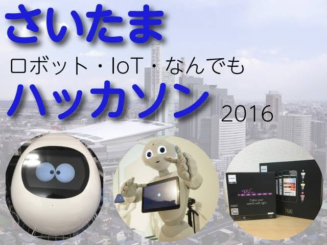

## 0268 — 2017-01-12 — 古田武士

- 投稿ID: 613118125555997
- 投稿URL: https://www.facebook.com/groups/186097664924714/posts/613118125555997/
- 要約: 昨日は、Codo for SAITAMAでの2017年最初のイベントのGIS勉強会を実施しました。好評でしたので、今年はしばらく毎月のイベントとして続けていきたいと思っています。
- コメント要約: 来月も実施する予定ですのでぜひご参加ください。 所属団体の理事会が入ってしまい参加できませんでしたがものすごく興味ありました。ことしはＧＩＳを勉強したいと思っていますので、何卒よろしくお願いいたします。

昨日は、Codo for SAITAMAでの2017年最初のイベントのGIS勉強会を実施しました。好評でしたので、今年はしばらく毎月のイベントとして続けていきたいと思っています。今回はQGISを勉強しましたが、次回はCartoでも良いかなと思っています。勉強会で取り扱って欲しい話題があればリクエストください。
ざっくり過ぎる資料ですが、公開しておきます。
地図の勉強会
SLIDESHARE.NET
地図の勉強会
関連度の高い順
返信1件を見る

### コメント — 古田武士

来月も実施する予定ですのでぜひご参加ください。

### コメント — 平山 毅

所属団体の理事会が入ってしまい参加できませんでしたがものすごく興味ありました。ことしはＧＩＳを勉強したいと思っていますので、何卒よろしくお願いいたします。

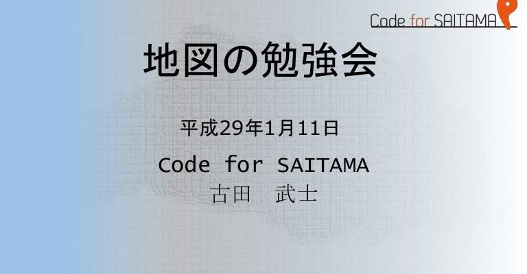

## 0269 — 2017-01-13 — 太田 一穂

- 投稿ID: 613651068836036
- 投稿URL: https://www.facebook.com/groups/186097664924714/posts/613651068836036/
- 要約: 1月15日と1月22日に協働ステーション中央との協働事業「魅力再発見 ブラまちMAPづくり」を行います。 中身は「まち歩き＋写真撮影＋OSMマッピング」で、気軽に参加できるマッピングパーティを目指します。
- コメント要約: （コメントなし）

1月15日と1月22日に協働ステーション中央との協働事業「魅力再発見　ブラまちMAPづくり」を行います。
中身は「まち歩き＋写真撮影＋OSMマッピング」で、気軽に参加できるマッピングパーティを目指します。
15日は月島周辺、22日は小伝馬町周辺をまわります。
お近くの人もお気軽に参加ください〜
2017/01/15(日)
月島･佃＆日本橋！魅力再発見 ブラまちmapづくり（1/15午前月島◆1/15午後佃◆1/22小伝馬町）
東京都中央区
立正大学研究推進地域連携センター（公開ページ）とシェアされています

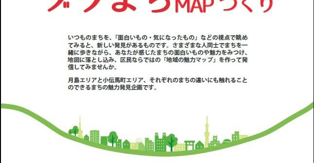

## 0270 — 2017-01-24 — とよしま 亮介

- 投稿ID: 618477311686745
- 投稿URL: https://www.facebook.com/groups/186097664924714/posts/618477311686745/
- 要約: 開催迫る！ 参加者受付中！ WEBからお申込みください！
- コメント要約: （コメントなし）

開催迫る！！
参加者受付中！！
WEBからお申込みください！！
━━━━━━━━━━━━━━━━━━━━━━━━━━━━━━━━━━━━
「～首都圏災害に備えよう～第４回協働型災害訓練 in 杉戸」を開催
－震災支援の経験や知識をさらに高めたい方・災害に備えたい方へ－
http://www.kunren.wix.com/sugito
━━━━━━━━━━━━━━━━━━━━━━━━━━━━━━━━━━━━
東日本大震災の経験と教訓を活かした地域防災活動を推進している、杉戸町・富岡町・川内村地域間共助推進協議会（主幹：特定非営利活動法人すぎとＳＯＨＯクラブ（所在地：埼玉県北葛飾郡杉戸町、理事長：小川清一）、同法人ＮＰＯ埼玉ネット（所在地：埼玉県さいたま市北区、代表理事：松尾道夫））は、「～首都圏災害に備えよう～第４回協働型災害訓練 in 杉戸（【特別企画】熊本地震支援活動報告）」を、平成２９年２月３日（金）９時３０分から２月４日（土）１７時までの２日間にわたり開催します。
【イベントの内容】
東日本大震災の経験と教訓を生かすべく、平成25年度国土交通省広域的地域間共助推進事業としてスタートした「協働型災害訓練」。大規模災害時には一人でも多くの命を助けるために、効率と統一された災害対応が必要になります。この訓練では、米国で誕生した災害版ISOと呼ばれるICS（Incident（現場） Command（指揮） System（システム））を用い、将来発生し得る大規模災害発生時に即時助け合いの対応ができる仕組みをつくることを目指しています。
【見どころ】
１日目、はじめにセレモニーを開催。地域首長をはじめ議員の来賓を予定しています。
協働型災害訓練フォーラムⅠでは、「熊本地震支援活動報告」と題して、昨年４月に発生した熊本地震において、この協働型災害訓練での経験を活かして支援活動を行った団体（九州救助犬協会、MMIXLAB、NPOキャンパー）から現場で行った支援内容や見えてきた課題など、実際に感じた被災現場のリアルを伝えて頂きます。
シェアリングタイムでは、東埼玉総合病院とSFC薬局幸手中央店薬剤師による災害時介護支援についての情報提供が行われます。そして、本年もICSを活用した図上訓練（DIG）を実施し、当協議会の構成員である福島県富岡町・川内村からも実際に東日本大震災を経験した職員が参加し、訓練本部である関係者会議席にて、避難所開設・運営を行う際の有識者として参画し、助言等を行います。同県富岡町は、品川区と防災協定を締結しており、都内からの同区避難者が杉戸町に来た場合の対応を行います。また、訓練内では実際に屋外でドローンを飛行させ、離れた場所の情報を入手し、対応策に反映するフルスケールシミュレーションを実施します。
チェックアウトタイムでは、本年４月１日に一部を除き避難指示の解除が行われる富岡町からは今の町の様子を赤裸々に語っていただきます。閉会式では参加者全員で記念撮影を行います。
参加者の一部は会場（エコ・スポいずみ）に宿泊します。この会場は東日本大震災の際にも、福島県からの避難者の皆さんが実際に避難生活を送られた場所ですので、当時を振り返りながら交流会を行います。
２日目は、協働型災害訓練フォーラムⅡでも「熊本地震支援活動報告」と題して、昨年４月に発生した熊本地震において支援活動を行った団体に報告を行っていただきます。日本マイクロソフトは、同社のクラウドサービスを提供し、熊本市内の各避難所を結び、物心における支えを構築。JVOAD（全国災害ボランティア支援団体ネットワーク）は、熊本地震支援の活動について情報収集と提供を行いました。杉戸町は民間ネットワークを活用し、現地へ物資の輸送を行いました。これらの被災現場のリアルを伝えて頂きます。
シェアリングタイムでは、総務省関東総合通信局が会場に展示されている災害対応用無線システムについて、東洋大学が災害介護活動から見えた暮らしを支える福祉的視点について情報提供を行います。
エクスペリエンスタイムでは、屋外でドローンを使用した災害情報収集のデモンストレーションを行います。ＨＵＧ（避難所設営訓練）では、各班に避難所経験を配置した避難所運営シミュレーションゲームを行います。プロポーザルワークショップでは、各分野のプロフェッショナルがリーダーとなり、省庁向けの政策提言ワークを行います。
尚、参加対象者としては、１日目は災害支援活動のＮＰＯなどのプロフェッショナルメンバー。２日目は１日目に加えて地域住民や自主防災組織などを想定しています。
＜こんな要望・悩みを抱えている方＞
1：震災支援の経験や知識をさらに高めたい人や団体
2：首都圏や南海トラフ地震などに備えを考えている人や団体
3：地域の絆を活かしたい人や団体
【開催概要】
イベント名：～首都圏災害に備えよう～「第４回協働型災害訓練 in 杉戸（【特別企画】熊本地震支援活動報告）」
主催：杉戸町・富岡町・川内村地域間共助推進協議会
主幹：すぎとＳＯＨＯクラブ、ＮＰＯ埼玉ネット
日時：平成２９年２月３日（金）９時３０分～１８時３０分
平成２９年２月４日（土）９時３０分～１７時００分
会場：杉戸町ふれあいセンター エコ・スポいずみ（345-0001埼玉県北葛飾郡杉戸町木津内５２４　電話0480-38-2300）
対象：地域防災に関わっているまたは興味のある人や団体など
定員：３００名
費用：無料（食事代別）
詳細ページ：http://www.kunren.wix.com/sugito
お申込み方法：上記ホームページからお申し込みください
【本件に関するお問い合わせ先】
杉戸町・富岡町・川内村地域間共助推進協議会
＜訓練事務局＞
社名：特定非営利活動法人ＮＰＯ埼玉ネット
本社：331-0823　埼玉県さいたま市北区日進町２丁目544番地1
代表者：代表理事　松尾道夫
設立：2006年11月14日
Tel：048-729-6151
Fax：048-729-6152
http://nposaitamanet.or.jp/
活動内容：被災地支援、地域情報発信、創業支援など
写真の説明はありません。. 写真の説明はありません。. 写真の説明はありません。

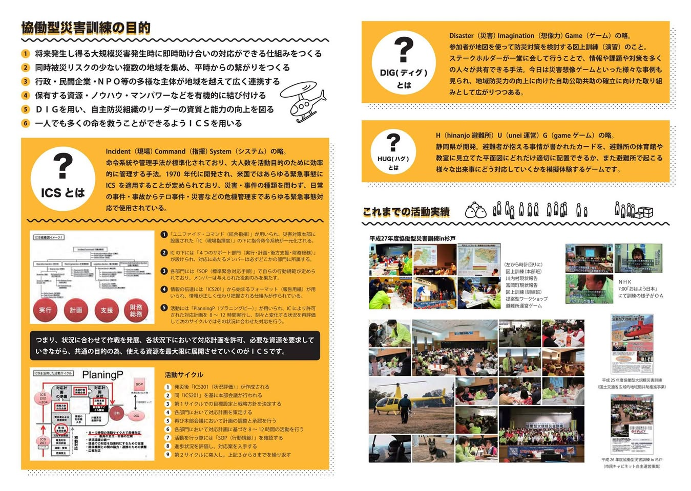

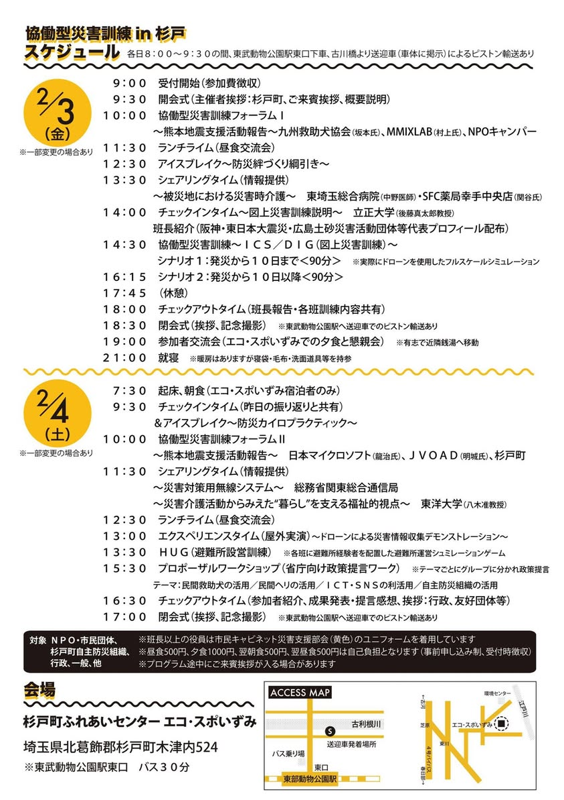

## 0271 — 2017-01-25 — 太田 一穂

- 投稿ID: 619015854966224
- 投稿URL: https://www.facebook.com/groups/186097664924714/posts/619015854966224/
- 要約: LODチャレンジ2016、Code for SAITAMA 今井 優さんのエントリー作品です。7月の主題図アイデアソン発のアイデアですね。おもしろいので作品ページのいいねボタンを押しましょう〜 今井 優さんからの投稿をシェアしました 今井 優 Shared via AddThis 「ヒーリングマップの作りかた」のページを追加しました。
- コメント要約: ひと手間なので恐縮ですが、作品ページのオレンジ色のいいねボタンを押してください。 太田さん、シェアありがとうございます。

LODチャレンジ2016、Code for SAITAMA 今井 優さんのエントリー作品です。7月の主題図アイデアソン発のアイデアですね。おもしろいので作品ページのいいねボタンを押しましょう〜
今井 優さんからの投稿をシェアしました
今井 優
Shared via AddThis
「ヒーリングマップの作りかた」のページを追加しました。おもしろいって思ってくださった方は、作品ページのいいねボタンを押してくれると嬉しいです o(._.)o
IDEA.LINKDATA.ORG
みんなのヒーリングマップ
近くを通るとなんだか癒される、ちょっとした林や川辺の自然ってありますよね？ 人の多い場所ほど、多くの人がその自然に癒されています。都市に残るそれぞれの自然が何人の「ほっとする気持ち」を担っているか、地図にしてみました。
関連度の高い順

### コメント — 今井 優

ひと手間なので恐縮ですが、作品ページのオレンジ色のいいねボタンを押してください。

### コメント — 今井 優

太田さん、シェアありがとうございます。

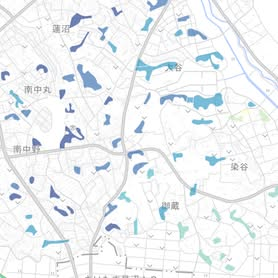

## 0272 — 2017-01-29 — 後藤 真太郎

- 投稿ID: 620819538119189
- 投稿URL: https://www.facebook.com/groups/186097664924714/posts/620819538119189/
- 要約: 2/3-4と杉戸町にて第4回協働型訓練が開催されます。この訓練には、ドローン画像を捜索救助犬のハンドラーが使用し、被災前の地図と照合して被災家屋の特定効率を向上させる訓練も含まれてます。
- コメント要約: 参加させていただきます！

2/3-4と杉戸町にて第4回協働型訓練が開催されます。この訓練には、ドローン画像を捜索救助犬のハンドラーが使用し、被災前の地図と照合して被災家屋の特定効率を向上させる訓練も含まれてます。昨日テストを実施し、早速、撮影データを3Dデータにして提供されました。
28日撮影３Dイメージ撮影高度20m
只今、最終参加者絶賛受付中！
協働型災害訓練in杉戸オフィシャルサイト
http://kunren.wixsite.com/sugito/
エントリー方法
「開催案内」→「参加のお申し込み」からお願いします
Project_67462 by Pix4D SA. - 3D model
SKETCHFAB.COM
Project_67462 by Pix4D SA. - 3D model
関連度の高い順

### コメント — 平林 寛

参加させていただきます！

## 0273 — 2017-02-06 — 古田武士

- 投稿ID: 624066141127862
- 投稿URL: https://www.facebook.com/groups/186097664924714/posts/624066141127862/
- 要約: 協働型災害訓練にご参加された方はお疲れ様でした。 マップチームのGISリーダーの古田です。 撮影者の酒井さんの許可が出たので今回のドローンタイルのURLを共有しておきます。
- コメント要約: （コメントなし）

協働型災害訓練にご参加された方はお疲れ様でした。
マップチームのGISリーダーの古田です。
撮影者の酒井さんの許可が出たので今回のドローンタイルのURLを共有しておきます。
タイルベースURL
http://sugito.code4saitama.org/tiles
2/3 午前中撮影分
/sugito_20170203/{Z}/{X}/{Y}.png
2/3 午後撮影分
/sugito_20170203_02/{Z}/{X}/{Y}.png
2/4 撮影分
/sugito_20170204/{Z}/{X}/{Y}.png
※ 2/4分は広域で撮っていますがオルソ化がうまくできてないくて画像が壊れたように見えますが仕様です。
ズームサイズは16～22です。田んぼしか写っていませんが何かに使えれば活用してください。なお、範囲外のデータは404(File Not Found)にしています。

## 0274 — 2017-02-18 — Seikaku Robo PRteam

- 投稿ID: 629191040615372
- 投稿URL: https://www.facebook.com/groups/186097664924714/posts/629191040615372/
- 要約: この度、生活革命はPepperと、ロボホンや昨今正式リリースされたばかりのAndroid Wear 2.0(IoT)等、複数のロボットとIoTが接続する新しい事例を手掛けました。
- コメント要約: （コメントなし）

この度、生活革命はPepperと、ロボホンや昨今正式リリースされたばかりのAndroid Wear 2.0(IoT)等、複数のロボットとIoTが接続する新しい事例を手掛けました。
生活革命は、引き続きロボット・IoTの連携による社会諸問題の解決に取り組んでいきます。
http://seikaku.co.jp/pressrelease/mimamori201702
#ロボット #ペッパー #Pepper #介護 #IoT #社会問題 #解決 #ロボホン #AndroidWear #見守り #ウェアラブル #介護施設
Pepper 生活革命さんからの投稿をシェアしました
Pepper 生活革命
介護業務の負担が社会問題になってきています。
生活革命では、株式会社RTC様の提供する見守り支援プラットフォームに、弊社の得意とする技術でロボットとウェアラブルデバイスを繋げるバージョンアップを行いました。
これにより社会諸問題の解決に貢献したいと考えています。
実証実験が既に始まっています。
＜プレスリリース＞
http://seikaku.co.jp/pressrelease/mimamori201702
介護で有名なPepperだけでなく、ロボホンや昨今正式リリースされたばかりのAndroid Wear 2.0(IoT)等、複数のロボットとIoTが接続する新しい事例となりました。
生活革命は、引き続きロボット・IoTの連携による社会諸問題の解決に取り組んでいきます。
【プレスリリース】高齢者見守り支援システムがロボット・IoT機器に対応 | | （株）生活革命 | Pepperレンタル・イベント実績 多数
SEIKAKU.CO.JP
【プレスリリース】高齢者見守り支援システムがロボット・IoT機器に対応 | | （株）生活革命 | Pepperレンタル・イベント実績 多数

## 0275 — 2017-02-23 — 古田武士

- 投稿ID: 631184830415993
- 投稿URL: https://www.facebook.com/groups/186097664924714/posts/631184830415993/
- 要約: 昨日の地図の勉強会の資料をSlide Shareにアップしました。 ※ この資料の画面はこれからアカウントを作る人の画面とは違うのでご注意ください。 あと、地図の勉強会ですが奇数月と偶数月でやることを変えていきたいと思います。
- コメント要約: 今後も勉強会の資料はスライドシェアに上げる予定です。 お待ちしております。 定期的に勉強会を開催するのは素晴らしいことだと思います 大変なこともあると思いますが、協力者も見つけて、是非頑張って下さい！

昨日の地図の勉強会の資料をSlide Shareにアップしました。
http://www.slideshare.net/ssuser514b7a/2-72483452
※ この資料の画面はこれからアカウントを作る人の画面とは違うのでご注意ください。
あと、地図の勉強会ですが奇数月と偶数月でやることを変えていきたいと思います。
奇数月（1,3,5…） QGISについてじっくりと取り組む。
偶数月（2,4,6…）色々なWebGISについて触ってみる。
にしたいと思います。次回はまだ日程決めていませんがQGIS予定です。第2か第3かの水曜日にするつもりです。
第2回 地図の勉強会
SLIDESHARE.NET
第2回 地図の勉強会
関連度の高い順

### コメント — 古田武士

今後も勉強会の資料はスライドシェアに上げる予定です。

### コメント — 古田武士

お待ちしております。

### コメント — 五十嵐 康伸

定期的に勉強会を開催するのは素晴らしいことだと思います
大変なこともあると思いますが、協力者も見つけて、是非頑張って下さい！
仕事が忙しくてなかなか参加できませんが
いつか機会を見つけて遊びに行きます！

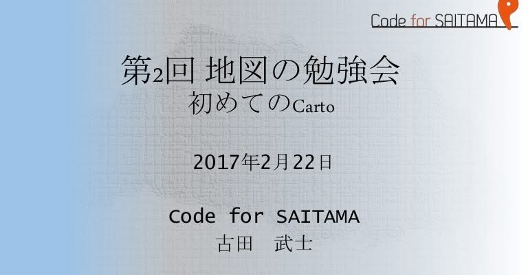

## 0276 — 2017-03-01 — 古田武士

- 投稿ID: 633771876823955
- 投稿URL: https://www.facebook.com/groups/186097664924714/posts/633771876823955/
- 要約: ３月の地図の勉強会のイベントを立てました。今回はQGISです。 ３１１の後でも有りますので防災マップづくりを体験してみたいと思います。また、２月の災害訓練で作ったドローンマップのデータ作りについて話ができたらと思います。
- コメント要約: （コメントなし）

３月の地図の勉強会のイベントを立てました。今回はQGISです。
３１１の後でも有りますので防災マップづくりを体験してみたいと思います。また、２月の災害訓練で作ったドローンマップのデータ作りについて話ができたらと思います。
2017/03/15(水)
第３回 地図の勉強会
さいたま市
参加者8人・興味あり30人

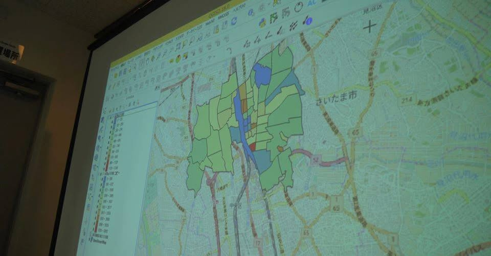

## 0277 — 2017-03-04 — 後藤 真太郎

- 投稿ID: 634904446710698
- 投稿URL: https://www.facebook.com/groups/186097664924714/posts/634904446710698/
- 要約: 盆栽博物館で行われる国際盆栽大会、岩槻映画祭などでコンテンツツーリズムができるようなオープンデータ利用のマッピングを一緒に考えませんか？ 2017/03/04(土) 【3/4土曜】International Open Data Day 2017 in SAITAMA さいたま市 立正大学研究推進地域連携センター（公開ページ）とシェアされています
- コメント要約: （コメントなし）

盆栽博物館で行われる国際盆栽大会、岩槻映画祭などでコンテンツツーリズムができるようなオープンデータ利用のマッピングを一緒に考えませんか？
2017/03/04(土)
【3/4土曜】International Open Data Day 2017 in SAITAMA
さいたま市
立正大学研究推進地域連携センター（公開ページ）とシェアされています

## 0278 — 2017-03-08 — Seikaku Robo PRteam

- 投稿ID: 636860646515078
- 投稿URL: https://www.facebook.com/groups/186097664924714/posts/636860646515078/
- 要約: 埼玉発の弊社から先日プレスリリースを発出させていただいた、 株式会社RTC様の高齢者見守りシステムに対応するロボット・ IoT機器向けのアプリの実証実験が行われました。
- コメント要約: （コメントなし）

埼玉発の弊社から先日プレスリリースを発出させていただいた、
株式会社RTC様の高齢者見守りシステムに対応するロボット・
IoT機器向けのアプリの実証実験が行われました。
その際の現場の様子を、ぜひご覧ください。
http://seikaku.co.jp/event/mimamori_system
#ロボット #ペッパー #Pepper #介護 #IoT #社会問題 #解決 #ロボホン #AndroidWear #見守り #ウェアラブル #介護施設
Pepper 生活革命さんからの投稿をシェアしました
Pepper 生活革命
生活革命では、株式会社RTC様の提供する見守り支援プラットフォームに、弊社の得意とする技術でロボットとウェアラブルデバイスを繋げるバージョンアップを行いました。
今回は、実際に介護老人ホームで行われた実証実験の様子をご紹介します。
http://seikaku.co.jp/event/mimamori_system
【事例紹介】高齢者見守りシステムに対応したPepper・ロボホン・スマートウォッチアプリを開発！ | | （株）生活革命 | Pepperレンタル・イベント実績 多数
SEIKAKU.CO.JP
【事例紹介】高齢者見守りシステムに対応したPepper・ロボホン・スマートウォッチアプリを開発！ | | （株）生活革命 | Pepperレンタル・イベント実績 多数

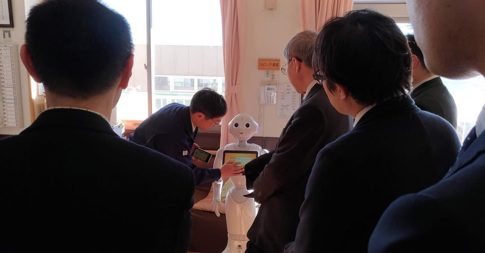

## 0279 — 2017-03-16 — 古田武士

- 投稿ID: 640705562797253
- 投稿URL: https://www.facebook.com/groups/186097664924714/posts/640705562797253/
- 要約: 昨日の地図の勉強会の資料を公開しました。 来月は4月19日に予定しています。会議室の予約完了時点でイベントページを 立てます。次回の内容はCarto.comリベンジです。
- コメント要約: 12,19日は予約が埋まっていたので他の日にしたいと思います。

昨日の地図の勉強会の資料を公開しました。
来月は4月19日に予定しています。会議室の予約完了時点でイベントページを
立てます。次回の内容はCarto.comリベンジです。
前回、アカウントの作られたタイミングでUIが違いましたので、
新UIでの操作方法を中心に説明します。
第３回 地図の勉強会
SLIDESHARE.NET
第３回 地図の勉強会
関連度の高い順

### コメント — 古田武士

12,19日は予約が埋まっていたので他の日にしたいと思います。

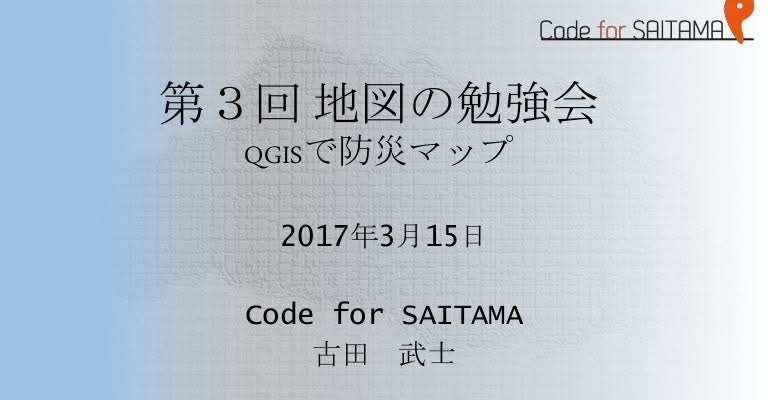

## 0280 — 2017-03-24 — 太田 一穂

- 投稿ID: 644005499133926
- 投稿URL: https://www.facebook.com/groups/186097664924714/posts/644005499133926/
- 要約: 今年のお花見マッピングパーティは戸田市でやります。 2017/04/09(日) 【4/9日曜】お花見マッピングパーティ2017【今年は戸田】 埼玉県 戸田市
- コメント要約: （コメントなし）

今年のお花見マッピングパーティは戸田市でやります。
https://www.facebook.com/events/170925160084906/
2017/04/09(日)
【4/9日曜】お花見マッピングパーティ2017【今年は戸田】
埼玉県 戸田市

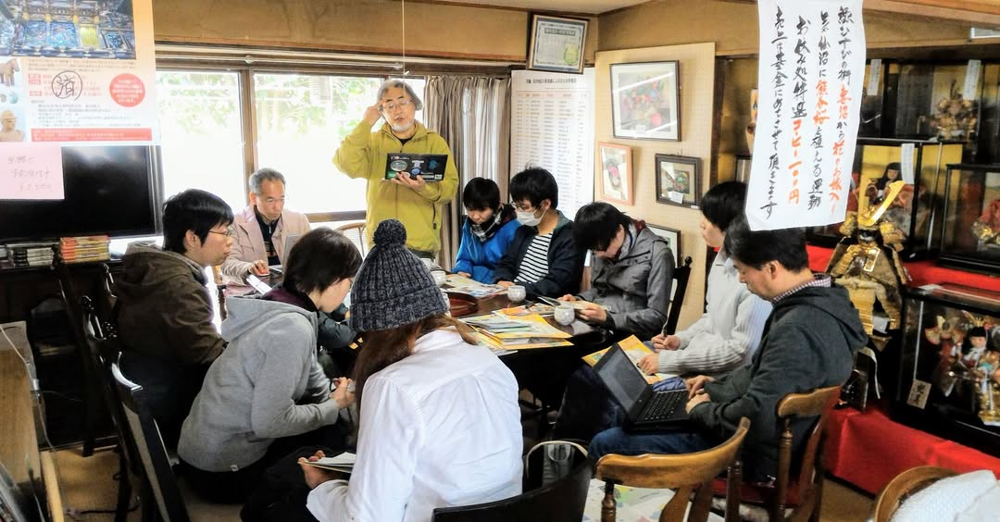

## 0281 — 2017-03-28 — 後藤 真太郎

- 投稿ID: 646109755590167
- 投稿URL: https://www.facebook.com/groups/186097664924714/posts/646109755590167/
- 要約: 興味のある方、参加されませんか？ 「地震対策ハッカソン」参加チーム募集中、天王洲アイルで4月22日・23日開催 INTERNET.WATCH.IMPRESS.CO.JP 「地震対策ハッカソン」参加チーム募集中、天王洲アイルで4月22日・23日開催
- コメント要約: （コメントなし）

興味のある方、参加されませんか？
「地震対策ハッカソン」参加チーム募集中、天王洲アイルで4月22日・23日開催
INTERNET.WATCH.IMPRESS.CO.JP
「地震対策ハッカソン」参加チーム募集中、天王洲アイルで4月22日・23日開催

## 0282 — 2017-04-21 — Seikaku Robo PRteam

- 投稿ID: 659026350965174
- 投稿URL: https://www.facebook.com/groups/186097664924714/posts/659026350965174/
- 要約: アキュラホーム様 “春のおもてなし感謝祭” に行ってきました。 様々な弊社独自アプリでたくさんのお客様に喜んでいただきました。 これからも埼玉県企業として全国で生活革命のPepperを活躍させて 行きたいと思っています。
- コメント要約: （コメントなし）

アキュラホーム様 “春のおもてなし感謝祭” に行ってきました。
様々な弊社独自アプリでたくさんのお客様に喜んでいただきました。
これからも埼玉県企業として全国で生活革命のPepperを活躍させて
行きたいと思っています。
当日の様子はぜひブログをご覧ください。
#ロボット #ペッパー #Pepper #ビジネス #春 #イベント #接客
Pepper 生活革命さんからの投稿をシェアしました
Pepper 生活革命
3月にアキュラホーム様の「春の感謝祭」で弊社の賢いPepperとプリンティングソリューションでアキュラホームおみくじをご用命いただきました。
GWまだ空きがございます。是非、ご相談ください！
http://seikaku.co.jp/event/pepper_event_aq201703
#Pepper #ペッパー #イベント #展示会 #レンタル
【イベント】今回も生活革命のPepperが大活躍！アキュラホーム様、春の感謝祭にPepperも参加 | | （株）生活革命 | Pepperレンタル・イベント実績 多数
SEIKAKU.CO.JP
【イベント】今回も生活革命のPepperが大活躍！アキュラホーム様、春の感謝祭にPepperも参加 | | （株）生活革命 | Pepperレンタル・イベント実績 多数

## 0283 — 2017-04-27 — 太田 一穂

- 投稿ID: 662012610666548
- 投稿URL: https://www.facebook.com/groups/186097664924714/posts/662012610666548/
- 要約: 4/29土曜日、Code for TODAでスクラッチ初心者向けワークショップがあります。 僕もCoderDojoさいたまのメンター仲間と参加します！ 岡嶋 和弘さんからの投稿をシェアしました 岡嶋 和弘 【4月29日（土）15時からスクラッチ初心者向けワークショップ】 急な告知ですが、戸田市で開催します。
- コメント要約: （コメントなし）

4/29土曜日、Code for TODAでスクラッチ初心者向けワークショップがあります。
僕もCoderDojoさいたまのメンター仲間と参加します！
岡嶋 和弘さんからの投稿をシェアしました
岡嶋 和弘
【4月29日（土）15時からスクラッチ初心者向けワークショップ】
急な告知ですが、戸田市で開催します。
埼京線 戸田公園駅から徒歩10分くらい場所で少しわかりずらいかも知れませんが、お時間ある方は、初心者に限らず是非ご参加ください。
詳細、申し込み方法は、以下のサイトで確認してください。
CODEFORTODA.ORG
プログラミング「スクラッチ」入門を開催します – Code for TODA
さいたま市で、3年以上CoderDojoを開催しているCoderDojoさいたまさんのご協力をいただきまして、Scratchを中心としたCoderDojoを開催します。

## 0284 — 2017-05-03 — 太田 一穂さんは6Fにいます。

- 投稿ID: 664903303710812
- 投稿URL: https://www.facebook.com/groups/186097664924714/posts/664903303710812/
- 要約: 太田 一穂 さいたま市 【Scratch Dayのお知らせ】 教育用プログラミング言語として有名なScratchですが今年10周年だそうです。毎年5月に「Scratch Day」として世界中でイベントが行われていますが、CoderDojoさいたまでも5/13に午前午後2本立てでイベントを行います。
- コメント要約: イベントページはこちら。メンター増えれば参加者も増やせますm(_ _)m CODERDOJO.DOORKEEPER.JP <<午前の部>> CoderDojoさいたまのScratch Day！

太田 一穂
さいたま市
【Scratch Dayのお知らせ】
教育用プログラミング言語として有名なScratchですが今年10周年だそうです。毎年5月に「Scratch Day」として世界中でイベントが行われていますが、CoderDojoさいたまでも5/13に午前午後2本立てでイベントを行います。（場所は大宮の貸会議室6Fです）
特に午前中は「３人１組でハッカソン！」と題してハッカソン形式で作品を作る試みです。
お子様の参加は、すでに定員に達しキャンセル待ち状態なのですが、見学やメンター参加は大歓迎です！
CoderDojoとかプログラミング教育関係に興味のある方はぜひぜひ！— 場所: 6F
DAY.SCRATCH.MIT.EDU
CorderDojoさいたまのScratchDay! | Scratch Day
Javascript is required for this website. Please enable Javascript on this device or visit with a more capable device for the full experience.
関連度の高い順

### コメント — 太田 一穂

イベントページはこちら。メンター増えれば参加者も増やせますm(_ _)m
https://coderdojo.doorkeeper.jp/events/60102
CODERDOJO.DOORKEEPER.JP
<<午前の部>> CoderDojoさいたまのScratch Day！ - 2017年5月13日(土)9時40分から
<<午前の部>> CoderDojoさいたまのScratch Day！ - 2017年5月13日(土)9時40分から
プレビューを削除

### コメント — 後藤 真太郎

5/13は鳩山の地球観測センターの公開日。10時-15時、Strawbeesで大型の宇宙にちなんだ何か？を作りますので難しいです。浅川さんもおられますので夜、合流出来るかも？

## 0285 — 2017-05-10 — 太田 一穂

- 投稿ID: 668031280064681
- 投稿URL: https://www.facebook.com/groups/186097664924714/posts/668031280064681/
- 要約: 今年のCode for Japan Summitは9/23-24神戸です 2017/09/23(土) Code for Japan Summit 2017 神戸市 Code for TODA～情報×（子供＋防災＋まちづくり）支援とシェアされています
- コメント要約: （コメントなし）

今年のCode for Japan Summitは9/23-24神戸です
2017/09/23(土)
Code for Japan Summit 2017
神戸市
Code for TODA～情報×（子供＋防災＋まちづくり）支援とシェアされています

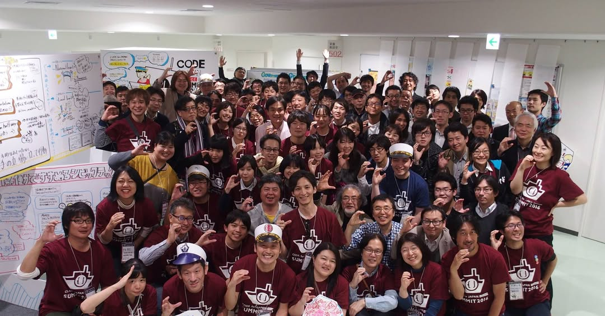

## 0286 — 2017-05-26 — Seikaku Robo PRteam

- 投稿ID: 675782582622884
- 投稿URL: https://www.facebook.com/groups/186097664924714/posts/675782582622884/
- 要約: 埼玉の会社である弊社の開発した、介護施設用のロボット・スマートデバイス連携システムを日経新聞様電子版に掲載いただきました。 ぜひ、ご覧ください。
- コメント要約: （コメントなし）

埼玉の会社である弊社の開発した、介護施設用のロボット・スマートデバイス連携システムを日経新聞様電子版に掲載いただきました。
ぜひ、ご覧ください。
#ロボット #ペッパー #Pepper #介護 #IoT #社会問題 #解決 #ロボホン #AndroidWear #見守り #ウェアラブル #介護施設
Pepper 生活革命さんからの投稿をシェアしました
Pepper 生活革命
ロボホン・スマートウォッチ・ペッパーがセンサーと連携した、弊社のロボット・スマートデバイス連動技術の活用例を日経新聞電子版に掲載いただきました！
https://seikaku.co.jp/media/nikkeiweb-mimamori01
【日経新聞電子版様】弊社のロボット・スマートデバイス連動技術の活用例を紹介いただきました - （株）生活革命 | Pepperレンタル・イベント実績 多数
SEIKAKU.CO.JP
【日経新聞電子版様】弊社のロボット・スマートデバイス連動技術の活用例を紹介いただきました - （株）生活革命 | Pepperレンタル・イベント実績 多数

## 0287 — 2017-05-26 — 栗原謙一

- 投稿ID: 675797299288079
- 投稿URL: https://www.facebook.com/groups/186097664924714/posts/675797299288079/
- 要約: 4月にCode for Kumagayaを立ち上げました。埼玉県内Brigadeとして、ともに盛り上げていきます！ さて、早速ですが6月に「熊谷から埼玉の観光を考えるアイディアソン／ハッカソン」を開催します。
- コメント要約: （コメントなし）

4月にCode for Kumagayaを立ち上げました。埼玉県内Brigadeとして、ともに盛り上げていきます！
さて、早速ですが6月に「熊谷から埼玉の観光を考えるアイディアソン／ハッカソン」を開催します。詳細についてはCode for Kumagayaページ内のイベントで確認お願いします。
Code for Kumagaya

## 0288 — 2017-05-26 — 後藤 真太郎

- 投稿ID: 675851605949315
- 投稿URL: https://www.facebook.com/groups/186097664924714/posts/675851605949315/
- 要約: Code for SAITAMAと共催で行います。宇宙語ばかりだとご心配されている方、見学だけでも大歓迎です。ともに考えともに作りましょう。 2017/06/17(土) 熊谷から埼玉の観光を考えるアイディアソン／ハッカソン《プレアイディアソン》 埼玉県 熊谷市 熊谷宝乗院愛染堂を救おうとシェアされています
- コメント要約: （コメントなし）

Code for SAITAMAと共催で行います。宇宙語ばかりだとご心配されている方、見学だけでも大歓迎です。ともに考えともに作りましょう。
https://www.facebook.com/events/407349702997670/?ti=cl
2017/06/17(土)
熊谷から埼玉の観光を考えるアイディアソン／ハッカソン《プレアイディアソン》
埼玉県 熊谷市
熊谷宝乗院愛染堂を救おうとシェアされています

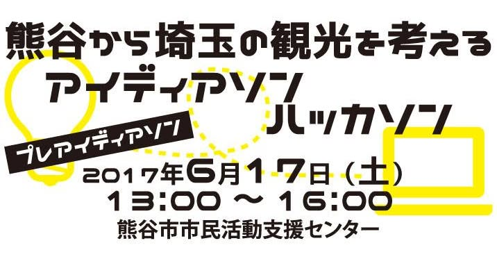

## 0289 — 2017-05-30 — 古田武士

- 投稿ID: 677787965755679
- 投稿URL: https://www.facebook.com/groups/186097664924714/posts/677787965755679/
- 要約: 先日の勉強会の資料が共有されていなかったので、SlideShareにアップしたものを共有しておきます。 第4回 第5回 第５回 地図の勉強会 SLIDESHARE.NET 第５回 地図の勉強会
- コメント要約: （コメントなし）

先日の勉強会の資料が共有されていなかったので、SlideShareにアップしたものを共有しておきます。
第4回
https://www.slideshare.net/ssuser514b7a/ss-76362442
第5回
https://www.slideshare.net/ssuser514b7a/ss-76362496
第５回 地図の勉強会
SLIDESHARE.NET
第５回 地図の勉強会

## 0290 — 2017-06-17 — 後藤 真太郎

- 投稿ID: 687237248144084
- 投稿URL: https://www.facebook.com/groups/186097664924714/posts/687237248144084/
- 要約: ICTによる社会課題解決の活動、Code for SAITAMAから始まり、Toda、wako、Kumagaya、さらにノード所沢に拡がりました。 色んな分野の方々が位置を介して地図上で関係を持ちながら緩やかに繋がりあう社会(空間情報社会)を醸成していきます。
- コメント要約: オープンデータ事業を根付かせないと統合型GISみたいに死語になってしまう危機感を持ってます。 そのうち埼玉でサミットですかね？

ICTによる社会課題解決の活動、Code for SAITAMAから始まり、Toda、wako、Kumagaya、さらにノード所沢に拡がりました。
色んな分野の方々が位置を介して地図上で関係を持ちながら緩やかに繋がりあう社会(空間情報社会)を醸成していきます。
7/23は、所沢で話題提供してきます。
https://www.facebook.com/events/1371846012931333/?ti=cl
このコンテンツは現在ご利用いただけません
所有者がシェア先を一部の人のみに限定しているか、プライバシー設定が変更されたか、コンテンツが削除された、などの理由が考えられます。
関連度の高い順

### コメント — 後藤 真太郎

オープンデータ事業を根付かせないと統合型GISみたいに死語になってしまう危機感を持ってます。

### コメント — 山中 邦久

そのうち埼玉でサミットですかね？

## 0291 — 2017-06-17 — 後藤 真太郎

- 投稿ID: 687484944785981
- 投稿URL: https://www.facebook.com/groups/186097664924714/posts/687484944785981/
- 要約: 太田一穗さんの著作が出版されます。ご一読下さい。 ここまで作れる! Raspberry Pi 実践サンプル集 AMAZON.CO.JP ここまで作れる! Raspberry Pi 実践サンプル集 関連度の高い順 返信3件を見る 返信1件を見る 返信2件を見る
- コメント要約: 予約しました〜！これはワークショップ開催な予感！ 予約しました！楽しみです！ 太田さん、岡嶋さんお疲れ様でした オンラインのステータスインジケーター アクティブ 田中 明子 え！

太田一穗さんの著作が出版されます。ご一読下さい。
ここまで作れる! Raspberry Pi 実践サンプル集
AMAZON.CO.JP
ここまで作れる! Raspberry Pi 実践サンプル集
関連度の高い順
返信3件を見る
返信1件を見る
返信2件を見る

### コメント — 高柳 謙

予約しました〜！！！これはワークショップ開催な予感！

### コメント — 宮野 慶一朗

予約しました！！楽しみです！

### コメント — 飯島 修

太田さん、岡嶋さんお疲れ様でした

### コメント — オンラインのステータスインジケーター
アクティブ

オンラインのステータスインジケーター
アクティブ
田中 明子
え！なに？？太田さん本出すの～～～？？(;ﾟдﾟ)

### コメント — 吉永 篤史

予約したいけどアマゾンのアカウント乗っ取られ中です。

## 0292 — 2017-06-25 — 太田 一穂さんはさいたま市市民活動サポートセンターにいます。

- 投稿ID: 691221021079040
- 投稿URL: https://www.facebook.com/groups/186097664924714/posts/691221021079040/
- 要約: 太田 一穂 さいたま市 明日になりますが、浦和のパルコ9階でグラフィックレコーディング（グラレコ）の勉強会やります。今後埼玉でグラレコを広めるためには何をしたらいいか考える会、の方が適切かも。
- コメント要約: （コメントなし）

太田 一穂
さいたま市
明日になりますが、浦和のパルコ9階でグラフィックレコーディング（グラレコ）の勉強会やります。今後埼玉でグラレコを広めるためには何をしたらいいか考える会、の方が適切かも。
講師として、埼玉県日高市在住の本園さんをお招きします。中央区佃島のマッピングパーティからのご縁です。
グラレコの説明から、少し実践もするつもりです。紙とプロッキーは用意しますのでお気軽にご参加ください！
https://m.facebook.com/story.php?story_fbid=1348761925193602&id=100001794230795— 場所: さいたま市市民活動サポートセンター
2017/06/26(月)
グラレコパーティー＠浦和
さいたま市
参加者5人・興味あり49人

## 0293 — 2017-06-28 — 古田武士

- 投稿ID: 692985377569271
- 投稿URL: https://www.facebook.com/groups/186097664924714/posts/692985377569271/
- 要約: 前回の地図の勉強会の資料をアップしましたので共有しておきます。 第6回地図の勉強会 SLIDESHARE.NET 第6回地図の勉強会 関連度の高い順
- コメント要約: ありがとうございました。つかってっみると、かなり忘れていたので助かります。 MACHIHITO.BLOG131.FC2.COM 昭和通りも越えた日本橋界隈の集い 第4回 日本橋くされ市 昭和通りも越えた日本橋界隈の集い 第4回 日本橋くされ市

前回の地図の勉強会の資料をアップしましたので共有しておきます。
第6回地図の勉強会
SLIDESHARE.NET
第6回地図の勉強会
関連度の高い順

### コメント — 藤井 俊公

ありがとうございました。つかってっみると、かなり忘れていたので助かります。　http://machihito.blog131.fc2.com/blog-entry-2216.html
MACHIHITO.BLOG131.FC2.COM
昭和通りも越えた日本橋界隈の集い　第4回 日本橋くされ市
昭和通りも越えた日本橋界隈の集い　第4回 日本橋くされ市

## 0294 — 2017-07-01 — 後藤 真太郎

- 投稿ID: 694807917387017
- 投稿URL: https://www.facebook.com/groups/186097664924714/posts/694807917387017/
- 要約: 8/4-6 第1回災害支援業務と連携した防災リテラシー教育セミナー（協働型災害訓練 理論編） の申し込みサイトを公開しました。学内宿泊施設をご利用の方はお早めに申し込みください。
- コメント要約: （コメントなし）

8/4-6 第1回災害支援業務と連携した防災リテラシー教育セミナー（協働型災害訓練 理論編） の申し込みサイトを公開しました。学内宿泊施設をご利用の方はお早めに申し込みください。
第1回災害支援業務と連携した防災リテラシー教育セミナー　協働型災害訓練 理論編
DOCS.GOOGLE.COM
第1回災害支援業務と連携した防災リテラシー教育セミナー　協働型災害訓練 理論編

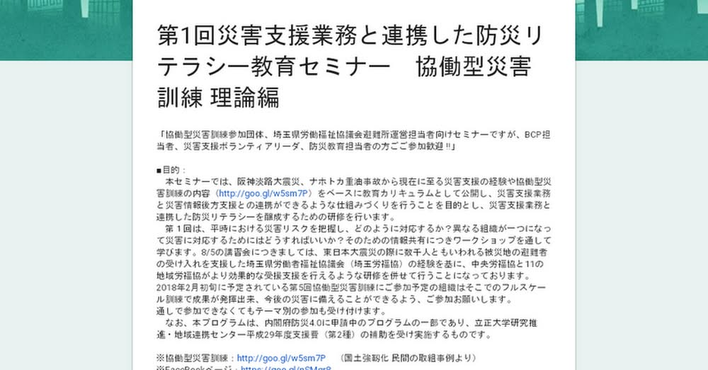

## 0295 — 2017-07-05 — 伊藤 利昭

- 投稿ID: 697144750486667
- 投稿URL: https://www.facebook.com/groups/186097664924714/posts/697144750486667/
- 要約: Code for TODAの伊藤と申します。 告知です。今週末ですが、戸田で「オープンデータの現状について」研究会を開催します。 2017/07/08(土) 「オープンデータの現状について」研究会 戸田市ボランティア・市民活動支援センターTOMATO Code for TODA～情報×（子供＋防災＋まちづくり）支援主催 興味あり
- コメント要約: （コメントなし）

Code for TODAの伊藤と申します。
告知です。今週末ですが、戸田で「オープンデータの現状について」研究会を開催します。
https://www.facebook.com/events/117651145508854/
2017/07/08(土)
「オープンデータの現状について」研究会
戸田市ボランティア・市民活動支援センターTOMATO
Code for TODA～情報×（子供＋防災＋まちづくり）支援主催
興味あり

## 0296 — 2017-07-22 — 藤倉 潤一郎

- 投稿ID: 706245476243261
- 投稿URL: https://www.facebook.com/groups/186097664924714/posts/706245476243261/
- 要約: いつもお世話になっております。いよいよ明日、UDC2017／所沢オープンデータ研究会のキックオフです。
- コメント要約: （コメントなし）

いつもお世話になっております。いよいよ明日、UDC2017／所沢オープンデータ研究会のキックオフです。
この間、事務局では産総研や川崎、鶴岡、鎌倉のリビングラボや経産省、産総研、UDC2017／岡山ブロックとしての活動ともリンクしている、倉敷市・データクレイドル社のデータキャピタル事業、インテリジェントIoT実装事業などについてお話を伺ったり、意見交換を進めてまいりました。
明日は、後藤先生のお話に加えて、事務局からもこれらの内容について情報提供・シェアさせて頂き、所沢でのオープンデータ事業の取り組みについて大いに意見交換させて頂きたいと思っています。
あいにく出席予定者は少なめの様子ですが、その分、密度の濃い意見交換ができればと思っていますので、各地の皆さまにも応援に足をお運びいただけたら幸いです。どうぞよろしくお願いいたします。
https://www.facebook.com/events/1371846012931333/
このコンテンツは現在ご利用いただけません
所有者がシェア先を一部の人のみに限定しているか、プライバシー設定が変更されたか、コンテンツが削除された、などの理由が考えられます。

## 0297 — 2017-08-04 — 小嶋 敦夫
 
·
フォローする

- 投稿ID: 712249742309501
- 投稿URL: https://www.facebook.com/groups/186097664924714/posts/712249742309501/
- 要約: 【セミナーのご案内】 地域活性化センターの小嶋と申します。 当センターでは、バラエティに富む講師陣による多角的な視点でオープンデータの可能性を紐解くセミナーを開催します！
- コメント要約: （コメントなし）

【セミナーのご案内】
地域活性化センターの小嶋と申します。
当センターでは、バラエティに富む講師陣による多角的な視点でオープンデータの可能性を紐解くセミナーを開催します！
皆さんのように既にオープンデータに興味をお持ちの方はもちろんのこと、協働のまちづくり、福祉、市民生活関連部門など、ともするとジブンには畑違いとお思いの方々にもご参加いただきけると嬉しいです。
ぜひ、心あたりの方にもご紹介ください。
https://www.facebook.com/events/330621480713045/?acontext=%7B%22ref%22%3A%2222%22%2C%22feed_story_type%22%3A%2222%22%2C%22action_history%22%3A%22null%22%7D&pnref=story
2017/09/09(土)
【土日集中セミナー（募集）】「人にやさしいオープンデータは住民と行政を変える」
地域活性化センター大会議室（東京都中央区日本橋２－３－４日本橋プラザビル１３階）
オープンデータ活用！とシェアされています
興味あり

## 0298 — 2017-08-06 — 後藤 真太郎

- 投稿ID: 713133445554464
- 投稿URL: https://www.facebook.com/groups/186097664924714/posts/713133445554464/
- 要約: とよしま 亮介さんからの投稿をシェアしました 写真の説明はありません。. 写真の説明はありません。. 写真の説明はありません。. 写真の説明はありません。. 写真の説明はありません。
- コメント要約: （コメントなし）

とよしま 亮介さんからの投稿をシェアしました
写真の説明はありません。. 写真の説明はありません。. 写真の説明はありません。. 写真の説明はありません。. 写真の説明はありません。
とよしま 亮介さんは 第1回災害支援業務と連携した防災リテラシー教育セミナー　協働型災害訓練 理論編に参加しています ― 友達: 古田武士さん、
他4人
場所: 立正大学熊谷キャンパス
埼玉県 熊谷市
来年2月2〜3日に実施する「協働型災害訓練in杉戸」の為のステップアップセミナーとして、第一回災害支援業務と連携した防災リテラシー教育セミナー－ 協働型災害訓練 理論編 －を開催。
今回は、災害リスク（松島講師）、避難所運営（永田講師）、ICS（山上講師）、GIS（後藤教授）。全3回で協働型災害訓練のフルスケール訓練で成果が発揮出来、今後の災害に備えることができるよう学んで頂きます。

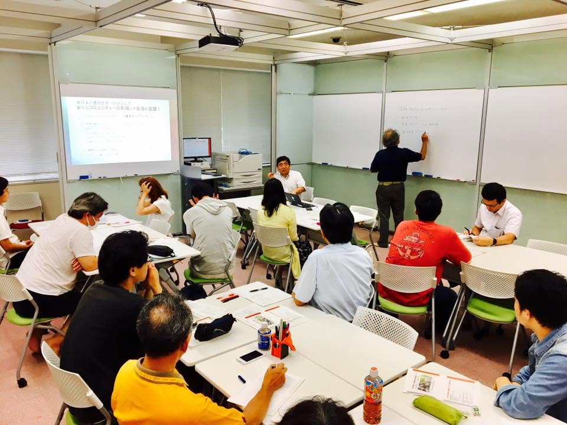

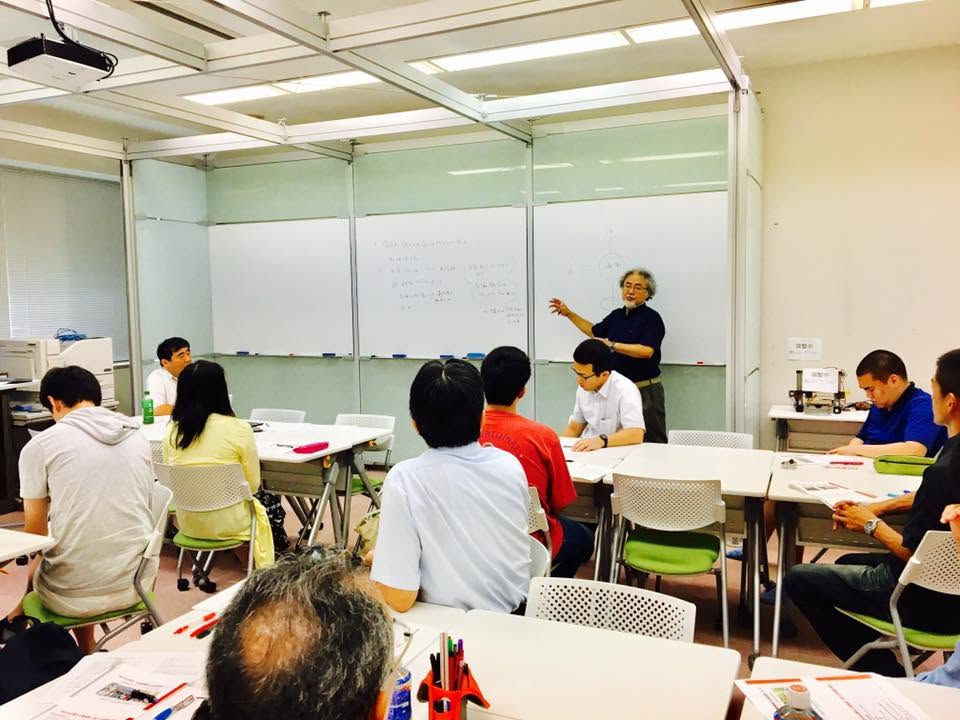

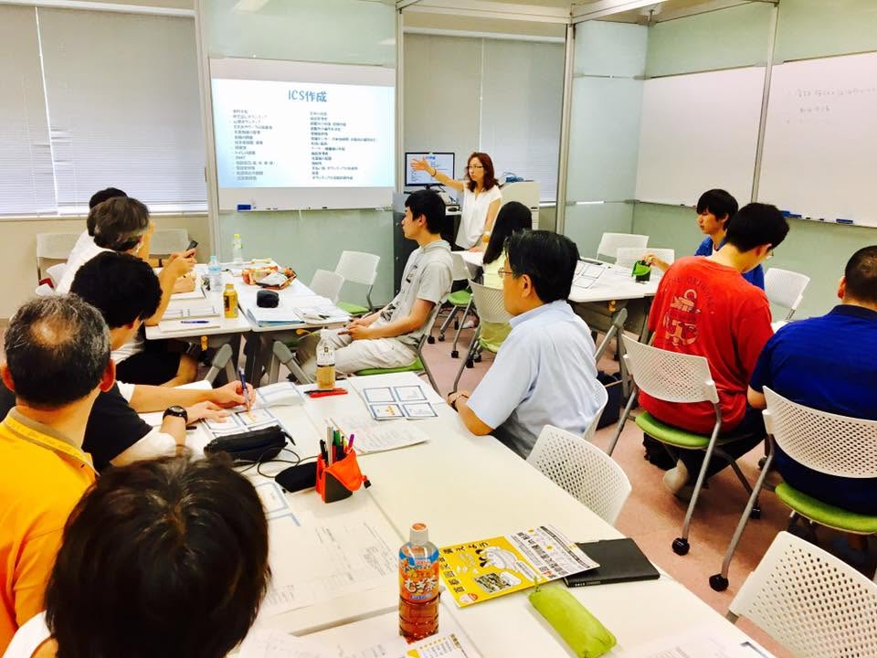

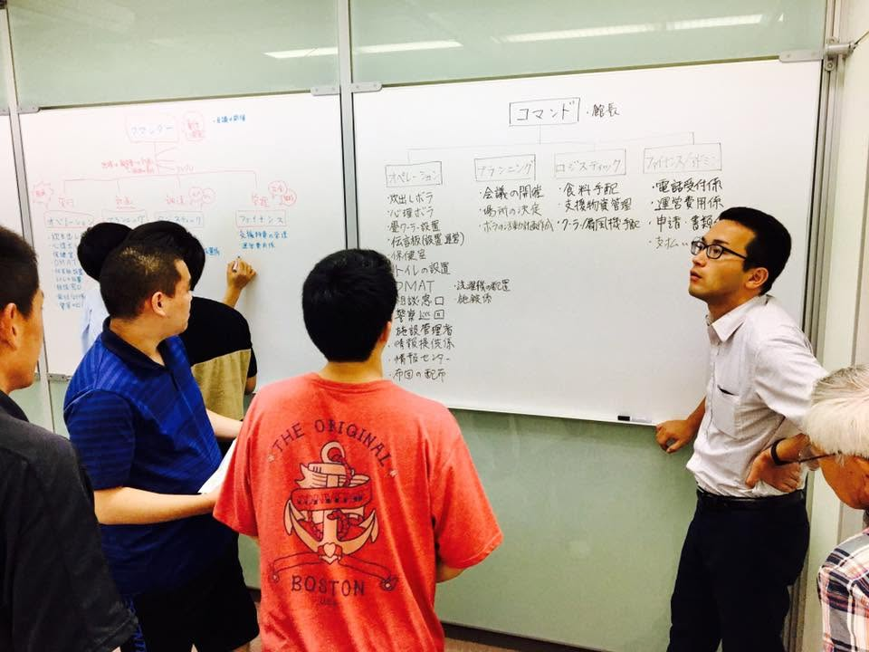

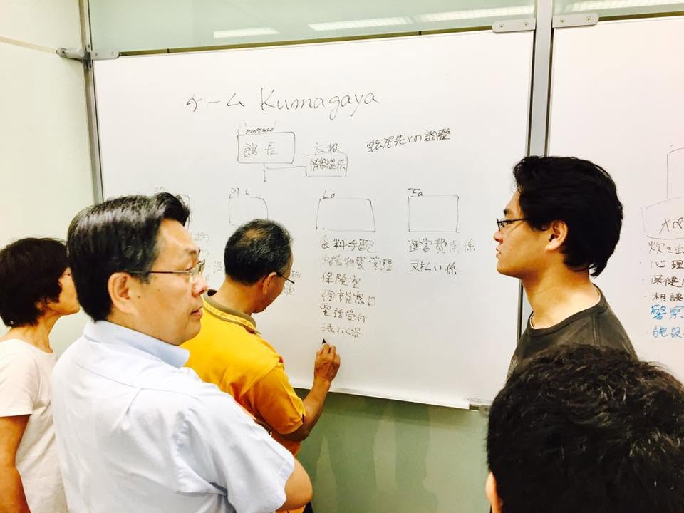

## 0299 — 2017-08-30 — 上原 正

- 投稿ID: 724572024410606
- 投稿URL: https://www.facebook.com/groups/186097664924714/posts/724572024410606/
- 要約: Code for Suginamiでオープンデータ活用のシンポジウムを開催します。 ９月２２日（金）と２３日（土）でCode for Japan サミットと日程が重なってしまいましたが、当日東京においででしたら、是非、ご参加をご検討ください。
- コメント要約: （コメントなし）

Code for Suginamiでオープンデータ活用のシンポジウムを開催します。
９月２２日（金）と２３日（土）でCode for Japan サミットと日程が重なってしまいましたが、当日東京においででしたら、是非、ご参加をご検討ください。
参加者募集を開始しました。
１日目は
庄司 昌彦氏、新 雅史氏、笹金 光徳氏、３氏のほか、行政から杉並区役所様と産業界から西武信用金庫様がご登壇！
定員６０名
１日目のお申込みはこちら！
http://peatix.com/event/297860/view
２日目は
山ノ内 凜太郎氏のファシリテーションによるワークショップ（アイデアソン）
定員６０名
２日目のお申込みはこちら！
http://peatix.com/event/297876/view
是非、お申込みの上、ご来場ください。
２日間それぞれお申込みください。
「まちづくりとオープンデータ活用」シンポジウム
「まちづくりとオープンデータ活用」シンポジウム
もっと見る
PEATIX.COM

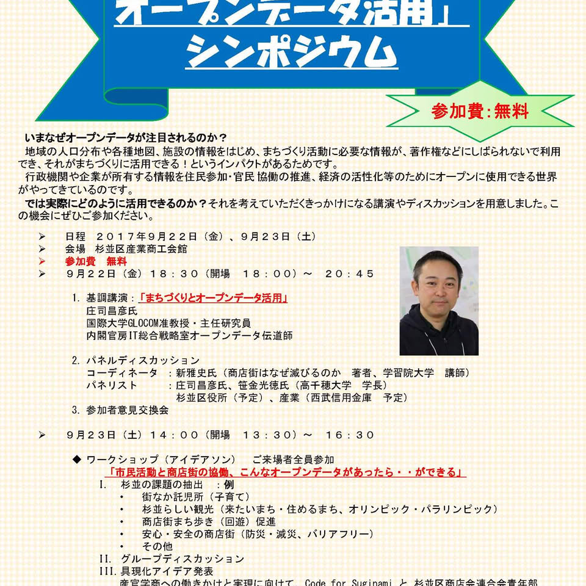

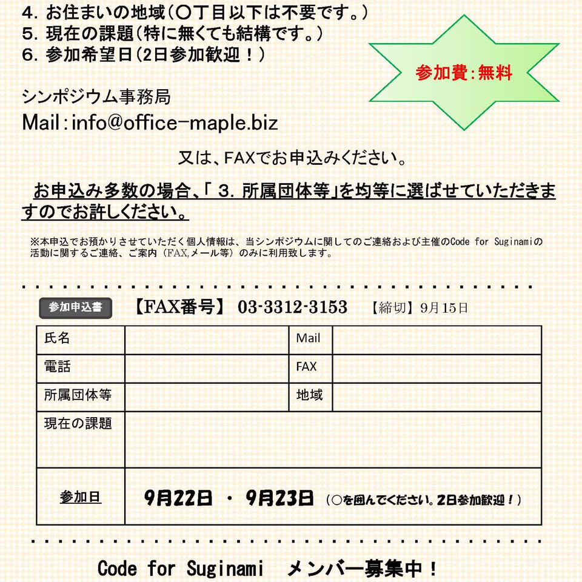

## 0300 — 2017-09-08 — 後藤 真太郎

- 投稿ID: 728107627390379
- 投稿URL: https://www.facebook.com/groups/186097664924714/posts/728107627390379/
- 要約: 2017/10/09(月) 場づくりワールドカフェ in くまがや「空き家活用 百花繚乱」 埼玉県 熊谷市 Code for Saitama運営会議とシェアされています 興味あり
- コメント要約: （コメントなし）

2017/10/09(月)
場づくりワールドカフェ in くまがや「空き家活用 百花繚乱」
埼玉県 熊谷市
Code for Saitama運営会議とシェアされています
興味あり

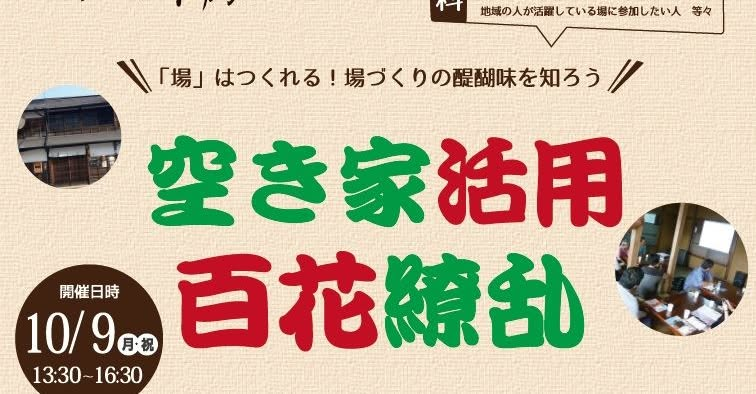

## 0301 — 2017-09-14 — 安部 邦昭

- 投稿ID: 730511543816654
- 投稿URL: https://www.facebook.com/groups/186097664924714/posts/730511543816654/
- 要約: 月末に、庄司さんをゲストにこんなイベントを予定しております。都市づくりNPOさいたまのメンバー外でも参加できますので、興味がありましたらぜひ。 2017/09/26(火) つくたま塾「オープンデータ／オープンガバメントで、市民参加のまちづくりはどう変わる？
- コメント要約: （コメントなし）

月末に、庄司さんをゲストにこんなイベントを予定しております。都市づくりNPOさいたまのメンバー外でも参加できますので、興味がありましたらぜひ。
https://www.facebook.com/events/1488763481215784/
2017/09/26(火)
つくたま塾「オープンデータ／オープンガバメントで、市民参加のまちづくりはどう変わる？」
NPO法人都市づくりNPOさいたま
興味あり

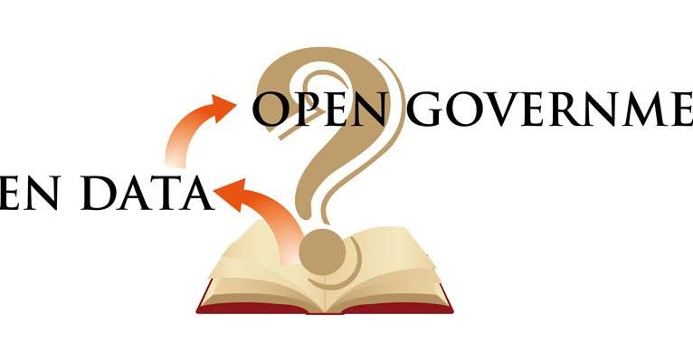

## 0302 — 2017-09-26 — 太田 一穂

- 投稿ID: 735220660012409
- 投稿URL: https://www.facebook.com/groups/186097664924714/posts/735220660012409/
- 要約: 【女性限定】 ではありますが、Code for Tokyo副代表でもある Mami EnomotoさんらDjangoGirlsTokyoのイベントです。僕もメンター参加してます。
- コメント要約: （コメントなし）

【女性限定】
ではありますが、Code for Tokyo副代表でもある Mami EnomotoさんらDjangoGirlsTokyoのイベントです。僕もメンター参加してます。
申込みは明日いっぱいなのですが、ちょっとプログラミングに手を出してみたい方どうぞ！
Mami Enomotoさんからの投稿をシェアしました
写真の説明はありません。. 写真の説明はありません。. 写真の説明はありません。. 写真の説明はありません。
Mami Enomoto
【参加申込み明日まで】DjangoGirlsワークショップ 2017
こんなアプリがあったらいいな、あんなサイトをつくれたらな…と思ってる女性のみなさん、あなたの「はじめてのWebアプリ」を一緒につくろう！女性を対象に、プログラミング・ワークショップを開催します。Pythonを始めたい方にもオススメです！　https://djangogirls.org/tokyo/
小さいグループをつくって、チュートリアルに沿ってWebアプリを作成します。プログラマとして活躍するコーチ達がお手伝いするので、プログラミングがはじめてでも大丈夫。HTML、CSS、Python、そしてDjango（ジャンゴ）を学んで、はじめてのWebアプリケーションを一緒に作ってみましょう。
＜開催概要＞
日時： 10月7日（土）10:00〜17:00
場所： 株式会社LIFULLL（半蔵門）
※ 参加費は無料です。
※ PC（WindowsまたはMac）をご持参ください
※ 前日（10/6 19:00~）に、参加者同士の顔合わせと必要なソフト等のインストールをおこないます。可能な限り参加をオススメします。
＜詳細・申込み＞
https://djangogirls.org/tokyo/
お申込み〆切： 9月27日 23:59
※ 申込みが定員を超える場合は、抽選とさせて頂きます。
＜参加して得られるモノ＞
・はじめてのウェブサイトを作ることで、その仕組みを学べます。
・プログラミングがあなたのキャリアの選択肢か、じっくり考えることができます。
・業界で活躍するプログラマーや、おなじ関心をもつ仲間と出会うことができます。

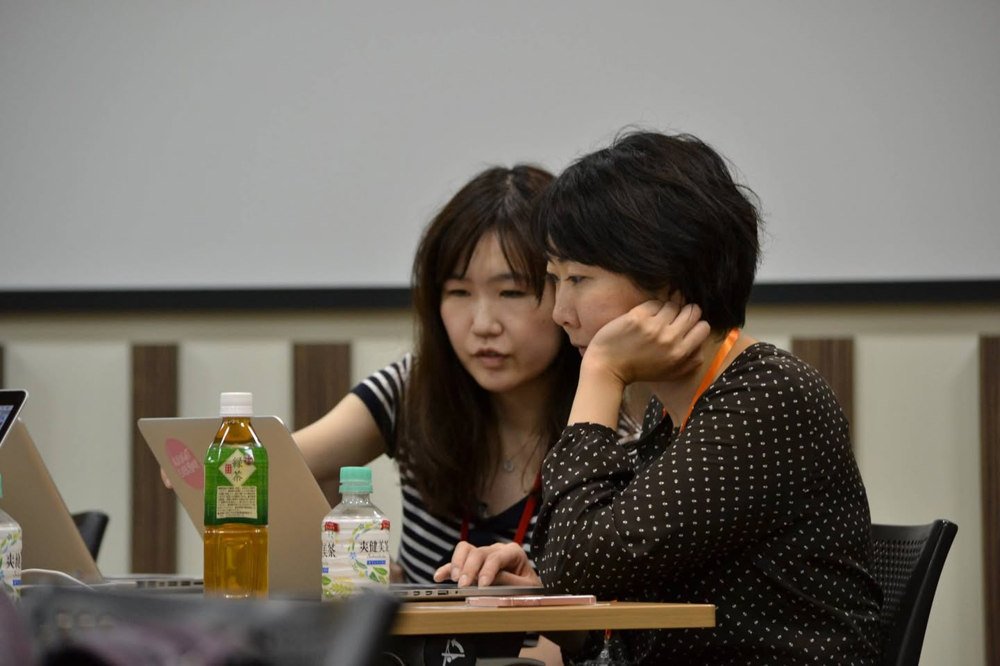

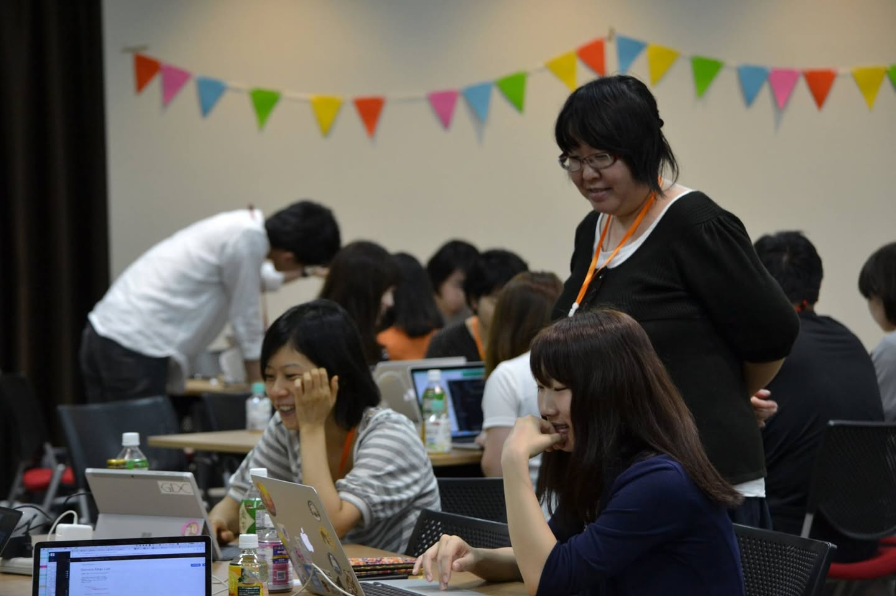

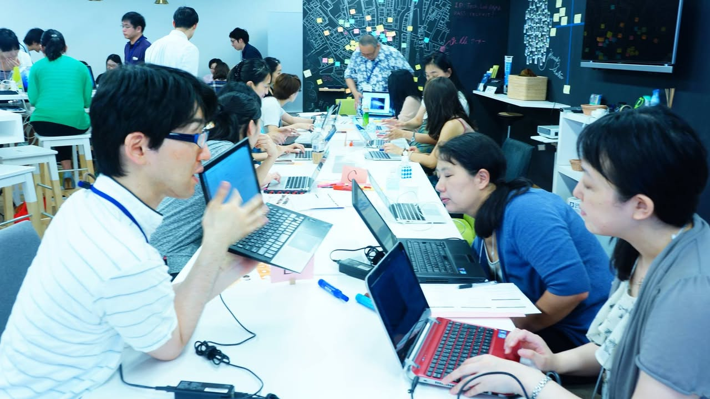

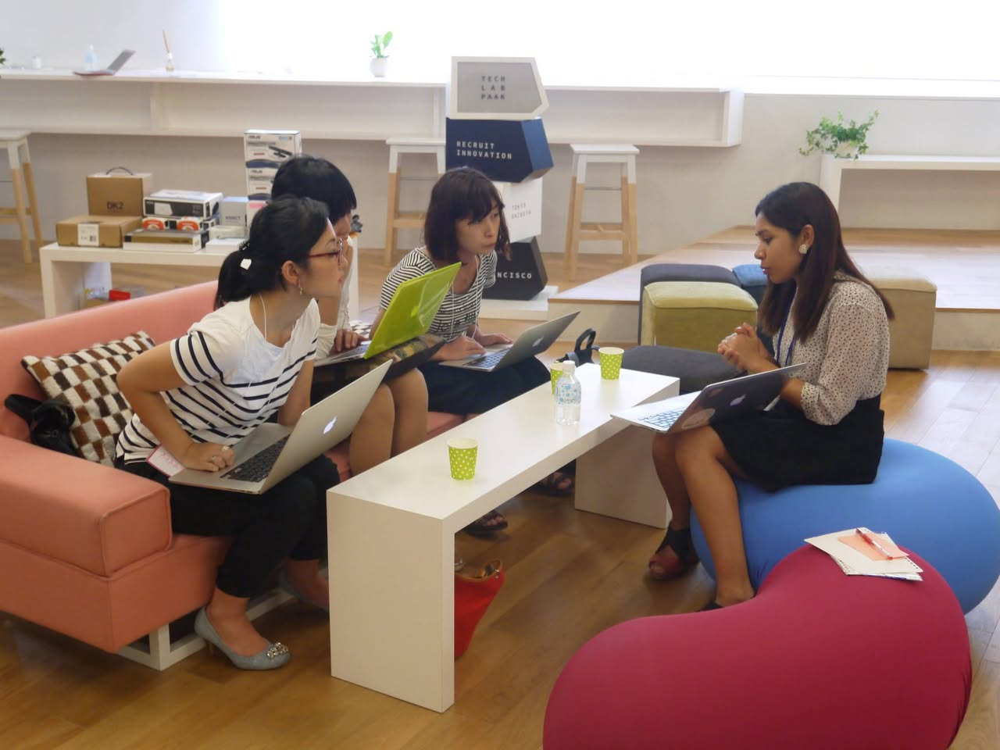

## 0303 — 2017-09-30 — 後藤 真太郎

- 投稿ID: 736795289854946
- 投稿URL: https://www.facebook.com/groups/186097664924714/posts/736795289854946/
- 要約: 12/2に立正大学品川キャンパスでケアマネージャー向けのメニューにて行います。是非ご参加ください。 2017/12/02(土) ご近所防災マッピングパーティー 立正大学 品川キャンパス 9B12 Code for Saitama運営会議とシェアされています
- コメント要約: （コメントなし）

12/2に立正大学品川キャンパスでケアマネージャー向けのメニューにて行います。是非ご参加ください。
2017/12/02(土)
ご近所防災マッピングパーティー
立正大学　品川キャンパス　9B12
Code for Saitama運営会議とシェアされています

## 0304 — 2017-11-29 — 後藤 真太郎

- 投稿ID: 761208180746990
- 投稿URL: https://www.facebook.com/groups/186097664924714/posts/761208180746990/
- 要約: 12/2に立正大学品川キャンパスで日本作業療法士会との協働で災害支援者向けマッピングパーティーを行います。 前半はマッピングパーティー。後半は、参加団団体の災害時の業務を整理していただき、業務の中でマップの役割を認識してもらうワークショップを行います。
- コメント要約: （コメントなし）

12/2に立正大学品川キャンパスで日本作業療法士会との協働で災害支援者向けマッピングパーティーを行います。
前半はマッピングパーティー。後半は、参加団団体の災害時の業務を整理していただき、業務の中でマップの役割を認識してもらうワークショップを行います。よろしければ、ご参加ください。
https://www.facebook.com/events/493416724368366/
2017/12/02(土)
ご近所防災マッピングパーティー
立正大学　品川キャンパス　9B12
Code for Saitama運営会議とシェアされています

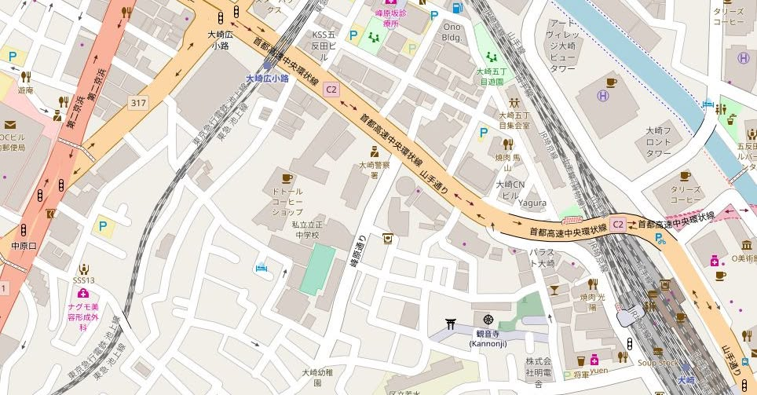

## 0305 — 2017-12-06 — 後藤 真太郎

- 投稿ID: 764836187050856
- 投稿URL: https://www.facebook.com/groups/186097664924714/posts/764836187050856/
- 要約: 2/12 戸田でアイデアソンが開催されます。是非！ 山中 邦久さんからの投稿をシェアしました 山中 邦久 Code for TODAで戸田市と日本情報経済社会推進機構共催、経産省後援で2月12日にアイデアソンをやることになった。
- コメント要約: （コメントなし）

2/12 戸田でアイデアソンが開催されます。是非！
山中 邦久さんからの投稿をシェアしました
山中 邦久
Code for TODAで戸田市と日本情報経済社会推進機構共催、経産省後援で2月12日にアイデアソンをやることになった。詳しくはサイトを。
http://codefortoda.org/

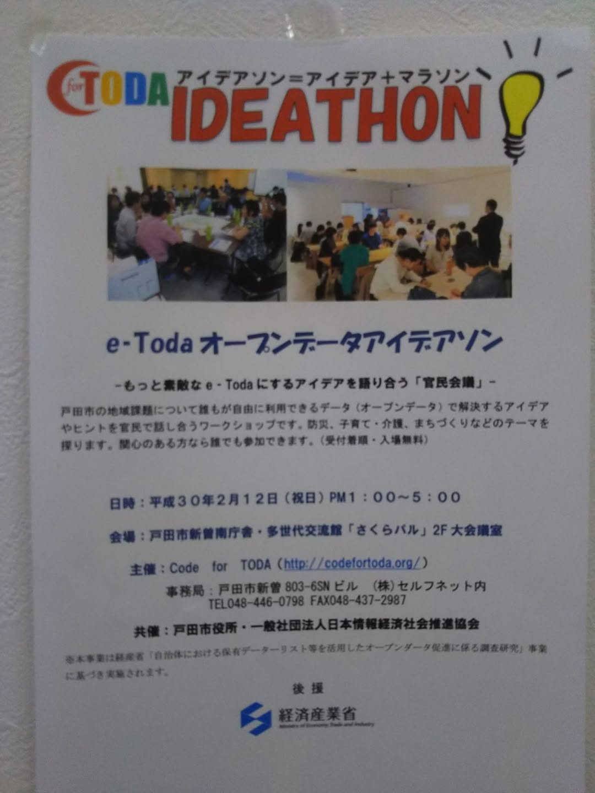

## 0306 — 2017-12-12 — 後藤 真太郎

- 投稿ID: 767672483433893
- 投稿URL: https://www.facebook.com/groups/186097664924714/posts/767672483433893/
- 要約: 12/16 大宮の日進にて第2回災害支援業務と連携した防災リテラシー教育セミナーを開催します。ここで議論している1/11の9都県市総合防災訓練の埼玉チームや、2/2-3の協働型災害訓練に参戦予定の団体のチーフは是非ご参加ください。
- コメント要約: （コメントなし）

12/16 大宮の日進にて第2回災害支援業務と連携した防災リテラシー教育セミナーを開催します。ここで議論している1/11の9都県市総合防災訓練の埼玉チームや、2/2-3の協働型災害訓練に参戦予定の団体のチーフは是非ご参加ください。
また、今後、災害に備えた訓練を予定されている方にとっては訓練のあり方を考えるいい機会であると思います。ご検討いただけますと嬉しいです。　　　　　　　　　　　　https://www.facebook.com/events/360468697739299/?ti=cl
2017/12/16(土)
第2回災害支援業務と連携した防災リテラシー教育セミナー　協働型災害訓練 理論編
日進町2丁目自治会館
後藤 真太郎さんから招待がありました
興味あり

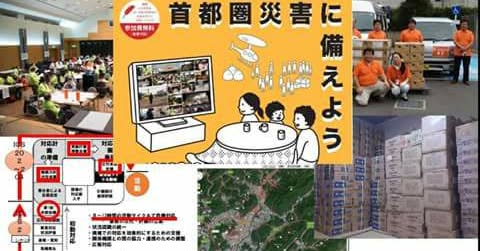

## 0307 — 2018-01-07 — 後藤 真太郎

- 投稿ID: 779712982229843
- 投稿URL: https://www.facebook.com/groups/186097664924714/posts/779712982229843/
- 要約: いよいよ明日に迫りました。今年の書初めは本庄からといきましょう。 2018/01/08(月) 本庄中山道マッピングパーティー 埼玉県 本庄市
- コメント要約: （コメントなし）

いよいよ明日に迫りました。今年の書初めは本庄からといきましょう。
https://www.facebook.com/events/1703880629678029/
2018/01/08(月)
本庄中山道マッピングパーティー
埼玉県 本庄市

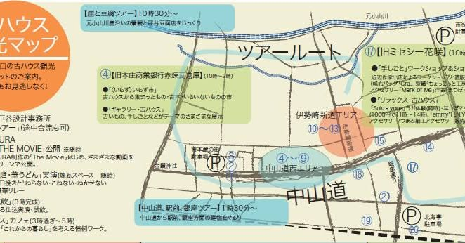

## 0308 — 2018-01-11 — 伊藤 利昭

- 投稿ID: 781464135388061
- 投稿URL: https://www.facebook.com/groups/186097664924714/posts/781464135388061/
- 要約: Code for TODAです。 「e-TODAオープンデータ・アイデアソン」を開催します。
- コメント要約: （コメントなし）

Code for TODAです。
「e-TODAオープンデータ・アイデアソン」を開催します。
日　時：2018年2月12日(月・祝)
会　場：戸田市新曽南多世代交流館(さくらパル) 2F会議室
参加費：無料
オープンデータを活用した地域課題の解決、行政の効率化、官民協働の促進を目指し、
防災・防犯
健康・医療
子育て、教育
街づくり、人づくり・商工
電子行政
の5つのテーマについて官民でアイデアを語り合います。
詳細・参加お申込み・お問合せは下記のサイトをご覧ください。
どうぞよろしくお願いいたします。
CODEFORTODA.ORG
e-Todaオープンデータ・アイデアソンの開催について – Code for TODA(コードフォーとだ）

## 0309 — 2018-02-23 — 後藤 真太郎

- 投稿ID: 802220226645785
- 投稿URL: https://www.facebook.com/groups/186097664924714/posts/802220226645785/
- 要約: Code for Shinagawaとの連携イベント。始まってます。お近くの方はどうぞ。 2018/02/23(金) ママパパで作るこれからの公園と子育て 立正大学5号館 Code for Saitama運営会議とシェアされています 興味あり
- コメント要約: （コメントなし）

Code for Shinagawaとの連携イベント。始まってます。お近くの方はどうぞ。
https://www.facebook.com/events/1085188144956646/
2018/02/23(金)
ママパパで作るこれからの公園と子育て
立正大学5号館
Code for Saitama運営会議とシェアされています
興味あり

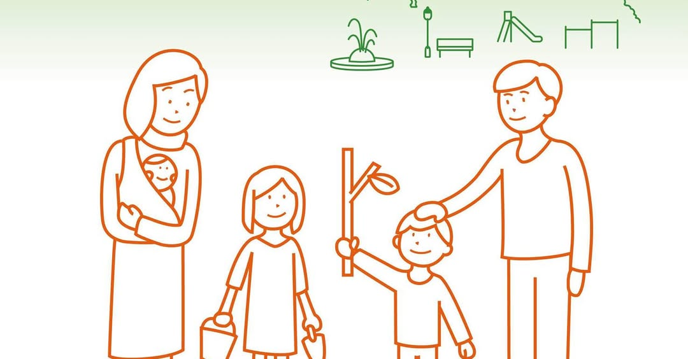

## 0310 — 2018-02-23 — 古田武士

- 投稿ID: 802225819978559
- 投稿URL: https://www.facebook.com/groups/186097664924714/posts/802225819978559/
- 要約: 品川区のハッカソンで公園検索アプリを作りました。 オープンデータの公園情報と公園を調査したデータを取り込むことで、簡単に公園を検索するアプリです。 品川区主催の発表会が今度の日曜日にありますので、その後ではデータ差し替え版として埼玉（どのまちにするかは検討中）のアプリをリリースしたいと思います。
- コメント要約: GitHubはこちらです。 GITHUB.COM mq-sol/park mq-sol/park

品川区のハッカソンで公園検索アプリを作りました。
https://park.mq-sol.jp
オープンデータの公園情報と公園を調査したデータを取り込むことで、簡単に公園を検索するアプリです。
品川区主催の発表会が今度の日曜日にありますので、その後ではデータ差し替え版として埼玉（どのまちにするかは検討中）のアプリをリリースしたいと思います。
PARK.MQ-SOL.JP
みんなで作る。乳幼児向け公園検索
関連度の高い順

### コメント — 古田武士

GitHubはこちらです。
https://github.com/mq-sol/park
GITHUB.COM
mq-sol/park
mq-sol/park

## 0311 — 2018-02-27 — 後藤 真太郎

- 投稿ID: 804262159774925
- 投稿URL: https://www.facebook.com/groups/186097664924714/posts/804262159774925/
- 要約: 後藤 真太郎さんからの投稿をシェアしました 後藤 真太郎 投稿先 立正大学研究推進地域連携センター（公開ページ） 後藤 真太郎 教育・学習のグループエキスパート トップコントリビューター いよいよ今週末の開催になります。
- コメント要約: （コメントなし）

https://www.facebook.com/groups/348679698633265/permalink/941372366030659/
後藤 真太郎さんからの投稿をシェアしました
後藤 真太郎
投稿先
立正大学研究推進地域連携センター（公開ページ）
後藤 真太郎
教育・学習のグループエキスパート
トップコントリビューター
いよいよ今週末の開催になります。
インターナショナルオープデータディ、県内ではCode for SAITAMA とTODAとの同時開催となります。埼玉県内でのオープンデータによるNo1の項目探しを目指したシビックパワーバトルもあります。熊谷は暑さだけじゃないところを見せましょう。
熊谷市民活動支援センター交流会との同時開催でもありますので3世代の交流の場になること間違いなし！
2018/03/03(土)
熊谷観光ハッカソン Huck for D アイデアをアプリに
埼玉県 熊谷市
参加者19人・興味あり31人
興味あり

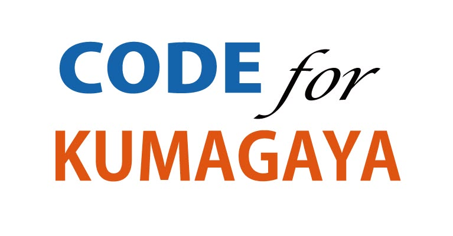

## 0312 — 2018-03-03 — 後藤 真太郎

- 投稿ID: 806435909557550
- 投稿URL: https://www.facebook.com/groups/186097664924714/posts/806435909557550/
- 要約: Code for Kumagayaの観光アイデアソンはじまってます。 #オープンデータデイ 公開グループ • メンバー634人 立正大学研究推進地域連携センター（公開ページ）
- コメント要約: （コメントなし）

Code for Kumagayaの観光アイデアソンはじまってます。 #オープンデータデイ  https://www.facebook.com/groups/348679698633265/
公開グループ • メンバー634人
立正大学研究推進地域連携センター（公開ページ）

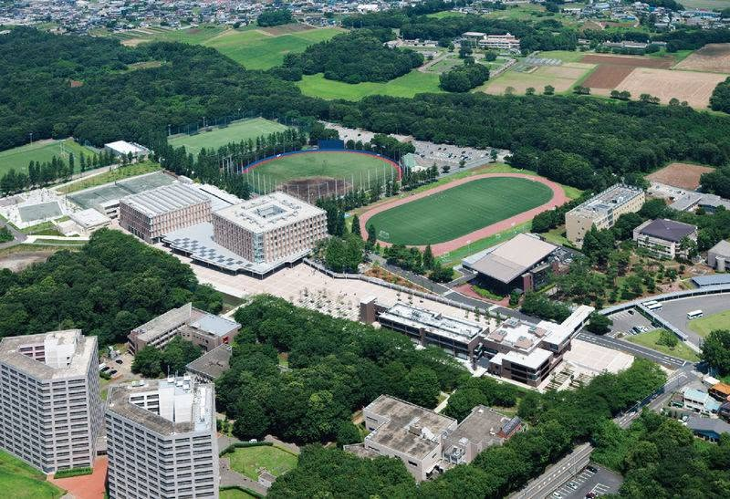

## 0313 — 2018-03-04 — 後藤 真太郎

- 投稿ID: 806941296173678
- 投稿URL: https://www.facebook.com/groups/186097664924714/posts/806941296173678/
- 要約: オープンデータ時代のGISを考えます。シティープロモーションにどのように対応するか？一方で保守をどうするか？ 是非、ご参加ください。 2018/03/06(火) 埼玉県gis普及推進研究会講演会 ーオープンデータ時代のgisのカタチー さいたま市 後藤 真太郎さんから招待がありました 興味あり
- コメント要約: （コメントなし）

オープンデータ時代のGISを考えます。シティープロモーションにどのように対応するか？一方で保守をどうするか？
是非、ご参加ください。
https://www.facebook.com/events/2151291778450778/
2018/03/06(火)
埼玉県gis普及推進研究会講演会 ーオープンデータ時代のgisのカタチー
さいたま市
後藤 真太郎さんから招待がありました
興味あり

## 0314 — 2018-03-17 — 後藤 真太郎

- 投稿ID: 813741688826972
- 投稿URL: https://www.facebook.com/groups/186097664924714/posts/813741688826972/
- 要約: 協働型災害訓練～つながることは備えること～さんからの投稿をシェアしました 協働型災害訓練～つながることは備えること～ 【感謝】 中央社協（東京都中央区）の「まちひとサイト」さんが 協働型災害訓練を記事にしてくださいました！
- コメント要約: （コメントなし）

協働型災害訓練～つながることは備えること～さんからの投稿をシェアしました
協働型災害訓練～つながることは備えること～
【感謝】
中央社協（東京都中央区）の「まちひとサイト」さんが
協働型災害訓練を記事にしてくださいました！
初回から毎年、特派員さんが取材してくださっています。
今後も続けていくために再構成して記事にしてくださるのは有難いことです。
いつもありがとうございます！
＜まちひとサイト＞
市民が組織化して公的防災組織機関と協力してゆく
ICS(災害対応運営システム）に沿った図上訓練
第５回協働型災害訓練in杉戸
>>>
市民が組織化して公的防災組織機関と協力してゆく　ICS(災害対応運営システム）に沿った図上訓練　第５回協働型災害訓練in杉戸
MACHIHITO.BLOG131.FC2.COM
市民が組織化して公的防災組織機関と協力してゆく　ICS(災害対応運営システム）に沿った図上訓練　第５回協働型災害訓練in杉戸

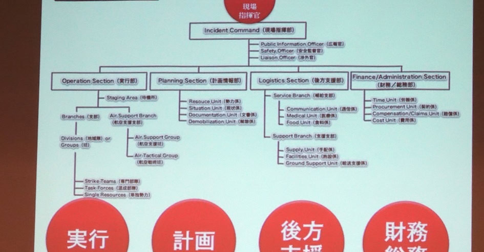

## 0315 — 2018-05-29 — 後藤 真太郎

- 投稿ID: 848886691979138
- 投稿URL: https://www.facebook.com/groups/186097664924714/posts/848886691979138/
- 要約: 後藤 真太郎さんからの投稿をシェアしました 後藤 真太郎 投稿先 市民キャビネット・スマートICT部会 後藤 真太郎 協働型災害訓練とのコラボで行います。是非ご参加ください。
- コメント要約: （コメントなし）

後藤 真太郎さんからの投稿をシェアしました
後藤 真太郎
投稿先
市民キャビネット・スマートICT部会
後藤 真太郎
協働型災害訓練とのコラボで行います。是非ご参加ください。
沼田 宗純
6月8日金曜日、9日土曜日で以下のイベントを行います。事前申し込み制です。
定員に達する前にお申し込み下さい！
災害対応最前線！ドローンを飛ばして被害を探せ！
http://komaba-oh.jp/event.html

## 0316 — 2018-06-08 — 後藤 真太郎

- 投稿ID: 854160638118410
- 投稿URL: https://www.facebook.com/groups/186097664924714/posts/854160638118410/
- 要約: 9/23 熊谷スポーツ文化センターで開催されます。立正大学谷津田イノベーション研究会、農業遺産関係も関わります。 8自治体からなる協議会が比企丘陵のため池農業文化を農業遺産に申請します。
- コメント要約: （コメントなし）

9/23 熊谷スポーツ文化センターで開催されます。立正大学谷津田イノベーション研究会、農業遺産関係も関わります。
8自治体からなる協議会が比企丘陵のため池農業文化を農業遺産に申請します。農業遺産の持続性を保つしくみとしてオーガニックは欠かせません。是非、ご予定お願いします。 https://www.facebook.com/greaterkumagaya.jp/
GREATER KUMAGAYA ORGANIC FES

## 0317 — 2018-06-10 — 後藤 真太郎

- 投稿ID: 855575761310231
- 投稿URL: https://www.facebook.com/groups/186097664924714/posts/855575761310231/
- 要約: Code for Kumagayaで昨年行った観光アイデアソンで出された内容が形になりました。9/23の熊谷オーガニックフェスとともにご予定お願いします。
- コメント要約: （コメントなし）

Code for Kumagayaで昨年行った観光アイデアソンで出された内容が形になりました。9/23の熊谷オーガニックフェスとともにご予定お願いします。
後藤 真太郎さんからの投稿をシェアしました
立正大学研究推進地域連携センター（公開ページ）
後藤 真太郎
教育・学習のグループエキスパート
トップコントリビューター
9/23の熊谷圏オーガニックフェスの後も続きます。10/7には音楽フェス。農業遺産登録の実地調査日程周辺がにぎやかです。同時多発でイベントが動いています。恐るべし熊谷！

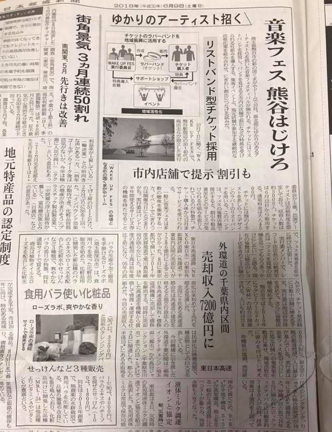

## 0318 — 2018-06-20 — 後藤 真太郎

- 投稿ID: 862953977239076
- 投稿URL: https://www.facebook.com/groups/186097664924714/posts/862953977239076/
- 要約: 6/23 10:00-12:00 Code for Kumagaya 共催にてプログラミング教室を開催します。学生がメンターを行います。 当日の午後、13:00-15:00 同じ場所にてロボット教室を開始します。
- コメント要約: （コメントなし）

6/23 10:00-12:00 Code for Kumagaya 共催にてプログラミング教室を開催します。学生がメンターを行います。https://goo.gl/qWJrME
当日の午後、13:00-15:00 同じ場所にてロボット教室を開始します。併せてご検討ください。
2018/06/23(土)
第25回小学生のためのプログラミング教室
立正大学熊谷キャンパス3号館２FコンピュータA室
後藤 真太郎さんから招待がありました
興味あり

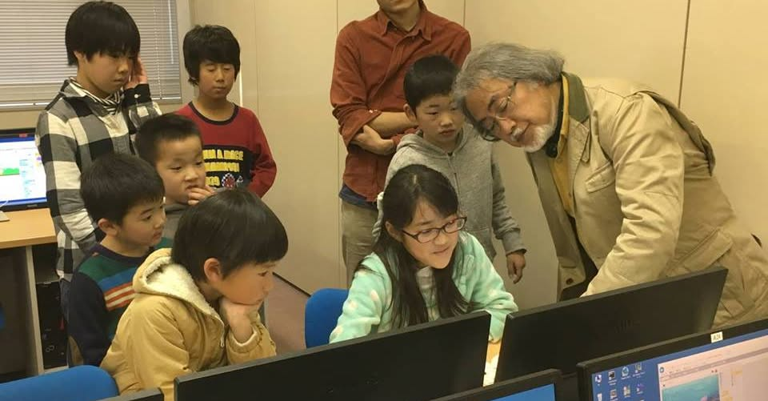

## 0319 — 2018-09-14 — 後藤 真太郎

- 投稿ID: 941458602721946
- 投稿URL: https://www.facebook.com/groups/186097664924714/posts/941458602721946/
- 要約: オリンピック・パラリンピックに向けてさいたま市を盛り上げるためのオープンデータ利用、その後の展開につきCode for SAITAMAへ協力依頼がありました。
- コメント要約: （コメントなし）

オリンピック・パラリンピックに向けてさいたま市を盛り上げるためのオープンデータ利用、その後の展開につきCode for SAITAMAへ協力依頼がありました。
9/17-18　第5回GISCamp
9/22　農福連携セミナー
9/23　熊谷オーガニックフェス
10/16　オープンデータセミナー
11/10　アイデアソン
11/23-24  ハッカソン
で共に考え、共に作りましょう。

## 0320 — 2018-09-18 — 後藤 真太郎

- 投稿ID: 943695585831581
- 投稿URL: https://www.facebook.com/groups/186097664924714/posts/943695585831581/
- 要約: 9/17-18 第5回GIS Campにて、アーバンデータチャレンジ・キックオフを行いました。 1日目は、QGIS入門からtile画像作成ーWMS配信 2日目はWordPressによる情報共有サイト構築をもくもく会的に行いました。
- コメント要約: （コメントなし）

9/17-18 第5回GIS Campにて、アーバンデータチャレンジ・キックオフを行いました。
1日目は、QGIS入門からtile画像作成ーWMS配信
2日目はWordPressによる情報共有サイト構築をもくもく会的に行いました。
CODE4SAITAMA.ORG
第5回GIS Camp　アーバンデータチャレンジ・キックオフイベント – Code for SAITAMA
第5回GIS Camp オープンデータを利用して災害時の状況認識の統一を図る －アーバンデータチャレンジ、災害情報サービスチャレンジキックオフ－

## 0321 — 2018-09-28 — 泉山 塁威

- 投稿ID: 948712781996528
- 投稿URL: https://www.facebook.com/groups/186097664924714/posts/948712781996528/
- 要約: ＼いよいよ、クラウドファンディング あと2日です！魅力をまとめてみた！／ #シェア歓迎！ 「未来の日常をつくる！「さいたま新都心」を使い倒すパブリックライフフェスを実現！
- コメント要約: （コメントなし）

＼いよいよ、クラウドファンディング あと2日です！魅力をまとめてみた！／
#シェア歓迎！
「未来の日常をつくる！「さいたま新都心」を使い倒すパブリックライフフェスを実現！」
https://camp-fire.jp/projects/view/89544
１ヶ月ほど進めてきた、人生初めてのクラウドファンディング 。３つのうち、最後のプロジェクトが、明日（9/29、23:59）に終了します！
現在、90%！ここまで多くの方のご支援で、、ここまできましたので、ぜひ達成したい！
ーーーーーーーーーーーーーーーーーーーーーーーーーー
｜｜｜そこで、このプロジェクトの魅力をまとめてみました！｜｜｜
まず、2018年10月15−24日に、さいたま新都心で、
「パブリックライフフェスさいたま新都心2018」という実験フェスを行います。
【そもそもなぜやるのか？】
さいたま新都心は、大宮操車場跡地の再開発で、2000年に街開き、18年が経過しました。
2020年の東京オリンピックには、さいたまスーパーアリーナはバスケットの会場になります。
この街には、コンサートやイベントがさいたまスーパーアリーナで行われ、多くの人が訪れます。また、商業施設コクーンシティにはたくさんの買い物客が訪れます。平日には、国の合同庁舎や民間ビルなど、就業者は2万人。
そう、たくさんの人はくるのです。でも、用が済んだらみんな帰る。直行直帰の街になっていて、そこに、パブリックライフはありません。
このままでは、街としてはどんどん落ちていく一方。作られた街をどう育てていくのか、
「さいたま新都心エリアマネジメント検討会」が立ち上がり、地元企業や行政と共に、エリアマネジメントの検討をしています。
私は、UDCO - アーバンデザインセンター大宮のディレクターとして、今年度からこのプロジェクトに取り組んでいます。
エリアマネジメントの検討のために、「パブリックライフフェスさいたま新都心2018」を行います。
【みなさんも実験フェスに関われます！】
・「運営CREW」
として、CREW Tシャツを着用して、実験フェスの運営に関われるチャンスがあります！
https://camp-fire.jp/projects/89544/activities/62306#main
・「広報CREW」
として、実験フェスの参加型広報に参加できます！素人でもできる、レポート、カメラ、動画の広報講座も受講できます！
講師はなんと！
大宮経済新聞さんと、MINIMUMOVIEの阪 敬太郎 (Keitaro Saka)さん、池袋のときにもお世話になりました。
https://camp-fire.jp/projects/89544/activities/62627
・「特別限定！さいたまスーパーアリーナ屋上ツアー」
も絶賛募集中（申込は9/29まで！）ですが、
さいたまアリーナの
大立目 司 (Tsukasa Ohtachime)さん、内藤 岳志 (Takashi Naito)さん、に多大なご協力をいただいて、夢の企画も実現します！
https://camp-fire.jp/projects/89544/activities/63108#main
・「実験フェス視察ツアー」
実験フェス、社会実験には各方面、多くの視察が訪れますが、しっかり資料付きで解説させていただくために、時間を決めて、視察ツアーを設定させていただいています。申込は、9/29まで！
https://camp-fire.jp/projects/89544/activities/62566
・「実験報告書」
実験フェスのプロセス、実施内容、調査結果をまとめた報告書もあるよ！
・「出店者募集中！」10/1まで！
http://www.shintoshin.saitama.jp/publiclifefes2018/shop/
これまで、ご支援いただいた方も含めて、多くの方の力があって、ここまできました！
あと、一息！みなさん、応援をどうぞよろしくお願いいたします！
未来の日常をつくる！「さいたま新都心」を使い倒すパブリックライフフェスを実現！
CAMP-FIRE.JP
未来の日常をつくる！「さいたま新都心」を使い倒すパブリックライフフェスを実現！

## 0322 — 2018-10-15 — 後藤 真太郎

- 投稿ID: 957180847816388
- 投稿URL: https://www.facebook.com/groups/186097664924714/posts/957180847816388/
- 要約: 10/16 13:00- の大宮でのアイデアソン、来年からオリパラに合わせ、自治体との協働事業（Code for SAITAMAへの委託事業であり議会説明中）でつくるクールシェアマップ、観光マップ、バリアフリーマップなどのボータル、障害者対応アプリなどをオープニンデータでどう作るかを考え、戸田で予定されるアイデアソン、ハッカソンでプロトタイピングします。
- コメント要約: （コメントなし）

10/16 13:00- の大宮でのアイデアソン、来年からオリパラに合わせ、自治体との協働事業（Code for SAITAMAへの委託事業であり議会説明中）でつくるクールシェアマップ、観光マップ、バリアフリーマップなどのボータル、障害者対応アプリなどをオープニンデータでどう作るかを考え、戸田で予定されるアイデアソン、ハッカソンでプロトタイピングします。
また、国のオープンデータの傾向も国土地理院、パスコのご担当より紹介していだだきます。是非、ご参加下さい。
https://www.facebook.com/events/2225710854370449/?ti=cl
2018/10/16(火)
オープンデータセミナー&アイデアソン ーアーバンデータチャレンジ、防災情報サービスチャレンジイベント－
さいたま市
埼玉県GIS普及推進研究会主催

## 0323 — 2018-10-15 — 伊藤 利昭

- 投稿ID: 957273487807124
- 投稿URL: https://www.facebook.com/groups/186097664924714/posts/957273487807124/
- 要約: Code for TODAの伊藤と申します。 戸田市のオープンデータを活用する新しいアイデアや、地域課題の解決を実現するアプリケーションの作成を目指し、Code for TODAはハッカソンを開催いたします。
- コメント要約: （コメントなし）

Code for TODAの伊藤と申します。
戸田市のオープンデータを活用する新しいアイデアや、地域課題の解決を実現するアプリケーションの作成を目指し、Code for TODAはハッカソンを開催いたします。
技術者や非技術者、戸田市にお住いの方もそうでない方もどなたでもご参加ください。
日程は以下の通りですが、いずれかの日だけの参加も可能です。
アイデアソン：
戸田市文化会館 5F
ハッカソン：
戸田市新曽南多世代交流館(さくらパル) 2F
詳細・参加お申し込みは以下のWEBページをご覧ください。
CODEFORTODA.ORG
e-Todaオープンデータ・ハッカソン2018のお知らせ – Code for TODA(コードフォーとだ）
昨年度開催いたしました「e-Todaオープンデータ・ハッカソン」では、 防災・防犯健康・医療子育て・教育街づくり、人づくり・商工電子行政 の5つのテーマについて、戸田市のオープンデータを活用した地域課題の解決、行...

## 0324 — 2018-10-16 — 後藤 真太郎

- 投稿ID: 957711537763319
- 投稿URL: https://www.facebook.com/groups/186097664924714/posts/957711537763319/
- 要約: 11/3 マッピングデーin埼玉県ＮＰＯ法人展（立正大学熊谷キャンパス）のあとはこれ！ウォーキング&マッピングで心も身体も健康 2018/11/25(日) ウィキペディアタウンin熊谷 埼玉県立熊谷図書館 Code for Kumagaya 運営室とシェアされています
- コメント要約: （コメントなし）

11/3 マッピングデーin埼玉県ＮＰＯ法人展（立正大学熊谷キャンパス）のあとはこれ！ウォーキング&マッピングで心も身体も健康
https://www.facebook.com/events/648952912165593/?ti=cl
2018/11/25(日)
ウィキペディアタウンin熊谷
埼玉県立熊谷図書館
Code for Kumagaya 運営室とシェアされています

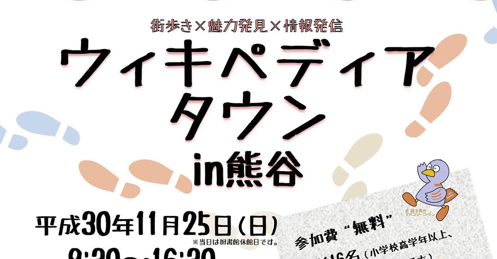

## 0325 — 2018-10-28 — 後藤 真太郎

- 投稿ID: 964219727112500
- 投稿URL: https://www.facebook.com/groups/186097664924714/posts/964219727112500/
- 要約: 一般社団法人化した協働型災害訓練、第一弾は昨年に続く防災リテラシー教育セミナー。一回目（10/30）は、北海道地震の災害対策本部での情報共有、物流支援の現状の話題提供を受け、2019年2/2-3の協働型災害訓練に向け、3回の研修でSOPを作っていきます。
- コメント要約: （コメントなし）

一般社団法人化した協働型災害訓練、第一弾は昨年に続く防災リテラシー教育セミナー。一回目（10/30）は、北海道地震の災害対策本部での情報共有、物流支援の現状の話題提供を受け、2019年2/2-3の協働型災害訓練に向け、3回の研修でSOPを作っていきます。是非、ご参加ください。今年度は防災科研の防災情報サービスチャレンジの事業として行います。
https://m.facebook.com/events/746575495679829...
2018/12/25(火),
防災リテラシー教育セミナー（３回連続講座）別名協働型災害訓練作戦会議
埼玉県さいたま市浦和区東高砂町11-1
Code for TODA～情報×（子供＋防災＋まちづくり）支援とシェアされています
興味あり

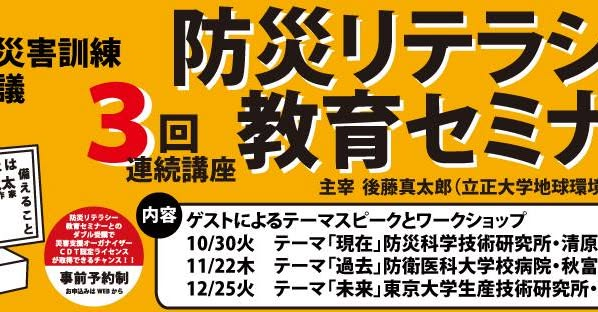

## 0326 — 2018-11-23 — 後藤 真太郎

- 投稿ID: 978984848969321
- 投稿URL: https://www.facebook.com/groups/186097664924714/posts/978984848969321/
- 要約: Code for SAITAMAのメンバー、戸田のハッカソンに参戦中。 後藤 真太郎さんからの投稿をシェアしました 後藤 真太郎さんは古田武士さん、 他4人 と一緒です。
- コメント要約: （コメントなし）

Code for SAITAMAのメンバー、戸田のハッカソンに参戦中。
後藤 真太郎さんからの投稿をシェアしました
後藤 真太郎さんは古田武士さん、
他4人
と一緒です。
Code for Todaハッカソンに合流して社会課題を解決するアプリの作成始まりました。防災情報サービスチャレンジ、アーバンデータチャレンジ向けのアプリを開発してます。

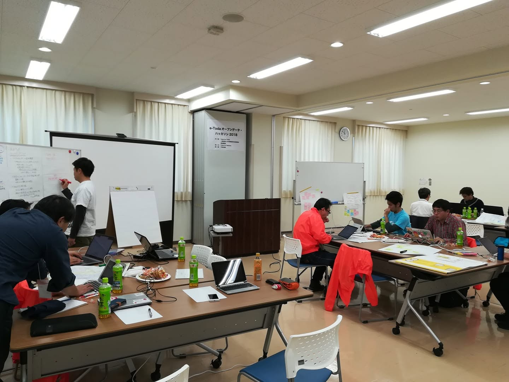

## 0327 — 2018-12-14 — 後藤 真太郎

- 投稿ID: 992537644280708
- 投稿URL: https://www.facebook.com/groups/186097664924714/posts/992537644280708/
- 要約: Code for SAITAMAメンバーのアプリも表彰されます。
- コメント要約: （コメントなし）

Code for SAITAMAメンバーのアプリも表彰されます。
Mizuho Ooyamaさんからの投稿をシェアしました
Mizuho Ooyama
投稿先
Code for TODA～情報×（子供＋防災＋まちづくり）支援
Mizuho Ooyama
行政のデジタル・トランスフォーメーション（DX）を推進するイベント「DX Days 2019」が開催されます。
「Govtech Conference Japan 2019」
３日目1/18（金）：自治体DX推進会議にてe-Toda(いいとだ)オープンデータ・ハッカソン2018の最優秀賞と優秀賞が表彰されます。
Govtech Conference Japan 2019
GOVTECHCONFDX.PEATIX.COM
Govtech Conference Japan 2019

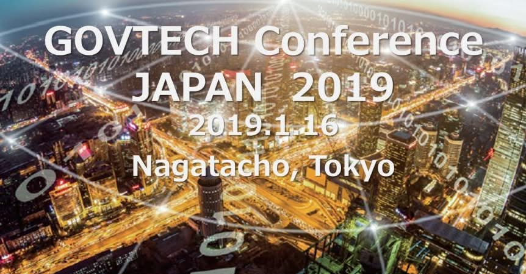

## 0328 — 2019-01-29 — 後藤 真太郎

- 投稿ID: 1021028641431608
- 投稿URL: https://www.facebook.com/groups/186097664924714/posts/1021028641431608/
- 要約: 2/1-2 今年も第6回協働型災害訓練を行います。第１回から継続しているICSを使った被災地支援、受援の訓練をSOPをベースに複数のNPOと協働して行うワーク以外にも、女性の視点からみた防災を考えたり、ドローンでの被災地モニタリング体験など多くのイベント満載です。
- コメント要約: （コメントなし）

2/1-2 今年も第6回協働型災害訓練を行います。第１回から継続しているICSを使った被災地支援、受援の訓練をSOPをベースに複数のNPOと協働して行うワーク以外にも、女性の視点からみた防災を考えたり、ドローンでの被災地モニタリング体験など多くのイベント満載です。是非、ご参加ください。
昨年12月に埼玉県と県内と被災地支援団体とが協働できる枠組みができましたので、県のホームページにもアップしていただいてます。
第6回協働型災害訓練in杉戸
PREF.SAITAMA.LG.JP
第6回協働型災害訓練in杉戸

## 0329 — 2019-02-01 — 後藤 真太郎

- 投稿ID: 1022486384619167
- 投稿URL: https://www.facebook.com/groups/186097664924714/posts/1022486384619167/
- 要約: 協働型災害訓練～つながることは備えること～さんからの投稿をシェアしました 写真の説明はありません。. 写真の説明はありません。. 写真の説明はありません。 協働型災害訓練～つながることは備えること～さんはすぎとピアにいます。
- コメント要約: （コメントなし）

https://m.facebook.com/story.php?story_fbid=374735363258894&id=135355400530226
協働型災害訓練～つながることは備えること～さんからの投稿をシェアしました
写真の説明はありません。. 写真の説明はありません。. 写真の説明はありません。
協働型災害訓練～つながることは備えること～さんはすぎとピアにいます。
埼玉県 北葛飾郡
設営完了！
いよいよ明日開催！
皆さん、お待ちしてます！
昨年も大雪でしたが、満員御礼、熱気ムンムンで開催できました
悪天候でも参加できるのが災害支援のプロであると証明された昨年
今回も降雪の予報もありますが、充分なリスク対策を行なってお越しください
自宅を出た瞬間から、協働型災害訓練ははじまります
皆さん、出会い、学び、繋がりましょう！！
この2日間が来たる日のチカラとなります！！！

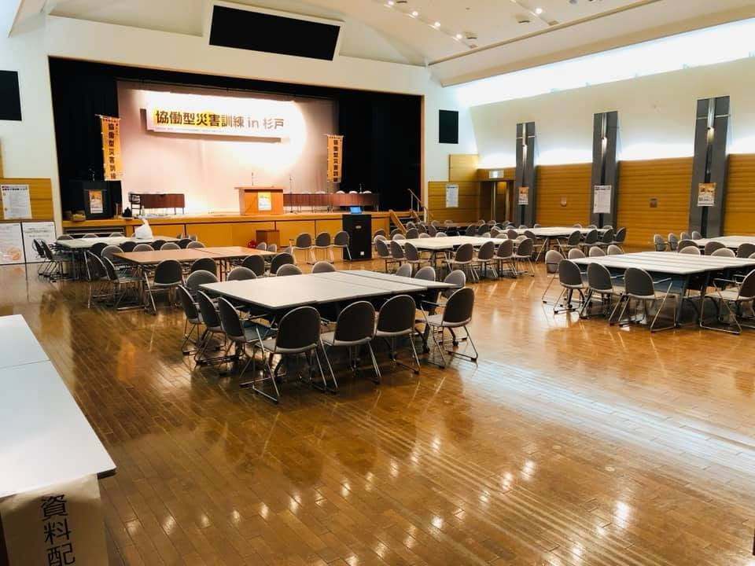

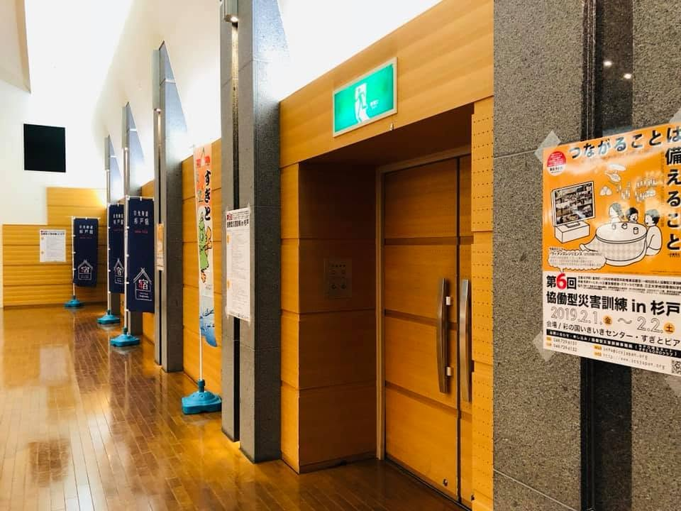

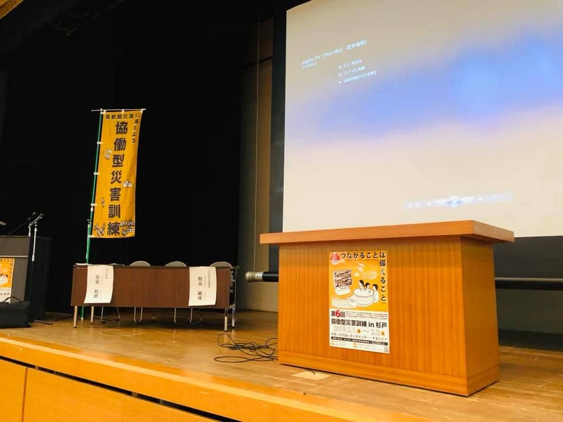

## 0330 — 2019-02-25 — 後藤 真太郎

- 投稿ID: 1037934673074338
- 投稿URL: https://www.facebook.com/groups/186097664924714/posts/1037934673074338/
- 要約: インターナショナルオープンデータディのCode for SAITAMAのイベントとしてオリパラに向けた車いすマッピングパーティーを大宮盆栽美術館周辺で開催します。
- コメント要約: （コメントなし）

インターナショナルオープンデータディのCode for SAITAMAのイベントとしてオリパラに向けた車いすマッピングパーティーを大宮盆栽美術館周辺で開催します。国際的なWheel Chair Mappingの仕様で作りますので他地域のインバウンド対応にも参考になるかと思います。是非ご参加ください。https://www.facebook.com/events/1226496987526951/
2019/03/03(日)
車いすマッピングパーティー
さいたま市
参加者6人・興味あり93人

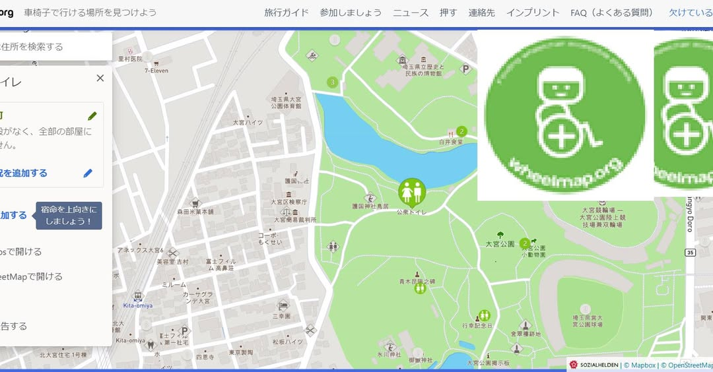

## 0331 — 2019-02-25 — 後藤 真太郎

- 投稿ID: 1038326313035174
- 投稿URL: https://www.facebook.com/groups/186097664924714/posts/1038326313035174/
- 要約: 後藤 真太郎さんからの投稿をシェアしました 後藤 真太郎 投稿先 立正大学研究推進地域連携センター（公開ページ） 後藤 真太郎 教育・学習のグループエキスパート トップコントリビューター 現在の地域連携センターの前進、立正大学産学官連携推進センター長だった13年前、熊谷市の産学官連携推進センターができ、うちわ祭りの山車どこシステム、まちなか交流広場、 写真…
- コメント要約: （コメントなし）

後藤 真太郎さんからの投稿をシェアしました
後藤 真太郎
投稿先
立正大学研究推進地域連携センター（公開ページ）
後藤 真太郎
教育・学習のグループエキスパート
トップコントリビューター
現在の地域連携センターの前進、立正大学産学官連携推進センター長だった13年前、熊谷市の産学官連携推進センターができ、うちわ祭りの山車どこシステム、まちなか交流広場、http://xn--l8je2fwa.com/、新川エコミュージアム、子育て応援マップ、地域SNSあついぞホットcom、、、などが始まりました。これらは今も引き継がれています。最近では、アクティブラーニングへの応用、比企丘陵の風土共創というコンセプトの下で比企丘陵のため池農業（谷津沼農業）文化の農業遺産登録を行っております。2月23日、そんな13年間を振り返ってみました。
写真の説明はありません。. 写真の説明はありません。. 写真の説明はありません。
立正大学
【開催報告】第13回熊谷市産学官連携まちづくりフォーラム
2月23日に熊谷キャンパスで「第13回熊谷市産学官連携まちづくりフォーラム」を開催しました。13回目を迎えた本フォーラムですが、今回も大勢の市民の方や行政関係者が来場され、産・学・官が一体となって地域社会を盛り上げていく必要性、また、その手法について考える機会となりました。
富岡熊谷市長、永井学長補佐、藤間熊谷商工会議所会頭の挨拶の後、地球環境科学部後藤教授が「比企丘陵の風土共創」と題した基調講演を行いました。熊谷キャンパスすぐ傍の比企地域で昔から育まれた「ため池文化」に着目し、人や自然・生態系が織り成す循環システムについて、現在進行中の世界農業遺産認定を目指した取組を交えて説明がなされました。また、事例報告の部では、講演に続き後藤教授より本学と地域が連携して実施した諸活動に関し、この13年間の歩みの紹介と、培われた事業推進のノウハウを教えて頂きました。

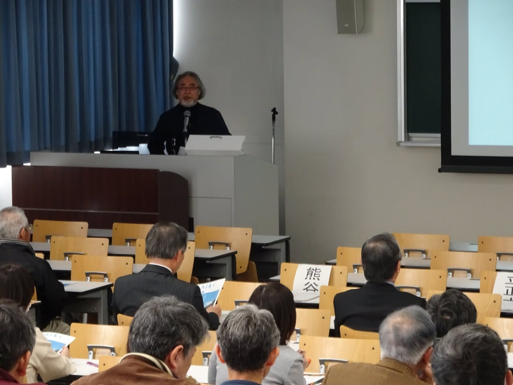

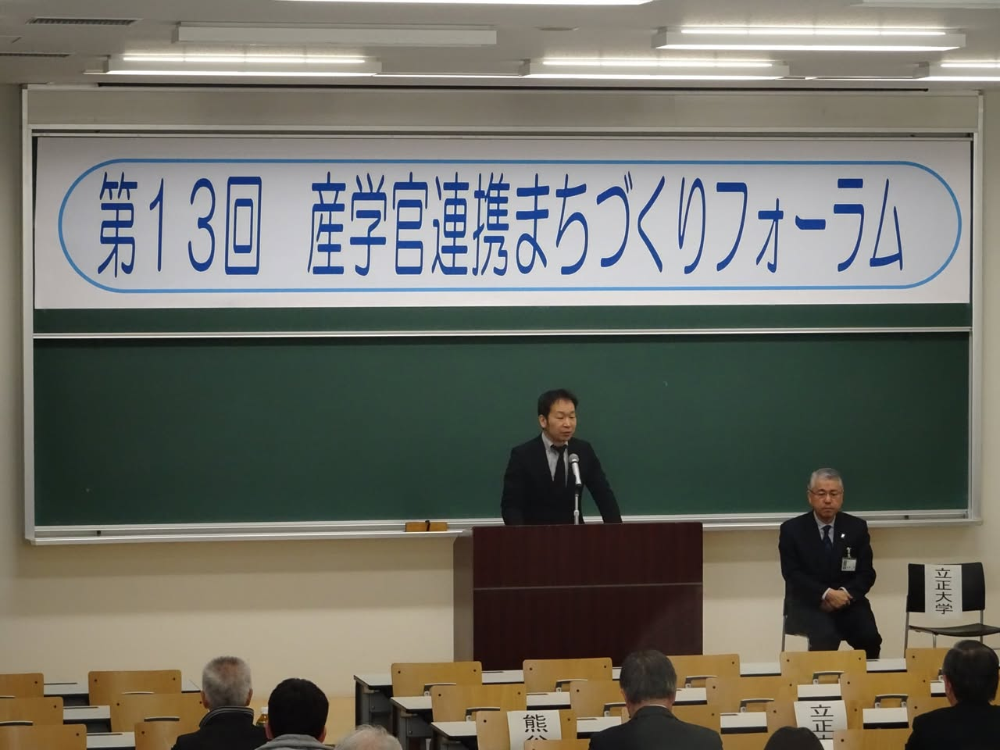

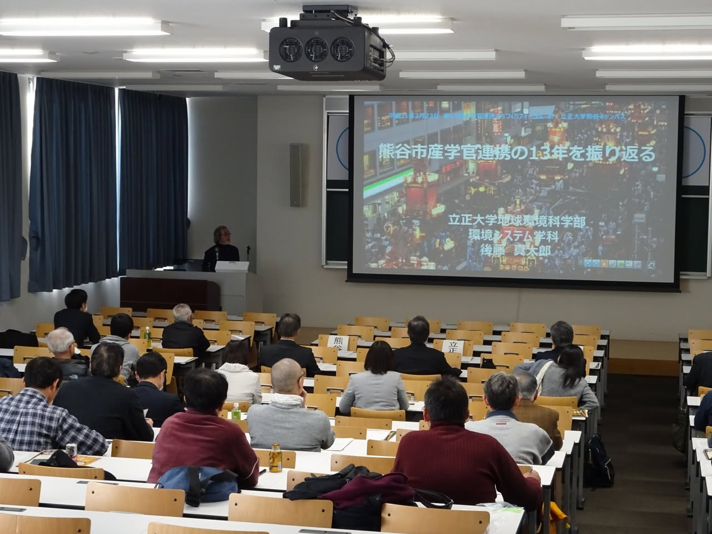

## 0332 — 2019-03-26 — 後藤 真太郎

- 投稿ID: 1056825867851885
- 投稿URL: https://www.facebook.com/groups/186097664924714/posts/1056825867851885/
- 要約: 後藤 真太郎さんからの投稿をシェアしました 後藤 真太郎 投稿先 立正大学研究推進地域連携センター（公開ページ） 後藤 真太郎 教育・学習のグループエキスパート トップコントリビューター Code for SAITAMAもアイデアソンハッカソンから深く関わった公園マップ、東京都のオープンデータアプリコンテストに入賞！
- コメント要約: 品川区のアイディアソン・ハッカソンで、区民からのアイディアをCode for SAITAMAの方がアプリの形にしてくださって，そこで試験的に公園調査を行うことができました．ここで，学生が調査で何ができるのか，学生の調査結果をどのようにまとめるのか等，色々分かりました．この経験値が大きく，試験的にやってわかったことを研究会で品川区と共有し，品川区のアプリに区民の意向を組み入れてもらうこともできました．本当に，ありがとうございました！

後藤 真太郎さんからの投稿をシェアしました
後藤 真太郎
投稿先
立正大学研究推進地域連携センター（公開ページ）
後藤 真太郎
教育・学習のグループエキスパート
トップコントリビューター
Code for SAITAMAもアイデアソンハッカソンから深く関わった公園マップ、東京都のオープンデータアプリコンテストに入賞！
おめでとうございます。
★受賞結果発表★ 東京都オープンデータアプリコンテスト２０１８ | 東京都オープンデータカタログサイト
OPENDATA-PORTAL.METRO.TOKYO.JP
★受賞結果発表★ 東京都オープンデータアプリコンテスト２０１８ | 東京都オープンデータカタログサイト
関連度の高い順

### コメント — Konomi Tonogi

品川区のアイディアソン・ハッカソンで、区民からのアイディアをCode for SAITAMAの方がアプリの形にしてくださって，そこで試験的に公園調査を行うことができました．ここで，学生が調査で何ができるのか，学生の調査結果をどのようにまとめるのか等，色々分かりました．この経験値が大きく，試験的にやってわかったことを研究会で品川区と共有し，品川区のアプリに区民の意向を組み入れてもらうこともできました．本当に，ありがとうございました！

### コメント — 嘉山 陽一

おめでとうございます。このイベントは昨年応募して入賞はできなかったです。ただイベントのwebページがレスポンシブデザインじゃないのはITイベントなのにちょいと残念です(・o・)

## 0333 — 2019-05-13 — 後藤 真太郎

- 投稿ID: 1087151054819366
- 投稿URL: https://www.facebook.com/groups/186097664924714/posts/1087151054819366/
- 要約: 17年目を迎えた埼玉県GIS普及推進研究会、今年度新たに埼玉県に着任されたお３方にご講演いただき、「公共地図とまちづくりで使用する地図の望ましいあり方」について考えたいと思います。
- コメント要約: 群馬県地球温暖化対策地域協議会があり、自分は副会長なので日程を決めるときに空きを確認されていますので・・・外せないっす・・・ 残念ながら、28日は予定が入ってまして 今回は不参加です わぉー

17年目を迎えた埼玉県GIS普及推進研究会、今年度新たに埼玉県に着任されたお３方にご講演いただき、「公共地図とまちづくりで使用する地図の望ましいあり方」について考えたいと思います。副題は、新人さんいらっしゃい
申込は、http://bit.ly/2VviRJ2　まで。
第17回埼玉県GIS普及推進研究会講演会申込み_2019
DOCS.GOOGLE.COM
第17回埼玉県GIS普及推進研究会講演会申込み_2019
関連度の高い順

### コメント — 酒井 千富

群馬県地球温暖化対策地域協議会があり、自分は副会長なので日程を決めるときに空きを確認されていますので・・・外せないっす・・・

### コメント — 酒井 千富

残念ながら、28日は予定が入ってまして
今回は不参加です

### コメント — 後藤 真太郎

わぉー

## 0334 — 2019-07-16 — 酒井 千富

- 投稿ID: 1132849830249488
- 投稿URL: https://www.facebook.com/groups/186097664924714/posts/1132849830249488/
- 要約: 前橋で初のマッピングパーティです ご協力、よろしくお願いします 2019/07/20(土) 第1回 MissionDayまえばし マッピングパーティ 群馬県 前橋市
- コメント要約: （コメントなし）

前橋で初のマッピングパーティです
ご協力、よろしくお願いします
2019/07/20(土)
第1回 MissionDayまえばし　マッピングパーティ
群馬県 前橋市

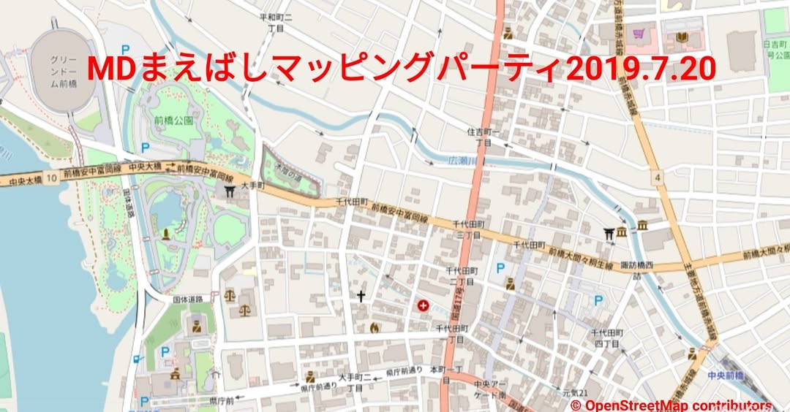

## 0335 — 2019-08-09 — 酒井 千富

- 投稿ID: 1149081431959661
- 投稿URL: https://www.facebook.com/groups/186097664924714/posts/1149081431959661/
- 要約: 前橋市でのマッピングパーティ第2弾！
- コメント要約: （コメントなし）

前橋市でのマッピングパーティ第2弾！
前橋にオープンデータ文化を広めるのにご協力をお願いします
古橋さんのセミナーでは前橋市長もディスカッションに加わります（笑
2019/09/01(日)
オープンストリートマップセミナーとマッピングパーティ
前橋市中央公民館　507学習室（元気21　5階）
QGIS User Group Japanとシェアされています
興味あり

## 0336 — 2019-08-26 — 鈴木 秀一

- 投稿ID: 1161024317432039
- 投稿URL: https://www.facebook.com/groups/186097664924714/posts/1161024317432039/
- 要約: 【参加者募集中！SAITAMA未来予想図アイデアソン】 ※定員まで残り10名 さいたま市の未来予想図を表現する「ビジネスアイデアやプラン」の具現化を、業界やビジネスの専門家であるメンター兼審査員の方々と共に取り組んで、1日で作成するイベントが開催されます！
- コメント要約: （コメントなし）

【参加者募集中！SAITAMA未来予想図アイデアソン】
※定員まで残り10名
さいたま市の未来予想図を表現する「ビジネスアイデアやプラン」の具現化を、業界やビジネスの専門家であるメンター兼審査員の方々と共に取り組んで、1日で作成するイベントが開催されます！
さいたま市の観光・地域資源である「盆栽の町さいたま」「岩槻地域のまちづくり」をアイデアソンのテーマに設定し、ディスカッションを通じて「新たな魅力発見」や「新たな魅力発信」を目指します！
これらによって「地域振興」や「地域お困りごと解決」を手段のひとつとしての「創業」に関心を持ってもらう機会を作ります。
・起業に興味がある方
・地域活性化に関心のある方
・ビジネスプランの作り方に興味がある方
などなど、またと無いチャンスです！
と　き：2019年9月7日（土）　10:00～17:00
ところ：貸会議室６Ｆ（JR大宮駅東口より徒歩１分）
テーマ：「盆栽の町さいたま」「岩槻地域のまちづくり」
参加費：無料
公式サイト・参加申込みはこちら※定員まで残り10名
さいたま市｜SAITAMA未来予想図アイデアソン
SAITAMA-IDEATHON.COM
さいたま市｜SAITAMA未来予想図アイデアソン

## 0337 — 2019-08-29 — 酒井 千富

- 投稿ID: 1163054760562328
- 投稿URL: https://www.facebook.com/groups/186097664924714/posts/1163054760562328/
- 要約: 前橋でOSMセミナーとマッピングパーティを開催します 席に余裕がございますので、ご参加をよろしくお願いします 2019/09/01(日) オープンストリートマップセミナーとマッピングパーティ 前橋市中央公民館 507学習室（元気21 5階） QGIS User Group Japanとシェアされています 興味あり
- コメント要約: （コメントなし）

前橋でOSMセミナーとマッピングパーティを開催します
席に余裕がございますので、ご参加をよろしくお願いします
2019/09/01(日)
オープンストリートマップセミナーとマッピングパーティ
前橋市中央公民館　507学習室（元気21　5階）
QGIS User Group Japanとシェアされています
興味あり

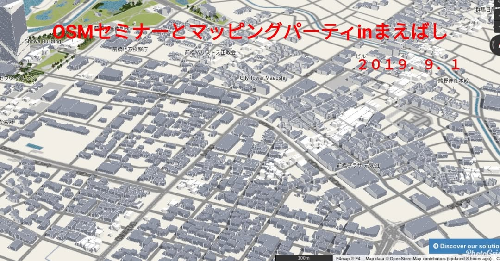

## 0338 — 2020-01-17 — 太田 一穂

- 投稿ID: 1291007321100404
- 投稿URL: https://www.facebook.com/groups/186097664924714/posts/1291007321100404/
- 要約: あけましておめでとうございます。 今年は埼玉で定期的に集まってもくもく会、勉強会、色々やっていきましょう！まずはmeetupを設定しました。浦和の市民活動サポートセンターです。
- コメント要約: （コメントなし）

あけましておめでとうございます。
今年は埼玉で定期的に集まってもくもく会、勉強会、色々やっていきましょう！まずはmeetupを設定しました。浦和の市民活動サポートセンターです。途中参加・退出歓迎です！
[https://www.facebook.com/events/508407279801057/](https://www.facebook.com/events/508407279801057/)
2020/01/29(水)
Code for SAITAMA Meetup 2020/1月
さいたま市
Code for Saitama運営会議とシェアされています

## 0339 — 2020-02-03 — 太田 一穂

- 投稿ID: 1305161759684960
- 投稿URL: https://www.facebook.com/groups/186097664924714/posts/1305161759684960/
- 要約: 次回Meetupは2/19（水）です！ 2020/02/19(水) Code for SAITAMA Meetup 2020/2月 さいたま市
- コメント要約: （コメントなし）

次回Meetupは2/19（水）です！
2020/02/19(水)
Code for SAITAMA Meetup 2020/2月
さいたま市

## 0340 — 2020-02-03 — 太田 一穂

- 投稿ID: 1305162986351504
- 投稿URL: https://www.facebook.com/groups/186097664924714/posts/1305162986351504/
- 要約: 前回1/29のミートアップについて寄稿しました。今後も定期的に書いていけたらと思います！書きたい人も絶賛募集中です！ Civic Tech Fun! Fun! Report!
- コメント要約: （コメントなし）

前回1/29のミートアップについて寄稿しました。今後も定期的に書いていけたらと思います！書きたい人も絶賛募集中です！
Civic Tech Fun! Fun! Report!　2020年1月号 - Code for Japan
CODE4JAPAN.ORG
Civic Tech Fun! Fun! Report!　2020年1月号 - Code for Japan

## 0341 — 2020-02-19 — 後藤 真太郎

- 投稿ID: 1318274448373691
- 投稿URL: https://www.facebook.com/groups/186097664924714/posts/1318274448373691/
- 要約: 3/7 今年のオープンデータディは防災マッピングパーティーをやります。どうぞご参加ください。 2020/03/07(土) 3月7日●International Open Data Day 2020 in 埼玉【さいたま市・浦和・別所沼公園】 さいたま市 立正大学研究推進地域連携センター（公開ページ）とシェアされています
- コメント要約: （コメントなし）

3/7 今年のオープンデータディは防災マッピングパーティーをやります。どうぞご参加ください。https://www.facebook.com/events/486213945394491
2020/03/07(土)
3月7日●International Open Data Day 2020 in 埼玉【さいたま市・浦和・別所沼公園】
さいたま市
立正大学研究推進地域連携センター（公開ページ）とシェアされています

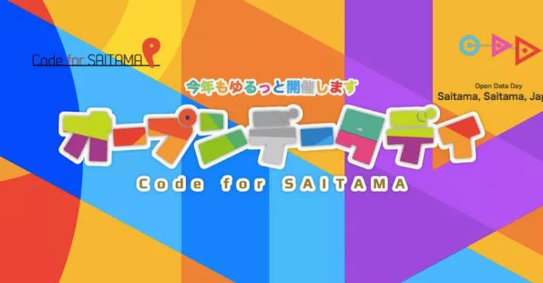

## 0342 — 2020-02-19 — 後藤 真太郎

- 投稿ID: 1318322441702225
- 投稿URL: https://www.facebook.com/groups/186097664924714/posts/1318322441702225/
- 要約: 明日開催です。ドローンデータによる3D解析を学びます。 2020/02/20(木) ドローン画像点群処理講習会（全測連CPD対象） 立正大学熊谷キャンパス3号館2FコンピュータB室 埼玉県GIS普及推進研究会主催
- コメント要約: （コメントなし）

明日開催です。ドローンデータによる3D解析を学びます。http://bit.ly/37IwUfo
2020/02/20(木)
ドローン画像点群処理講習会（全測連CPD対象）
立正大学熊谷キャンパス3号館2FコンピュータB室
埼玉県GIS普及推進研究会主催

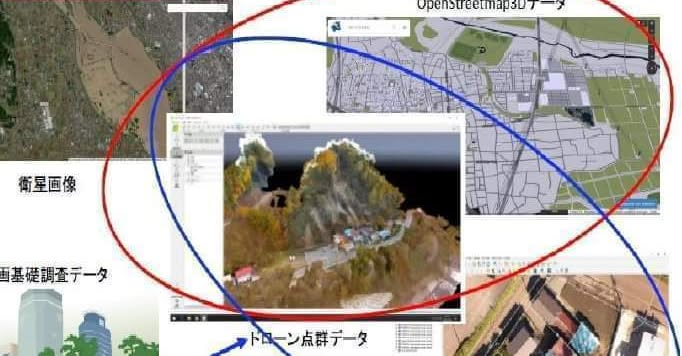

## 0343 — 2020-02-19 — 後藤 真太郎

- 投稿ID: 1318325768368559
- 投稿URL: https://www.facebook.com/groups/186097664924714/posts/1318325768368559/
- 要約: 2/27 TJUPなどの地域連携の報告とSDGsゲームを使ったワークショップを予定してます。地方創生事業を推進する上でのボトルネックの解消策など一緒に考えてみませんか？
- コメント要約: （コメントなし）

2/27 TJUPなどの地域連携の報告とSDGsゲームを使ったワークショップを予定してます。地方創生事業を推進する上でのボトルネックの解消策など一緒に考えてみませんか？https://www.facebook.com/events/603743110185766/
2020/02/27(木)
令和元年度 立正大学地域連携推進セミナー（地域連携事業報告&SDGsゲームによる地域計画体験ワークショップ）
立正大学熊谷キャンパス1号館第一会議室
後藤 真太郎さんから招待がありました
興味あり

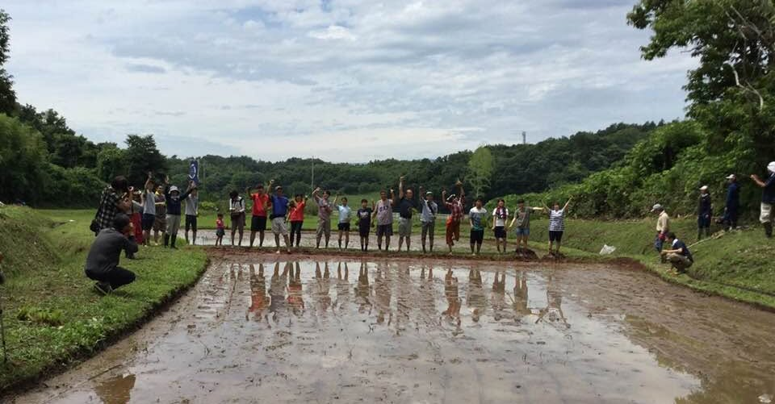

## 0344 — 2020-03-03 — 太田 一穂

- 投稿ID: 1328751903992612
- 投稿URL: https://www.facebook.com/groups/186097664924714/posts/1328751903992612/
- 要約: 今週末に迫ったIODDですが、代替開催を考えていた市民活動サポートセンター含め公共施設はほぼ閉鎖なため、コアタイム決めてzoomでオンライン開催かなと思ってます。
- コメント要約: （コメントなし）

https://www.facebook.com/events/486213945394491
今週末に迫ったIODDですが、代替開催を考えていた市民活動サポートセンター含め公共施設はほぼ閉鎖なため、コアタイム決めてzoomでオンライン開催かなと思ってます。他のIODDの実施時間帯をにらみつつ、午後のどこかの時間帯かな？ご意見募集します。
当日午前中は別所沼に行こうかな？
2020/03/07(土)
3月7日●International Open Data Day 2020 in 埼玉【さいたま市・浦和・別所沼公園】
さいたま市
立正大学研究推進地域連携センター（公開ページ）とシェアされています

## 0345 — 2020-04-08 — 太田 一穂

- 投稿ID: 1359274234273712
- 投稿URL: https://www.facebook.com/groups/186097664924714/posts/1359274234273712/
- 要約: 今日は19時からCode for Japanの「Civic Tech Live!」でした。 Peatixで登録してからのzoom参加となってます。 zoomのブレイクアウトルーム機能を使って分室でプチ座談会もするようです。
- コメント要約: （コメントなし）

今日は19時からCode for Japanの「Civic Tech Live!」でした。
Peatixで登録してからのzoom参加となってます。
zoomのブレイクアウトルーム機能を使って分室でプチ座談会もするようです。
https://www.facebook.com/events/1234547420084597/
2020/04/08(水)
Civic Tech Live! Online 〜シビックテック活動紹介〜
https://zoom.us/j/918496701

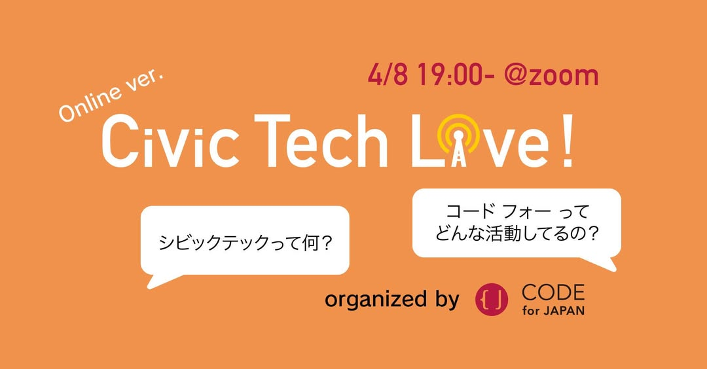

## 0346 — 2020-04-08 — 太田 一穂

- 投稿ID: 1359276487606820
- 投稿URL: https://www.facebook.com/groups/186097664924714/posts/1359276487606820/
- 要約: 今年度はさいたま市でデータアカデミーやるみたいですね CITY.SAITAMA.JP さいたま市／令和2年度「行政課題解決型データ利活用ワークショップ実施業務」の受託者募集について（公募型プロポーザル方式） 返信1件を見る 返信7件を見る
- コメント要約: 180万円でプロポーザルですか 条件に以下がありますので、どこかと組む必要がありますね。 （１）本プロポーザルの周知（通知）日において、平成３１・３２年度さいたま市競争入札参加資格名簿（業務委託）に、業務名：計画策定で登載されていること。

今年度はさいたま市でデータアカデミーやるみたいですね
CITY.SAITAMA.JP
さいたま市／令和2年度「行政課題解決型データ利活用ワークショップ実施業務」の受託者募集について（公募型プロポーザル方式）
返信1件を見る
返信7件を見る

### コメント — 飯塚 伸夫

180万円でプロポーザルですか

### コメント — 後藤 真太郎

条件に以下がありますので、どこかと組む必要がありますね。
（１）本プロポーザルの周知（通知）日において、平成３１・３２年度さいたま市競争入札参加資格名簿（業務委託）に、業務名：計画策定で登載されていること。

### コメント — 後藤 真太郎

もう一つ
（４）本プロポーザルの周知（通知）日から過去５年間に、総務省「地方公共団体におけるデータ利活用ガイドブックVer.2.0」にいう「データアカデミー」の実施に関する業務を受託し、適切に履行した実績がある者

### コメント — 渡辺 潤

受注する団体はどんなところが候補として考えられるでしょうか？

### コメント — 後藤 真太郎

一緒にRESUS使ったハッカソンやったような会社です。

### コメント — 酒井 千富

計画策定でさいたま市の競争入札参加資格のある業者、結構、いろんな分野にいますね（なんで、PDFなんだ）
https://www.city.saitama.jp/.../fil/3132_itaku_shinai.pdf
CITY.SAITAMA.JP
www.city.saitama.jp
www.city.saitama.jp

## 0347 — 2020-04-10 — 太田 一穂

- 投稿ID: 1360771107457358
- 投稿URL: https://www.facebook.com/groups/186097664924714/posts/1360771107457358/
- 要約: 毎年恒例のお花見マッピングパーティ、オンライン開催すればいいことに最近気づいたのでイベント建てました。zoomのURLを後ほど用意します。 2020/04/12(日) 4月12日オンライン開催☆お花見マッピングパーティ2020 埼玉県 熊谷市
- コメント要約: （コメントなし）

毎年恒例のお花見マッピングパーティ、オンライン開催すればいいことに最近気づいたのでイベント建てました。zoomのURLを後ほど用意します。
https://www.facebook.com/events/235802937477030
2020/04/12(日)
4月12日オンライン開催☆お花見マッピングパーティ2020
埼玉県 熊谷市

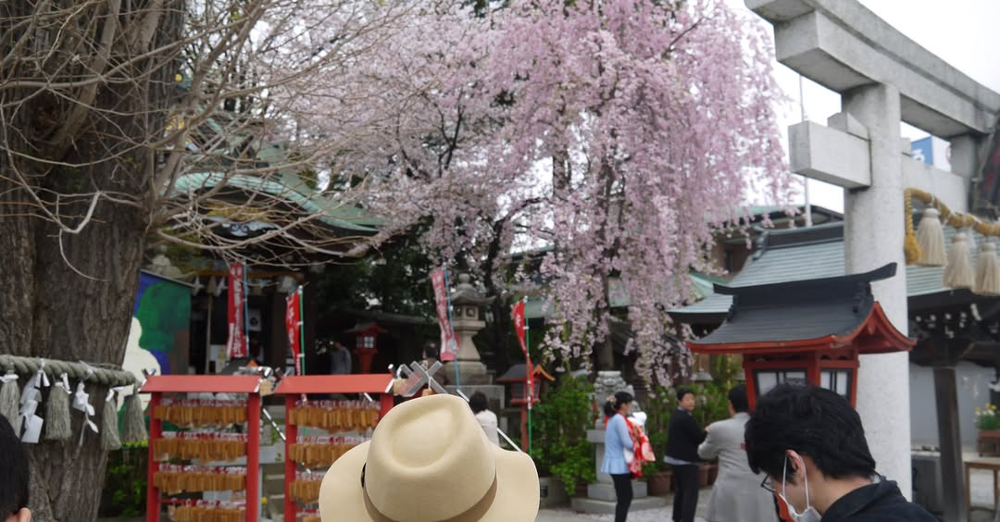

## 0348 — 2020-06-22 — 太田 一穂

- 投稿ID: 1419884751545993
- 投稿URL: https://www.facebook.com/groups/186097664924714/posts/1419884751545993/
- 要約: 2020/06/23(火) Code for SAITAMA Meetup 2020/6月
- コメント要約: （コメントなし）

2020/06/23(火)
Code for SAITAMA Meetup 2020/6月

## 0349 — 2020-07-07 — 後藤 真太郎

- 投稿ID: 1432508856950249
- 投稿URL: https://www.facebook.com/groups/186097664924714/posts/1432508856950249/
- 要約: 2020/07/11(土) 7/11 SDGsアイデアソン－アプリを使ってハレからケへの橋渡し－ 参加者17人・興味あり40人
- コメント要約: （コメントなし）

2020/07/11(土)
7/11 SDGsアイデアソン－アプリを使ってハレからケへの橋渡し－
参加者17人・興味あり40人

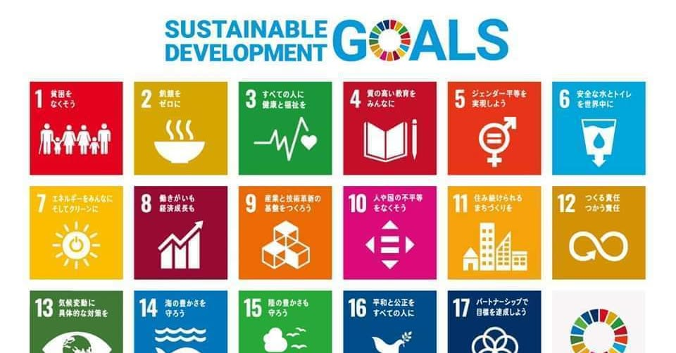

## 0350 — 2020-07-11 — 後藤 真太郎

- 投稿ID: 1435453016655833
- 投稿URL: https://www.facebook.com/groups/186097664924714/posts/1435453016655833/
- 要約: SDGsアイデアソンは本日です。本番は18:00-21:00ですが、13:00-18:00にもZoomに入室でき作戦会議ができますのでご利用ください。
- コメント要約: （コメントなし）

SDGsアイデアソンは本日です。本番は18:00-21:00ですが、13:00-18:00にもZoomに入室でき作戦会議ができますのでご利用ください。
https://www.facebook.com/events/2699772700307616/?active_tab=about
Zoomミーティングに参加する
https://zoom.us/j/98623033397...
ミーティングID: 986 2303 3397
パスワード: 132621
2020/07/11(土)
7/11 SDGsアイデアソン－アプリを使ってハレからケへの橋渡し－
参加者17人・興味あり40人

## 0351 — 2020-07-18 — 太田 一穂

- 投稿ID: 1441370919397376
- 投稿URL: https://www.facebook.com/groups/186097664924714/posts/1441370919397376/
- 要約: Code for Japan インターンの学生たちが企画した、学生のためのチーム開発で社会課題の解決がテーマのプログラミングコンテストのエントリーが開始しました。
- コメント要約: （コメントなし）

Code for Japan インターンの学生たちが企画した、学生のためのチーム開発で社会課題の解決がテーマのプログラミングコンテストのエントリーが開始しました。U-22対象ですが、この夏腕試したい学生、高専生はぜひ！
陣内 一樹さんからの投稿をシェアしました
陣内 一樹
Code for Japan初の本格的な開発コンテスト「CiCivictech Challenge Cup U-22」（CCC U-22）をはじめました！
Covid19をきっかくに多くの学生がシビックテックに興味を持ち、東京都コロナウイルス対策サイトなどに関わって来ました。
CCC U-22は、Code for Japanでインターンをしている学生が、学生向けに企画した開発コンテストです。
今、学生のインターン先が無くなって、高専生たちは経済的にも就職の実績づくりにも困っています。
CCC U-22は、10社程度から企業協賛をもらい、社会課題をテーマにしたチーム開発を学生に経験してもらうことで、インターンの代替になる機会を提供することを目指しています。
また、Code for Japanとしては来年以降も継続的に開催し、社会課題に興味を持つ若い盛大のコミュニティをつくっていきたいと考えています。
企画運営も参加者も学生というこれまでにない取り組みで、これまでもこれからも手探りで進めていくことになりますが、企業協賛や学生への告知に協力いただけると大変助かります！
（個人協賛は準備が整い次第、開始します）
ぜひ、ご協力をお願いします！！
Civictech Challenge Cup
CCC2020.CODE4JAPAN.ORG
Civictech Challenge Cup

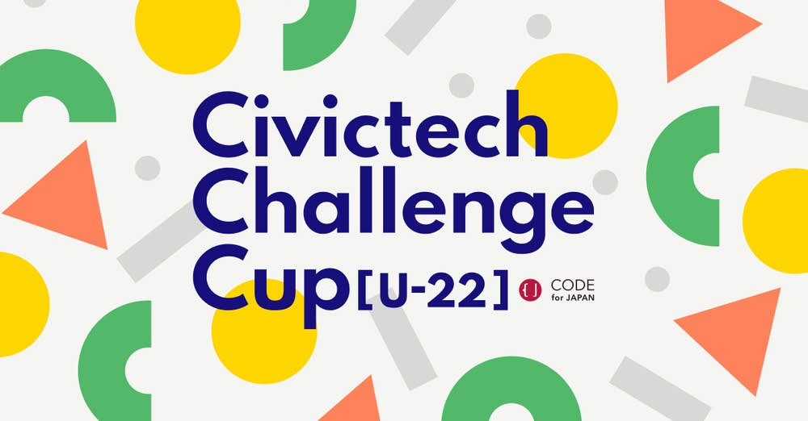

## 0352 — 2020-07-31 — 後藤 真太郎

- 投稿ID: 1451606581707143
- 投稿URL: https://www.facebook.com/groups/186097664924714/posts/1451606581707143/
- 要約: アイデアソンの続きをやります。アイデアソンで青年会議所から出てきたDMOやスマートシティー対応などに対する事業計画は作りたいと思いますのでオンラインでガヤガヤやりませんか？
- コメント要約: （コメントなし）

アイデアソンの続きをやります。アイデアソンで青年会議所から出てきたDMOやスマートシティー対応などに対する事業計画は作りたいと思いますのでオンラインでガヤガヤやりませんか？お待ちしてます。
2020/08/01(土)
8/1-2 SDGsハッカソン－アプリを使ってハレからケへの橋渡し－
local_art_communityとシェアされています

## 0353 — 2020-10-03 — 酒井 千富

- 投稿ID: 1507939202740547
- 投稿URL: https://www.facebook.com/groups/186097664924714/posts/1507939202740547/
- 要約: 一週間後のオンラインセミナー（再送） 日本付近の海水温上昇、台風大型化、線状降水帯 異常気象はみんなが感じています では、関東の気象はどう変わっているのか、群馬の災害はどうなっているのか 地元群大の先生方が話してくれます、ZOOM参加者は質問も出来ます（まだ、少し空きがあります） ZOOMは慣れていないという方はYouTubeでも生配信もされます 必ず、参…
- コメント要約: （コメントなし）

一週間後のオンラインセミナー（再送）
日本付近の海水温上昇、台風大型化、線状降水帯
異常気象はみんなが感じています
では、関東の気象はどう変わっているのか、群馬の災害はどうなっているのか
地元群大の先生方が話してくれます、ZOOM参加者は質問も出来ます（まだ、少し空きがあります）
ZOOMは慣れていないという方はYouTubeでも生配信もされます
必ず、参加フォームから申し込みして下さい（配信URLはフォーム登録者にメールでお知らせいたします）
2020/10/10(土)
災害時のスマートエネルギーを考えよう
興味あり

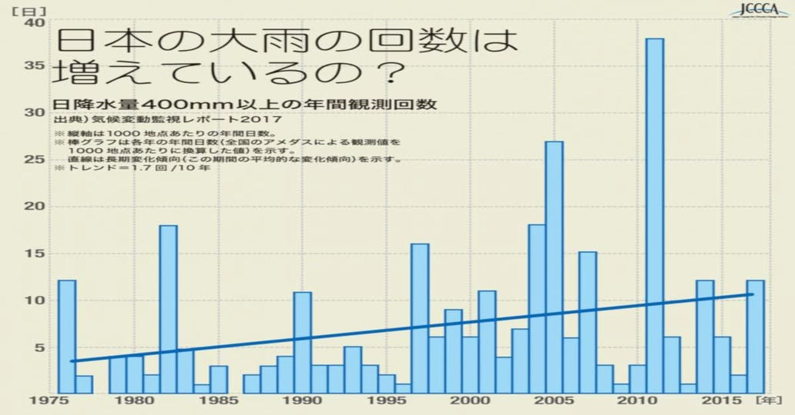

## 0354 — 2020-10-12 — 太田 一穂

- 投稿ID: 1516089748592159
- 投稿URL: https://www.facebook.com/groups/186097664924714/posts/1516089748592159/
- 要約: 【Code for Japan Summit 2020 交流会】 今週末10/17-18は Code for Japan Summit 2020 Onlineです。
- コメント要約: 18日、UDトーク修正担当で参加します！

【Code for Japan Summit 2020 交流会】
今週末10/17-18は Code for Japan Summit 2020 Onlineです。今回は愛知で開催でしたがCOVID-19のためオンライン開催となっています。したがって10/17の交流会もオンラインで開催されます。
CODE for SAKE さんがKURANDさん協力のもと、交流会用の東海地方のお酒をセレクトして販売していますので日本酒好きのあなたはポチッとしてください！苦手な方向けにも果実酒やクラフトビールもお選びいただけます！
Code for Japan Summit オンライン交流会 乾杯酒限定販売ページ
KURAND.JP
Code for Japan Summit オンライン交流会 乾杯酒限定販売ページ

### コメント — 大野 さやか

18日、UDトーク修正担当で参加します！

## 0355 — 2020-10-17 — 太田 一穂

- 投稿ID: 1521403591394108
- 投稿URL: https://www.facebook.com/groups/186097664924714/posts/1521403591394108/
- 要約: いよいよCode for Japan Summit 2020 online開催です！Youtube配信となりますが、peatixでチケット（無料）登録いただけるとありがたいです！
- コメント要約: （コメントなし）

いよいよCode for Japan Summit 2020 online開催です！Youtube配信となりますが、peatixでチケット（無料）登録いただけるとありがたいです！
Code for Japan Summit 2020 Online
CFJ-SUMMIT2020.PEATIX.COM
Code for Japan Summit 2020 Online

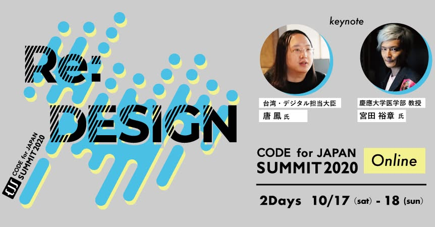

## 0356 — 2020-10-17 — 太田 一穂

- 投稿ID: 1521404634727337
- 投稿URL: https://www.facebook.com/groups/186097664924714/posts/1521404634727337/
- 要約: Code for Japan Summit 2020の懇親会はzoomを使って各地域+ネコで行われます。東京埼玉千葉の会場はこちらになります。 2020/10/17(土) Code for Japan Summit 2020ゆるっと関東交流会 Code for TODA～情報×（子供＋防災＋まちづくり）支援とシェアされています
- コメント要約: （コメントなし）

Code for Japan Summit 2020の懇親会はzoomを使って各地域+ネコで行われます。東京埼玉千葉の会場はこちらになります。
https://www.facebook.com/events/649261829355570?active_tab=about
2020/10/17(土)
Code for Japan Summit 2020ゆるっと関東交流会
Code for TODA～情報×（子供＋防災＋まちづくり）支援とシェアされています

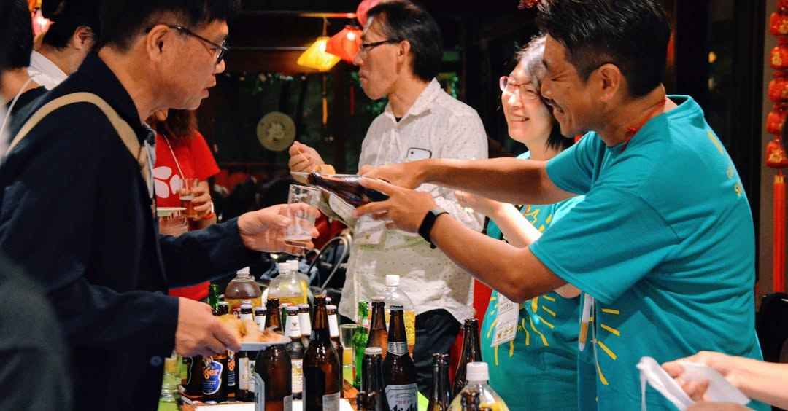

## 0357 — 2020-10-17 — 荻本 正浩

- 投稿ID: 1521762708024863
- 投稿URL: https://www.facebook.com/groups/186097664924714/posts/1521762708024863/
- 要約: 承認ありがとうございます♪ 現在STO Projectに参加させていただいてます。 よろしくお願いします。
- コメント要約: （コメントなし）

承認ありがとうございます♪
現在STO Projectに参加させていただいてます。
よろしくお願いします。

## 0358 — 2020-11-19 — 太田 一穂

- 投稿ID: 1553934678140999
- 投稿URL: https://www.facebook.com/groups/186097664924714/posts/1553934678140999/
- 要約: 【UDC2020】 Code for TODAのアイデアソン、今週末土曜に開催です！ #アーバンデータチャレンジ #UDC2020 2020/11/21(土) 【UDC2020】アイデアソン「市民が本当に使いたい行政サービスを勝手に考え勝手につくる」 Code for TODA～情報×（子供＋防災＋まちづくり）支援とシェアされています
- コメント要約: （コメントなし）

【UDC2020】
Code for TODAのアイデアソン、今週末土曜に開催です！
https://www.facebook.com/events/3942595925768920
#アーバンデータチャレンジ
#UDC2020
2020/11/21(土)
【UDC2020】アイデアソン「市民が本当に使いたい行政サービスを勝手に考え勝手につくる」
Code for TODA～情報×（子供＋防災＋まちづくり）支援とシェアされています

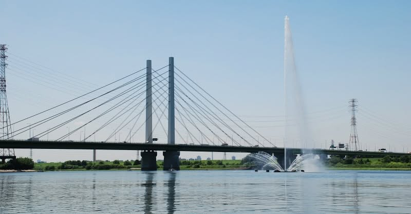

## 0359 — 2020-11-20 — 太田 一穂

- 投稿ID: 1554361804764953
- 投稿URL: https://www.facebook.com/groups/186097664924714/posts/1554361804764953/
- 要約: Code for Japan Summit 2020 が終わって1ヶ月経ってたことにさっき気づいたわけですが、来年の開催予定は仙台ということで塩竈の小泉さんがこんな振り返りイベントを立ててくれています。
- コメント要約: （コメントなし）

Code for Japan Summit 2020 が終わって1ヶ月経ってたことにさっき気づいたわけですが、来年の開催予定は仙台ということで塩竈の小泉さんがこんな振り返りイベントを立ててくれています。今年はオンライン開催で6トラックほぼアーカイブされてるのでサミットロスの暇もありません。みんなで見るのもいいものですね。
https://fb.me/e/1Lcn18pX5
2020/11/22(日)
CfJ Summit2020オススメセッション紹介の会

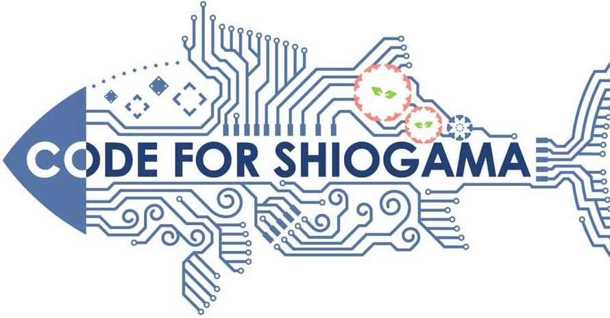

## 0360 — 2020-11-21 — 後藤 真太郎

- 投稿ID: 1555463304654803
- 投稿URL: https://www.facebook.com/groups/186097664924714/posts/1555463304654803/
- 要約: アイデアソン絶賛実施中w 古田武士さんからの投稿をシェアしました 古田武士 投稿先 【UDC2020】アイデアソン「市民が本当に使いたい行政サービスを勝手に考え勝手につくる」 空の投稿です 投稿にもともと含まれていたコンテンツが利用できなくなった、などの理由が考えられます。
- コメント要約: （コメントなし）

アイデアソン絶賛実施中w
古田武士さんからの投稿をシェアしました
古田武士
投稿先
【UDC2020】アイデアソン「市民が本当に使いたい行政サービスを勝手に考え勝手につくる」
空の投稿です
投稿にもともと含まれていたコンテンツが利用できなくなった、などの理由が考えられます。

## 0361 — 2020-12-14 — 太田 一穂

- 投稿ID: 1573869129480887
- 投稿URL: https://www.facebook.com/groups/186097664924714/posts/1573869129480887/
- 要約: UDC2020応募〆切も近くなってきたので埼玉のブリゲード集まって話そうよって感じの回です。先週Code for CATのミーティングで使ったMessengerルームがお手軽だったので今回使おうと思います。
- コメント要約: （コメントなし）

UDC2020応募〆切も近くなってきたので埼玉のブリゲード集まって話そうよって感じの回です。先週Code for CATのミーティングで使ったMessengerルームがお手軽だったので今回使おうと思います。イベントの写真はUDC中間シンポジウムの室蘭帰りに立ち寄った森町の風景。
https://www.facebook.com/events/1017926552026394/
2020/12/15(火)
Code for SAITAMA Meetup 2020/12月〜UDC2020応募に向けて〜
Code for TODA～情報×（子供＋防災＋まちづくり）支援とシェアされています

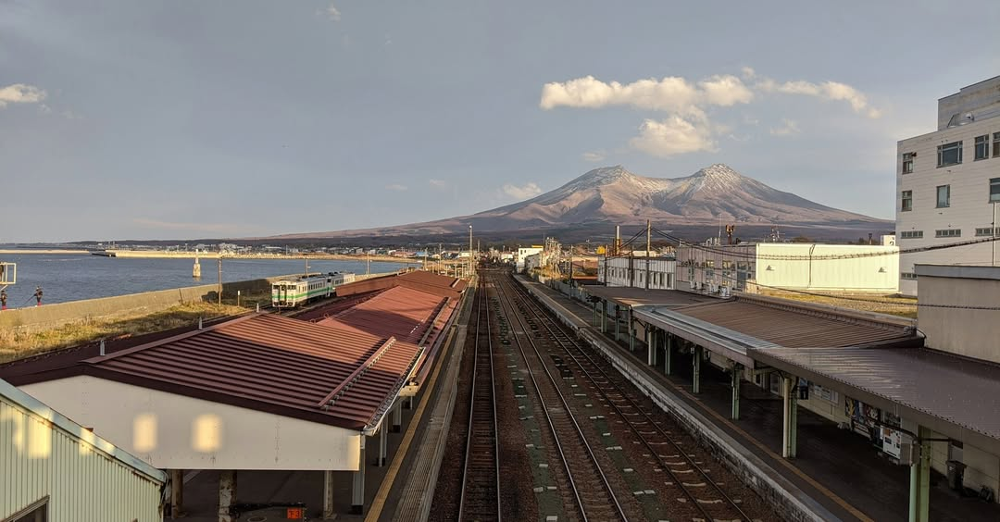

## 0362 — 2021-03-03 — 太田 一穂

- 投稿ID: 1630665777134555
- 投稿URL: https://www.facebook.com/groups/186097664924714/posts/1630665777134555/
- 要約: 今年もやります。場所はDiscordにて！ 2021/03/06(土) 3月6日●International Open Data Day 2021 in SAITAMA【オンライン】 Code for TODA～情報×（子供＋防災＋まちづくり）支援とシェアされています
- コメント要約: （コメントなし）

今年もやります。場所はDiscordにて！
https://www.facebook.com/events/267869458041563/?active_tab=about
2021/03/06(土)
3月6日●International Open Data Day 2021 in SAITAMA【オンライン】
Code for TODA～情報×（子供＋防災＋まちづくり）支援とシェアされています

## 0363 — 2021-05-01 — 華井 裕隆
 
·
フォローする

- 投稿ID: 1673987552802377
- 投稿URL: https://www.facebook.com/groups/186097664924714/posts/1673987552802377/
- 要約: ５月の市長選、あなたはどうするか決めましたか？ 前回の投票率は31.44％でした。政治に興味を持ってもらいたい高校生と一緒に、こんなイベントを企画しました。なんと、立候補表明者が複数来てくれます。
- コメント要約: （コメントなし）

５月の市長選、あなたはどうするか決めましたか？？
前回の投票率は31.44％でした。政治に興味を持ってもらいたい高校生と一緒に、こんなイベントを企画しました。なんと、立候補表明者が複数来てくれます。
５月４日の１０時から、２時間ご都合がつく方はぜひご参加ください！！
けんみん会議さんからの投稿をシェアしました
写真の説明はありません。. 写真の説明はありません。
けんみん会議
5月4日10時から「さいたま選挙応援部」がオンラインイベントをやります。入場無料。
なんと！！ さいたま市長選の立候補表明者（清水現市長と前島ひでおさん）が後半来てくださいます。
市長選を盛り上げたい高校生が、さいたま市の「まちづくり」と「子育て支援」について両候補にインタビューした動画をもとに、様々な人と意見交換してみませんか？（このテーマ2つも高校生が選びました）
「さいたま選挙応援部」は、さいたま市の高校生とけんみん会議のメンバーが設立・運営している団体です。当日は、複数の新聞社も取材に入ります。
さいたま市のみなさん、市外のみなさん、政治に興味のあるみなさん、ぜひお申し込みください！！
お申し込みはこちらから→https://docs.google.com/.../1FAIpQLScpGB1xRkWZz8.../viewform

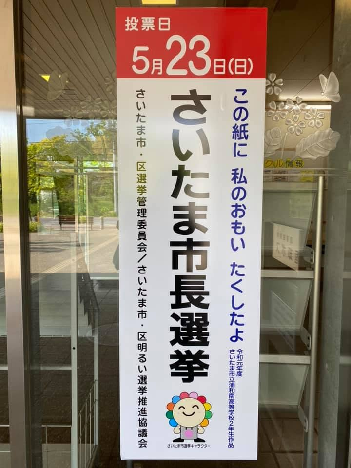

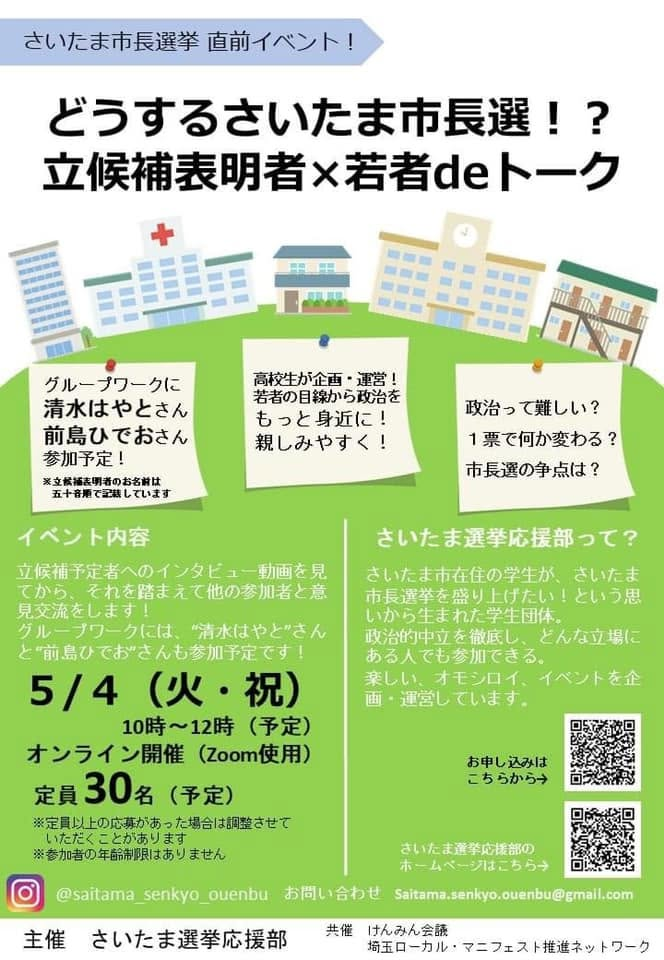

## 0364 — 2021-05-02 — 若林祥文

- 投稿ID: 1674268699440929
- 投稿URL: https://www.facebook.com/groups/186097664924714/posts/1674268699440929/
- 要約: ZOOMによる連続トークセッション第2弾 大宮をみる“まなざし”が変わる【大宮のまちづかいのプロ実践秘話】星野邦敏×岡野友敬｜へのご参加の呼びかけです。
- コメント要約: （コメントなし）

ZOOMによる連続トークセッション第2弾　　大宮をみる“まなざし”が変わる【大宮のまちづかいのプロ実践秘話】星野邦敏×岡野友敬｜へのご参加の呼びかけです。
・NPO法人都市づくりNPOさいたま（つくたま）の情報紙 vol.9、vol.10 とvol.11特別号で取り上げた大宮周辺のまちづくりについて、深堀りする連続トークイベント第2弾を5月8日午後2時から行います！
・コロナ禍でも、さいたま市大宮駅近くでシェアキッチンやyoutube配信スタジオなど新規事業を連発している星野邦敏さんと、子供の通う小学校でヤギを飼育することから地域コミュニティを盛り上げながら、今年見沼田んぼにNumerland（ヌマーランド）を開設した岡野友敬さんをお呼びして、大宮のまちづかいの奥行きや、人を育て、まちの可能性を高める方法を探ります。
・つくたま情報紙 は以下のリンクからご一読いただけます。
https://www.tsukutama.info/?page_id=1401
〇日時：2021年5月8日(土) 14:00-16:00
開催方法：zoomによるオンライン配信（チケット販売5月8(土)12:00迄）
イベントの参加料：1000円。
申し込みは、こちらから。
https://tsukutama-talk-session-02.peatix.com
【大宮のまちづかいのプロ実践秘話】星野邦敏×岡野友敬｜つくたまトークセッション #2
TSUKUTAMA-TALK-SESSION-02.PEATIX.COM
【大宮のまちづかいのプロ実践秘話】星野邦敏×岡野友敬｜つくたまトークセッション #2

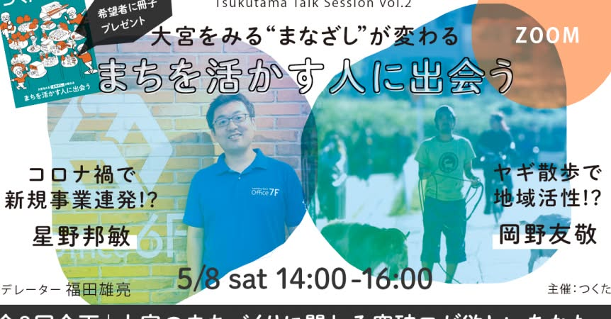

## 0365 — 2021-05-02 — 華井 裕隆
 
·
フォローする

- 投稿ID: 1674609262740206
- 投稿URL: https://www.facebook.com/groups/186097664924714/posts/1674609262740206/
- 要約: 連投ですいません。 高校生、緊張しながら、前島さん、清水さんに無事インタビューできました。 さいたま市長選、関心が高まるといいですね。 けんみん会議さんからの投稿をシェアしました 写真の説明はありません。
- コメント要約: （コメントなし）

連投ですいません。
高校生、緊張しながら、前島さん、清水さんに無事インタビューできました。
さいたま市長選、関心が高まるといいですね。
けんみん会議さんからの投稿をシェアしました
写真の説明はありません。. 写真の説明はありません。
けんみん会議
5月4日10時から「さいたま選挙応援部」がオンラインイベントをやります。
高校生が「まちづくり」と「子育て支援」について清水現市長と前島ひでおさん（さいたま市長選の立候補表明者）にインタビューしました。
5月4日は、この動画をもとに、様々な人と意見交換してみませんか？ 後半、お二人も来てくれますよ。
「さいたま選挙応援部」は、さいたま市の高校生と
けんみん会議のメンバーが設立・運営している団体です。当日は、複数の新聞社も取材に入ります。
さいたま市のみなさん、市外のみなさん、政治に興味のあるみなさん、ぜひお申し込みください！！
お申し込みはこちらから→https://docs.google.com/.../1FAIpQLScpGB1xRkWZz8.../viewform

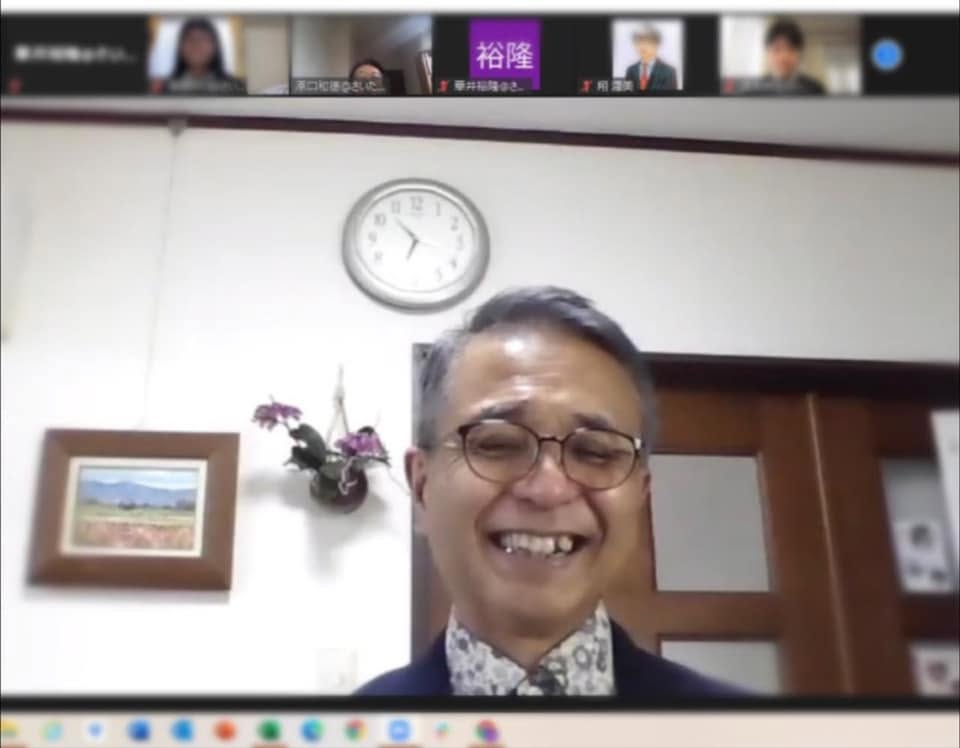

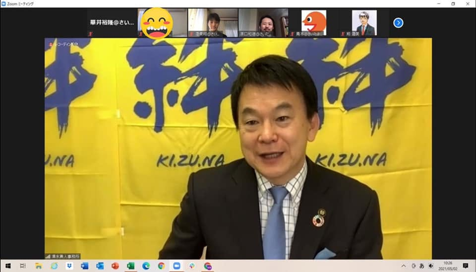

## 0366 — 2021-05-29 — 後藤 真太郎

- 投稿ID: 1693205060880626
- 投稿URL: https://www.facebook.com/groups/186097664924714/posts/1693205060880626/
- 要約: 後藤 真太郎さんからの投稿をシェアしました 立正大学研究推進地域連携センター（公開ページ） 後藤 真太郎 教育・学習のグループエキスパート トップコントリビューター 2017年、埼玉県と締結した協定で、立正大学は災害時に災害対策本部にて埼玉県GIS普及推進研究会等と協働し、GISなどのICT（ドローンによる被災状況撮影も運用上含んでいます）による情報共有の…
- コメント要約: （コメントなし）

後藤 真太郎さんからの投稿をシェアしました
立正大学研究推進地域連携センター（公開ページ）
後藤 真太郎
教育・学習のグループエキスパート
トップコントリビューター
2017年、埼玉県と締結した協定で、立正大学は災害時に災害対策本部にて埼玉県GIS普及推進研究会等と協働し、GISなどのICT（ドローンによる被災状況撮影も運用上含んでいます）による情報共有の支援を行うことになっています。今年より、登録証が発行されることになり、この度送付されてきました。

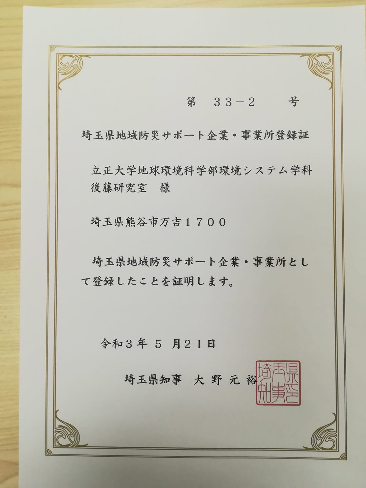

## 0367 — 2021-06-30 — 太田 一穂

- 投稿ID: 1716886631845802
- 投稿URL: https://www.facebook.com/groups/186097664924714/posts/1716886631845802/
- 要約: アーバンデータチャレンジ2021キックオフ、本日開催です。今年も埼玉拠点としてもりあげていこうと思います！ アーバンデータチャレンジさんからの投稿をシェアしました アーバンデータチャレンジ いよいよ本日、6月30日（水）午後1時半より5時半までUDC2021/IDC2021キックオフイベントがオンラインで開催されます。
- コメント要約: （コメントなし）

アーバンデータチャレンジ2021キックオフ、本日開催です。今年も埼玉拠点としてもりあげていこうと思います！
アーバンデータチャレンジさんからの投稿をシェアしました
アーバンデータチャレンジ
いよいよ本日、6月30日（水）午後1時半より5時半までUDC2021/IDC2021キックオフイベントがオンラインで開催されます。各界からの素晴らしい講演者、昨年度の受賞者や各地域拠点のキープレーヤーの皆様をお迎えして充実したプログラムです。是非ともご覧ください！
皆様もSNS等でハッシュタグ #UDC2021 を利用して積極的に発信してください。開催中はYouTube Liveのチャット欄でも書込できますので、応援のメッセージをお願いいたします。では、開催までわずかとなってきましたが楽しみにお待ちください。
【申込Peatix】申込まだの方は是非、お申込みもお願いいたします。
https://udc2021-1st.peatix.com/
【プログラム】
https://urbandata-challenge.jp/news/2021-1st-symposium
アーバンデータチャレンジ2021（UDC2021）キックオフ！(6/30）
UDC2021-1ST.PEATIX.COM
アーバンデータチャレンジ2021（UDC2021）キックオフ！(6/30）

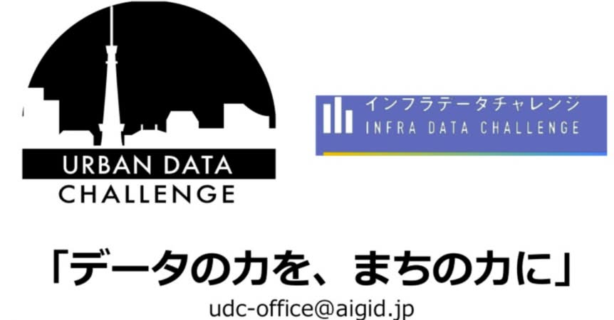

## 0368 — 2021-09-01 — 伊藤 利昭

- 投稿ID: 1762639603937171
- 投稿URL: https://www.facebook.com/groups/186097664924714/posts/1762639603937171/
- 要約: Code for TODAの伊藤です。 ちょっと変わったアイデアソンを開催します。 ファシリテータはいつもお世話になっているCode for SAITAMAの 古田武士 さんにお願いしています。
- コメント要約: （コメントなし）

Code for TODAの伊藤です。
ちょっと変わったアイデアソンを開催します。
ファシリテータはいつもお世話になっているCode for SAITAMAの　古田武士 さんにお願いしています。
皆様、ぜひご参加ください。
Code for TODAさんからの投稿をシェアしました
Code for TODA
バーチャルアイデアソン「バーチャル空間ではどんなイベントができるか」
9/25(土)・26(日)に、戸田市が実施するバーチャルイベントの実証実験の中で、バーチャルアイデアソンを開催します。
参加者のみなさんにアバターとなっていただき、バーチャル空間で、アイデアソンをおこないます。
詳細・お申し込みは、以下のリンク先をご覧ください。
バーチャル空間の中でお会いできること、楽しみにしています。ぜひご参加ください。
バーチャルアイデアソン「バーチャル空間ではどんなイベントができるか」
※お申し込みはこちらから
https://codefortoda.org/2021/08/30/virtualideathon/
戸田市のバーチャルイベントの実証実験
https://www.city.toda.saitama.jp/.../154/virtual-event.html
CODEFORTODA.ORG
バーチャルアイデアソン「バーチャル空間ではどんなイベントができるか」開催のお知らせ – Code for TODA(コードフォーとだ）
Code for TODAは、戸田市がおこなうバーチャルイベントの実証実験の中で、バーチャルアイデアソンを開催します。

## 0369 — 2021-09-16 — 後藤 真太郎

- 投稿ID: 1773627106171754
- 投稿URL: https://www.facebook.com/groups/186097664924714/posts/1773627106171754/
- 要約: 9/18-19はCode for Japan Summitです。市民がはじめる わたしたちのスマートシティなど、さいたまにも参考になる話題満載ですので是非参加しませんか？
- コメント要約: （コメントなし）

9/18-19はCode for Japan Summitです。市民がはじめる わたしたちのスマートシティなど、さいたまにも参考になる話題満載ですので是非参加しませんか？参加費は無料です。今年もオンライン開催ですので移動時間を考慮せず参加できます。
10/2 11:00-14:00 熊谷市民活動支援センターにてチャレンジオープンガバナンス2021のキックオフイベントを予定してます。そこでのテーマがラグビーロードの活性化、熱中症対策。アイデアを共に考え共に創り、アイデアを形に行く予定です。ワクワク感が共感を呼ぶこと間違いなし。
10/2のイベントには、CityGMLやIoTなども使えるよう準備中しており、アウトプットのイメージづくりにもいいと思われますのでどうぞご利用ください。
市民がはじめる わたしたちのスマートシティ | Code for Japan Summit 2021
SUMMIT2021.CODE4JAPAN.ORG
市民がはじめる わたしたちのスマートシティ | Code for Japan Summit 2021

## 0370 — 2021-09-26 — 古田武士

- 投稿ID: 1781073598760438
- 投稿URL: https://www.facebook.com/groups/186097664924714/posts/1781073598760438/
- 要約: 本日のCode for TODA バーチャルアイデアソンの動画配信を行います。Code for SAITAMAの古田が司会進行を行います。 2021/09/26(日) Code for TODA バーチャルアイデアソン 動画配信 Code for TODA～情報×（子供＋防災＋まちづくり）支援主催 興味あり
- コメント要約: （コメントなし）

本日のCode for TODA バーチャルアイデアソンの動画配信を行います。Code for SAITAMAの古田が司会進行を行います。
https://fb.me/e/3MiOSkgse
2021/09/26(日)
Code for TODA バーチャルアイデアソン 動画配信
Code for TODA～情報×（子供＋防災＋まちづくり）支援主催
興味あり

## 0371 — 2021-09-26 — 後藤 真太郎

- 投稿ID: 1781084482092683
- 投稿URL: https://www.facebook.com/groups/186097664924714/posts/1781084482092683/
- 要約: 10/2から3か月かけて、 熊谷市との産学官民連携で共に考えともに創っていく事になりました。アクティブラーニングの授業で学生も参加します。10/2は「熊谷にゃおざね祭り」が近くで開催されてますので会場からもオンライン参加もアリ。
- コメント要約: （コメントなし）

10/2から3か月かけて、 熊谷市との産学官民連携で共に考えともに創っていく事になりました。アクティブラーニングの授業で学生も参加します。10/2は「熊谷にゃおざね祭り」が近くで開催されてますので会場からもオンライン参加もアリ。ご関心ある方の参加をお待ちしてます。
テーマ： 「ラグビータウン熊谷」の活性化支援、「暑さ対策日本一の街」の推進　等
2021/10/02(土)
COG2021熊谷ミートアップ
Code for Saitama運営会議とシェアされています

## 0372 — 2021-11-07 — 太田 一穂

- 投稿ID: 1812328315634966
- 投稿URL: https://www.facebook.com/groups/186097664924714/posts/1812328315634966/
- 要約: 今年もアーバンデータチャレンジ埼玉拠点やってます。 そろそろ何をやっていくか、話してアイデア出していきましょう！ 以前やろうとしてそのままなアイデアとか、いろいろ出てくると思います。
- コメント要約: （コメントなし）

今年もアーバンデータチャレンジ埼玉拠点やってます。
そろそろ何をやっていくか、話してアイデア出していきましょう！
以前やろうとしてそのままなアイデアとか、いろいろ出てくると思います。
https://fb.me/e/1gZYYbgwp
2021/11/09(火)
UDC2021埼玉拠点 Meetup @Code for SAITAMA

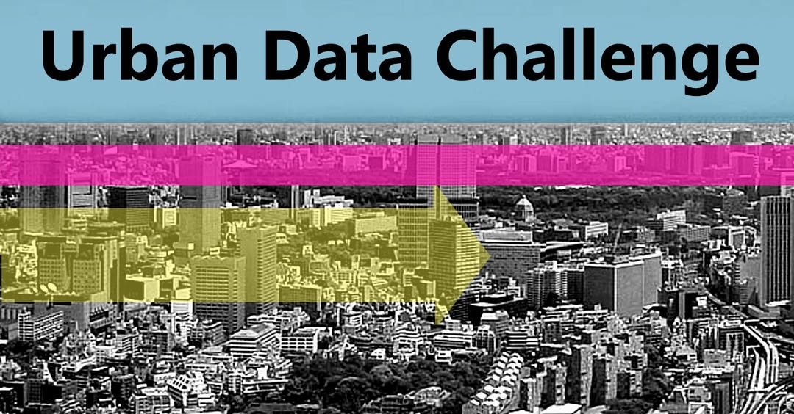

## 0373 — 2021-12-08 — 後藤 真太郎

- 投稿ID: 1834489116752219
- 投稿URL: https://www.facebook.com/groups/186097664924714/posts/1834489116752219/
- 要約: 12/11 に立正大学でラグビーロード活性化、熱中症対策を考えるチャレンジオープンガバナンスのイベント#2を行います。是非ご参加ください。 2021/12/11(土) COG2021熊谷ミートアップ Vol.2 立正大学熊谷キャンパス3号館2FコンピュータB室・演習室
- コメント要約: （コメントなし）

12/11 に立正大学でラグビーロード活性化、熱中症対策を考えるチャレンジオープンガバナンスのイベント#2を行います。是非ご参加ください。https://bit.ly/3rMo6mr
2021/12/11(土)
COG2021熊谷ミートアップ Vol.2
立正大学熊谷キャンパス3号館2FコンピュータB室・演習室

## 0374 — 2021-12-25 — 太田 一穂

- 投稿ID: 1846162035584927
- 投稿URL: https://www.facebook.com/groups/186097664924714/posts/1846162035584927/
- 要約: 本日UDC2021概要応募の締切日なのでイベント立てました。Zoomでやります。 2021/12/25(土) UDC2021埼玉拠点 Meetup #2@Code for SAITAMA
- コメント要約: （コメントなし）

本日UDC2021概要応募の締切日なのでイベント立てました。Zoomでやります。
https://www.facebook.com/events/1094284904702278/?post_id=1094284911368944&view=permalink
2021/12/25(土)
UDC2021埼玉拠点 Meetup #2@Code for SAITAMA

## 0375 — 2022-02-09 — とよしま 亮介

- 投稿ID: 1878573455677118
- 投稿URL: https://www.facebook.com/groups/186097664924714/posts/1878573455677118/
- 要約: 2日間でSDGsx防災を学ぼう！アフターコロナの災害対応をテーマに2月10日・11日に災害支援学習イベント「第9回協働型災害訓練in杉戸～SDGs×防災～」 東日本大震災以降、2014年より毎年開催している災害支援学習イベントの9回目を2月10日（木）・11日（金・祝）に開催。
- コメント要約: （コメントなし）

2日間でSDGsx防災を学ぼう！アフターコロナの災害対応をテーマに2月10日・11日に災害支援学習イベント「第9回協働型災害訓練in杉戸～SDGs×防災～」
東日本大震災以降、2014年より毎年開催している災害支援学習イベントの9回目を2月10日（木）・11日（金・祝）に開催。今年は、一昨年から続くコロナ禍を受けて「SDGs×防災～アフターコロナの災害対応CDT2022～」がテーマ。さまざまなケーススタディやICS（現場指揮システム）を用いて、将来発生し得る大規模災害発生時に即時助け合いの対応ができる仕組みを学びます。今年も様々な分野から多彩な講師陣が集結。これからの時代を見据えたニューレジリエンスの数々を皆さんと一緒に体感しましょう。
数々の災害支援の経験と教訓を活かした地域防災活動を推進している一般社団法人協働型災害訓練（所在地：埼玉県東松山市、代表理事：豊島亮介）は、2022年2月10日（木）・11日（金・祝）の2日間、大規模災害や巨大災害に対応するためのポイントを学ぶイベント「第9回協働型災害訓練in杉戸～SDGs×防災～」を開催いたします。両日とも9時～17時30分、会場は「彩の国いきいきセンターすぎとピア」（埼玉県北葛飾郡杉戸町堤根4742-1）にて行います。オンライン（Zoom）にて日本全国、全世界からの参加も可能です。
▼「協働型災害訓練in杉戸」公式ウェブサイト：https://www.icsjapan.org/
■「第9回協働型災害訓練in杉戸～SDGs×防災～」開催概要
日時：2022年2月10日（木）・11日（金・祝）いずれも9時～17時30分
会場：彩の国いきいきセンターすぎとピア（埼玉県北葛飾郡杉戸町堤根4742-1）
参加対象：
・自治体や団体で防災減災の担当をしている方、興味のある方
・地域などで防災減災活動に関わっている方、興味のある方
・SDGs防災やICS（災害現場等の指揮系統や管理手法）に興味のある方
など
参加費：1人3,000円（税込、オンライン・オフライン2日間共通）
＊事前予約の場合10%OFF（税込2,700円）
申込方法：申込フォーム（おすそわけマーケットプレイス「ツクツク!!」内）より事前の申込み
申込ページ：https://bit.ly/cdt2022
定員：会場参加100名
その他：会場宿泊（寝袋持参、費用別途）、杉戸天然温泉「雅楽の湯」利用（自由参加、費用別途）あり
主催：杉戸町・富岡町・川内村地域間共助推進協議会、一般社団法人協働型災害訓練（CDT）
共催：立正大学地球環境科学部、市民キャビネット災害支援部会・スマートICT部会
協力：埼玉県危機管理課・共助社会づくり課、株式会社ゼンリン、防災備蓄収納プランナー協会、WOTA株式会社、株式会社EnPal、東埼玉総合病院、埼玉県防災士会、全日本救助犬団体協議会、公益社団法人ユ二バーサル志縁センター、NPO法人フードバンク埼玉、埼玉県災害ボランティア団体ネットワーク「彩の国会議」、埼玉県キャンプ協会、災害リスク評価研究所、code for saitama、ホワイトボックス、日本社会福祉事業協会、他
【開催直前まで受付中！】
CDT2022オンラインチケット販売開始！
どなたでも全国・全世界からオンライン（zoom）でご参加頂けます！
→事前予約なら10%OFF!!（税込2,700円!!）
→申込：https://bit.ly/cdt2022
写真の説明はありません。. 写真の説明はありません。

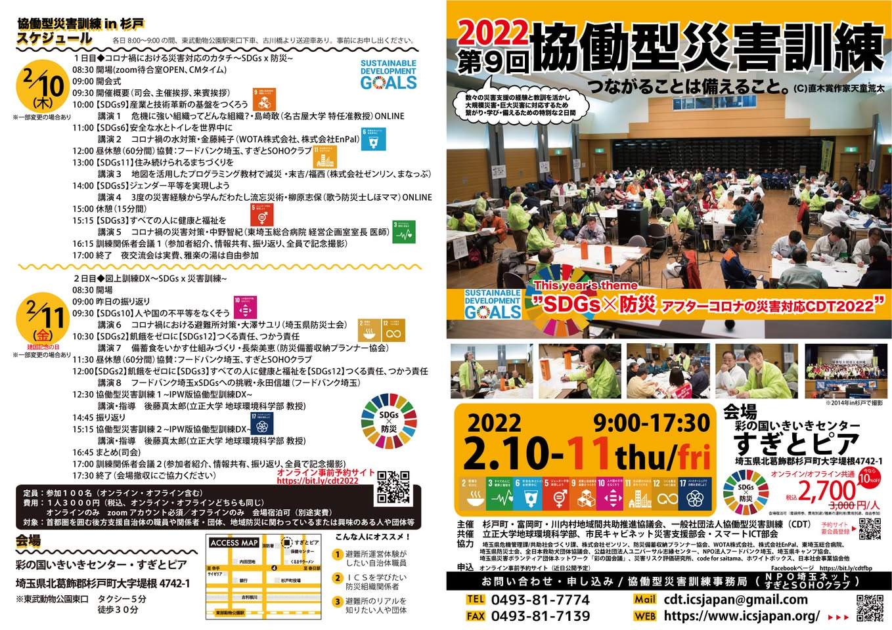

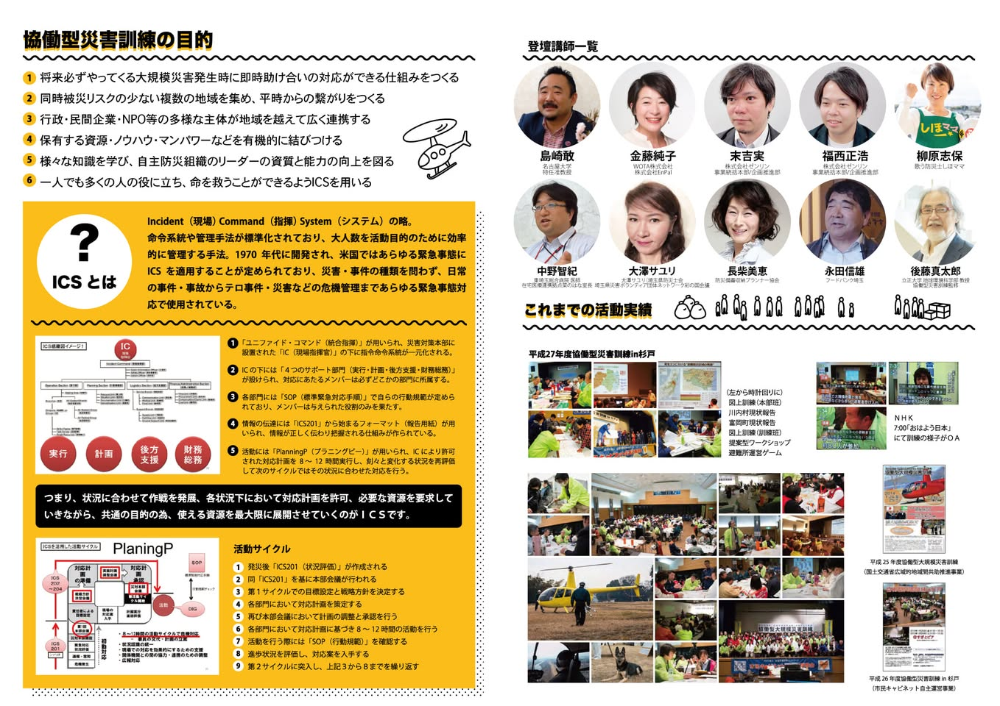

## 0376 — 2022-06-01 — 後藤 真太郎

- 投稿ID: 1960113097523153
- 投稿URL: https://www.facebook.com/groups/186097664924714/posts/1960113097523153/
- 要約: ドローン飛び会やります。
- コメント要約: （コメントなし）

ドローン飛び会やります。
後藤 真太郎さんからの投稿をシェアしました
3人、、「KANTO DRONE SCHOOL 関東ドローンスクール BBQ 参加 無料 令和4年 ＆ドローンデモフライト 6月11日 (土) 11時～16時 ヘリパーク （加須ヘリポート） 加須市大越1359 雨天の場合は6月12日 (日) 12日雨天の場合は中止 ドローンイベント内容 産業用ドローンデモフライト 機能説明や飛行をご覧いただけます。 デモフライトは11時～と午後から1回 散布ドローン・ 物資輸送ドローン ドローン活用・ 相談 免許制度の疑問等お気軽に。 ドローン飛び会 ドローン保有者は機体ご持参下さい。 飛ばせます。 【主催】 【協力】 関東甲信越ドローンセンター 関東ドローンスクール お問い合わせ 0480-77-4418 Svauto 株式会社スカイオート 立正大学 地球環境科学部 環境システム学科 後藤真太郎教授 リムジンサービス 株式会社手作」というテキストの画像のようです
市民キャビネット・スマートICT部会
後藤 真太郎
竹田さんの会社（ヘリフライト）でドローンスクールを行うことになりました。6/11に以下のようなイベントを開催します。ご興味のある方はご参加お願いします。今後、一般的なドローン研修以外に、立正大学所有の各種センサーを用い災害時の被災状況監視からその後の復旧計画策定にも使える点群データ作成、スマート農業、スマート林業に使用できる技術なども研修テーマにしていく予定です。

## 0377 — 2022-09-23 — 後藤 真太郎

- 投稿ID: 2046375418896920
- 投稿URL: https://www.facebook.com/groups/186097664924714/posts/2046375418896920/
- 要約: 10/2 13:00-16:00 熊谷市民活動支援センター にて、熊谷チャレンジオープンガバナンスのキックオフを行います。 今年のお題は、 ①スポーツ熱中都市 ②子供の居場所 ③農産物のブランド化 当日は、熊谷市の担当からの、インプットワークののちアイデアソン、チームビルディングを行います。
- コメント要約: （コメントなし）

10/2 13:00-16:00 熊谷市民活動支援センター にて、熊谷チャレンジオープンガバナンスのキックオフを行います。
今年のお題は、
①スポーツ熱中都市
②子供の居場所
③農産物のブランド化
当日は、熊谷市の担当からの、インプットワークののちアイデアソン、チームビルディングを行います。
詳細は追って連絡します。

## 0378 — 2022-10-01 — 太田 一穂

- 投稿ID: 2053178228216639
- 投稿URL: https://www.facebook.com/groups/186097664924714/posts/2053178228216639/
- 要約: 熊谷でチャレンジオープンガバナンス2022のキックオフイベント行います！ 2022/10/02(日) チャレンジオープンガバナンス2022 in 熊谷 キックオフ【UDC2022】 埼玉県 熊谷市 熊谷市市民活動支援センターに「いいね！
- コメント要約: （コメントなし）

熊谷でチャレンジオープンガバナンス2022のキックオフイベント行います！
https://www.facebook.com/events/510483174177801/
2022/10/02(日)
チャレンジオープンガバナンス2022 in 熊谷 キックオフ【UDC2022】
埼玉県 熊谷市
熊谷市市民活動支援センターに「いいね！」しました

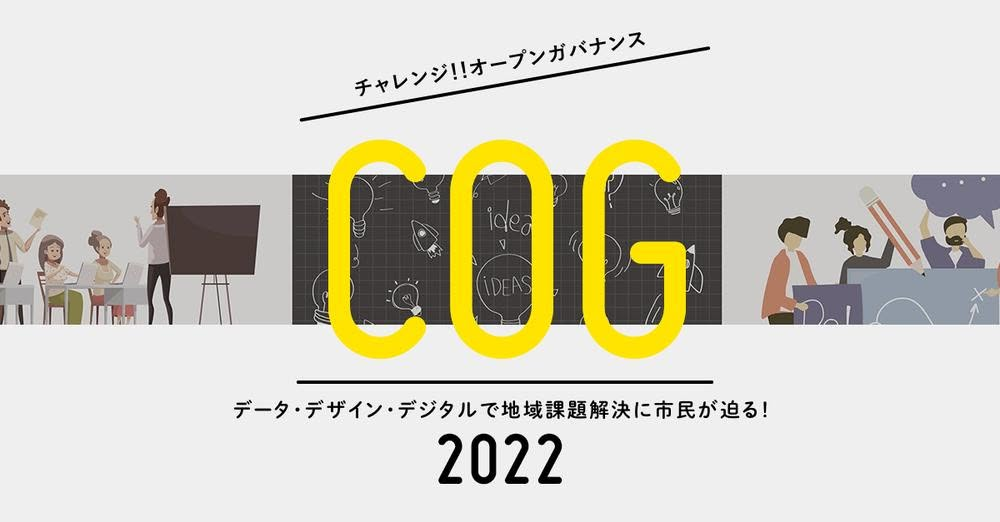

## 0379 — 2022-11-12 — 吉田英樹

- 投稿ID: 2089735814560880
- 投稿URL: https://www.facebook.com/groups/186097664924714/posts/2089735814560880/
- 要約: Code for Saitamaの皆様、こんにちは。突然失礼します。私は最近、岩槻観光ボランティアガイド会さまの活動を支援させて頂いている者です。会での観光案内情報の共有に、 localwiki を利用したいと思っておりますが、こちらに localwiki iwatsukiの管理者の方はいらっしゃいますか？
- コメント要約: どなたかいらっしゃいませんか？ 気が付かず申し訳ありませんでした。Code for SAITAMAでマッピングパーティーを開催した際に始めました。是非、進めましょう。

Code for Saitamaの皆様、こんにちは。突然失礼します。私は最近、岩槻観光ボランティアガイド会さまの活動を支援させて頂いている者です。会での観光案内情報の共有に、 localwiki を利用したいと思っておりますが、こちらに localwiki iwatsukiの管理者の方はいらっしゃいますか？
https://ja.localwiki.org/iwatuki/
出来れば一度、岩槻でお会いして、ウェブサイトの運営のことなどご相談させて頂きたいと思っております。メッセージかメールで連絡させて頂ければと思います。よろしくお願い致します。
JA.LOCALWIKI.ORG
岩槻 - LocalWiki
関連度の高い順

### コメント — 吉田英樹

どなたかいらっしゃいませんか？

### コメント — 後藤 真太郎

気が付かず申し訳ありませんでした。Code for SAITAMAでマッピングパーティーを開催した際に始めました。是非、進めましょう。

### コメント — 吉田英樹

歴史観光のための案内情報・地図情報を発信するのに、地元の観光ガイド組織や地誌研究会の方に記事作成方法をレクチャ・指導して頂けないかと考えております。よろしくお願い致します。

### コメント — 吉田英樹

「マッピングパーティ」のコンセプトから外れているかもしれませんが、(1) 直接対面でレクチャ (2) 成果を継続的に確認 (3) 目標（予期している観光案内ポイントの網羅）の達成 が出来るといいなと思っております。リモートで「こうするといいですよ」という話はよくさせて頂くのですが、記事の執筆には手が付かない感じでして。それと、各地域コミュのほとんどが、読者に有益な成果とまでいかない状態で中断している印象で、分かりやすい「出来上がり」の形を提示して、それを目指して作業できるといいのではと考えております。如何思われますか。

### コメント — 吉田英樹

日程の調整などはメッセンジャーかメールでお願いしたいのですが、後藤様にご連絡すれば宜しいですか。

### コメント — 後藤 真太郎

日程調整はメッセンジャーでお願いします。

### コメント — 吉田英樹

後藤 真太郎 さま：有難うございます。メッセージを入れさせて頂きます。

## 0380 — 2023-01-20 — とよしま 亮介

- 投稿ID: 2147300708804390
- 投稿URL: https://www.facebook.com/groups/186097664924714/posts/2147300708804390/
- 要約: 協働型災害訓練、初のクラウドファンディング開始！ マイノリティーの立場から考える次世代災害支援シンポジウムを開催！
- コメント要約: （コメントなし）

協働型災害訓練、初のクラウドファンディング開始！
マイノリティーの立場から考える次世代災害支援シンポジウムを開催！
第10回協働型災害訓練in杉戸~CDT2023~「phasefree（フェーズフリー）日常から繋がる防災を考える」
東日本大震災以降、2014年より毎年開催している災害支援学習イベント「協働型災害訓練in杉戸」の10回目を2月10日（金）・11日（土・祝）に開催。今年は、10年目の原点回帰として「phasefree（フェーズフリー）日常から繋がる防災を考える～」がテーマ。そして、今回初のクラウドファンディング「マイノリティーの立場から考える次世代災害支援シンポジウムを開きたい」を1月20日（金）10時から開始しました。寄付のリターンとして、参加チケットだけでなく、開催地である埼玉県杉戸町の推奨農産品「すぎふと」をご用意しました。会場参加（オフライン）及びzooo参加（オンライン）で開催となりますので、特にオンライン参加の皆さまには開催地である埼玉県杉戸町の推奨農産品「すぎふと」を手に入れて頂き、ご自宅でも会場の雰囲気をぜひ感じて頂く機会にして頂ければと思います。
■クラウドファンディングについて
プロジェクト名：マイノリティーの立場から考える次世代災害支援シンポジウムを開きたい
公開URL：https://readyfor.jp/projects/cdt2023
募集サイト：READYFOR（https://corp.readyfor.jp）
プロジェクト実行者：一般社団法人協働型災害訓練
公開日：2023/01/20 10:00
終了日　202/02/19 23:00
募集期間：30日間
資金の使途：一般社団法人協働型災害訓練が2/10-11に開催される「協働型災害訓練in杉戸」にて、性的マイノリティーに対応した次世代災害支援を考える講演会・ワークショップを開催し、LGBTQ目線で考える災害支援ガイドラインを策定する。講師謝金に2万円、ファシリテータ謝金に2万円、配信経費に6万円を使用する。
支援及びリターン一覧
・「感謝のメール＋開催のご報告」1,000円（＋システム利用料）
・「会場参加またはオンライン参加チケット」3,000円（＋システム利用料）
・「＋杉戸百景絵はがきセット」5,000円（＋システム利用料）
・「＋杉戸の名産品「すぎふと」老舗煎餅セット」10,000円（＋システム利用料）
・「＋杉戸の名産品「すぎふと」人気のそこら辺の草セット」10,000円（＋システム利用料）
・「＋杉戸の名産品「すぎふと」杉戸銘菓詰合せギフトセット」15,000円（＋システム利用料）
・「＋杉戸の名産品「すぎふと」焼き菓子ギフトセット」30,000円（＋システム利用料）
・「＋杉戸の名産品「すぎふと」うなぎ蒲焼き2人前セット」30,000円（＋システム利用料）
・「＋杉戸の名産品「すぎふと」うなぎ蒲焼きお得な 5人前セット」100,000円（＋システム利用料）
▼「協働型災害訓練in杉戸」クラウドファンディングサイト：https://readyfor.jp/projects/cdt2023
■今回の協働型災害訓練について
▼「協働型災害訓練in杉戸」公式ウェブサイト：https://www.icsjapan.org/
■体制
主催　杉戸町・富岡町・川内村地域間共助推進協議会、一般社団法人協働型災害訓練（ＣＤＴ）
共催　立正大学地球環境科学部、市民キャビネット災害支援部会・スマートＩＣＴ部会
協力　埼玉県危機管理課/共助社会づくり課、DMTC（東京大学生産技術研究所附属災害対策トレーニングセンター）、国立大学法人弘前大学、東埼玉総合病院、埼玉県災害ボランティア団体ネットワーク「彩の国会議」、彩の国市民映画祭実行委員会、一般社団法人レインボーフォスターケア、ビブリオテカオカルタ、埼玉県防災士会、全日本救助犬団体協議会、公益社団法人ユ二バーサル志縁センター、NPO法人フードバンク埼玉、埼玉県キャンプ協会、code for saitama、防災まちづくりの会・東久留米、株式会社測設、まちひとサイト（東京等中央区社会福祉協議会）、株式会社ホワイトボックス、日本社会事業協会、他

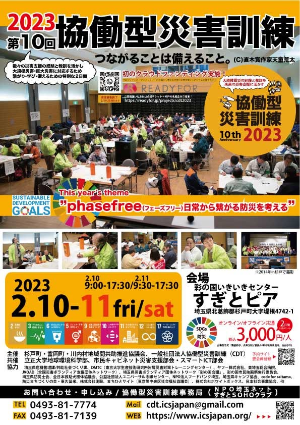

## 0381 — 2023-01-27 — とよしま 亮介

- 投稿ID: 2152434974957630
- 投稿URL: https://www.facebook.com/groups/186097664924714/posts/2152434974957630/
- 要約: 今年は、参加予約サイトからでも、クラウドファンディング特設サイトからでも申し込みできます！只今、参加申し込み受付中！ 2023/02/10(金) 第10回協働型災害訓練in杉戸~CDT2023~「phasefree（フェーズフリー）日常から繋がる防災を考える」 埼玉県 北葛飾郡 Code for Saitama運営会議とシェアされています 興味あり
- コメント要約: （コメントなし）

今年は、参加予約サイトからでも、クラウドファンディング特設サイトからでも申し込みできます！只今、参加申し込み受付中！
2023/02/10(金)
第10回協働型災害訓練in杉戸~CDT2023~「phasefree（フェーズフリー）日常から繋がる防災を考える」
埼玉県 北葛飾郡
Code for Saitama運営会議とシェアされています
興味あり

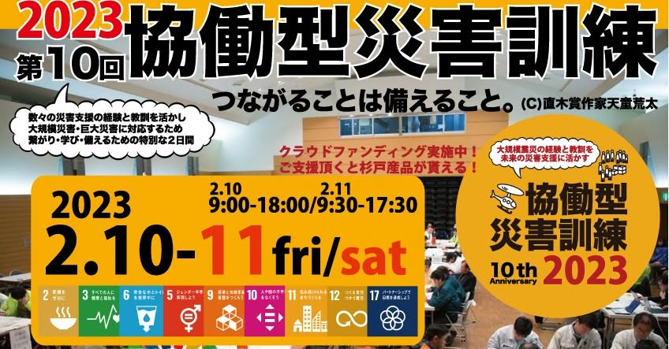

## 0382 — 2024-01-06 — 太田 一穂

- 投稿ID: 2372431526291306
- 投稿URL: https://www.facebook.com/groups/186097664924714/posts/2372431526291306/
- 要約: 明日1/7日曜、大宮でOSMもくもく会やります！ テーマは令和6年能登半島地震 クライシスマッピングです。 2024/01/07(日) 令和6年能登半島地震のOpenStreetMap マッピングプロジェクトに賛同して「もくもく会」やります 埼玉県さいたま市大宮区桜木町1丁目10-8
- コメント要約: （コメントなし）

明日1/7日曜、大宮でOSMもくもく会やります！
テーマは令和6年能登半島地震 クライシスマッピングです。
2024/01/07(日)
令和6年能登半島地震のOpenStreetMap マッピングプロジェクトに賛同して「もくもく会」やります
埼玉県さいたま市大宮区桜木町1丁目10-8

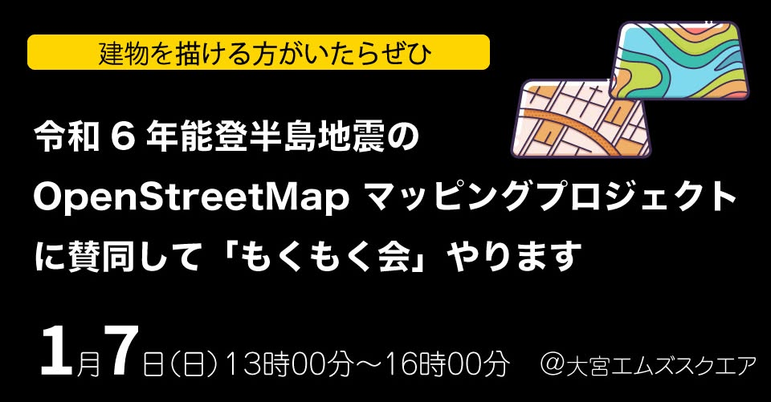

## 0383 — 2024-03-02 — 古田武士

- 投稿ID: 2409004232634035
- 投稿URL: https://www.facebook.com/groups/186097664924714/posts/2409004232634035/
- 要約: 古田武士さんからの投稿をシェアしました 古田武士 シビックテックさいたまさんの公園アイデアソンに参加してます。ちなみに、Code for SAITAMAも共催にしてます。
- コメント要約: （コメントなし）

古田武士さんからの投稿をシェアしました
古田武士
シビックテックさいたまさんの公園アイデアソンに参加してます。ちなみに、Code for SAITAMAも共催にしてます。
#iodd

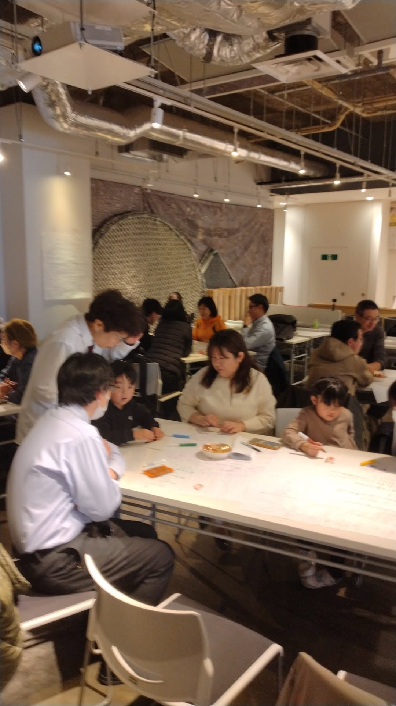

## 0384 — 2024-04-02 — 太田 一穂

- 投稿ID: 2428835527317572
- 投稿URL: https://www.facebook.com/groups/186097664924714/posts/2428835527317572/
- 要約: 10年前、Code for SAITAMA発足して最初のイベントが大宮マッピングパーティでした。 以後春先に「お花見マッピングパーティ」として川越、熊谷、戸田、岩槻と開催してきました。
- コメント要約: （コメントなし）

10年前、Code for SAITAMA発足して最初のイベントが大宮マッピングパーティでした。
以後春先に「お花見マッピングパーティ」として川越、熊谷、戸田、岩槻と開催してきました。コロナ禍もあり最近はできてなく、今年もセッティングできませんでしたが、自分は今週末はとちゃんと川越の桜を見てこようと思います。
https://www.facebook.com/events/361641693974911/?
2014/03/29(土)
大宮マッピングパーティー
さいたま市

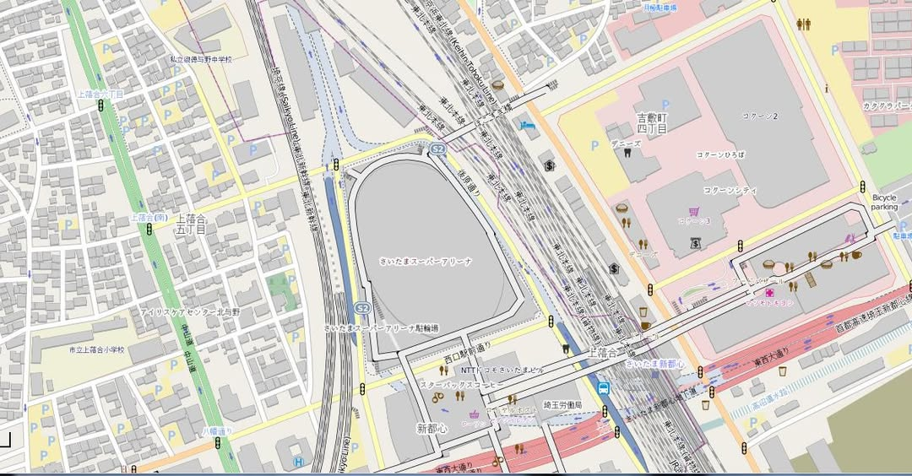

## 0385 — 2024-05-03 — 伊藤 利昭

- 投稿ID: 2447750595426065
- 投稿URL: https://www.facebook.com/groups/186097664924714/posts/2447750595426065/
- 要約: 告知です。 Code for TODAでは、戸田市役所のデジタル戦略室や協働推進課のご協力をいただき、5/26(日)に アイデアソン「デジタル時代の新しい町会・自治会のあり方を考える」 を開催します。
- コメント要約: これ、参加したかったです…。レポート記事公開などありましたら、ぜひ告知お願いします！ コメントありがとうございます! 簡単ですが、こちらに開催報告をアップしていますのでご覧ください。

告知です。
Code for TODAでは、戸田市役所のデジタル戦略室や協働推進課のご協力をいただき、5/26(日)に
アイデアソン「デジタル時代の新しい町会・自治会のあり方を考える」
を開催します。
詳細や申し込みは以下のリンク先よりお願いします。
https://codefortoda.org/ideathon2024/
他の自治体の状況なども知る機会となればと思いますので、たくさんの方のご参加をお待ちしております。
アイデアソン「デジタル時代の新しい町会・自治会のあり方を考える」開催のお知らせ（5/26開催） – Code for TODA(コードフォーとだ）
CODEFORTODA.ORG
アイデアソン「デジタル時代の新しい町会・自治会のあり方を考える」開催のお知らせ（5/26開催） – Code for TODA(コードフォーとだ）
関連度の高い順

### コメント — 大野 さやか

これ、参加したかったです…。レポート記事公開などありましたら、ぜひ告知お願いします！

### コメント — 伊藤 利昭

コメントありがとうございます!
簡単ですが、こちらに開催報告をアップしていますのでご覧ください。
https://codefortoda.org/%E3%82%A2%E3%82%A4%E3%83%87%E3%82...
好評だったため、第2弾を開催したいとの声もあがっています。その際にはぜひご参加をお願いします。
CODEFORTODA.ORG
アイデアソン「デジタル時代の新しい町会・自治会のあり方を考える」を開催しました – Code for TODA(コードフォーとだ）
アイデアソン「デジタル時代の新しい町会・自治会のあり方を考える」を開催しました – Code for TODA(コードフォーとだ）

### コメント — 大野 さやか

伊藤 利昭
ありがとうございます！
デジタル庁が推奨している地域幸福度指標ダッシュボードを見ながら、「自分たちが市長だったらこんな施策に注力します！」という8つの注力施策とキャッチフレーズを考えるワークショップがあるのですが、これもやってみたら面白いと思いました！
https://well-being.digital.go.jp/dashboard/
以下にはりつけているのは戸田市のデータです。さすが主観では子育てが偏差値68.6で1位！

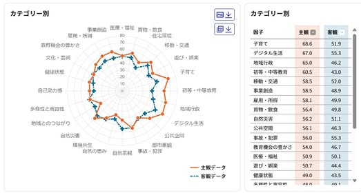

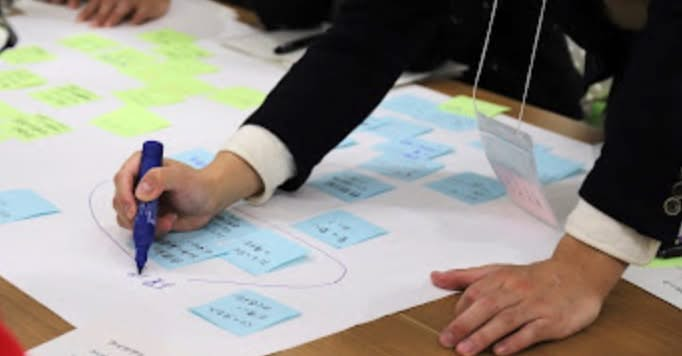

## 0386 — 2024-06-01 — 後藤 真太郎

- 投稿ID: 2470091379858653
- 投稿URL: https://www.facebook.com/groups/186097664924714/posts/2470091379858653/
- 要約: 6/15オンライン公開講座「住み続けられるまちづくりのために～地域の資源をいかに活用するか～」にて、比企丘陵の日本農業遺産に選定された地域で1000年以上前からため池の水のみで農業が今も持続している事例を参考に、地域資源を活用したまちづくりについて考えます。
- コメント要約: （コメントなし）

6/15オンライン公開講座「住み続けられるまちづくりのために～地域の資源をいかに活用するか～」にて、比企丘陵の日本農業遺産に選定された地域で1000年以上前からため池の水のみで農業が今も持続している事例を参考に、地域資源を活用したまちづくりについて考えます。是非ご参加ください。
6/15 TJUPオンライン公開講座「住み続けられるまちづくりのために～地域の資源をいかに活用するか～」にて地球環境科学部教員が登壇します | お知らせ | 立正大学 研究推進・社会貢献セ
RPRA.RIS.AC.JP
6/15 TJUPオンライン公開講座「住み続けられるまちづくりのために～地域の資源をいかに活用するか～」にて地球環境科学部教員が登壇します | お知らせ | 立正大学 研究推進・社会貢献セ

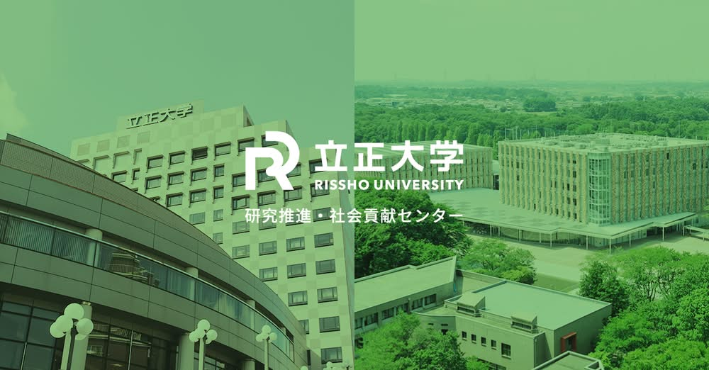

## 0387 — 2024-11-22 — 太田 一穂

- 投稿ID: 2616689535198836
- 投稿URL: https://www.facebook.com/groups/186097664924714/posts/2616689535198836/
- 要約: NPOむすびえさん主催のこども食堂アイデアソン＆ハッカソン、去年に引き続いて大宮で開催です。ことしはアーバンデータチャレンジのイベントとしても開催となります。こども食堂の関係者も参加されるので、よりリアルな話が聞けるアイデアソン・ハッカソンとなります。
- コメント要約: （コメントなし）

NPOむすびえさん主催のこども食堂アイデアソン＆ハッカソン、去年に引き続いて大宮で開催です。ことしはアーバンデータチャレンジのイベントとしても開催となります。こども食堂の関係者も参加されるので、よりリアルな話が聞けるアイデアソン・ハッカソンとなります。
暮れの押し迫った時期ですが、ぜひぜひご参加ください！
全国こども食堂支援センター・むすびえさんからの投稿をシェアしました
全国こども食堂支援センター・むすびえ
12/21&22 埼玉県で開催
こども食堂のオープンデータを使ってアプリを作るイベントのお知らせです！
日頃の困りごとや子どもに関する課題解決をアプリ開発を通して推進しましょう！こども食堂関係者、社会課題解決に関心のあるエンジニアの方、奮ってご参加ください
＜概要＞
・日時
【事前勉強会】11月22日（金） 18：30〜　会場：オンライン会議（Zoom）
【アイデアソン1日目】12月21日（土）10:00〜16:30
【ハッカソン2日目】12月22日（日）9:00〜16:30
・場所
埼玉県さいたま市「エムズスクエア」
（埼玉県さいたま市大宮区桜木町1丁目10-8　武蔵野銀行本店2階　大宮駅より徒歩5分）
・参加費無料
・こんな方におすすめ！
こども食堂に携わる方、こどもの支援に関心がある方、こども食堂に携わる方、シビックテックに興味のある方、社会課題解決に興味のあるエンジニア
＼全国横断シリーズ第2弾＠埼玉県／ こども食堂オープンデータ・アイデアソン&ハッカソンーUDC2024ー 〜地域×データで課題解決チャレンジ〜｜新着情報
MUSUBIE.ORG
＼全国横断シリーズ第2弾＠埼玉県／ こども食堂オープンデータ・アイデアソン&ハッカソンーUDC2024ー 〜地域×データで課題解決チャレンジ〜｜新着情報

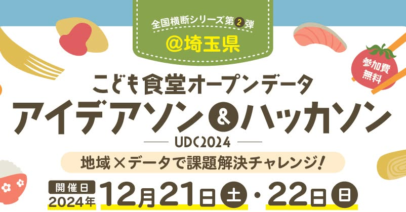

## 0388 — 2025-01-15 — とよしま 亮介

- 投稿ID: 2657202684480854
- 投稿URL: https://www.facebook.com/groups/186097664924714/posts/2657202684480854/
- 要約: 【お待たせしました！】 協働型災害訓練2025参加チケット販売開始！ 各日3,000円（税込）/人 →２日間会場参加チケット5,000円（税込）【16%OFF!
- コメント要約: （コメントなし）

【お待たせしました！】
協働型災害訓練2025参加チケット販売開始！！
各日3,000円（税込）/人
→２日間会場参加チケット5,000円（税込）【16%OFF!!】
→２日間オンライン参加チケット4,800円（税込）【20%OFF!!】
ご購入はPeatix特設ページからお手続きください
→会場参加チケット
[https://icsjapn2025.peatix.com/](https://icsjapn2025.peatix.com/)
→オンライン参加チケット
[https://icsjapan2025.peatix.com/](https://icsjapan2025.peatix.com/)
本年度も「協働型災害訓練in杉戸～CDT2025～」を、2025年2月7日（金）・2月8日（土）の2日間にわたり開催します。
東日本大震災の経験と教訓を生かすべく、平成25年度国土交通省広域的地域間共助推進事業としてスタートした「協働型災害訓練」。大規模災害時には一人でも多くの命を助けるために、効率と統一された災害対応が必要になります。この訓練では、米国で誕生した災害版ISOと呼ばれるICS（Incident（現場） Command（指揮） System（システム））を用い、将来発生し得る大規模災害発生時に即時助け合いの対応ができる仕組みをつくることを目指しています。
名称 第12回協働型災害訓練in杉戸「地域のチカラ×学生のチカラ〜防災×ゲーミフィケーション〜」
日時　2025年2月7日(金)9:00-17:00、2月8日(土)9:30-17:30
会場　①彩の国いきいきセンターすぎとピア(埼玉県北葛飾郡杉戸町堤根4742-1)
②zoom(ワークは見学)
定員　①会場参加100名　②zoom参加200名
対象　・首都圏周辺の災害時後方支援自治体の職員など
・地域防災に関わっている方、興味のある方や団体など
・ICS(災害現場等の指揮系統や管理手法)を学びたい方や団体など
主催　杉戸町・富岡町・川内村地域間共助推進協議会、一般社団法人協働型災害訓練（CDT）
共催　日本保健医療大学保健医療学部、立正大学地球環境科学部、市民キャビネット災害支援部会・スマートICT部会
協力　 埼玉県危機管理課/共助社会づくり課、杉戸町社会福祉協議会、北葛北部医師会、東埼玉総合病院、南越谷内科クリニック、一般社団法人Do It Yourself、防災普及学生団体Genkai（玄海）、福祉タクシー恵彩、動物支援ナース、認定NPO法人市民福祉団体全国協議会 、埼玉県災害ボランティア団体ネットワーク「彩の国会議」、全日本救助犬団体協議会、NPO法人埼玉県防災士会、公益社団法人ユ二バーサル志縁センター、NPO法人フードバンク埼玉、code for saitama、ビブリオテカ オカルタ、株式会社測設、NPO法人埼玉県キャンプ協会、防災まちづくりの会・東久留米、まちひとサイト(東京等中央区社会福祉協議会)、株式会社ホワイトボックス、NPO法人日本社会事業協会、他
参考URL （開催案内掲載ページ）　[https://www.icsjapan.org/](https://www.icsjapan.org/)

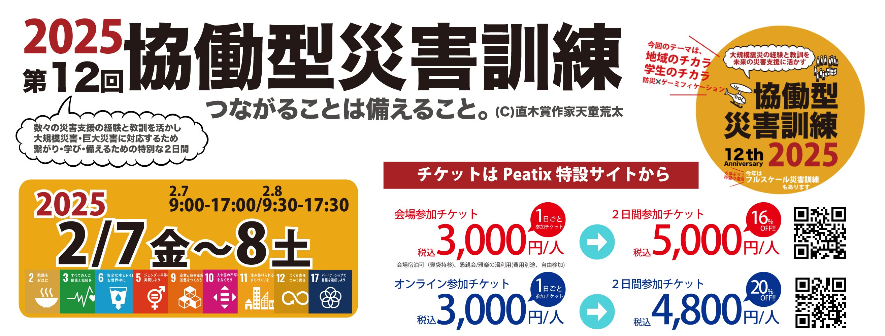

