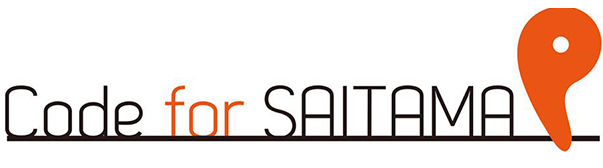

# Code for SAITAMA

## Code for SAITAMAとは

「SAITAMAのITの力で、社会課題の解決を図ることで、市民をわくわくさせる」ことを目的とする団体です。

2014年1月発足、以降マッピングパーティ、アイデアソン、ハッカソン、勉強会など、様々なイベントをほぼ月イチで開催しています。

## Code for SAITAMAのロゴ

ロゴは埼玉の「勾玉」、またマップのピンを表しています。

- [Facebook Group](https://www.facebook.com/groups/186097664924714/)
- [Facebook event](https://www.facebook.com/pg/Code4SAITAMA/events/?ref=page_internal)
